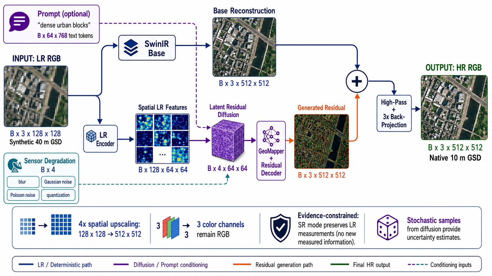

# GeoDiff-GAN

Research implementation of prompt-guided 4x super-resolution for Sentinel-2 L2A RGB imagery.
The primary experiment synthesizes 40 m low-resolution observations from native 10 m B4/B3/B2
surface reflectance and reconstructs the 10 m target.

New to the subject? Follow the sequential [GeoDiff-GAN learning course](learning/README.md). It
starts with the mathematical, PyTorch, remote-sensing, GAN, and diffusion prerequisites before
deriving this repository's architecture, training stages, diagnostics, and research methodology.


Input/output and tensor-shape explainers:




## Run on Kaggle

Import [the Kaggle notebook](kaggle/GeoDiff_GAN_Kaggle.ipynb), enable Internet and a GPU
accelerator, and attach a dataset containing extracted Sentinel-2 L2A `.SAFE` directories. The
notebook clones this repository, installs it without replacing Kaggle's CUDA PyTorch, prepares
patches, optionally runs Qwen3-VL-8B captioning, trains all selected stages, and exports metrics and
checkpoints.

After creating your GitHub repository, replace `OWNER` in the notebook's `REPOSITORY_URL` cell with
your GitHub username or organization.

The notebook defaults to `FAST_DEV_RUN = True` and `MODEL_SIZE = "small"`. Run length and model
capacity are independent: choose `MODEL_SIZE = "xs"`, `"small"`, `"medium"`, or `"large"`, then
use `FAST_DEV_RUN` to select a one-epoch pipeline check or the research epoch schedule. Small keeps
the complete research module graph and conditioning path while reducing core capacity to 12.14M.

| Model size | Core parameters | Intended use |
|---|---:|---|
| XS | 0.765M | Shape, loss, checkpoint, and pipeline testing |
| Small | 12.14M | Default lower-cost research architecture |
| Medium | 21.13M | Practical research training on 16 GB GPUs |
| Large | 81.86M | Maximum-capacity research experiments |

Keep `MODEL_SIZE` fixed across base, VAE, diffusion, joint, and edit stages. Checkpoints cannot be
transferred between XS, small, medium, and large because their parameter tensor shapes differ.
The notebook stores runs below a model-specific directory to prevent incompatible auto-resume.

## Model

```text
LR RGB
  +--> compact SwinIR base --------------------------+
  |                                                  |
  +--> LR encoder --> latent residual diffusion      |
                         |                            |
                 dual-policy GeoMapper               |
       (content, FiLM, evidence, edit permission)    |
                         |                            |
               dual-head GAN decoder                 |
              /                         \             |
      evidence detail              edit residual     |
              \                         /             |
               policy-gated composition -------------+
                         |
       sensor projection + uncertainty abstention
```

`sr` mode uses only high-frequency detail, scales it with calibrated evidence confidence, applies
three consistency projections, and can blend stochastic predictions back toward the deterministic
base where ensemble disagreement is high. `edit` mode uses a separate full-band residual head
controlled by a spatial edit-permission map, applies only a soft projection, and writes
`"synthetic_edit": true` to the output JSON.

The implementation includes:

- SwinIR-style base branch with configurable shifted-window depth and 4x pixel shuffle.
- Residual VAE with a four-channel latent at one-eighth HR resolution.
- Conditional `v`-prediction U-Net with LR, degradation, mode, and text conditioning.
- Four-block dual-policy GeoMapper with separate evidence-confidence and edit-permission maps.
- Four-stage dual-head residual decoder: evidence detail for SR and full-band change for edits.
- Confidence calibration, sparse counterfactual edit coverage, and edit-localization objectives.
- Ensemble uncertainty abstention that returns unsupported SR regions toward the SwinIR base.
- Spatial plus Haar-wavelet discriminators.
- Differentiable MTF degradation and iterative LR consistency projection.
- Tile-level train/validation/test isolation, SCL cloud filtering, and windowed SAFE processing.
- Five-stage training, DDP, AMP, gradient accumulation, checkpoint transfer, and uncertainty runs.

## Installation

```bash
cd geodiff_gan
pip install -e ".[geo]"
```

Captioning and optional perceptual metrics use separate extras:

```bash
pip install -e ".[caption,metrics]"
```

Qwen3-VL captioning should run in a separate Kaggle session or before SR training. The 8B model is
loaded in 4-bit mode and is never part of the trainable SR graph.

## Prepare Sentinel-2 Data

Download Sentinel-2 **L2A** `.SAFE` products from Copernicus Data Space. Use several geographically
separated MGRS tiles and land-cover types.

```bash
geodiff-prepare \
  --input /kaggle/input/sentinel-safe \
  --output /kaggle/working/geodiff-data/patches \
  --manifest /kaggle/working/geodiff-data/manifest.jsonl \
  --patch-size 512 \
  --stride 384 \
  --minimum-valid-fraction 0.95 \
  --test-prefix CHHATARPUR1 \
  --val-prefix CHHATARPUR2 \
  --unmatched-split train
```

The command reads each large product by raster window. It does not load a whole state or complete
110 km tile into RAM. B4/B3/B2 are scaled by 10,000; invalid, cloud, cloud-shadow, cirrus, snow,
no-data, and saturated patches are rejected using SCL. Every extracted patch records its MGRS tile,
window location, source SAFE product, split, source, and licence identifier. Prefix matching is
case-insensitive. Explicit validation/test SAFE products are retained even when `--max-products`
limits the unmatched training products.

Preparation is incremental. When the manifest already exists, completed SAFE products are skipped
and only newly attached products are extracted. Progress is checkpointed after each product in
`manifest.jsonl.preparation.json` by default. Use `--state PATH` to choose another location and
`--rebuild` only when intentionally regenerating patches. Patch directories include the SAFE
product name, preventing multiple acquisitions of the same MGRS tile from overwriting each other.

Some archives create a renamed outer `.SAFE` wrapper containing the actual canonical Sentinel
`.SAFE` product. Discovery accepts only directories with direct `manifest.safe` and `GRANULE`
entries, so wrapper/inner pairs are counted once. Raster data is read from the canonical inner
product while the outer label is retained for prefix split rules such as `CHHATARPUR1`.

All windows from one MGRS tile receive the same split. Preparation stops if prefix rules place the
same MGRS tile in both validation and test. A study with only a few tiles is invalid: collect enough
complete tiles to represent train, validation, and test geography.

## Generate Qwen3-VL Captions

```bash
geodiff-caption \
  --manifest /kaggle/working/geodiff-data/manifest.jsonl \
  --output /kaggle/working/geodiff-data/captions.jsonl \
  --model Qwen/Qwen3-VL-8B-Instruct \
  --split train
```

The instruction requests structured evidence-only descriptions and excludes place names and
coordinates. Captioning is resumable. Generate captions for validation and test as separate files
or combine JSONL outputs after checking for duplicate patch keys.

## Train

Update the manifest and caption paths in `configs/default.yaml`. On two 16 GB GPUs, batch size 1
per GPU and accumulation 8 produce an effective batch of 16:

```bash
torchrun --standalone --nproc_per_node=2 -m geodiff_gan.cli.train \
  --config configs/default.yaml

torchrun --standalone --nproc_per_node=2 -m geodiff_gan.cli.train \
  --defaults configs/default.yaml --config configs/stage_vae.yaml

torchrun --standalone --nproc_per_node=2 -m geodiff_gan.cli.train \
  --defaults configs/default.yaml --config configs/stage_diffusion.yaml

torchrun --standalone --nproc_per_node=2 -m geodiff_gan.cli.train \
  --defaults configs/default.yaml --config configs/stage_joint.yaml

torchrun --standalone --nproc_per_node=2 -m geodiff_gan.cli.train \
  --defaults configs/default.yaml --config configs/stage_edit.yaml
```

Change each overlay's `init_checkpoint` if an epoch count changes. Use `resume` only to continue the
same stage because it restores optimizer and discriminator state.

Training displays nested tqdm bars for stage epochs and batches, including running loss, learning
rate, elapsed time, and ETA. With a non-empty validation split, `validate_every` and
`validation_limit` control held-out evaluation. Validation L1, PSNR, SSIM, edge F1, and LR
re-degradation error are written to `latest_metrics.json` and `training_history.jsonl`.

Training stages:

1. `base`: Charbonnier, SSIM, gradient, and sensor-consistency losses.
2. `vae`: residual VAE plus clean-latent GeoMapper/decoder reconstruction.
3. `diffusion`: SNR-weighted latent velocity prediction with the decoder frozen.
4. `joint`: diffusion, mapper, decoder, perceptual, wavelet, consistency, and hinge-GAN losses.
5. `edit`: counterfactual/mismatched prompt tuning with SigLIP image-text alignment and softer
   consistency.

Joint and edit training use `training.train_back_projection_steps` (default: 1), while SR
inference uses three projection steps and edit inference uses one. Set the training value to `0`
only for an explicit no-projection ablation.

The hash text encoder in `configs/smoke.yaml` is only for tests. Research runs must use the frozen
SigLIP encoder from the default configuration.

## Inference and Evaluation

```bash
geodiff-infer \
  --config configs/default.yaml \
  --checkpoint runs/joint/joint_epoch_0019.pt \
  --input example_lr.png \
  --output outputs/example_sr.png \
  --mode sr --steps 20 --seed 7

geodiff-infer \
  --config configs/default.yaml \
  --checkpoint runs/edit/edit_epoch_0009.pt \
  --input example_lr.png \
  --output outputs/example_edit.png \
  --prompt "dense planned urban blocks with narrow roads" \
  --mode edit --steps 20 --guidance 3.0 --seed 7
```

Evaluate eight stochastic samples and save per-pixel variance, confidence, edit permission, and
abstention maps:

```bash
geodiff-evaluate \
  --config configs/default.yaml \
  --checkpoint runs/joint/joint_epoch_0019.pt \
  --output outputs/test_metrics \
  --split test --samples 8 --steps 20 --mode sr
```

L1, PSNR, SSIM, edge F1, and LR re-degradation error are always reported. Evaluation also reports
confidence-error correlation, uncertainty-error correlation, and selective L1 at 80% coverage.
LPIPS and DISTS are added when the metrics extra is installed. Edit evaluation also reports frozen
vision-language alignment. Super-resolution is a regression/generation task, so there is no
classification accuracy value.

Generate the built-in bicubic and trained base-branch baselines:

```bash
geodiff-baselines \
  --config configs/default.yaml \
  --base-checkpoint runs/base/base_epoch_0019.pt \
  --output outputs/baselines.json \
  --split test
```

## Debug and Visual Diagnostics

Export a shareable diagnostic folder for one validation or test patch:

```bash
geodiff-debug \
  --config configs/default.yaml \
  --checkpoint runs/joint/joint_epoch_0019.pt \
  --output outputs/debug_patch_0 \
  --split test \
  --index 0 \
  --mode sr \
  --steps 20 \
  --diffusion-every 5
```

The folder contains:

- `overview.png`: LR, base, residual, output, target, re-degraded output, and error maps.
- `stage_intermediates.png`: stage-specific tensors from base, VAE, diffusion, joint, or edit.
- `features.png`: LR features, denoised latent, mapper content, evidence confidence, edit
  permission, and abstention map.
- `tensor_histograms.png`: activation distributions for images, latents, policies, and residuals.
- `frequency_spectra.png`: Fourier spectra for LR, base, generated detail, output, and target.
- `policy_overlays.png`: confidence, permission, abstention, and error maps over the output.
- `edges_and_wavelets.png`: target/output edges and Haar LH/HL/HH comparisons.
- `diffusion_trajectory.png`: selected noisy and predicted-clean latent states.
- `projection_trajectory.png`: HR estimate and LR error after each back-projection update.
- `loss_breakdown.png`: current training-step loss components when training diagnostics run.
- `intermediate_tensors.npz`: optional compressed tensors for offline inspection.
- `report.json`: shapes, ranges, NaN/Inf counts, losses, gate saturation, residual strength, and
  LR consistency before and after back-projection.
- `summary.txt`: compact text output suitable for sharing during debugging.

Training diagnostics are opt-in through the `debug` section of `configs/default.yaml`. Keep
`enabled: false` for normal training. When enabled, the trainer writes stage-specific diagnostic
directories at the configured interval, capped by `max_exports_per_epoch`. Every stage also writes
`training_history.jsonl`, `latest_metrics.json`, and `training_curves.png`.

## Ablations and Scientific Use

The following `model` switches can be changed without code edits:

- `use_text_conditioning`
- `use_degradation_conditioning`
- `use_evidence_gate`
- `use_edit_gate`
- `use_uncertainty_abstention`
- `use_back_projection`

Run each ablation from the same parent checkpoint and seed set. Also compare bicubic, the trained
base branch, an established SwinIR implementation, ESRGAN, diffusion without adversarial
fine-tuning, and the joint model.

Sentinel-2-only 40 m to 10 m experiments have a real 10 m target. A claimed 10 m to 2.5 m result
requires independently acquired, accurately registered 2.5 m imagery. Prompt-edit outputs are
conditional synthesis and must not be presented as observed ground truth.

## Tests

```bash
$env:PYTHONPATH="src"  # PowerShell
python -m unittest discover -s tests -v
```

The CPU suite checks model shapes, both inference modes, DDIM sampling, degradation/projection, and
stable tile-level splitting.
