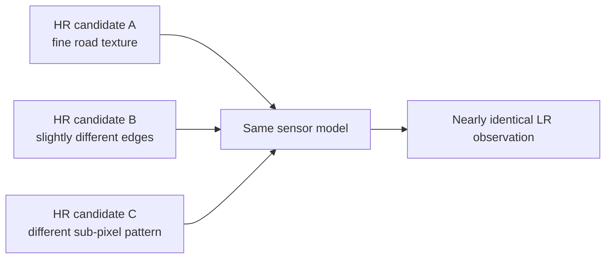
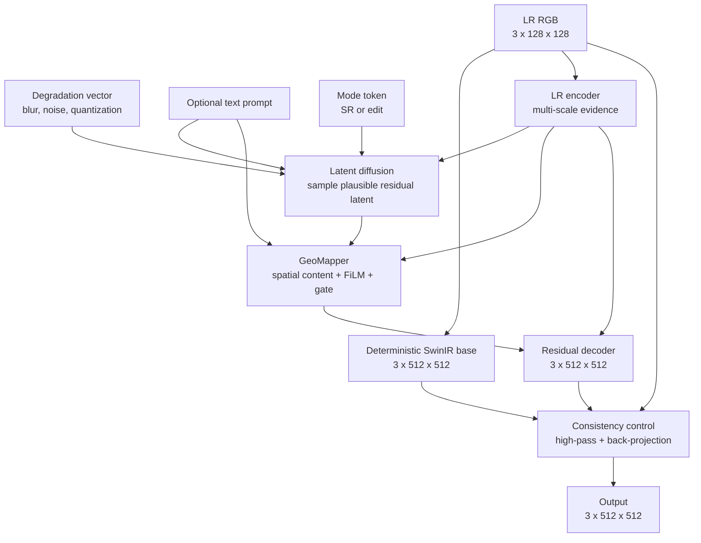
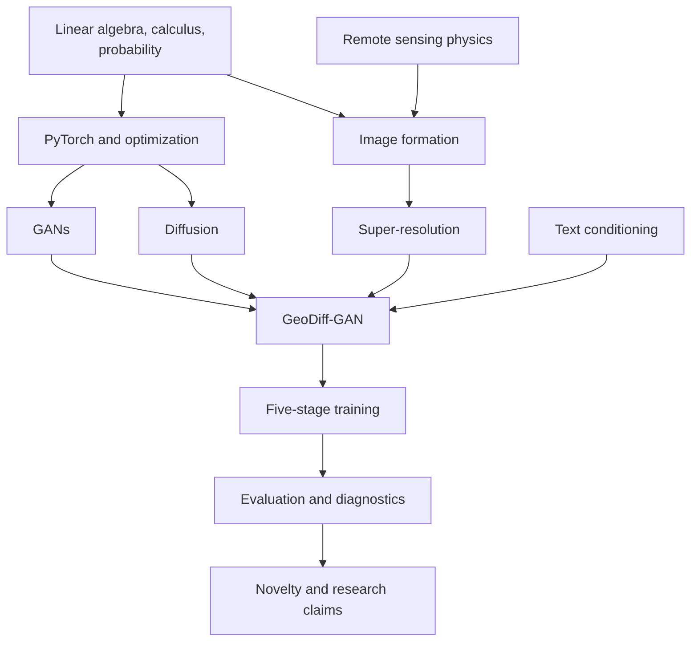

# 00 - Course Map and Mental Model

## Learning Objectives

By the end of this chapter, you should be able to:

- state the scientific problem in one precise sentence;
- distinguish reconstruction from prompt-guided editing;
- explain why the pipeline uses a deterministic base and a stochastic residual;
- identify the prerequisite chain for understanding the complete model.

## The Research Problem

Given a synthetic 40 m RGB observation

\[
y \in [0,1]^{3\times128\times128},
\]

estimate a native 10 m RGB image

\[
x \in [0,1]^{3\times512\times512}.
\]

The scale factor is four in each spatial dimension, so one LR pixel corresponds to a \(4\times4\)
region of HR pixels. The output contains 16 times as many spatial samples. Those samples cannot all
be uniquely determined from the LR image.

The forward observation model is:

\[
y = Q\left(D_4\left(k_\theta * x\right) + n_\theta\right),
\]

where \(k_\theta\) is a point-spread or modulation-transfer blur, \(D_4\) is 4x downsampling,
\(n_\theta\) is sensor noise, and \(Q\) is quantization. Super-resolution attempts an approximate
inverse:

\[
\hat{x} = G(y, \theta, c, m, z).
\]

Here \(\theta\) is degradation metadata, \(c\) is optional text, \(m\) is the operating mode, and
\(z\) is stochastic diffusion noise.

## Why the Problem Is Ill-Posed

Many HR images can produce nearly the same LR image after blur and downsampling:

The model therefore needs two capabilities:

- preserve information that is supported by the observation;
- model the distribution of plausible missing high-frequency detail.

GeoDiff-GAN separates them:

\[
\hat{x} = x_{\text{base}} + r_{\text{generated}}.
\]

The deterministic base estimates stable low-frequency structure. The diffusion and adversarial
decoder model a residual. In SR mode, the residual is high-pass filtered and the final image is
projected back toward LR consistency.

## Complete Mental Model

## Two Modes, Two Claims

| Property | SR mode | Edit mode |
|---|---|---|
| Goal | Evidence-constrained reconstruction | Prompt-guided synthetic visualization |
| Residual spectrum | High-pass only | Full-band allowed |
| LR projection | Three stronger steps | One soft step |
| Prompt authority | Limited by evidence gate | Stronger |
| Metadata | Normal SR output | `synthetic_edit=true` |
| Scientific interpretation | Reconstruction estimate | Generated scenario, not observation |

Do not describe edit outputs as recovered satellite observations. That would confuse semantic
plausibility with measurement evidence.

## Knowledge Dependency Graph

## What You Must Eventually Be Able to Explain

You should finish the course able to answer:

1. What information is destroyed by 4x downsampling?
2. Why predict a residual instead of an unrestricted image?
3. Why does diffusion operate at \(64\times64\), not \(512\times512\)?
4. What does the GeoMapper add between diffusion and the GAN decoder?
5. How do high-pass filtering and back-projection conserve spatial evidence?
6. Why is a low LR error necessary but not sufficient for faithful SR?
7. Why are tile-level splits essential?
8. Which proposed contributions require ablation before they can be called novel?

## Exercise

Write a five-sentence explanation of the project:

1. input and target;
2. why the inverse is ambiguous;
3. role of the deterministic branch;
4. role of the generative branch;
5. difference between SR and edit modes.

If any sentence uses the words "recover the true missing pixels," rewrite it. The model estimates
plausible detail; it does not observe missing sub-pixel information.

## Mastery Checklist

- [ ] I can write the forward degradation equation.
- [ ] I understand why 4x spatial SR creates 16x samples.
- [ ] I can distinguish evidence, prior, and prompt conditioning.
- [ ] I can explain SR mode and edit mode without conflating their claims.

Next: [01 - Mathematical Foundations](01_mathematical_foundations.md).
