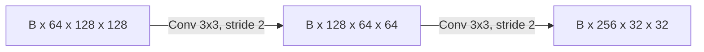
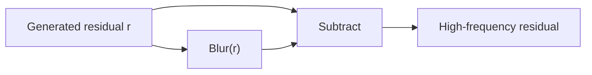

# 01 - Mathematical Foundations

## Learning Objectives

You will learn the minimum mathematics required to read the model and training code:

- tensor notation and shape transformations;
- convolution, sampling, and frequency content;
- gradients and optimization;
- probability distributions and latent variables;
- expectations, norms, and common image losses.

## 1. Tensors and Shapes

A tensor is a multidimensional array. Image batches use PyTorch's `NCHW` convention:

\[
X \in \mathbb{R}^{B\times C\times H\times W}.
\]

- \(B\): batch size;
- \(C\): channels;
- \(H,W\): height and width.

For one GeoDiff-GAN training example:

| Tensor | Shape | Meaning |
|---|---:|---|
| LR | \(B\times3\times128\times128\) | simulated 40 m RGB |
| HR | \(B\times3\times512\times512\) | native 10 m RGB |
| latent | \(B\times4\times64\times64\) | compressed residual |
| text tokens | \(B\times64\times768\) | frozen text features |
| degradation | \(B\times4\) | sensor simulation parameters |

### Shape arithmetic

For a 2D convolution with kernel \(K\), stride \(S\), padding \(P\), and dilation \(D\):

\[
H_{\text{out}} =
\left\lfloor\frac{H_{\text{in}} + 2P - D(K-1)-1}{S}+1\right\rfloor.
\]

Example: \(K=3,S=2,P=1,D=1,H_{\text{in}}=128\) gives \(H_{\text{out}}=64\).

## 2. Vectors, Matrices, and Projections

A convolution at one location is a shared linear transformation followed by a bias. Attention uses
matrix products:

\[
\operatorname{Attention}(Q,K,V)
= \operatorname{softmax}\left(\frac{QK^\top}{\sqrt{d}}\right)V.
\]

The dot product measures alignment. The softmax turns scores into non-negative weights that sum to
one. Cross-attention uses image features as queries and text tokens as keys and values.

An evidence projection is conceptually different. It moves an estimate toward the set of images
that reproduce the observed LR image:

\[
x_{k+1}=x_k+\alpha U\left(y-\mathcal{D}(x_k)\right),
\]

where \(\mathcal{D}\) is degradation and \(U\) upsamples the LR error.

## 3. Convolution and Receptive Field

For image \(x\) and kernel \(k\):

\[
(k*x)[i,j]=\sum_{u,v}k[u,v]x[i-u,j-v].
\]

Convolution detects local patterns and shares weights across location. Stacking convolutions grows
the receptive field. Downsampling grows it faster but removes spatial detail.

### Low and high frequencies

- Low frequencies represent gradual variation: broad land-cover color, illumination, large fields.
- High frequencies represent rapid variation: edges, roofs, narrow roads, texture, noise.

A simple high-pass residual is:

\[
r_{\text{HP}}=r-\operatorname{blur}(r).
\]

GeoDiff-GAN uses reflect padding before blurring. Zero padding would create artificial dark borders,
causing a constant residual to become non-zero near the image boundary.

## 4. Sampling and Aliasing

Downsampling keeps fewer spatial samples. Frequencies above the new Nyquist limit fold into lower
frequencies unless the image is blurred first. Therefore realistic degradation must blur before
4x sampling:

\[
x \xrightarrow{k_\theta *} x_b \xrightarrow{D_4} y.
\]

Area downsampling alone is not a complete sensor model. The blur kernel approximates the optical
and detector modulation transfer function.

## 5. Calculus and Backpropagation

A model \(f_\phi\) maps input to prediction. A scalar loss \(L(f_\phi(x),y)\) measures error.
Training updates parameters:

\[
\phi \leftarrow \phi-\eta\nabla_\phi L.
\]

The chain rule propagates gradients through composed operations:

\[
\frac{\partial L}{\partial \phi}
=\frac{\partial L}{\partial f}
\frac{\partial f}{\partial \phi}.
\]

For a residual output \(\hat{x}=b+r_\phi\):

\[
\frac{\partial L}{\partial r_\phi}
=\frac{\partial L}{\partial \hat{x}},
\]

so the decoder directly receives the output loss while the fixed base provides a stable reference.

## 6. Probability and Latent Variables

The inverse problem has multiple plausible solutions, so model a conditional distribution:

\[
p(x\mid y,c,\theta,m),
\]

not only one deterministic mapping.

### Gaussian distribution

A scalar Gaussian is:

\[
p(z)=\frac{1}{\sqrt{2\pi\sigma^2}}
\exp\left(-\frac{(z-\mu)^2}{2\sigma^2}\right).
\]

The VAE predicts \(\mu\) and \(\log\sigma^2\), then samples using reparameterization:

\[
z=\mu+\sigma\epsilon,\qquad \epsilon\sim\mathcal{N}(0,I).
\]

This keeps sampling differentiable with respect to \(\mu\) and \(\sigma\).

### Expectation

Training minimizes average loss over data, prompts, degradation, timesteps, and noise:

\[
\mathbb{E}_{x,y,c,\theta,t,\epsilon}[L].
\]

A minibatch is a Monte Carlo estimate of this expectation.

## 7. Norms and Image Losses

### L1 and Charbonnier

\[
L_1=\frac{1}{N}\sum_i|\hat{x}_i-x_i|.
\]

Charbonnier is a smooth robust approximation:

\[
L_{\text{char}}=\frac{1}{N}\sum_i
\sqrt{(\hat{x}_i-x_i)^2+\epsilon^2}.
\]

### Mean squared error

\[
L_2=\frac{1}{N}\sum_i(\hat{x}_i-x_i)^2.
\]

MSE penalizes large errors strongly and is connected to PSNR.

### Cosine similarity

\[
\cos(a,b)=\frac{a^\top b}{\|a\|_2\|b\|_2}.
\]

Image-text alignment losses often maximize cosine similarity in a shared embedding space.

### KL divergence for the VAE

For a diagonal Gaussian relative to \(\mathcal{N}(0,I)\):

\[
D_{KL}=
-\frac{1}{2}\sum_j
\left(1+\log\sigma_j^2-\mu_j^2-\sigma_j^2\right).
\]

It regularizes latent space but can damage reconstruction if weighted too strongly.

## 8. Optimization Concepts

- **Learning rate:** step size.
- **Momentum/Adam moments:** running estimates that stabilize updates.
- **Weight decay:** parameter regularization.
- **Gradient clipping:** limits unstable large gradients.
- **Gradient accumulation:** sums several microbatch gradients before an optimizer step.
- **Mixed precision:** stores many operations in FP16/BF16 while protecting sensitive operations.

Effective batch size in distributed training:

\[
B_{\text{eff}}=
B_{\text{GPU}}\times N_{\text{GPU}}\times N_{\text{accumulation}}.
\]

For batch 1, two GPUs, and accumulation 8, \(B_{\text{eff}}=16\).

## Common Misunderstandings

1. **More output pixels do not mean more observed information.** They mean the model must infer more.
2. **A lower pixel loss does not guarantee perceptual realism.**
3. **A sharp image can still be spatially wrong.**
4. **A probability model does not make every sample equally valid.** Conditioning and consistency
   still constrain the sample.

## Exercises

1. Calculate the output size of a \(512\times512\) image after three stride-2 convolutions with
   \(K=3,P=1\).
2. Why must anti-alias blur precede downsampling?
3. Derive the effective batch size for batch 2, two GPUs, accumulation 4.
4. Explain why \(r-\operatorname{blur}(r)\) should be nearly zero for a constant image.
5. State the difference between a deterministic estimate \(f(y)\) and a conditional distribution
   \(p(x\mid y)\).

## Mastery Checklist

- [ ] I can calculate convolution shapes.
- [ ] I understand low and high spatial frequencies.
- [ ] I can explain gradients and the chain rule.
- [ ] I understand Gaussian sampling and KL regularization.
- [ ] I can distinguish pixel, perceptual, and consistency objectives.

Next: [02 - Deep Learning and PyTorch](02_deep_learning_and_pytorch.md).
