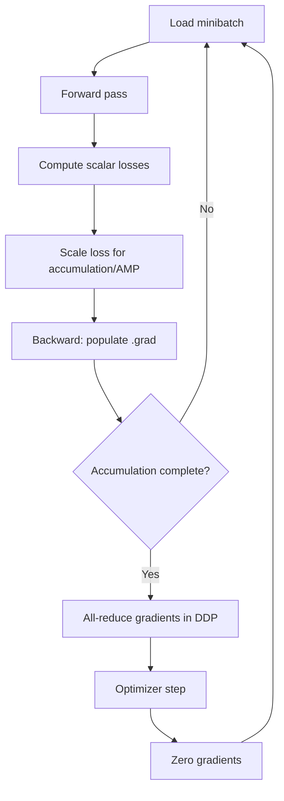
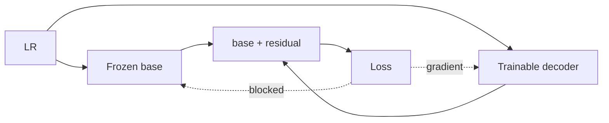
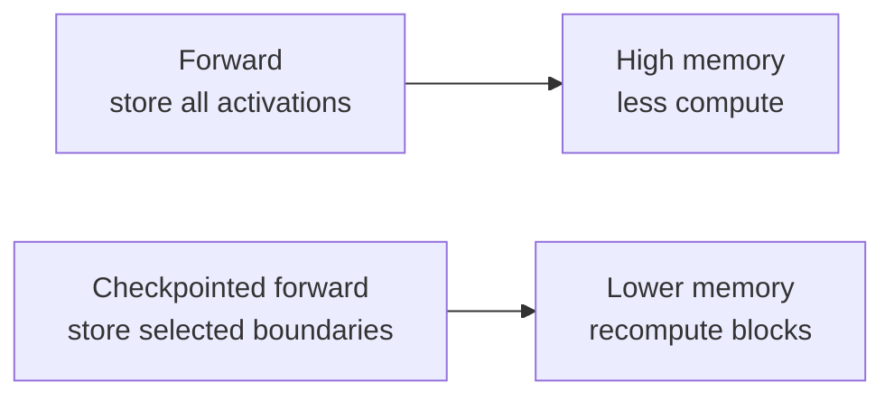
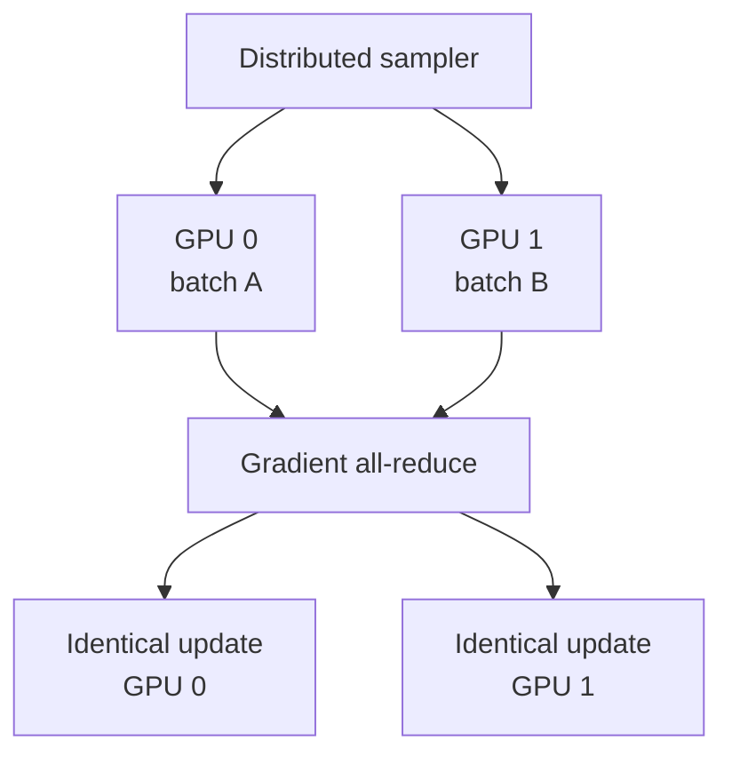

# 02 - Deep Learning and PyTorch

## Learning Objectives

- understand the training lifecycle of a PyTorch model;
- read `nn.Module` code in this repository;
- reason about autograd, freezing, AMP, accumulation, and DDP;
- recognize common memory and numerical failures.

## 1. The PyTorch Training Loop



Minimal conceptual code:

```python
optimizer.zero_grad(set_to_none=True)
for step, batch in enumerate(loader):
    with torch.autocast("cuda", dtype=torch.float16):
        prediction = model(batch["lr"])
        loss = criterion(prediction, batch["hr"]) / accumulation_steps

    scaler.scale(loss).backward()

    if (step + 1) % accumulation_steps == 0:
        scaler.step(optimizer)
        scaler.update()
        optimizer.zero_grad(set_to_none=True)
```

The actual trainer supports stage-specific modules, discriminators, checkpoint transfer, and
distributed gradient synchronization. Read
[`trainer.py`](../src/geodiff_gan/training/trainer.py).

## 2. `nn.Module`

An `nn.Module` stores trainable layers and defines a `forward` transformation:

```python
class ResidualBlock(nn.Module):
    def __init__(self, channels):
        super().__init__()
        self.conv1 = nn.Conv2d(channels, channels, 3, padding=1)
        self.conv2 = nn.Conv2d(channels, channels, 3, padding=1)

    def forward(self, x):
        return x + self.conv2(F.gelu(self.conv1(x)))
```

The skip connection learns a correction rather than a complete replacement. This improves gradient
flow and matches the residual philosophy of the entire model.

### Parameters, buffers, and activations

- **Parameters** are optimized, such as convolution weights.
- **Buffers** are saved state but not optimized, such as fixed kernels.
- **Activations** are intermediate tensors produced during a forward pass.

Activations usually dominate training memory, especially at \(512\times512\).

## 3. Autograd

PyTorch builds a dynamic computation graph from tensor operations. Calling `loss.backward()`
applies the chain rule and accumulates gradients in parameter `.grad` fields.

Important rules:

- `torch.no_grad()` prevents graph construction.
- `.detach()` creates a tensor that shares values but blocks gradient flow.
- `requires_grad_(False)` freezes a parameter.
- `model.eval()` changes dropout and normalization behavior; it does not freeze parameters.
- gradients accumulate until explicitly cleared.



## 4. Freezing by Training Stage

GeoDiff-GAN is too coupled to train every component randomly from the start. Each stage controls
`requires_grad`:

| Stage | Main trainable modules |
|---|---|
| base | deterministic SR base |
| vae | residual VAE, LR encoder, GeoMapper, decoder |
| diffusion | diffusion U-Net |
| joint | diffusion, LR encoder, GeoMapper, decoder |
| edit | diffusion, GeoMapper, decoder |

Freezing has three benefits:

1. preserves capabilities learned in earlier stages;
2. reduces GPU memory and optimizer state;
3. makes each optimization problem better conditioned.

It also has a risk: a frozen interface can become a bottleneck. Joint fine-tuning later repairs
some mismatch between independently trained modules.

## 5. Mixed Precision

FP16 reduces memory and increases tensor-core throughput, but its numeric range is smaller than
FP32. Automatic mixed precision selects safer dtypes for operations.

Gradient scaling multiplies the loss before backward so small FP16 gradients do not underflow:

\[
L' = sL,\qquad \nabla L' = s\nabla L.
\]

Before the optimizer update, gradients are unscaled.

Watch for:

- NaN or Inf losses;
- overflow in attention logits;
- unstable discriminator updates;
- tiny consistency losses disappearing in FP16.

The diagnostics module explicitly tests tensors for non-finite values.

## 6. Gradient Checkpointing

Normal backpropagation stores activations. Checkpointing stores fewer activations and recomputes
them during backward:



This is useful for diffusion U-Nets and attention layers. The tradeoff is slower training.

## 7. Distributed Data Parallel

Each GPU owns one model replica and receives a different minibatch. After backward, gradients are
averaged:

\[
g = \frac{1}{N}\sum_{i=1}^{N}g_i.
\]



This repository's stage logic sometimes calls submodules directly rather than only invoking the
top-level DDP wrapper. The trainer therefore explicitly synchronizes generator gradients before the
optimizer step. Without synchronization, replicas would silently diverge.

## 8. Shape and Device Discipline

Before combining tensors, verify:

- same batch dimension;
- expected channel count;
- compatible spatial dimensions;
- same device;
- compatible dtype.

Use explicit interpolation when fusing scales:

```python
skip = F.interpolate(skip, size=x.shape[-2:], mode="bilinear", align_corners=False)
x = torch.cat([x, skip], dim=1)
```

Do not use interpolation to conceal an unexplained shape error. First determine whether the
architecture intends those tensors to represent the same spatial grid.

## 9. Debugging Hooks

Forward hooks can capture activations without modifying layer code:

```python
handles = []

def capture(name):
    def hook(_module, _inputs, output):
        activations[name] = output.detach().float().cpu()
    return hook

handles.append(model.mapper.register_forward_hook(capture("mapper")))
```

Remove hooks after use. Retaining graph-connected outputs in a Python list can cause a memory leak.

The repository provides a structured alternative in
[`diagnostics.py`](../src/geodiff_gan/diagnostics.py).

## Exercises

1. Explain the difference among `eval()`, `no_grad()`, and `requires_grad_(False)`.
2. Why divide a loss by the accumulation count before `backward()`?
3. What fails if two DDP replicas update without gradient all-reduce?
4. Estimate which costs more activation memory: \(64\times64\times512\) or
   \(512\times512\times48\).
5. Add a temporary hook to one module and print only shape, minimum, maximum, mean, and standard
   deviation.

## Mastery Checklist

- [ ] I can trace a PyTorch training step.
- [ ] I know how gradients are created, blocked, accumulated, and synchronized.
- [ ] I can explain AMP and checkpointing tradeoffs.
- [ ] I can diagnose shape, device, and dtype mismatches.

Next: [03 - Remote Sensing and Sentinel-2](03_remote_sensing_and_sentinel2.md).
