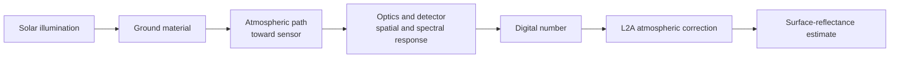
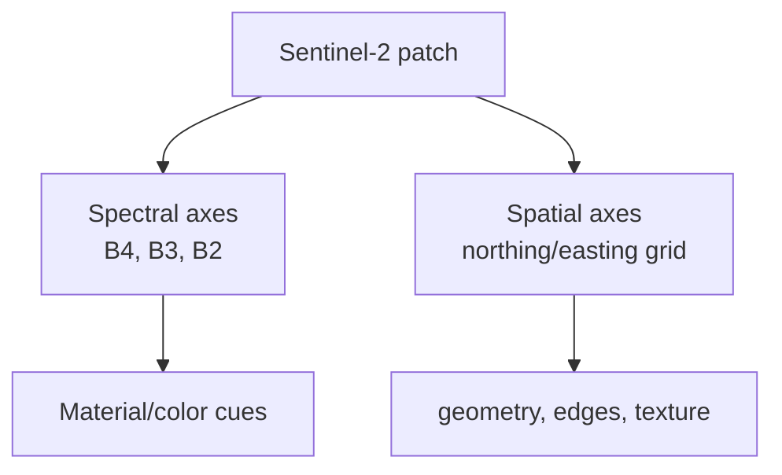
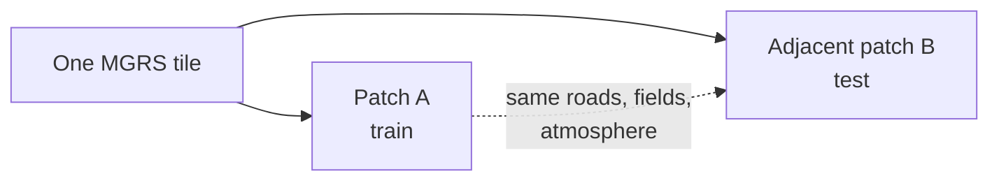
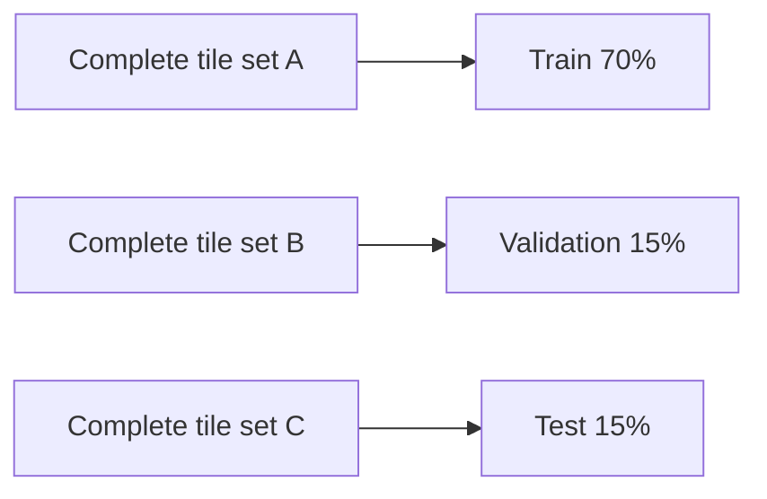

# 03 - Remote Sensing and Sentinel-2

## Learning Objectives

- understand what Sentinel-2 L2A RGB pixels represent;
- distinguish spatial resolution, sampling distance, and geolocation;
- understand B4/B3/B2, surface reflectance, SCL, tiling, and masks;
- identify remote-sensing assumptions that limit the experiment.

## 1. From Ground to Pixel

A satellite pixel is not a photograph of an infinitesimal point. It is the result of:

The measured value integrates radiance over:

- a spectral response interval;
- a ground footprint;
- an exposure period;
- the sensor point-spread function.

Therefore "10 m pixel" is shorthand for a sampled product with approximately 10 m ground sampling
distance for the selected bands. It is not a perfect \(10\text{ m}\times10\text{ m}\) box average
with infinite geolocation accuracy.

## 2. Sentinel-2 L2A RGB

This project uses:

| Display channel | Sentinel-2 band | Approximate color | Native sampling |
|---|---|---|---:|
| R | B4 | red | 10 m |
| G | B3 | green | 10 m |
| B | B2 | blue | 10 m |

L2A products contain bottom-of-atmosphere surface-reflectance estimates. Integer values are scaled
by 10,000, so preprocessing uses:

\[
x_{\text{reflectance}} =
\operatorname{clip}\left(\frac{x_{\text{stored}}}{10000},0,1\right).
\]

Clipping is an engineering choice. Confirm the product metadata and quality flags rather than
assuming every large value is valid reflectance.

## 3. Spectral versus Spatial Information

RGB channels describe three spectral bands. Super-resolution increases the number of spatial
samples; it does not create new spectral bands.

A prompt such as "dense urban blocks" influences expected spatial texture. It must not silently
change measured reflectance into arbitrary colors in SR mode.

## 4. Scene Classification Layer

The Scene Classification Layer labels pixel categories used to reject:

- no data and defective pixels;
- cloud shadows;
- medium/high probability clouds;
- thin cirrus;
- snow or ice;
- saturated or invalid observations.

Patch filtering evaluates the valid fraction. A threshold of 0.95 means at least 95% of the patch
must pass the mask.

Why not simply inpaint cloud pixels? Because that changes the task from spatial super-resolution to
cloud removal and introduces another source of hallucination.

Read the data implementation in [`io.py`](../src/geodiff_gan/io.py).

## 5. Coordinate Reference Systems and MGRS Tiles

Sentinel-2 products are organized using MGRS tile identifiers. Windows from the same or nearby tile
are highly correlated through land cover, acquisition conditions, and repeated structures.

Random patch splitting leaks this correlation:

Correct splitting:

The split unit is the complete MGRS tile, not the patch. For a rigorous study, also inspect the
geographic distance and environmental similarity between tile sets.

## 6. Synthetic 40 m Inputs

The primary experiment starts with native 10 m RGB and synthesizes 40 m LR. This provides exact
paired targets:

\[
x_{10m} \xrightarrow{\mathcal{D}_\theta} y_{40m}.
\]

Advantages:

- pixel-aligned supervision;
- controlled degradation;
- known blur/noise parameters;
- repeatable evaluation.

Limitations:

- synthetic blur may not match a real 40 m sensor;
- native 10 m imagery already includes its own PSF and noise;
- resampling 10 m imagery does not reproduce every physical property of an actual 40 m acquisition;
- results demonstrate recovery under the simulated degradation distribution.

This is a central validity statement for the thesis.

## 7. Radiometry and Augmentation

Spatial transforms such as flips and 90-degree rotations preserve reflectance values and are
usually defensible. Aggressive color jitter is risky because it changes radiometry.

Evaluate each augmentation by asking:

1. Could this transformation occur physically?
2. Does it preserve the target task?
3. Does it alter a quantity the model is expected to reconstruct?

For example, arbitrary channel permutation is not valid because B4, B3, and B2 have fixed spectral
meaning.

## 8. Spatial Fidelity

Spatial conservation includes several ideas:

- major boundaries remain aligned with LR evidence;
- the output re-degrades close to the observed LR image;
- generated detail does not shift objects;
- edge enhancement does not introduce ringing;
- geospatial metadata remains correct when saving outputs.

Pixel-space consistency does not by itself preserve map coordinates. In production, retain the
source transform, CRS, and extent when writing a 4x raster, with pixel size divided by four and the
same geographic bounds.

## Exercises

1. Explain why a 10 m pixel is not a perfect point sample.
2. Why is SCL masking part of scientific validity rather than only data cleaning?
3. Give an example of geographic leakage that random patch splitting would create.
4. State exactly what can and cannot be concluded from synthetic 40 m experiments.
5. Which metadata must be preserved to write a georeferenced 10 m result from a 40 m input?

## Mastery Checklist

- [ ] I understand L2A surface reflectance and B4/B3/B2.
- [ ] I can explain SCL-based filtering.
- [ ] I know why splits must be tile-level.
- [ ] I can state the domain gap of synthetic degradation.
- [ ] I distinguish visual sharpness from geospatial fidelity.

Next: [04 - Image Formation and Super-Resolution](04_image_formation_and_super_resolution.md).
