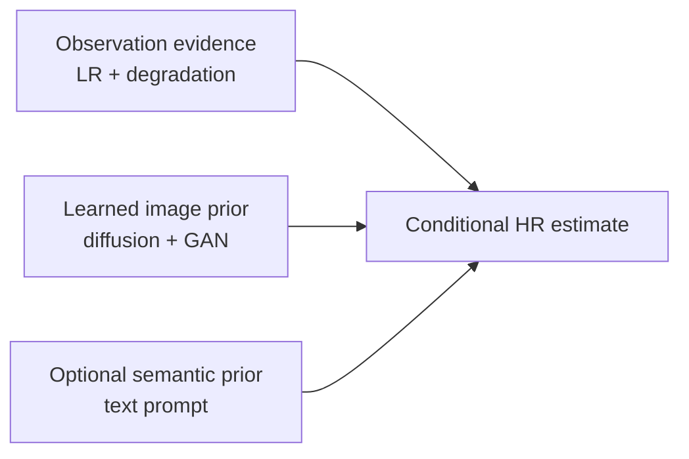
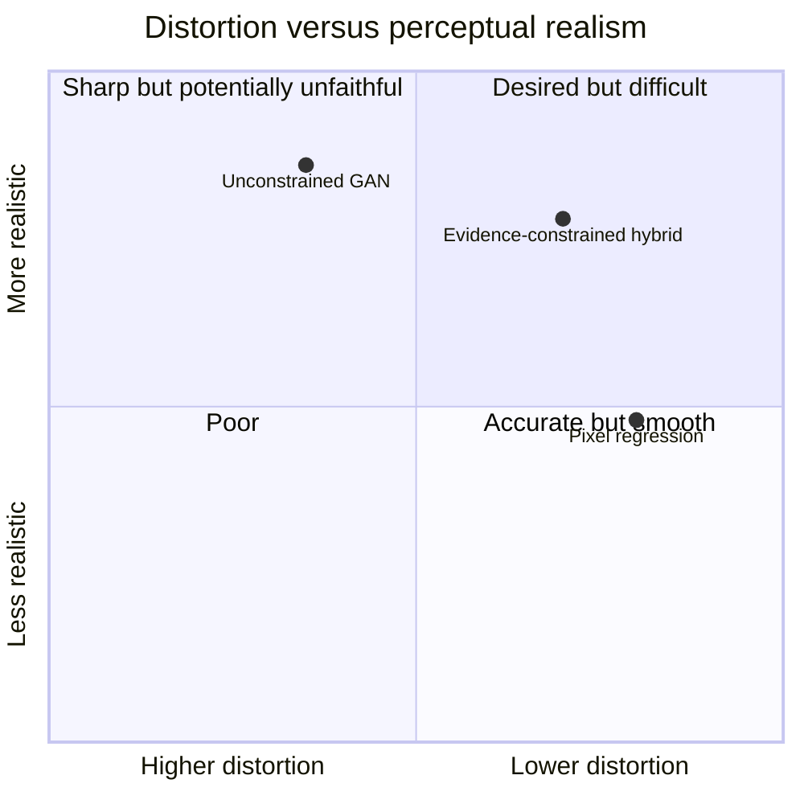
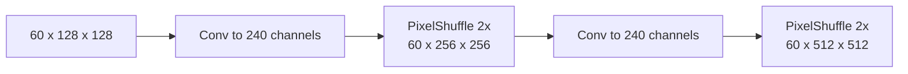
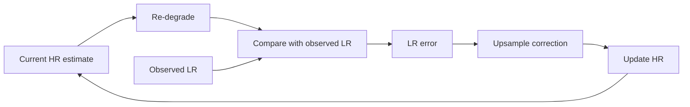

# 04 - Image Formation and Super-Resolution

## Learning Objectives

- formulate super-resolution as a conditional inverse problem;
- understand blur, downsampling, noise, quantization, and aliasing;
- compare interpolation, regression, GAN, and diffusion SR;
- understand residual prediction and back-projection.

## 1. Forward and Inverse Problems

The forward model maps a high-resolution scene to an observation:

\[
y=\mathcal{D}_\theta(x).
\]

The inverse problem estimates \(x\) from \(y\). Because degradation loses information,
\(\mathcal{D}_\theta^{-1}\) is not unique.

Bayesian interpretation:

\[
p(x\mid y,\theta)
\propto p(y\mid x,\theta)p(x).
\]

- \(p(y\mid x,\theta)\): data likelihood or sensor consistency;
- \(p(x)\): prior knowledge about plausible satellite images;
- \(p(x\mid y,\theta)\): posterior distribution of plausible HR images.

GeoDiff-GAN combines both:

## 2. Degradation Components

### Blur

Blur approximates the sensor's spatial response:

\[
x_b=k_\theta*x.
\]

A Gaussian kernel is a practical simplification. Real sensors may have anisotropic, non-Gaussian,
band-dependent, and spatially varying MTF.

### Downsampling

\[
y_d=D_4(x_b).
\]

Each dimension is reduced by four:

\[
512\times512\rightarrow128\times128.
\]

### Poisson-Gaussian noise

Signal-dependent shot noise and signal-independent read noise can be approximated together:

\[
y_n=y_d+n_p(y_d)+n_g.
\]

### Quantization

For \(q\) levels:

\[
Q(y)=\frac{\operatorname{round}(qy)}{q}.
\]

Quantization makes the observation discrete and destroys small differences.

## 3. Four Families of SR Methods

| Method | Strength | Weakness |
|---|---|---|
| Bicubic interpolation | fast, stable, no hallucination model | cannot reconstruct missing detail |
| Pixel-regression CNN/Transformer | strong PSNR and structure | often smooth under ambiguity |
| GAN SR | sharp, realistic local texture | may hallucinate or create artifacts |
| Diffusion SR | models multiple plausible outputs | slow sampling and possible inconsistency |

GeoDiff-GAN is hybrid:

- deterministic transformer for stable structure;
- latent diffusion for stochastic residual content;
- adversarial decoder for realistic high frequencies;
- sensor projection for evidence consistency.

## 4. Distortion-Perception Tradeoff

Optimizing only pixel error tends toward the conditional mean:

\[
\hat{x}_{MSE}(y)=\mathbb{E}[x\mid y].
\]

When several sharp textures are plausible, their mean can be blurry. Perceptual and adversarial
losses prefer natural-looking samples but may move away from exact pixel correspondence.

The final point is a research goal, not a guaranteed result.

## 5. Residual Super-Resolution

Instead of predicting all HR values:

\[
\hat{x}=G(y),
\]

predict:

\[
\hat{x}=B(y)+R(y,z,c,\theta).
\]

Benefits:

- the base carries low-frequency color and geometry;
- the residual branch focuses capacity on missing detail;
- the output remains useful before generative training is mature;
- residual magnitude can be monitored for hallucination.

The residual-to-base ratio diagnostic is:

\[
\rho=\frac{\mathbb{E}|R|}{\mathbb{E}|B|+\epsilon}.
\]

A rapidly growing \(\rho\) is a warning that the generative branch is overpowering observed
structure.

## 6. PixelShuffle Upsampling

PixelShuffle rearranges channels into spatial resolution. For scale \(r=2\):

\[
B\times(4C)\times H\times W
\rightarrow B\times C\times2H\times2W.
\]

Two stages produce 4x:

It learns features in LR space before rearrangement and avoids some transposed-convolution
artifacts.

## 7. High-Pass Residual Control

In SR mode:

\[
\hat{x}_0=B(y)+H(R),
\qquad H(R)=R-\operatorname{blur}(R).
\]

This restricts the generative branch from making broad color or illumination changes. It is a soft
architectural bias, not a mathematical guarantee of truth.

In edit mode:

\[
\hat{x}_0=B(y)+R,
\]

so prompts can affect lower frequencies. This is why edit output must be labeled synthetic.

## 8. Iterative Back-Projection

Compute the LR error:

\[
e_k=y-\mathcal{D}_\theta(\hat{x}_k).
\]

Upsample and add a correction:

\[
\hat{x}_{k+1}=
\operatorname{clip}\left(\hat{x}_k+\alpha U(e_k),0,1\right).
\]

The repository uses bicubic upsampling as an approximate correction, not the exact adjoint of the
physical degradation. Three steps with stronger weight are used in SR mode; edit mode uses one
weaker step.

### What back-projection guarantees

It tends to reduce the implemented re-degradation error. It does not guarantee:

- unique recovery;
- correct high-frequency phase;
- absence of hallucinated details;
- consistency with a real sensor outside the simulated degradation model.

## 9. Baselines

A defensible study needs:

- bicubic;
- deterministic base/SwinIR;
- GAN-only residual model;
- diffusion-only model;
- full hybrid model.

These isolate whether complexity produces measurable benefit rather than merely attractive images.

## Exercises

1. Write the Bayesian SR equation and label likelihood and prior.
2. Why does MSE produce smooth outputs under multimodal ambiguity?
3. Calculate the channel requirement before 2x PixelShuffle for 60 output channels.
4. Explain why high-pass filtering protects radiometry but cannot prove spatial truth.
5. Give a case where LR back-projection error is low but HR detail is wrong.

## Mastery Checklist

- [ ] I can formulate SR as an ill-posed inverse problem.
- [ ] I understand the complete synthetic degradation chain.
- [ ] I can explain the perception-distortion tradeoff.
- [ ] I understand residual prediction, PixelShuffle, and back-projection.

Next: [05 - GAN Foundations](05_gan_foundations.md).
