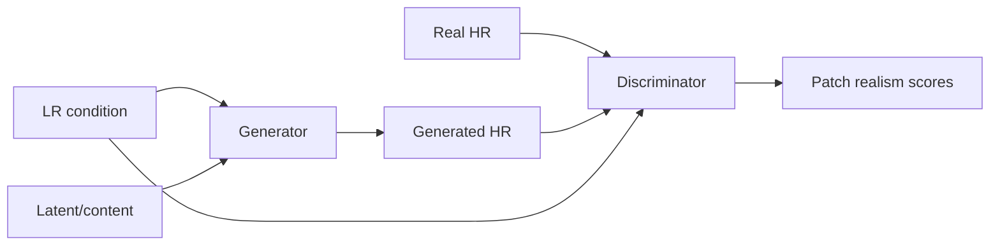
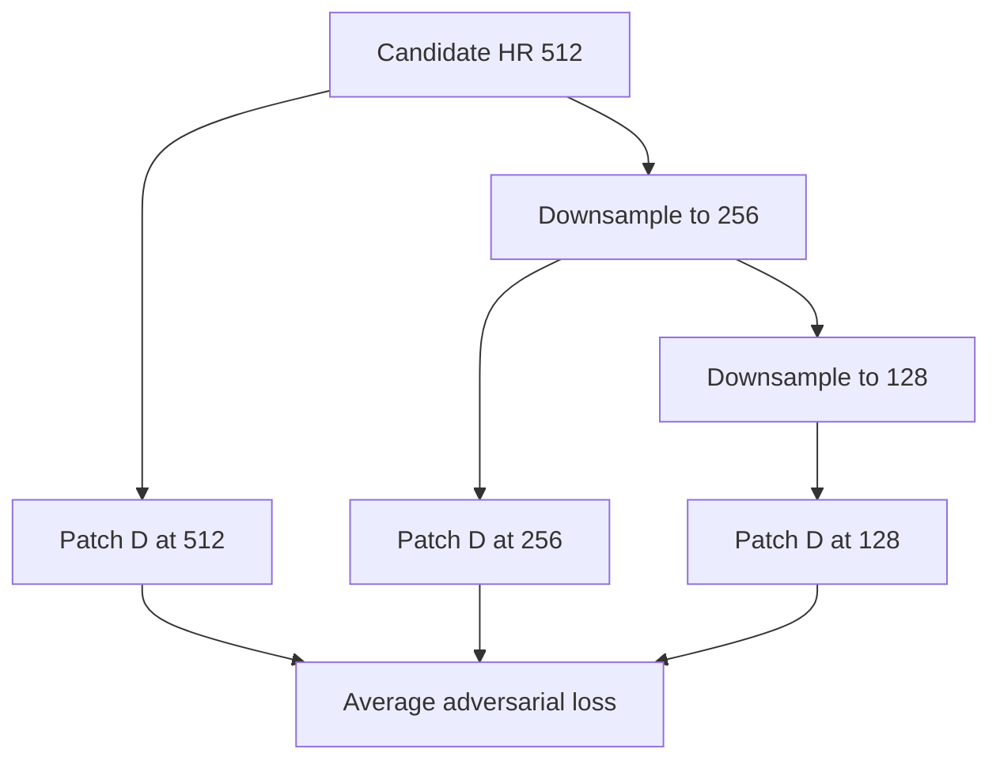
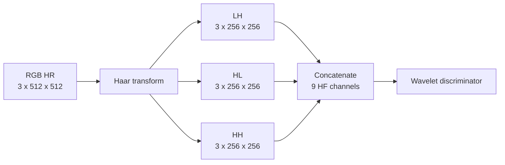
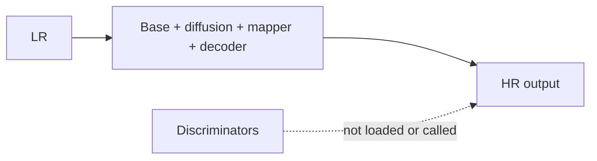

# 05 - GAN Foundations

## Learning Objectives

- understand generator-discriminator competition;
- derive hinge adversarial losses;
- understand conditional multi-scale PatchGAN and wavelet discrimination;
- recognize instability and hallucination risks.

## 1. The Adversarial Idea

A generator \(G\) produces samples. A discriminator \(D\) learns to distinguish real HR images
from generated ones.

The original minimax objective is:

\[
\min_G\max_D
\mathbb{E}_{x\sim p_{\text{data}}}\log D(x)
+\mathbb{E}_{z}\log(1-D(G(z))).
\]

In practice, GeoDiff-GAN uses hinge losses because they often provide stable gradients.

## 2. Hinge Loss

For discriminator scores \(D(x)\), where larger means more real:

\[
L_D=
\mathbb{E}[\max(0,1-D(x))]
+\mathbb{E}[\max(0,1+D(\hat{x}))].
\]

The generator loss is:

\[
L_G^{adv}=-\mathbb{E}[D(\hat{x})].
\]

Interpretation:

- real samples are encouraged to score above \(+1\);
- fake samples are encouraged to score below \(-1\);
- the generator tries to increase fake scores.

The adversarial weight begins small, \(0.01\), because spatial and radiometric objectives must
dominate satellite reconstruction.

## 3. Conditional Discrimination

An unconditional discriminator asks, "Does this look like a satellite image?" A conditional
discriminator asks, "Does this HR image look real **for this LR observation**?"

\[
D(x,y).
\]

The LR image is resized to the HR discriminator scale and concatenated with the candidate. This
discourages realistic but unrelated textures.

However, conditioning is not a perfect guarantee. A discriminator may focus on easy texture cues
and underuse the LR condition. Re-degradation loss and explicit diagnostics remain necessary.

## 4. PatchGAN

PatchGAN produces a spatial score map rather than one scalar:

\[
D(x,y)\in\mathbb{R}^{1\times H_D\times W_D}.
\]

Each score evaluates a receptive-field patch. Benefits:

- focuses on local texture and edges;
- uses one model across image sizes;
- provides many adversarial decisions per image;
- is less parameter-heavy than a global classifier.

GeoDiff-GAN uses three scales:

| Input candidate scale | Approximate score map |
|---:|---:|
| \(512\times512\) | \(1\times62\times62\) |
| \(256\times256\) | \(1\times30\times30\) |
| \(128\times128\) | \(1\times14\times14\) |

High-resolution discrimination emphasizes fine texture. Lower scales see larger structures relative
to their receptive field.

Implementation: [`discriminators.py`](../src/geodiff_gan/models/discriminators.py).

## 5. Haar-Wavelet Discriminator

The 2D Haar transform decomposes each channel into:

- LL: coarse low-frequency content;
- LH: one edge orientation;
- HL: the orthogonal edge orientation;
- HH: diagonal high frequencies.

For adversarial high-frequency supervision, use LH, HL, and HH:

\[
\operatorname{Haar}_{HF}(x)\in
\mathbb{R}^{B\times9\times256\times256}
\]

for RGB \(512\times512\) input. The LR condition is expanded to matching channels, producing 18
channels for the wavelet discriminator.

Why omit LL? The deterministic base and reconstruction losses already supervise broad content. The
wavelet discriminator concentrates capacity on detail where GAN supervision is most useful.

## 6. Why GAN Training Is Difficult

The objective is a game, not minimization of one fixed loss. As \(G\) changes, the optimal \(D\)
changes.

Common failures:

| Failure | Symptom | Possible cause |
|---|---|---|
| discriminator dominance | generator adversarial loss grows, texture stalls | D learning rate/capacity too high |
| generator overpowering | D cannot separate real/fake | weak D or stale updates |
| checkerboard/ringing | periodic edge artifacts | upsampling or adversarial overemphasis |
| hallucinated texture | sharp output, poor LR consistency | adversarial weight too high |
| mode collapse | samples look too similar | insufficient stochastic use |
| color drift | broad color changes | unrestricted residual or weak consistency |

## 7. Safe Adversarial Practice for Satellite SR

1. Pretrain reconstruction before enabling GAN loss.
2. Use low adversarial weight.
3. Condition on LR evidence.
4. Separate spatial and wavelet discriminators.
5. Monitor LR re-degradation error.
6. Inspect residual frequency content.
7. Compare against a no-GAN ablation.
8. Never select checkpoints only by visual sharpness.

## 8. The Discriminator Is Training-Only

At inference:

The discriminator shapes the generator's learned distribution during optimization. It is not part
of the forward inference pipeline.

## Exercises

1. Calculate hinge discriminator loss if a real score is 0.4 and a fake score is -0.2.
2. Why can an unconditional discriminator reward a spatially unrelated output?
3. What structural scales are emphasized by the three PatchGAN inputs?
4. Explain why a wavelet discriminator is complementary to pixel reconstruction.
5. Name three diagnostics that should be checked before increasing adversarial weight.

## Mastery Checklist

- [ ] I can derive generator and discriminator hinge losses.
- [ ] I understand conditional PatchGAN outputs.
- [ ] I can explain Haar high-frequency bands.
- [ ] I know why GAN loss must remain low-weight in reconstruction mode.

Next: [06 - Diffusion Foundations](06_diffusion_foundations.md).
