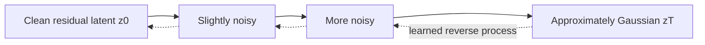
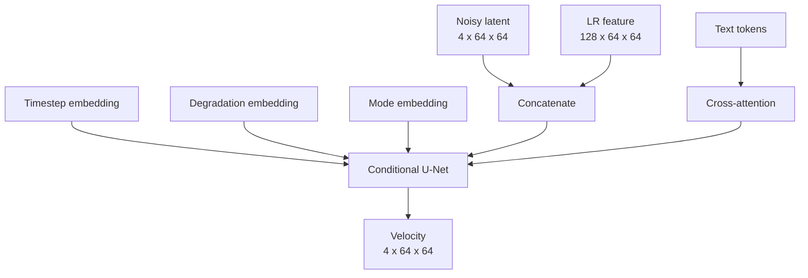
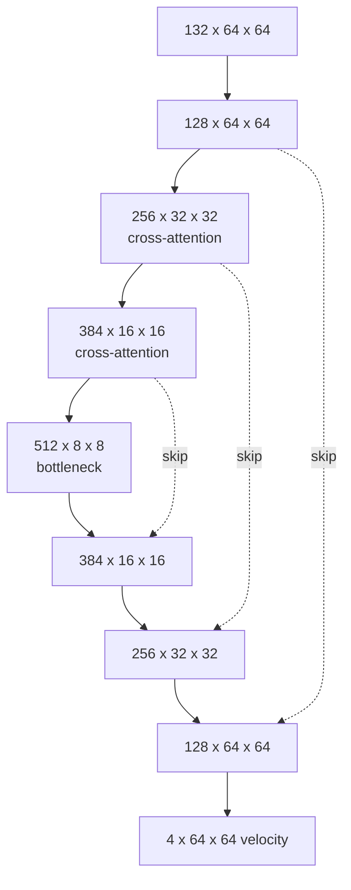
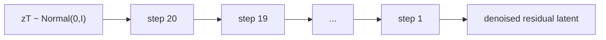

# 06 - Diffusion Foundations

## Learning Objectives

- derive forward noising and reverse denoising;
- understand \(\epsilon\), \(x_0\), and velocity prediction;
- understand conditional latent diffusion and classifier-free guidance;
- trace the diffusion U-Net's multi-scale path.

## 1. Why Diffusion?

Super-resolution is one-to-many. Diffusion models learn to transform Gaussian noise into a sample
from a complex distribution while conditioning on available evidence.

In this project, diffusion operates on a 4-channel \(64\times64\) VAE latent, not directly on RGB
\(512\times512\). This reduces memory and compute while retaining a spatial grid.

## 2. Forward Diffusion

Define a variance schedule \(\beta_t\):

\[
\alpha_t=1-\beta_t,\qquad
\bar{\alpha}_t=\prod_{s=1}^{t}\alpha_s.
\]

A noisy sample can be drawn directly:

\[
z_t=
\sqrt{\bar{\alpha}_t}z_0+
\sqrt{1-\bar{\alpha}_t}\epsilon,
\qquad
\epsilon\sim\mathcal{N}(0,I).
\]

At small \(t\), \(z_t\) resembles \(z_0\). At large \(t\), it approaches noise.

## 3. Prediction Parameterizations

The network may predict:

- noise \(\epsilon\);
- clean latent \(z_0\);
- velocity \(v\).

Velocity is:

\[
v_t=
\sqrt{\bar{\alpha}_t}\epsilon
-\sqrt{1-\bar{\alpha}_t}z_0.
\]

Given \(z_t\) and predicted \(v_t\):

\[
\hat{z}_0=
\sqrt{\bar{\alpha}_t}z_t
-\sqrt{1-\bar{\alpha}_t}\hat{v}_t,
\]

\[
\hat{\epsilon}=
\sqrt{1-\bar{\alpha}_t}z_t
+\sqrt{\bar{\alpha}_t}\hat{v}_t.
\]

Velocity prediction balances targets across noise levels and is used by GeoDiff-GAN.

Implementation: [`diffusion.py`](../src/geodiff_gan/models/diffusion.py).

## 4. Signal-to-Noise Ratio

\[
\operatorname{SNR}(t)=
\frac{\bar{\alpha}_t}{1-\bar{\alpha}_t}.
\]

Early timesteps have high SNR; late timesteps have low SNR. SNR-weighted loss prevents training
from being dominated by one region:

\[
L_{\text{diff}}=
\mathbb{E}_{t,\epsilon}
\left[w(t)\|\hat{v}_t-v_t\|_2^2\right].
\]

The exact weighting rule is a hyperparameter and must be recorded in experiments.

## 5. Conditional Diffusion

The U-Net receives:

1. noisy residual latent \(z_t\);
2. LR feature map \(f_{64}\);
3. timestep embedding;
4. degradation embedding;
5. mode embedding;
6. text token context.

The LR feature is spatial conditioning: it tells the denoiser where evidence appears. Degradation,
time, and mode are global conditioning. Text provides semantic token context.

## 6. U-Net Shape Walkthrough

Input:

\[
[z_t;f_{64}]\in\mathbb{R}^{B\times132\times64\times64}.
\]

Encoder:

| Level | Tensor |
|---|---:|
| input projection | \(B\times128\times64\times64\) |
| down 1 | \(B\times256\times32\times32\) |
| down 2 | \(B\times384\times16\times16\) |
| down 3 | \(B\times512\times8\times8\) |
| bottleneck | \(B\times512\times8\times8\) |

Decoder uses skip connections and returns:

| Level | Tensor |
|---|---:|
| up 1 | \(B\times384\times16\times16\) |
| up 2 | \(B\times256\times32\times32\) |
| up 3 | \(B\times128\times64\times64\) |
| output | \(B\times4\times64\times64\) |

The channels \([128,256,384,512]\) increase as spatial resolution decreases, trading spatial detail
for semantic capacity.

## 7. Cross-Attention

Flatten image features into query positions and text into tokens:

\[
Q=W_QF,\quad K=W_KC,\quad V=W_VC.
\]

\[
\operatorname{CrossAttn}(F,C)=
\operatorname{softmax}\left(\frac{QK^\top}{\sqrt d}\right)V.
\]

Attention is applied at \(32\times32\) and \(16\times16\), where computation is manageable and each
query has a useful receptive field. Full \(512\times512\) cross-attention would be prohibitively
expensive.

## 8. Classifier-Free Guidance

Train with some text conditions replaced by a null prompt. At inference, compute:

\[
\hat{v}_{cfg}=
\hat{v}_{null}
+s\left(\hat{v}_{cond}-\hat{v}_{null}\right).
\]

- \(s=1\): normal conditional prediction;
- \(s>1\): stronger prompt effect;
- excessive \(s\): artifacts, reduced diversity, weaker evidence fidelity.

SR mode should use conservative guidance. Edit mode can use stronger guidance because it is
explicitly synthetic.

## 9. Sampling

Training selects a random timestep and predicts one target. Inference iteratively denoises from
noise:

More steps generally improve approximation but increase latency. Eight different random seeds can
produce eight plausible outputs, whose pixelwise variance estimates model uncertainty.

This is epistemically limited: sample variance measures the model's stochastic spread, not total
real-world uncertainty.

## Exercises

1. Explain what happens to \(z_t\) as \(\bar{\alpha}_t\) approaches zero.
2. Derive \(\hat{z}_0\) from \(z_t\) and predicted velocity.
3. Why is latent diffusion cheaper than RGB diffusion at 512 resolution?
4. What roles do LR features and degradation metadata play separately?
5. Why can excessive classifier-free guidance harm reconstruction?

## Mastery Checklist

- [ ] I understand the forward noising equation.
- [ ] I can explain velocity prediction.
- [ ] I can trace all U-Net tensor sizes.
- [ ] I understand conditional attention and classifier-free guidance.
- [ ] I know what stochastic sample variance does and does not measure.

Next: [07 - Conditioning and Prompts](07_conditioning_and_prompts.md).
