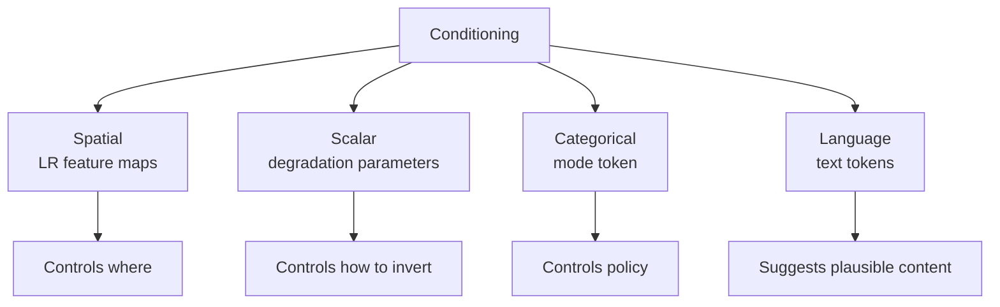
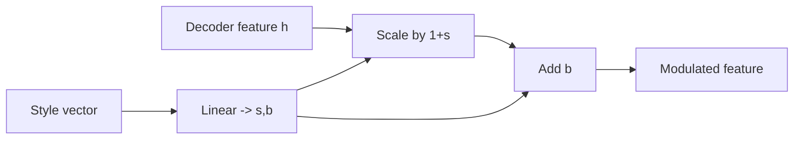
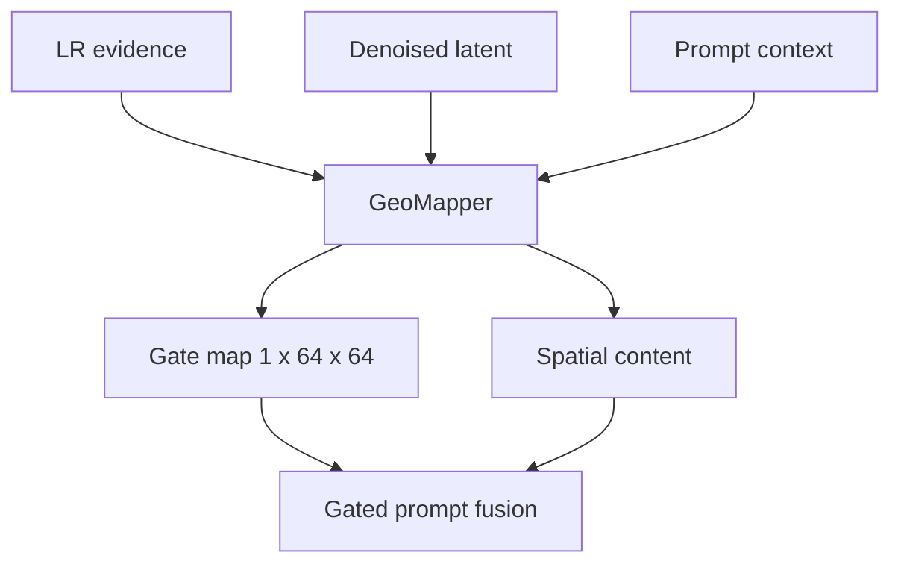

# 07 - Conditioning and Prompts

## Learning Objectives

- distinguish spatial, scalar, categorical, and text conditioning;
- understand SigLIP embeddings, cross-attention, FiLM, and evidence gating;
- understand null, paraphrased, mismatched, and counterfactual prompts;
- design prompt use without misrepresenting generated content.

## 1. Four Conditioning Types

| Condition | Shape/example | Information |
|---|---|---|
| spatial LR features | \(B\times128\times64\times64\) | where observed structures occur |
| degradation vector | \(B\times4\) | how LR was formed |
| mode token | SR or edit | allowed generative behavior |
| text tokens | \(B\times64\times768\) | optional semantic description |

## 2. Offline Captioning versus Training-Time Encoding

Qwen3-VL is used offline to create evidence-based captions from HR patches. It is not loaded during
SR training.

Training-time flow:

This separation:

- avoids keeping an 8B vision-language model in GPU memory;
- makes captions reproducible;
- keeps the SR optimization graph focused;
- permits manual caption auditing.

Caption instructions remove coordinates and place names to reduce geographic leakage and encourage
visible evidence rather than memorized location facts.

## 3. Frozen Text Encoder

The frozen encoder maps tokenized text into a semantic feature space:

\[
c=E_{\text{text}}(\text{caption}).
\]

Freezing prevents the small SR dataset from distorting general language representations. It also
makes prompt-alignment comparisons more stable.

The smoke configuration uses a lightweight hash encoder only for tests. It is not a research
substitute for SigLIP.

Implementation: [`text.py`](../src/geodiff_gan/text.py).

## 4. Prompt Augmentation

The training mixture includes:

- 40% null prompts;
- 20% paraphrase-style prompt wrappers;
- 10% mismatched prompts;
- remaining examples with their original caption.

### Null prompts

Teach unconditional behavior and enable classifier-free guidance. They prevent the model from
requiring text for basic SR.

### Paraphrase-style wrappers

The current implementation prepends an overhead-view template rather than generating a true lexical
paraphrase. This adds prompt-form variation but does not fully teach semantic invariance. A
paper-scale prompt pipeline should store genuine offline paraphrases and test that "dense
rectangular urban blocks" and "closely packed city blocks with rectilinear streets" have similar
effects.

### Mismatched prompts

Teach the system to recognize conflict between text and image evidence. They support evidence-gate
training and hard negative alignment.

### Counterfactual prompts

These are part of the proposed edit-mode curriculum: request a semantically changed but visually
plausible scenario, then label the result synthetic. The current trainer does not yet maintain a
dedicated counterfactual-caption dataset; it reuses null, wrapped, and mismatched prompt
augmentation. Add explicit counterfactual records before claiming that this part of the plan has
been experimentally implemented.

## 5. FiLM Conditioning

Feature-wise linear modulation applies channel-wise scale and bias:

\[
\operatorname{FiLM}(h;s,b)=
(1+s)\odot h+b.
\]

The GeoMapper produces layer-wise style vectors, from which decoder stages derive modulation
parameters.

FiLM changes feature interpretation without discarding spatial structure. Because \(s,b\) are
channel-wise, LR skip features still anchor locations.

## 6. Prompt Evidence Gate

The gate is a spatial mask:

\[
g\in[0,1]^{B\times1\times64\times64}.
\]

A simplified interpretation:

\[
h_{\text{guided}}=
h_{\text{evidence}}+
g\odot h_{\text{prompt}}.
\]

- \(g\approx0\): prompt influence suppressed;
- \(g\approx1\): prompt influence admitted;
- spatial variation lets the model use a prompt more strongly in ambiguous regions.

The gate is a learned policy, not a calibrated probability of truth. It must be inspected:

- mean and standard deviation;
- near-zero or near-one saturation;
- differences between null, matched, and mismatched prompts;
- spatial correspondence with ambiguous regions.

## 7. Mode Conditioning

The mode token lets one diffusion network learn two policies:

\[
m\in\{\text{SR},\text{edit}\}.
\]

Mode affects the denoiser and final projection rules. It is essential that downstream code also
enforce the policy; a token alone cannot guarantee safety.

| Control | SR | Edit |
|---|---|---|
| mode embedding | SR token | edit token |
| residual filter | high-pass | none |
| projection | 3 stronger iterations | 1 soft iteration |
| metadata | reconstruction | synthetic edit |

## 8. Prompt Alignment Loss

An image encoder and text encoder produce normalized embeddings:

\[
u=E_{\text{image}}(\hat{x}),\qquad
v=E_{\text{text}}(c).
\]

A simple alignment loss is:

\[
L_{\text{prompt}}=1-\cos(u,v).
\]

This rewards semantic agreement, but it has limitations:

- global embedding may ignore small spatial errors;
- it may reward stereotypical textures;
- it can conflict with LR evidence;
- pretrained embeddings may not represent remote-sensing semantics perfectly.

Therefore its initial weight is only \(0.05\), and edit mode retains soft LR consistency.

## 9. Responsible Prompt Semantics

Good SR prompt:

> agricultural fields with alternating narrow rectangular plots, sparse roads, and low building
> density

Risky prompt:

> add a highway and a new industrial district

The first describes plausible visible evidence. The second requests new objects. It belongs in edit
mode and must be labeled generated.

## Exercises

1. Explain why spatial LR features cannot be replaced by one pooled vector.
2. Why are null prompts required for classifier-free guidance?
3. What behavior should a mismatched prompt teach the evidence gate?
4. Compare cross-attention and FiLM.
5. Why is image-text alignment insufficient as an SR quality metric?

## Mastery Checklist

- [ ] I can identify all four conditioning types.
- [ ] I understand offline Qwen captioning and frozen SigLIP encoding.
- [ ] I can explain cross-attention, FiLM, and the evidence gate.
- [ ] I know why prompts have different authority in SR and edit modes.

Next: [08 - GeoDiff-GAN Architecture](08_geodiff_gan_architecture.md).
