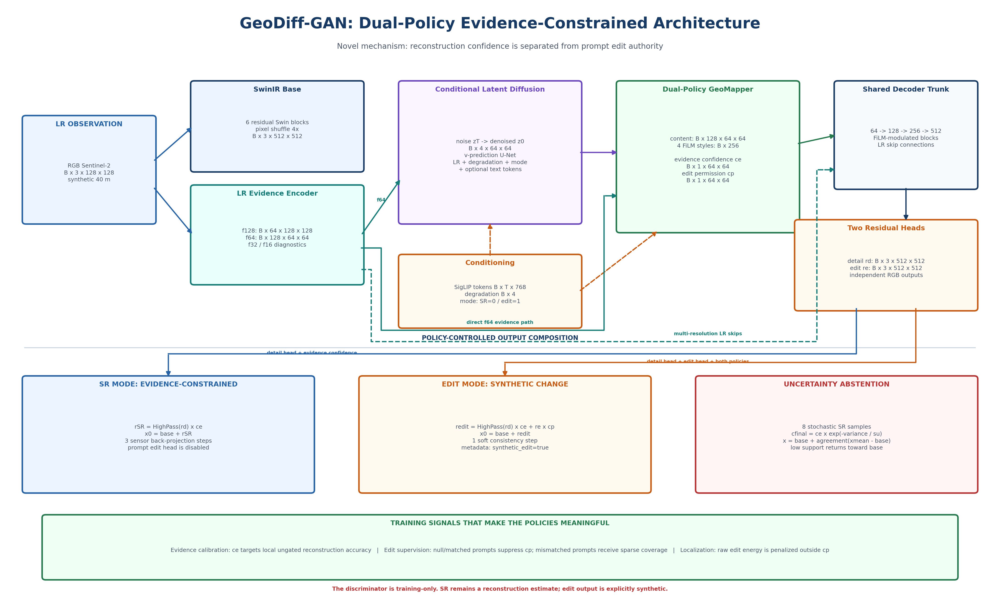
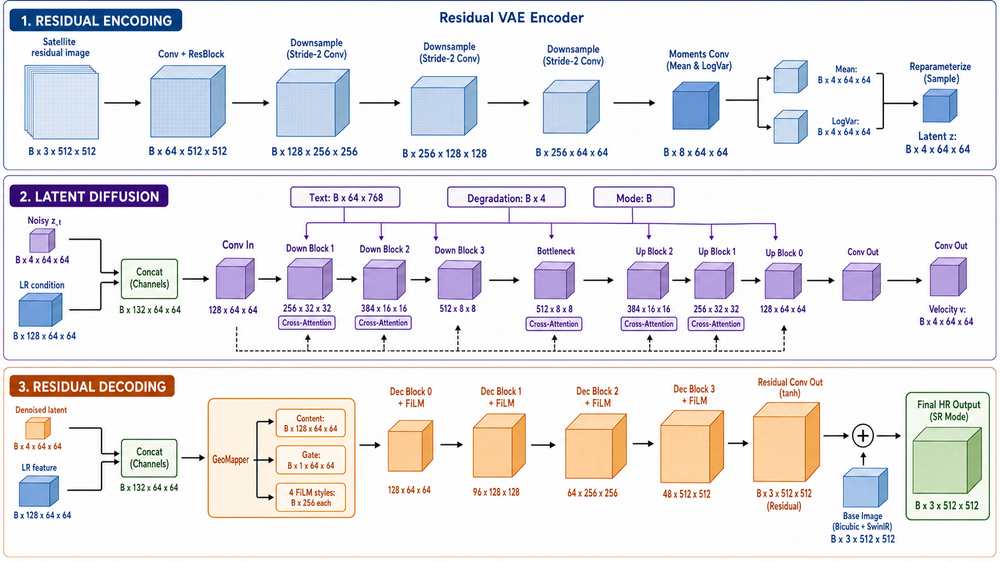
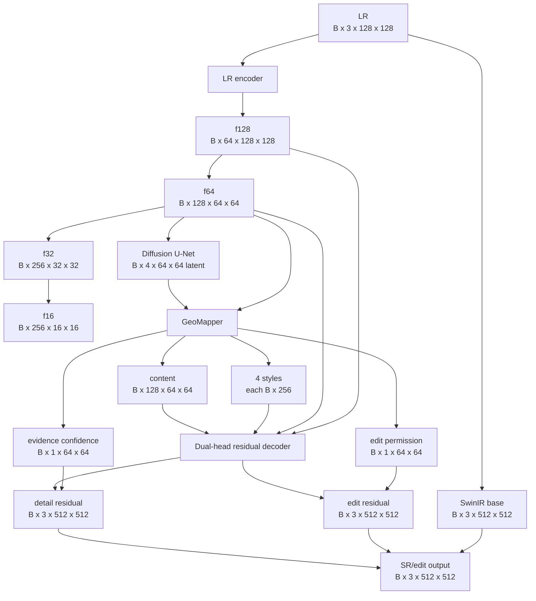
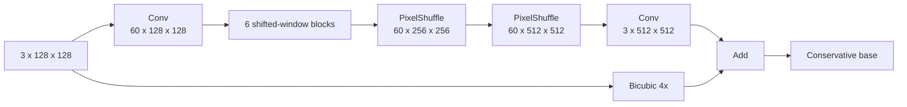
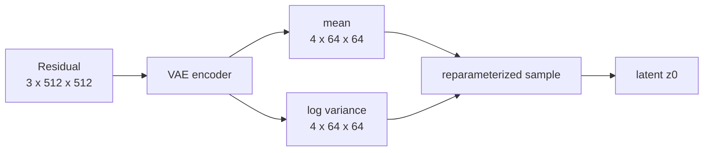
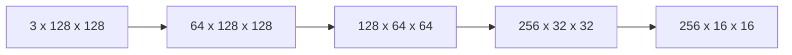
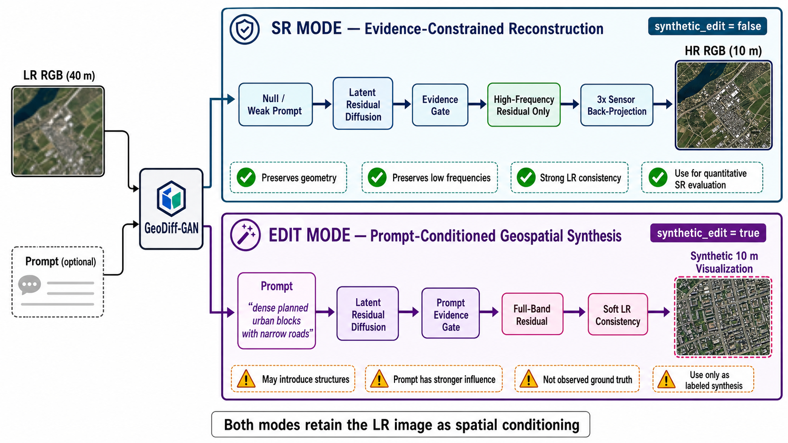

# 08 - GeoDiff-GAN Architecture, Layer by Layer

## Learning Objectives

- trace every major tensor from LR input to HR output;
- explain the role of each module and interface;
- identify which components conserve spatial evidence;
- identify current architectural limitations and research opportunities.

## 1. End-to-End Shape Map

For batch size \(B\):

The current implementation computes \(f_{32}\) and \(f_{16}\), but the generator primarily consumes
\(f_{64}\) and \(f_{128}\). This is an architectural opportunity: explicit multi-scale fusion could
use coarse features more directly, but it must be tested rather than assumed beneficial.

Main assembly: [`system.py`](../src/geodiff_gan/models/system.py).

## 2. Deterministic SwinIR Base

Input:

\[
y\in\mathbb{R}^{B\times3\times128\times128}.
\]

Pipeline:

| Step | Output shape | Role |
|---|---:|---|
| 3x3 input convolution | \(B\times60\times128\times128\) | RGB to feature space |
| six residual Swin blocks | same | local/windowed contextual modeling |
| residual feature fusion | same | preserve stable structure |
| PixelShuffle 2x | \(B\times60\times256\times256\) | first learned upsampling |
| PixelShuffle 2x | \(B\times60\times512\times512\) | second learned upsampling |
| output convolution | \(B\times3\times512\times512\) | RGB correction |
| bicubic skip addition | same | stable low-frequency baseline |

Each attention window is \(8\times8\); alternating shifts permit information exchange across window
boundaries.

Role: reconstruct geometry, broad reflectance patterns, and predictable edges without stochastic
hallucination.

Implementation: [`base.py`](../src/geodiff_gan/models/base.py).

## 3. Residual VAE

During training, form:

\[
r^*=x_{\text{HR}}-x_{\text{base}}.
\]

Encoder:

| Layer | Shape |
|---|---:|
| residual RGB | \(B\times3\times512\times512\) |
| stem | \(B\times64\times512\times512\) |
| down 1 | \(B\times128\times256\times256\) |
| down 2 | \(B\times256\times128\times128\) |
| down 3 | \(B\times256\times64\times64\) |
| moments | \(B\times8\times64\times64\) |
| split | \(\mu,\log\sigma^2\), each \(B\times4\times64\times64\) |
| sample | \(z_0\in B\times4\times64\times64\) |

The VAE decoder reconstructs the RGB residual during VAE training. During final inference, the
GeoMapper and adversarial decoder transform the denoised latent into the HR residual.

Role: define a compact residual distribution for diffusion. Compression factor is eight in each
spatial dimension.

Implementation: [`vae.py`](../src/geodiff_gan/models/vae.py).

## 4. LR Encoder

Role:

- provide spatial evidence at the latent grid \(64\times64\);
- provide skip features to the residual decoder;
- keep the stochastic branch tied to observed geometry.

The \(64\times64\) feature aligns exactly with the VAE latent, making concatenation meaningful.

Implementation: [`generator.py`](../src/geodiff_gan/models/generator.py).

## 5. Conditional Diffusion U-Net

Input concatenation:

\[
[z_t;f_{64}]\in
\mathbb{R}^{B\times(4+128)\times64\times64}
=\mathbb{R}^{B\times132\times64\times64}.
\]

Global embeddings:

| Signal | Encoded size |
|---|---:|
| timestep | \(B\times512\) |
| degradation vector | \(B\times512\) |
| mode token | \(B\times512\) |

These are combined to modulate residual blocks. Text tokens provide cross-attention context.

Output:

\[
\hat{v}\in\mathbb{R}^{B\times4\times64\times64}.
\]

After iterative sampling, the denoised latent \(\hat{z}_0\) represents one plausible residual
content realization.

Role: model uncertainty and multimodality that the deterministic base cannot express.

## 6. Dual-Policy GeoMapper

The mapper predicts two different spatial decisions at the latent grid:

| Policy | Shape | Inputs | Meaning |
|---|---:|---|---|
| Evidence confidence \(c_e\) | \(B\times1\times64\times64\) | latent content and LR evidence | whether generated detail is supported by the observation |
| Edit permission \(c_p\) | \(B\times1\times64\times64\) | latent content, prompt context, and evidence | where a counterfactual prompt may change the image |

These maps are deliberately not aliases. Evidence confidence is text-independent at its prediction
head, while edit permission is prompt-conditioned and forced to zero in SR mode.

\[
h_{\text{map}} =
h_{\text{content}} +
h_{\text{text}}\left(
0.15c_e(1-m)+c_pm
\right),
\]

where \(m=0\) for SR and \(m=1\) for edit mode. The same policy strength also limits text entering
the layer-wise FiLM styles.

## 7. Dual-Head Residual Decoder

The shared decoder trunk upsamples \(64\to128\to256\to512\) and receives LR skips. It then splits:

| Head | Output | Allowed use |
|---|---:|---|
| Detail head | \(B\times3\times512\times512\) | high-pass evidence detail in both modes |
| Edit head | \(B\times3\times512\times512\) | full-band synthetic change in edit mode only |

The compositions are:

\[
r_{\mathrm{SR}} =
H(r_{\mathrm{detail}})\odot c_e,
\]

\[
r_{\mathrm{edit}} =
H(r_{\mathrm{detail}})\odot c_e +
r_{\mathrm{change}}\odot c_p.
\]

This prevents the edit branch from silently becoming the SR reconstruction branch.

## 8. Confidence Calibration and Abstention

During paired synthetic training, confidence is supervised by local ungated reconstruction error:

\[
c_e^*=\exp\left(
-\frac{\operatorname{AvgPool}(
|\hat{x}_{\mathrm{ungated}}-x|)}
\tau}
\right).
\]

At multi-sample evaluation, pixelwise variance \(u\) discounts confidence:

\[
c_{\mathrm{final}}=c_e\exp(-u/s_u).
\]

The final stochastic mean can abstain toward the deterministic base:

\[
\alpha=\exp(-u/s_u),
\qquad
\hat{x}_{\mathrm{abstain}} =
x_{\mathrm{base}}+
\alpha(\hat{x}_{\mathrm{stochastic}}-x_{\mathrm{base}}).
\]

The stochastic image is already evidence-gated, so ensemble abstention applies only the additional
agreement factor instead of multiplying evidence twice. The model therefore exposes uncertainty as
an operational reconstruction policy, not only as a heatmap. Back-projection remains the final
sensor-consistency controller: three steps for SR and one soft step for edit mode.

## 9. Discriminators

Training-only:

- conditional three-scale PatchGAN;
- conditional Haar high-frequency discriminator.

They never modify inference tensors directly. Their gradients shape the decoder during joint and
edit stages.

## 10. Does the Architecture Conserve Spatial Data?

It **encourages** conservation through:

1. deterministic base reconstruction;
2. LR features aligned to the latent and decoder;
3. residual rather than unrestricted output;
4. high-pass filtering in SR mode;
5. calibrated evidence confidence;
6. a separate edit permission policy and decoder head;
7. degradation-consistency loss and iterative back-projection;
8. stochastic uncertainty abstention;
9. conditional discriminators;
10. tile-preserving data preparation.

It does **not mathematically guarantee** exact spatial truth because:

- 4x degradation is non-invertible;
- generated high frequencies are inferred;
- bicubic back-projection is an approximate adjoint;
- learned skips can still be ignored;
- prompts and adversarial gradients may bias texture;
- the synthetic sensor model may differ from reality.

A rigorous claim is:

> GeoDiff-GAN is designed to constrain generated detail by LR evidence and reports explicit
> consistency diagnostics; it does not claim unique recovery of unobserved sub-pixel structure.

## 11. Potential Architecture Improvements

These are experiments, not automatic upgrades:

| Candidate change | Motivation | Risk / required ablation |
|---|---|---|
| use \(f_{32},f_{16}\) in U-Net/decoder | stronger multi-scale geometry | more memory; may duplicate U-Net features |
| learned degradation adjoint | better back-projection | may exploit simulator and generalize poorly |
| confidence calibration alternatives | improve selective-risk calibration | can overfit the synthetic target error |
| dense edit masks | improve edit localization | requires reliable counterfactual supervision |
| spectral-angle/radiometric loss | protect RGB ratios | may trade off texture |
| geospatial edge constraints | preserve roads/field boundaries | requires reliable labels or operators |
| prompt-localization supervision | ensure text affects relevant regions | captions lack dense localization |

The highest-priority code-informed experiment is to ablate unused coarse LR features before adding
new modules.

## Exercises

1. Reproduce every spatial shape from 128 LR to 512 output.
2. Why is the latent \(64\times64\) while the LR is \(128\times128\)?
3. Explain the difference between content, styles, evidence confidence, and edit permission.
4. Identify all paths by which LR evidence reaches the output.
5. Defend or criticize the claim that the model "conserves spatial data."

## Mastery Checklist

- [ ] I can draw the architecture from memory.
- [ ] I can state every major tensor shape.
- [ ] I can explain the unique role of every module.
- [ ] I can distinguish reconstruction confidence from edit authority.
- [ ] I know which conservation mechanisms are soft constraints.
- [ ] I can propose an improvement with a falsifiable ablation.

Next: [09 - Data and Degradation Pipeline](09_data_and_degradation_pipeline.md).
