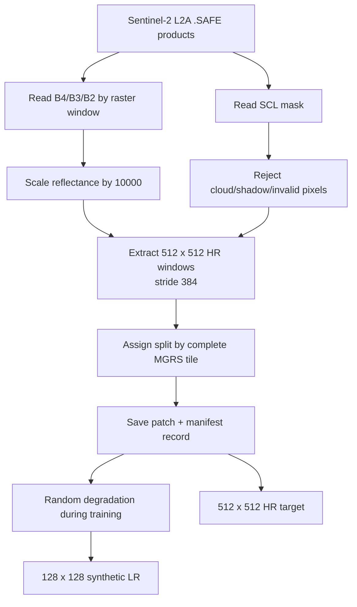
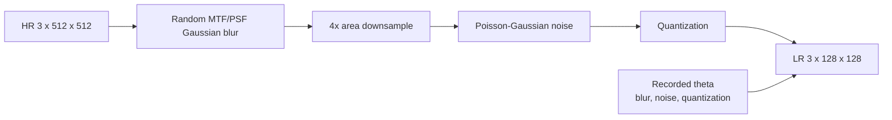

# 09 - Data and Degradation Pipeline

## Learning Objectives

- build valid HR patches from Sentinel-2 L2A SAFE products;
- generate randomized synthetic LR observations;
- understand manifests, captions, tile-level splits, and reproducibility;
- detect data leakage and degradation mismatch.

## 1. Complete Pipeline



Preparation command:

```bash
geodiff-prepare \
  --input /path/to/sentinel-safe \
  --output data/patches \
  --manifest data/manifest.jsonl \
  --patch-size 512 \
  --stride 384 \
  --minimum-valid-fraction 0.95
```

Implementation:
[`prepare_sentinel.py`](../src/geodiff_gan/cli/prepare_sentinel.py) and
[`io.py`](../src/geodiff_gan/io.py).

## 2. Windowed Reading

A full Sentinel-2 product is large. The pipeline reads raster windows instead of loading an entire
tile into RAM.

Patch size \(512\times512\) at 10 m covers approximately:

\[
5120\text{ m}\times5120\text{ m}.
\]

Stride 384 creates 128-pixel overlap:

\[
512-384=128.
\]

Overlap increases sample count and reduces missed boundary regions, but creates highly correlated
patches. Tile-level splitting prevents overlap from crossing train/test sets.

## 3. Manifest Records

Each JSONL record should preserve:

- patch path/key;
- source product identifier;
- MGRS tile;
- window row and column;
- split;
- dimensions and bands;
- source/licence identifier;
- caption linkage if available.

The manifest is the experiment's data ledger. Do not infer split from filenames or silently merge
products with different resolutions or licences.

## 4. Tile-Level Split

A deterministic hash of tile identifiers assigns approximately:

- 70% train;
- 15% validation;
- 15% test.

Approximate ratios are expected because the unit is a tile, not a patch. For small tile counts, the
actual percentages may deviate substantially. Report both tile and patch counts.

Recommended checks:

```text
No MGRS tile appears in more than one split.
No source product identifier appears in conflicting splits.
Validation and test represent multiple land-cover classes.
Unseen-city and unseen-tile subsets are reported separately.
```

## 5. Randomized Degradation

For each training sample, draw parameters \(\theta\):



The degradation vector is supplied to the diffusion model. This changes the inverse from
"guess one universal restoration" to "restore knowing how this sample was degraded."

Implementation: [`degradation.py`](../src/geodiff_gan/models/degradation.py).

## 6. Why Randomize Degradation?

Training with one fixed bicubic transform causes the model to specialize to that kernel. Randomized
blur, noise, and quantization teach a family:

\[
p(y\mid x)=\int p(y\mid x,\theta)p(\theta)\,d\theta.
\]

The chosen \(p(\theta)\) defines the experiment. If it is unrealistically broad, training becomes
unnecessarily difficult. If too narrow, the model fails under modest mismatch.

Plot sampled parameters and inspect degraded patches. Configuration ranges are part of the method,
not minor implementation details.

## 7. Caption Data

Generate captions offline:

```bash
geodiff-caption \
  --manifest data/manifest.jsonl \
  --output data/captions.jsonl \
  --model Qwen/Qwen3-VL-8B-Instruct \
  --split train
```

Captions should describe:

- land cover;
- visible objects;
- density;
- terrain;
- texture.

Exclude:

- coordinates;
- place names;
- unsupported object identities;
- speculative historical or socioeconomic claims.

Audit a random caption sample. A vision-language model can introduce label noise, and prompt
conditioning will learn that noise.

## 8. Sampling Balance

Target 40,000-100,000 valid patches across:

- cities;
- agriculture;
- forest;
- coast;
- desert;
- mountains.

Patch count alone is insufficient. Ten thousand overlapping patches from one metropolitan tile do
not provide the geographic diversity of ten thousand patches across many environments.

Track distributions by:

- MGRS tile;
- land-cover caption tags;
- cloud-free acquisition;
- season where known;
- reflectance histograms;
- degradation parameters.

## 9. Dataset Failure Modes

| Failure | Effect |
|---|---|
| random patch split | inflated test metrics through spatial leakage |
| cloud contamination | model learns cloud edges/textures |
| fixed bicubic degradation | poor robustness beyond one kernel |
| wrong RGB band order | systematic color corruption |
| missing reflectance scaling | unstable dynamic range |
| silent dataset mixing | unclear target resolution/licence/domain |
| caption geographic names | location leakage |
| unbalanced terrain | misleading aggregate metrics |

## 10. Data Validation Checklist

Before a long run:

1. display HR, LR, and bicubic LR together;
2. re-degrade HR and verify LR size/range;
3. print degradation vectors;
4. inspect SCL masks;
5. count unique tiles per split;
6. assert tile-set intersections are empty;
7. plot channel histograms;
8. verify captions by human inspection;
9. run one minibatch through all five training stages.

## Exercises

1. Calculate patch overlap for size 512 and stride 384.
2. Why can split percentages differ from 70/15/15 even when assignment is correct?
3. Explain why degradation parameters are model inputs.
4. Design a plot that reveals an unrealistic degradation distribution.
5. Write three assertions that detect geographic leakage.

## Mastery Checklist

- [ ] I can explain every preprocessing step.
- [ ] I understand the manifest as a scientific record.
- [ ] I can defend tile-level splitting.
- [ ] I know how degradation randomization defines the task.
- [ ] I can identify caption and dataset leakage.

Next: [10 - Five-Stage Training](10_five_stage_training.md).
