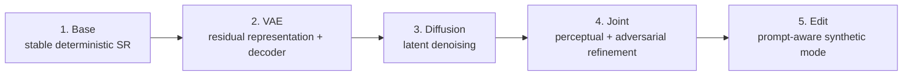
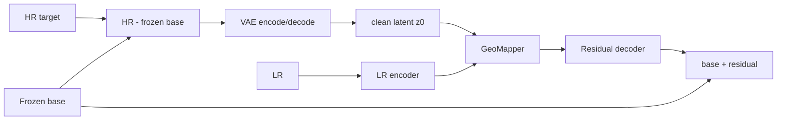
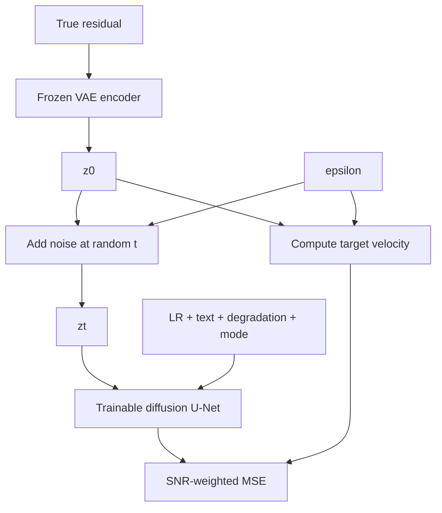
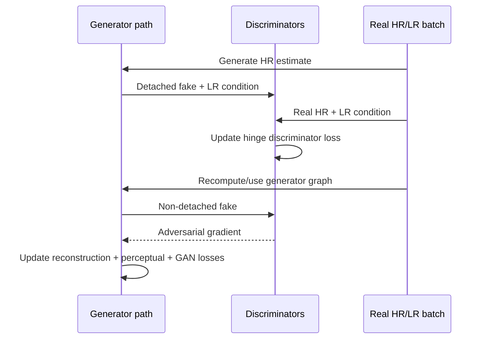
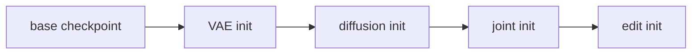

# 10 - Five-Stage Training

## Learning Objectives

- understand why end-to-end random initialization is avoided;
- know which modules and losses are active at each stage;
- understand checkpoint transfer, accumulation, AMP, and DDP;
- diagnose stage-specific failure modes.

## 1. Curriculum Overview

Each stage solves a narrower problem and passes a checkpoint to the next. Training everything from
scratch creates unstable moving targets:

- the base changes what "residual" means;
- the VAE latent distribution changes while diffusion learns it;
- the decoder changes how latent error appears in pixels;
- the discriminator immediately punishes untrained outputs.

The curriculum stabilizes these interfaces before joint refinement.

Main implementation:
[`trainer.py`](../src/geodiff_gan/training/trainer.py).

## 2. Stage 1 - Deterministic Base

### Trainable

- SwinIR-style base branch.

### Frozen or unused

- VAE;
- diffusion;
- GeoMapper;
- residual decoder;
- discriminators.

### Objective

\[
L_{\text{base}}=
1.0L_{\text{char}}
+0.2L_{\text{SSIM}}
+\lambda_gL_{\text{gradient}}
+1.0L_{\text{consistency}}.
\]

The exact gradient weight is configuration-controlled.

### Purpose

Learn the radiometrically conservative component:

- broad color;
- large geometry;
- predictable edges;
- an output whose re-degradation matches LR.

### Failure signs

- severe smoothness: base capacity or losses insufficient;
- checkerboard: upsampling problem;
- color drift: scaling or data issue;
- low HR loss but high LR error: degradation mismatch;
- overfitting: training tiles improve while validation tiles stall.

## 3. Stage 2 - Residual VAE and Decoder

### Input target

\[
r^*=x_{\text{HR}}-x_{\text{base}}.
\]

### Trainable

- residual VAE;
- LR encoder;
- GeoMapper;
- residual decoder.

### Core flow

### Objectives

- residual reconstruction;
- VAE KL regularization;
- final HR Charbonnier;
- wavelet/high-frequency reconstruction.

No adversarial loss is needed yet. First verify that the latent and decoder can reconstruct actual
residuals. The current Stage 2 code does not include degradation consistency; that objective enters
the base, joint, and edit stages.

### Key balance

If KL weight is too high, posterior collapse can occur: the latent approaches the prior but carries
little residual information. If too low, diffusion later must learn an irregular latent
distribution.

Monitor:

- latent mean and standard deviation;
- KL magnitude;
- VAE reconstruction;
- decoder reconstruction from clean latent;
- residual-to-base ratio.

## 4. Stage 3 - Conditional Latent Diffusion

### Trainable

- diffusion U-Net only.

### Frozen

- base;
- residual VAE encoder/decoder;
- LR encoder;
- GeoMapper;
- residual decoder.

The frozen VAE encoder supplies target latent \(z_0\). Sample timestep \(t\) and noise \(\epsilon\),
construct \(z_t\), and predict velocity.

\[
L_{\text{diff}}=
\mathbb{E}\left[
w(t)\|\hat{v}_\phi(z_t,t,c,\theta,m,f_{64})-v_t\|_2^2
\right].
\]

### Failure signs

- loss strongly depends on timestep: inspect SNR weighting;
- prompt has no measurable effect: check text masks and null rate;
- LR conditioning ignored: compare matched versus shuffled LR features;
- sampling diverges: inspect schedule and velocity conversions;
- NaNs: inspect timestep embeddings, attention, and AMP scaling.

## 5. Stage 4 - Joint Fine-Tuning

### Trainable

- diffusion U-Net;
- LR encoder;
- GeoMapper;
- residual decoder;
- discriminators in their own optimizer.

### Frozen

- deterministic base;
- residual VAE.

### Initial generator objective

\[
\begin{aligned}
L_G={}&
1.0L_{\text{char}}
+1.0L_{\text{consistency}}
+0.2L_{\text{SSIM}}\\
&+0.1L_{\text{LPIPS}}
+0.05L_{\text{wavelet}}
+0.01L_{\text{adv}}.
\end{aligned}
\]

Diffusion supervision may also be retained to prevent latent denoising drift.

### Alternating updates

Never backpropagate discriminator updates into the generator; use a detached fake for the
discriminator step. During gradient accumulation, accumulate discriminator loss from every
microbatch and step both optimizers at the accumulation boundary. Freeze discriminator parameters
during the generator adversarial pass so only the generated image receives that gradient.

Joint and edit training use a configurable differentiable back-projection count. The default is one
step, which exposes the trainable generator to the same output controller used at inference without
letting three correction iterations dominate the reconstruction objective.

## 6. Stage 5 - Edit Fine-Tuning

### Trainable

- diffusion;
- GeoMapper;
- residual decoder.

### Main additions

- mismatched and prompt-form augmentation;
- image-text alignment;
- a gate-usage regularizer;
- full-band residuals;
- softer LR consistency;
- low-weight adversarial realism.

The current gate loss, \(1-\operatorname{mean}(g)\), rewards opening the gate in edit mode. It is
not mismatch-aware supervision. Dedicated counterfactual prompts and matched-versus-mismatched gate
targets remain a research extension rather than completed code.

### Objective concept

\[
L_{\text{edit}}=
L_{\text{reconstruction/control}}
+0.05L_{\text{prompt}}
+L_{\text{soft-consistency}}
+0.01L_{\text{adv}}.
\]

The output policy changes. For a future explicit counterfactual dataset, the goal would not be exact
target reconstruction; it would be controlled generation anchored loosely to the source.

## 7. Checkpoint Transfer

Use `init_checkpoint` to start a new stage from prior weights. Use `resume` only to continue the
same stage because it restores:

- optimizer states;
- discriminator state;
- scaler state;
- epoch/step counters.

If epoch counts or filenames change, update overlay configuration paths explicitly.

Configuration files:
[`default.yaml`](../configs/default.yaml),
[`stage_vae.yaml`](../configs/stage_vae.yaml),
[`stage_diffusion.yaml`](../configs/stage_diffusion.yaml),
[`stage_joint.yaml`](../configs/stage_joint.yaml), and
[`stage_edit.yaml`](../configs/stage_edit.yaml).

## 8. Effective Batch and DDP

For two GPUs:

\[
B_{\text{eff}}=1\times2\times8=16.
\]

Use a distributed sampler so GPUs do not process the same examples. Generator gradients are
explicitly all-reduced when stage-specific submodule calls bypass a single top-level DDP forward.

Validate DDP by checking:

- both ranks start from equal parameter hashes;
- gradients are finite;
- parameters remain equal after optimizer steps;
- only rank zero writes shared checkpoints/logs.

## 9. Learning-Rate Strategy

Different components have different maturity:

- base starts from scratch;
- diffusion starts after latent stabilization;
- joint decoder is pretrained;
- discriminator starts later from scratch.

It can be reasonable to use smaller learning rates during joint fine-tuning than during isolated
pretraining. Record generator and discriminator rates separately.

Do not change several loss weights and learning rates simultaneously if you want interpretable
experiments.

## 10. Stage-Gate Criteria

Do not advance based only on epoch count.

| Transition | Minimum evidence |
|---|---|
| base -> VAE | validation base metrics stable; no radiometric failure |
| VAE -> diffusion | latent finite; reconstructions meaningful; KL controlled |
| diffusion -> joint | denoising loss stable; sampled latent decodes plausibly |
| joint -> edit | SR consistency remains strong; GAN does not dominate |
| edit -> final | prompt effect measurable; outputs labeled; soft consistency acceptable |

## Exercises

1. Explain why the VAE target changes if the base remains trainable.
2. Why is the decoder frozen during diffusion-only training?
3. Which joint loss protects LR evidence most directly?
4. Why is `resume` unsafe as a generic cross-stage initialization mechanism?
5. Design stage-gate criteria for a small smoke run and a paper-scale run.

## Mastery Checklist

- [ ] I can name trainable modules in all five stages.
- [ ] I can write the major loss for each stage.
- [ ] I understand checkpoint transfer and resume semantics.
- [ ] I can explain alternating GAN updates and DDP synchronization.
- [ ] I know what evidence is required before advancing stages.

Next: [11 - Spatial Fidelity and Evaluation](11_spatial_fidelity_and_evaluation.md).
