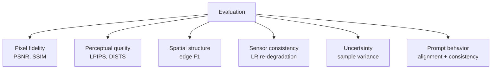
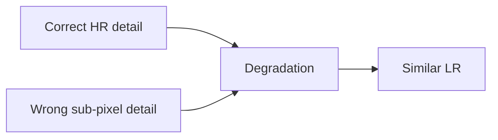
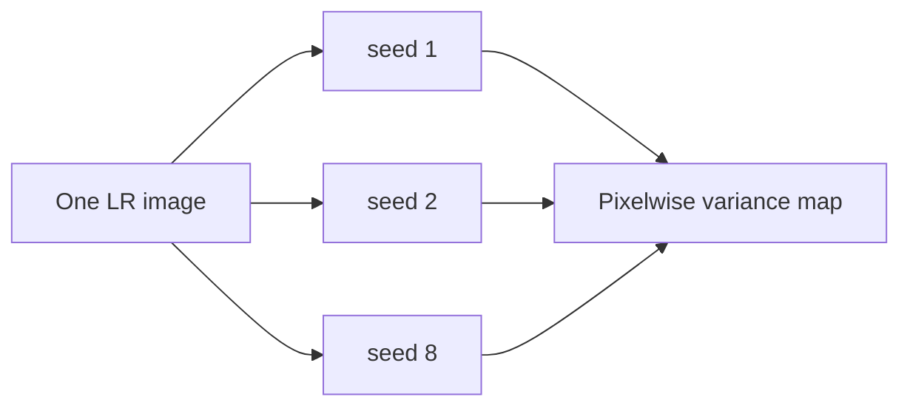

# 11 - Spatial Fidelity and Evaluation

## Learning Objectives

- understand each metric and its blind spots;
- measure spatial, radiometric, perceptual, and stochastic behavior;
- design tile-level and unseen-city evaluation;
- interpret SR and edit outputs under different standards.

## 1. Evaluation Is Multi-Axis

No single number answers whether satellite SR is good. This is a regression/generation problem,
not classification, so a generic "accuracy" percentage is not defined.

Report metrics together and inspect images. Optimize one metric only if it corresponds to the
scientific claim.

## 2. PSNR

For normalized images with maximum value 1:

\[
\operatorname{MSE}=\frac{1}{N}\sum_i(x_i-\hat{x}_i)^2,
\]

\[
\operatorname{PSNR}=10\log_{10}\frac{1}{\operatorname{MSE}}.
\]

Higher is better. PSNR strongly rewards pixel agreement but often favors smooth predictions.

Use the same color range, border crop policy, and quantization across methods.

## 3. SSIM

SSIM compares local luminance, contrast, and structure:

\[
\operatorname{SSIM}(x,\hat{x})=
\frac{(2\mu_x\mu_{\hat{x}}+C_1)(2\sigma_{x\hat{x}}+C_2)}
{(\mu_x^2+\mu_{\hat{x}}^2+C_1)(\sigma_x^2+\sigma_{\hat{x}}^2+C_2)}.
\]

It is more structure-aware than PSNR but can still miss semantically wrong high-frequency details.

## 4. LPIPS and DISTS

Both compare deep features rather than only pixels.

- **LPIPS** measures distance in pretrained network features.
- **DISTS** combines structural and texture similarity.

Lower is better. Their feature extractors are typically trained on natural imagery, so validate
their relevance to remote-sensing content rather than treating them as universal perception.

## 5. Edge F1

The current implementation converts RGB to grayscale, computes one-pixel horizontal and vertical
differences, thresholds gradient magnitude, and matches edges within a configurable pixel
tolerance:

\[
\operatorname{Precision}=
\frac{TP}{TP+FP},
\qquad
\operatorname{Recall}=
\frac{TP}{TP+FN},
\]

\[
F_1=2\frac{PR}{P+R}.
\]

This measures thresholded edge overlap for roads, fields, coastlines, and buildings. Always report
the detector, adaptive threshold policy, and matching tolerance.

## 6. LR Re-Degradation Error

\[
E_{LR}=
\|\mathcal{D}_\theta(\hat{x})-y\|_1.
\]

This is one of the most important evidence metrics. It asks whether the output could plausibly have
produced the input under the known simulated sensor model.

But it is not sufficient:

Many high-frequency patterns vanish after blur/downsampling. Pair LR error with HR and edge metrics.

## 7. Back-Projection Improvement

Diagnostics record:

\[
E_{\text{before}}=
\|\mathcal{D}(\hat{x}_0)-y\|_1,
\]

\[
E_{\text{after}}=
\|\mathcal{D}(\hat{x}_K)-y\|_1.
\]

Expected behavior:

\[
E_{\text{after}}\le E_{\text{before}}
\]

for most samples. If projection increases error, investigate step size, clipping, padding, and the
approximate upsampling correction.

Also record:

\[
\Delta_{\text{proj}}=\mathbb{E}|\hat{x}_K-\hat{x}_0|.
\]

Large projection updates mean the generator is producing outputs substantially inconsistent with
LR.

## 8. Residual Frequency Diagnostics

Low-frequency fraction:

\[
f_{\text{low}}=
\frac{\mathbb{E}|\operatorname{blur}(r)|}
{\mathbb{E}|r|+\epsilon}.
\]

In SR mode, the post-filter residual should have low broad-band energy. Compare raw and filtered
values rather than expecting exactly zero.

Residual-to-base ratio:

\[
\rho=
\frac{\mathbb{E}|r|}{\mathbb{E}|x_{\text{base}}|+\epsilon}.
\]

Track distributions across land-cover categories. Urban detail may legitimately require a larger
residual than uniform desert, but abrupt growth during GAN training is suspicious.

## 9. Stochastic Samples and Uncertainty

Generate \(K=8\) outputs:

\[
\hat{x}^{(1)},\ldots,\hat{x}^{(K)}.
\]

Pixelwise mean:

\[
\bar{x}=\frac1K\sum_k\hat{x}^{(k)}.
\]

Pixelwise variance:

\[
\operatorname{Var}(x)=
\frac1{K-1}\sum_k(\hat{x}^{(k)}-\bar{x})^2.
\]

Desired pattern: more variance in ambiguous fine textures, less around strongly observed broad
structures. Validate calibration by relating variance to actual error; variance alone is not proof
of calibrated uncertainty.

## 10. Geographic Evaluation

Report:

- full held-out tile set;
- unseen cities;
- unseen MGRS tiles;
- land-cover subsets;
- degradation severity subsets.

Aggregate metrics can hide failures. Provide mean, standard deviation, and preferably confidence
intervals over tiles, not only over highly correlated patches.

The tile should be the statistical unit for claims of geographic generalization.

## 11. Prompt-Edit Evaluation

Edit mode requires:

- image-text alignment;
- human or learned realism assessment;
- LR consistency;
- edit magnitude;
- spatial localization of changes;
- clear synthetic labeling.

There may be no ground-truth counterfactual target. Do not report edit mode as PSNR improvement over
the original HR unless the prompt asks for the original content.

## 12. Baseline and Ablation Table

Every method should use:

- identical test tiles;
- identical preprocessing;
- identical metric implementation;
- documented parameter counts and inference steps;
- comparable compute where possible.

Example table columns:

| Method | PSNR | SSIM | LPIPS | DISTS | Edge F1 | LR error | Params | Time |
|---|---:|---:|---:|---:|---:|---:|---:|---:|
| Bicubic | | | | | | | 0 | |
| SwinIR base | | | | | | | | |
| GAN-only | | | | | | | | |
| Diffusion-only | | | | | | | | |
| GeoDiff-GAN | | | | | | | | |

## Exercises

1. Give one failure PSNR detects and one it misses.
2. Why is LR error necessary but insufficient?
3. How would you test uncertainty calibration?
4. Why should confidence intervals be computed over tiles rather than patches?
5. Design a metric suite for edit mode that avoids claiming ground-truth recovery.

## Mastery Checklist

- [ ] I understand all required metrics and their limitations.
- [ ] I can measure projection and residual behavior.
- [ ] I can design stochastic and geographic evaluation.
- [ ] I apply different standards to SR and synthetic edit outputs.

Next: [12 - Debugging and Visual Diagnostics](12_debugging_and_visual_diagnostics.md).
