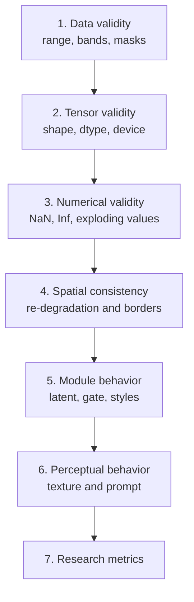
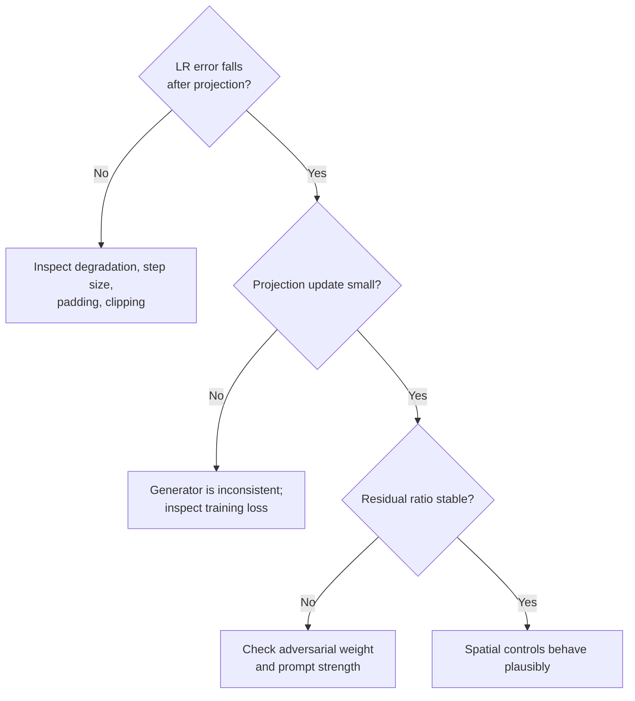
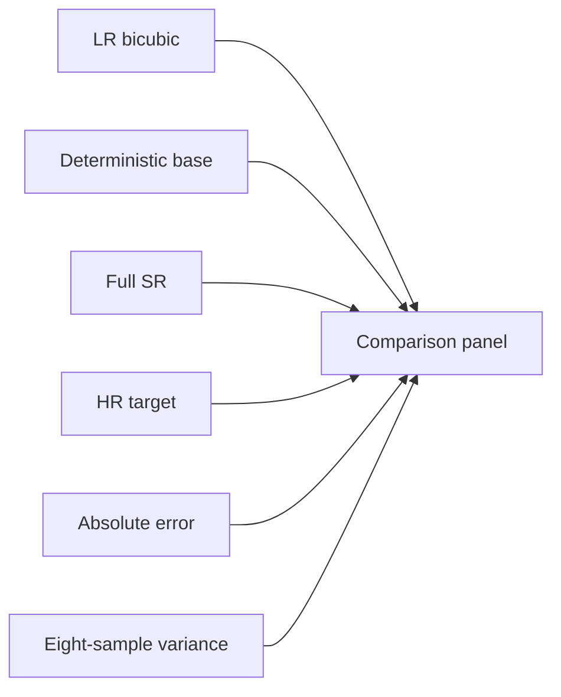

# 12 - Debugging and Visual Diagnostics

## Learning Objectives

- run the repository diagnostic command;
- interpret generated reports and figures;
- debug tensor, numerical, spatial, prompt, and training failures;
- share a compact evidence package for collaborative diagnosis.

## 1. Diagnostic Command

After installation:

```bash
geodiff-debug \
  --config configs/default.yaml \
  --checkpoint runs/joint/joint_epoch_0019.pt \
  --output outputs/debug \
  --split test \
  --mode sr \
  --steps 20 \
  --seed 7
```

The command requires a trained checkpoint and a populated manifest for the selected split. It uses
[`cli/debug.py`](../src/geodiff_gan/cli/debug.py) and
[`diagnostics.py`](../src/geodiff_gan/diagnostics.py).

Outputs:

| File | Purpose |
|---|---|
| `overview.png` | LR, base, final residual, output, target, and consistency views |
| `features.png` | feature/latent/gate summaries |
| `diffusion_trajectory.png` | denoising evolution |
| `report.json` | machine-readable shapes and statistics |
| `summary.txt` | compact human-readable warnings |

## 2. Debugging Hierarchy

Always debug from foundational to high-level:



Do not diagnose prompt alignment while input bands are swapped or projection increases LR error.

## 3. Essential Tensor Statistics

For every major tensor record:

- shape;
- dtype;
- minimum and maximum;
- mean and standard deviation;
- finite fraction;
- absolute mean.

Critical tensors:

```text
lr
base
LR features f128/f64/f32/f16
noisy latent
predicted velocity
denoised latent
GeoMapper content/styles/gate
raw residual
filtered residual
pre-projection output
final output
```

### Healthy ranges are contextual

Images should normally remain around \([0,1]\) after clipping. Latents and intermediate features
need not. A near-zero standard deviation may indicate collapse; a very large value may indicate
instability. Compare across steps and checkpoints rather than relying on one universal threshold.

## 4. Non-Finite Detection

For tensor \(a\):

\[
\operatorname{finite\_fraction}(a)=
\frac{\#\{i:\operatorname{isfinite}(a_i)\}}{N}.
\]

Any value below 1 is a blocker. Likely causes:

| Location | Common causes |
|---|---|
| input | corrupt data or invalid scaling |
| VAE log variance | uncontrolled variance, overflow |
| attention | extreme logits, FP16 overflow |
| diffusion sampling | schedule/conversion error |
| GAN loss | discriminator instability |
| optimizer | learning rate or stale scaler |

Stop the run and preserve the offending batch, seed, timestep, and checkpoint.

## 5. Spatial Diagnostics

The report includes:

- `spatial.lr_error_before_projection`;
- `spatial.lr_error_after_projection`;
- `spatial.projection_update_abs_mean`;
- `spatial.residual_to_base_ratio`;
- `residual.raw_low_frequency_fraction`.

Interpretation:



## 6. Border Artifact Test

A constant residual should have near-zero high-pass output everywhere, including borders.

Zero padding violates this because out-of-image zeros create a false edge. Reflect padding
preserves the constant field. The repository includes a regression test for this behavior.

When inspecting results:

- zoom into all four borders;
- look for dark/bright halos;
- compare raw and filtered residual;
- test a constant synthetic input.

## 7. Diffusion Trajectory

The trajectory image should evolve gradually from noise-like latent structure toward organized
spatial content.

Warning patterns:

- unchanged across steps: sampler or timestep update not functioning;
- sudden explosion: schedule, guidance, or dtype issue;
- repeated checkerboard: U-Net upsampling artifact;
- final latent nearly constant: denoiser collapse;
- prompt changes everything globally in SR mode: guidance/evidence gate too strong.

Use identical LR and seed when comparing checkpoints.

## 8. Gate Diagnostics

Record:

- mean;
- standard deviation;
- fraction near 0;
- fraction near 1;
- heatmap.

Compare four conditions:

1. null prompt;
2. matched caption;
3. true offline paraphrase;
4. mismatched caption.

Expected research hypothesis:

- matched/paraphrased prompts produce related gate behavior;
- mismatched prompts are suppressed where LR evidence conflicts;
- null prompts do not break baseline SR.

If all gate maps are identical, text may not reach the mapper. If all saturate to one, the prompt
path may dominate.

## 9. Training Debug Table

| Symptom | First checks |
|---|---|
| output all gray | image range, output activation, base checkpoint |
| output equals base exactly | residual magnitude, mapper/decoder gradients |
| prompt has no effect | text tokens, null mask, CFG calculation, gate |
| prompt changes broad color in SR | high-pass path, mode token, projection |
| LR error worsens | degradation parity and projection step |
| NaN after GAN starts | D learning rate, AMP scaler, adversarial weight |
| GPUs diverge | generator gradient all-reduce |
| validation much better than expected | split leakage |
| seams at patch boundaries | overlap/blending and border padding |
| uncertainty always zero | seed use, sampler noise, deterministic path |

## 10. Useful Visual Comparisons

Create fixed panels for the same validation examples:



Also show:

- edge maps;
- re-degraded output versus LR;
- raw residual versus high-pass residual;
- gate heatmap;
- wavelet bands.

Avoid auto-scaling every panel independently; it can exaggerate weak residuals and hide radiometric
differences.

## 11. What to Share for Diagnosis

When asking for help, provide:

1. `summary.txt`;
2. `report.json`;
3. `overview.png`;
4. `features.png`;
5. `diffusion_trajectory.png`;
6. config YAML;
7. checkpoint stage and epoch;
8. exact command;
9. GPU type and precision;
10. whether the input is smoke data or real Sentinel-2.

This package is far more useful than only sharing the final attractive or failed image.

## Exercises

1. Run diagnostics in SR and edit modes with the same seed and compare reports.
2. Explain a case where projection update is large but final LR error is low.
3. Design a test proving the prompt path affects the model.
4. Why should panels use consistent color scaling?
5. Create a decision tree for NaNs that begin only after joint training starts.

## Mastery Checklist

- [ ] I can run and interpret all diagnostic outputs.
- [ ] I debug data and numerics before semantics.
- [ ] I understand every spatial diagnostic field.
- [ ] I can test gate, prompt, and stochastic behavior.
- [ ] I know what artifacts to share for remote diagnosis.

Next: [13 - Novelty, Ablations, and Research Design](13_novelty_ablations_and_research.md).
