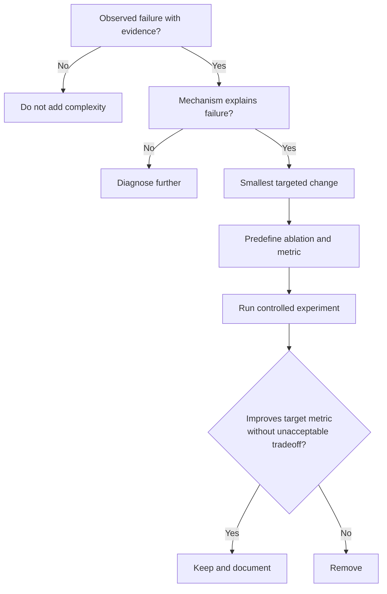
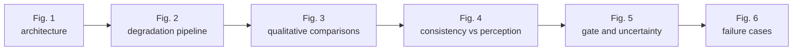

# 13 - Novelty, Ablations, and Research Design

## Learning Objectives

- distinguish architectural originality from demonstrated contribution;
- write falsifiable novelty claims;
- design fair baselines and ablations;
- avoid overclaiming spatial recovery or prompt utility.

## 1. What Novelty Means

A component is not novel merely because it has a new name. Scientific novelty requires:

GeoDiff-GAN combines known families: SwinIR, VAE, latent diffusion, FiLM-style decoding,
adversarial losses, wavelets, and back-projection. The contribution must therefore be framed around
the **specific integration and evidence-control mechanism**, then validated.

## 2. Candidate Contributions

### Contribution A: deterministic-stochastic residual decomposition

**Hypothesis:** Keeping conservative low-frequency reconstruction in a deterministic base while
restricting stochastic generation to a residual improves perceptual detail without sacrificing
sensor consistency.

Test against:

- one unrestricted generator;
- diffusion-only full-image prediction;
- residual prediction without high-pass control.

### Contribution B: GeoMapper interface

**Hypothesis:** Jointly producing spatial content, layer-wise FiLM styles, and a spatial prompt gate
is more effective than directly decoding the diffusion latent.

Test:

- remove mapper;
- content only;
- styles only;
- content + styles without gate;
- complete mapper.

### Contribution C: mode-aware prompt evidence control

**Hypothesis:** Combining mode conditioning, evidence gating, high-pass SR residuals, and separate
projection strengths produces a meaningful separation between reconstruction and synthetic editing.

Test:

- no mode token;
- no evidence gate;
- same projection policy for both modes;
- prompt conditioning without mismatched examples.

### Contribution D: dual spatial-frequency adversarial supervision

**Hypothesis:** Multi-scale spatial PatchGAN plus high-frequency Haar discrimination improves edge
and texture quality at a lower consistency cost than spatial GAN alone.

Test:

- no GAN;
- spatial GAN only;
- wavelet GAN only;
- both.

### Contribution E: degradation-aware consistency

**Hypothesis:** Explicit degradation conditioning and iterative projection improve robustness over
unknown blur/noise variation.

Test:

- fixed degradation;
- randomized degradation without conditioning;
- conditioning without back-projection;
- both conditioning and back-projection.

## 3. Primary Ablation Matrix

Change one mechanism at a time:

| ID | Base | Diffusion | Mapper | Gate | Wavelet D | Deg. cond. | Back-proj. |
|---|---|---|---|---|---|---|---|
| A0 | yes | yes | yes | yes | yes | yes | yes |
| A1 | no | yes | yes | yes | yes | yes | yes |
| A2 | yes | no | yes | yes | yes | yes | yes |
| A3 | yes | yes | direct decode | no | yes | yes | yes |
| A4 | yes | yes | yes | no | yes | yes | yes |
| A5 | yes | yes | yes | yes | no | yes | yes |
| A6 | yes | yes | yes | yes | yes | no | yes |
| A7 | yes | yes | yes | yes | yes | yes | no |

For expensive models, train multiple random seeds for the full model and the most important
ablations. One seed cannot separate architecture effects from optimization noise.

## 4. Baseline Fairness

Baselines:

- bicubic;
- SwinIR/deterministic base;
- ESRGAN-style GAN;
- diffusion-only SR;
- GAN-only residual decoder;
- full GeoDiff-GAN.

Fairness requires:

- same train/validation/test tiles;
- same synthetic degradation samples or distribution;
- same RGB scaling and masks;
- comparable training budget;
- reported parameter count and inference time;
- tuned but documented baseline hyperparameters.

A deliberately weak baseline does not strengthen a paper.

## 5. Research Questions

Use explicit questions:

1. Does the hybrid improve perceptual metrics at matched LR consistency?
2. Does GeoMapper improve spatial structure and prompt controllability?
3. Does the evidence gate suppress mismatched prompts in SR mode?
4. Does the wavelet discriminator improve edge F1 without increasing hallucination?
5. Does degradation conditioning improve performance under held-out degradations?
6. Is stochastic variance correlated with reconstruction error?
7. Do gains persist on unseen cities and tiles?

Each question maps to a table or figure.

## 6. Statistical Unit and Uncertainty

Patches from one tile are correlated. Compute per-tile metric summaries, then compare methods over
tiles.

For paired methods A and B:

\[
d_i=m_i^A-m_i^B
\]

for each held-out tile \(i\). Report:

- mean paired difference;
- standard deviation;
- confidence interval;
- number of tiles;
- significance test if assumptions are defensible.

Do not report thousands of patches as thousands of independent samples.

## 7. Architecture-Improvement Decision Framework

Before adding a module:

### Current evidence-informed priorities

1. Verify whether \(f_{32}\) and \(f_{16}\) add value when explicitly fused.
2. Measure gate response to matched/mismatched/null prompts.
3. Compare approximate bicubic correction with a degradation-adjoint-inspired update.
4. Evaluate uncertainty calibration before using uncertainty to scale residuals.
5. Add radiometric/spectral constraints only if color drift is measured.

## 8. Claims to Avoid

Avoid:

> The model reconstructs the true missing 10 m details from 40 m imagery.

Use:

> Under a controlled synthetic degradation model, the method estimates native-resolution targets
> while constraining stochastic detail through LR features and re-degradation consistency.

Avoid:

> The gate guarantees that prompts cannot hallucinate.

Use:

> The gate is designed to modulate prompt influence; its behavior is evaluated with matched,
> mismatched, and null-prompt ablations.

Avoid:

> This is the first diffusion-GAN satellite SR model.

Use only a priority claim supported by a systematic, current literature search.

## 9. Paper Figure Plan

Core tables:

1. baseline comparison;
2. component ablations;
3. unseen-geography evaluation;
4. degradation robustness;
5. prompt/edit evaluation;
6. compute and parameter cost.

## 10. Reproducibility Record

For every run store:

- git commit;
- full resolved config;
- random seeds;
- tile manifest hash;
- environment/package versions;
- GPU type;
- stage initialization checkpoint;
- training curves;
- best-checkpoint selection rule;
- diagnostic report;
- metric outputs.

Without this record, an apparent improvement may not be reproducible or attributable.

## Exercises

1. Rewrite one candidate contribution as a falsifiable hypothesis.
2. Design an ablation isolating GeoMapper styles from content.
3. Explain why patch-level confidence intervals are misleading.
4. Give one result that would falsify the evidence-gate hypothesis.
5. Define a checkpoint selection rule before training.

## Mastery Checklist

- [ ] I distinguish a design idea from demonstrated novelty.
- [ ] I can construct fair baselines and one-factor ablations.
- [ ] I understand tile-level statistical analysis.
- [ ] I can write precise claims and limitations.
- [ ] I add architecture only in response to measured failure.

Next: [14 - Kaggle Execution and Research Workflow](14_kaggle_and_research_workflow.md).
