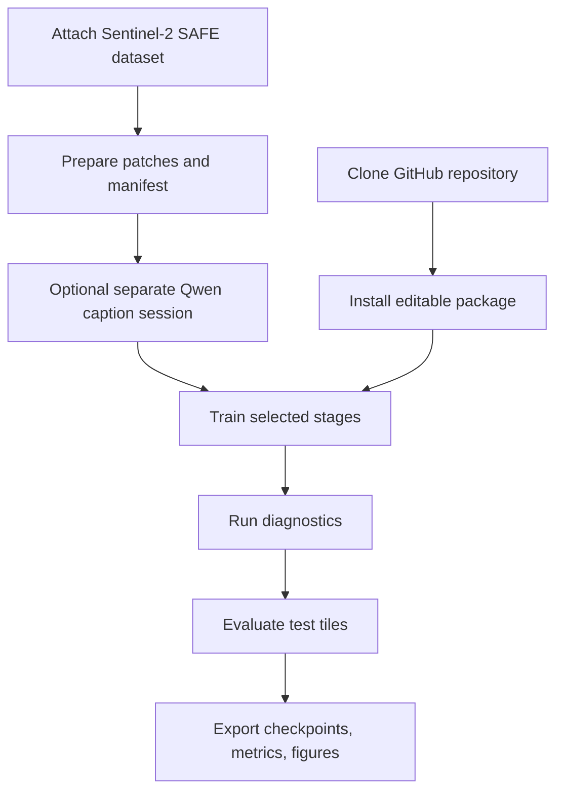
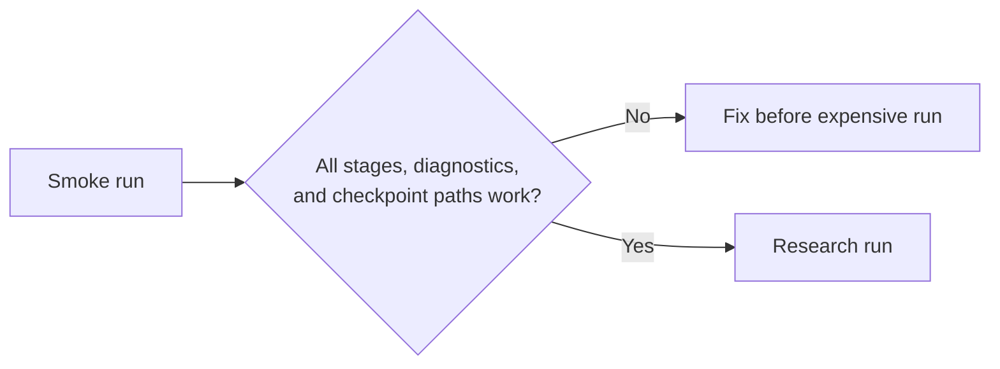

# 14 - Kaggle Execution and Research Workflow

## Learning Objectives

- run the project from a clean Kaggle clone;
- distinguish smoke verification from research training;
- manage data, checkpoints, outputs, and interruptions;
- organize experiments so results remain reproducible.

## 1. Kaggle Workflow

Use [`GeoDiff_GAN_Kaggle.ipynb`](../kaggle/GeoDiff_GAN_Kaggle.ipynb).

The notebook has two independent controls:

| Control | Responsibility |
|---|---|
| `FAST_DEV_RUN` | Tile limit, epoch count, sampling steps, and diagnostic frequency |
| `MODEL_SIZE` | `xs`, `small`, `medium`, or `large` architecture capacity |

Dataset and evaluation controls are also independent:

| Control | Responsibility |
|---|---|
| `TEST_SAFE_PREFIXES` | SAFE filename prefixes reserved for test |
| `VAL_SAFE_PREFIXES` | SAFE filename prefixes reserved for validation |
| `UNMATCHED_SAFE_SPLIT` | Split for all other SAFE products, normally `train` |
| `VALIDATION_LIMIT` | Maximum validation batches per validated epoch |
| `EVALUATION_LIMIT` | Maximum patches in each final validation/test report |
| `AUTO_RESUME_TRAINING` | Continue the latest checkpoint in the current stage directory |
| `TRAINING_PROGRESS_MODE` | `compact`, `tqdm`, or `quiet` logging |
| `PROGRESS_UPDATES_PER_EPOCH` | Number of compact milestone lines per epoch |
| `TRAINING_DIAGNOSTICS` | Enable expensive training-time tensor exports |

Use XS only to verify execution. Small is the notebook default and preserves the full research
module graph at 12.14M core parameters. Medium uses 21.13M and provides more capacity on 16 GB
GPUs. Large uses 81.86M and requires a substantially larger compute budget.



Kaggle settings:

- enable GPU accelerator;
- enable Internet for cloning/model downloads when needed;
- attach input data as a Kaggle Dataset;
- write all generated files under `/kaggle/working`;
- preserve important outputs by creating a notebook version or dataset.

## 2. Clone-and-Install Principle

The notebook installs the repository without replacing Kaggle's CUDA-compatible PyTorch:

```bash
git clone https://github.com/OWNER/geodiff-gan.git
cd geodiff-gan
pip install -e .
```

Replacing PyTorch blindly can break CUDA compatibility. Install only required extras for the current
session.

## 3. Smoke Run versus Research Run

`FAST_DEV_RUN = True`:

- tiny sample count;
- one epoch or few steps per stage;
- verifies code paths and checkpoint transfer;
- does not produce scientific results.

`FAST_DEV_RUN = False`:

- paper-scale data;
- intended epoch schedules;
- frozen SigLIP encoder;
- research metrics and ablations.

Architecture capacity is selected separately by `MODEL_SIZE`.



Never report smoke-run metrics as model performance.

## 4. Session Separation

Captioning Qwen3-VL-8B in 4-bit and training SR compete for GPU memory. Recommended:

1. data preparation session;
2. captioning session;
3. base/VAE session;
4. diffusion/joint/edit sessions;
5. evaluation session.

Persist outputs between sessions as Kaggle datasets or notebook versions.

## 5. Checkpoint Chain

Before starting a stage, verify the previous checkpoint exists:

```text
runs/<model_size>/base/base_epoch_....pt
runs/<model_size>/vae/vae_epoch_....pt
runs/<model_size>/diffusion/diffusion_epoch_....pt
runs/<model_size>/joint/joint_epoch_....pt
runs/<model_size>/edit/edit_epoch_....pt
```

If the schedule changes, filenames change. Update `init_checkpoint` in the stage overlays instead of
assuming the old path.

The notebook enables same-stage automatic resume. For example, if
`runs/small/base/base_epoch_0007.pt` is newest and `epochs: 20`, rerunning starts at epoch 9 in
human-readable numbering and writes `base_epoch_0008.pt` next. Resume restores the model,
optimizer, discriminators, discriminator optimizer, and AMP scaler. Checkpoints are atomic and
resume occurs at epoch boundaries, not halfway through a dataloader epoch.

Automatic discovery is intentionally stage-local. `init_checkpoint` transfers weights from the
previous stage; `resume` continues optimization within the same stage.
Model-specific run directories prevent small from resuming XS, medium, or large tensors.

## 6. Resource Planning

Memory pressure roughly follows:

- image area;
- activation channels;
- number of retained layers;
- attention context;
- optimizer state;
- discriminator activation;
- batch size.

Recovery order for out-of-memory:

1. confirm no stale models, especially Qwen, remain loaded;
2. reduce batch size;
3. increase gradient accumulation;
4. enable gradient checkpointing;
5. use FP16;
6. reduce diagnostic capture frequency;
7. use compact smoke config only for debugging;
8. change patch/model size only as a documented research variant.

Do not silently train a different architecture after an OOM and compare it as the same model.

## 7. Experiment Directory

Recommended structure:

```text
runs/
  experiment_name/
    resolved_config.yaml
    environment.txt
    manifest_hash.txt
    checkpoints/
    logs/
    diagnostics/
    validation_metrics.json
    test_metrics.json
    figures/
    notes.md
```

Use experiment names that encode the question, not every hyperparameter:

```text
full_seed7
ablate_gate_seed7
ablate_wavelet_d_seed7
fixed_degradation_seed7
```

## 8. Run Ledger

Maintain a table:

| Run | Commit | Data hash | Seed | Change | Status | Best checkpoint | Decision |
|---|---|---|---:|---|---|---|---|
| full_s7 | | | 7 | full model | | | |
| no_gate_s7 | | | 7 | remove gate | | | |

Write the hypothesis and success criterion before launching:

> Removing the gate will increase prompt alignment but worsen mismatched-prompt LR consistency. The
> hypothesis is supported if both changes occur on held-out tiles.

This prevents post-hoc interpretation.

## 9. Failure Recovery

If a Kaggle session ends:

- keep `AUTO_RESUME_TRAINING=True` and rerun the training cell;
- use `resume` only within the same stage;
- verify optimizer/scaler states were saved;
- do not restart a later stage from an arbitrary "best-looking" output;
- preserve logs and resolved configuration;
- rerun diagnostics after resuming.

`/kaggle/working` is not permanent across expired sessions. Create a notebook version or Kaggle
Dataset containing `runs/`, then restore it to the same run directory before relying on automatic
resume.

If an input dataset path changes, update configuration explicitly and verify manifest identity.

## 10. Minimum Research Execution Order

1. Run unit tests locally or in Kaggle.
2. Run the complete smoke notebook.
3. Prepare and audit tile-split data.
4. Verify CHHATARPUR/test, CHHATARPUR/validation, and unmatched/train counts.
5. Train deterministic baseline.
6. Train full stage chain while monitoring tqdm ETA and per-epoch validation.
7. Run diagnostics on fixed validation cases.
8. Evaluate validation and test independently against baselines.
9. Run priority ablations.
10. Repeat important runs with additional seeds.
11. Generate paper tables, figures, uncertainty maps, and failures.

## Exercises

1. Explain why editable installation is useful in the notebook.
2. List files that must persist between the diffusion and joint sessions.
3. Design a run name and ledger entry for testing coarse LR feature fusion.
4. What is the correct response to OOM during joint training?
5. Write a pre-registered success criterion for the wavelet discriminator.

## Mastery Checklist

- [ ] I can execute the notebook from a clean clone.
- [ ] I distinguish smoke verification from research evidence.
- [ ] I can preserve and resume stage-specific state correctly.
- [ ] I maintain an experiment ledger with hypotheses and decisions.
- [ ] I can recover from resource limits without silently changing the study.

Next: [15 - Paper, Thesis, and Viva Guide](15_paper_thesis_and_viva.md).
