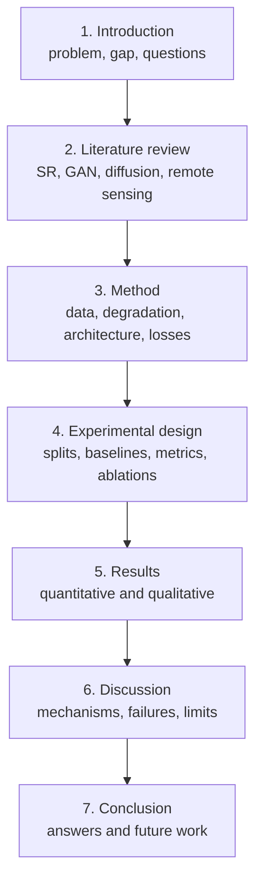
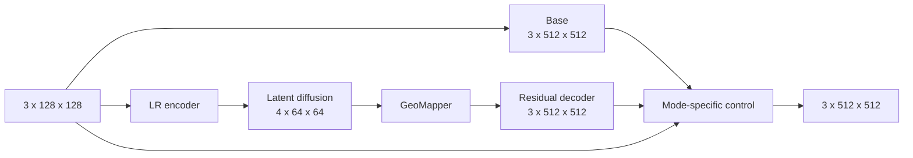

# 15 - Paper, Thesis, and Viva Guide

## Learning Objectives

- explain the work from first principles;
- structure a defensible paper or thesis;
- answer likely examiner questions precisely;
- present limitations and ethical boundaries as part of the contribution.

## 1. One-Minute Explanation

> GeoDiff-GAN studies 4x RGB super-resolution using native 10 m Sentinel-2 L2A patches as targets
> and synthetically degraded 40 m observations as inputs. A deterministic SwinIR branch estimates a
> conservative HR base. A conditional latent diffusion model samples a residual representation,
> which GeoMapper converts into spatial content, layer-wise FiLM controls, and a prompt evidence
> gate for an adversarial residual decoder. In reconstruction mode, the generated residual is
> high-pass filtered and the output is iteratively projected toward the observed LR image; in edit
> mode, stronger prompt influence is allowed and the result is labeled synthetic. The study tests
> whether this hybrid improves perceptual and edge quality while preserving re-degradation
> consistency on geographically held-out tiles.

Memorize the logic, not the exact wording.

## 2. Thesis Structure

### Introduction

Establish:

- why spatial resolution matters;
- why 4x SR is ill-posed;
- why deterministic methods can oversmooth;
- why generative methods can hallucinate;
- why evidence-constrained generative SR is the central problem.

End with research questions and concise contributions.

### Literature review

Organize by ideas, not paper summaries:

1. deterministic single-image SR;
2. perceptual and adversarial SR;
3. diffusion-based restoration;
4. remote-sensing SR and sensor modeling;
5. text-conditioned image generation;
6. fidelity, uncertainty, and hallucination.

### Method

Include:

- forward degradation equation;
- complete tensor-shape architecture;
- separate SR/edit algorithms;
- five-stage training table;
- loss equations and weights;
- data masks and tile splitting;
- metadata policy.

### Experiments

Predefine:

- datasets and tile counts;
- baselines;
- full metrics;
- ablations;
- seeds;
- checkpoint selection;
- statistical unit.

## 3. Likely Viva Questions

### "Why combine diffusion and GANs?"

Diffusion models a conditional distribution of plausible residual content and supports stochastic
sampling. The adversarial decoder encourages realistic local high-frequency statistics at full
resolution. Their roles are complementary, but the ablation must show that the hybrid beats either
alone at comparable consistency.

### "Why not use diffusion directly on the HR image?"

Operating on a \(4\times64\times64\) VAE latent greatly reduces memory and compute. A separate
decoder restores high-resolution detail. The tradeoff is that the latent may discard information or
introduce a representation bottleneck.

### "What is novel?"

Do not answer with a list of standard components. State the tested integration:

> The proposed contribution is the evidence-controlled residual architecture: deterministic base,
> degradation-conditioned latent residual diffusion, and a GeoMapper that jointly produces spatial
> content, decoder styles, and a spatial prompt gate, with mode-specific frequency and consistency
> constraints.

Then cite the ablations that support each mechanism. If those ablations are incomplete, call it a
proposed contribution.

### "Does it recover real missing detail?"

No method can uniquely recover frequencies destroyed by degradation. The model estimates plausible
detail under learned priors. Synthetic paired evaluation measures correspondence to a known native
target, and LR projection constrains evidence, but neither proves exact recovery for real unpaired
40 m observations.

### "How do you prevent hallucination?"

The architecture reduces risk through a deterministic base, LR feature skips, residual prediction,
SR-mode high-pass filtering, degradation consistency, iterative projection, low adversarial weight,
and prompt gating. These are risk controls, not guarantees, so the study also reports LR error,
residual diagnostics, uncertainty, and failure cases.

### "Why use prompts?"

Prompts can express semantic context when LR evidence is ambiguous and enable a separate synthetic
edit mode. In normal SR, 40% null prompts and evidence controls ensure text is optional. The study
must show benefit rather than assume it.

### "Why tile-level splitting?"

Adjacent patches share structures, atmosphere, and acquisition conditions. Random patch splitting
would leak geographic information and inflate metrics. Complete MGRS tiles are assigned to only one
split.

### "What is the biggest limitation?"

A strong answer:

> The primary limitation is the synthetic degradation assumption. Results show performance for
> downsampled native Sentinel-2 under the modeled blur, noise, and quantization distribution; they
> do not directly establish performance on a distinct real 40 m sensor.

Other limitations include caption noise, approximate back-projection, natural-image perceptual
metrics, compute cost, and uncertain calibration.

## 4. Equation Set to Know

Forward model:

\[
y=Q(D_4(k_\theta*x)+n_\theta).
\]

Residual output:

\[
\hat{x}=x_{\text{base}}+r.
\]

Forward diffusion:

\[
z_t=\sqrt{\bar\alpha_t}z_0+\sqrt{1-\bar\alpha_t}\epsilon.
\]

Velocity:

\[
v_t=\sqrt{\bar\alpha_t}\epsilon-\sqrt{1-\bar\alpha_t}z_0.
\]

Classifier-free guidance:

\[
\hat{v}=\hat{v}_{null}+s(\hat{v}_{cond}-\hat{v}_{null}).
\]

Back-projection:

\[
x_{k+1}=x_k+\alpha U(y-\mathcal D_\theta(x_k)).
\]

Hinge losses:

\[
L_D=\max(0,1-D(x))+\max(0,1+D(\hat{x})),
\qquad
L_G^{adv}=-D(\hat{x}).
\]

## 5. Figure Explanation Order

When presenting the architecture:

1. begin with LR and HR sizes;
2. explain the deterministic base;
3. explain why only the residual is stochastic;
4. introduce latent diffusion conditions;
5. explain GeoMapper outputs;
6. trace decoder upsampling;
7. finish with SR/edit output control;
8. place discriminators outside the inference path.

Do not begin with every loss or attention block. The audience needs the information flow first.

## 6. Results Discussion Template

For each major result:

1. state the measured observation;
2. quantify the difference;
3. connect it to a proposed mechanism;
4. cite the ablation;
5. state the tradeoff;
6. avoid causal language if evidence is only correlational.

Example:

> Adding the wavelet discriminator improved edge F1 by X while LPIPS decreased by Y, but LR error
> increased slightly by Z. The spatial-discriminator-only ablation suggests high-frequency
> supervision contributed to sharper boundaries, although the consistency tradeoff indicates that
> adversarial weight requires careful control.

## 7. Failure Cases to Publish

Include:

- repetitive urban patterns;
- coastlines and thin roads;
- uniform desert or snow-like bright regions;
- residual border artifacts if any;
- mismatched prompt behavior;
- high-uncertainty samples;
- held-out degradation extremes;
- cases with low LR error but wrong HR texture.

Failure analysis demonstrates understanding and prevents selective visual reporting.

## 8. Ethical and Interpretation Statement

Recommended language:

> SR-mode outputs are model-based reconstructions constrained by the input observation; generated
> sub-pixel detail remains uncertain. Edit-mode outputs are synthetic visualizations and are marked
> `synthetic_edit=true`. Neither mode should be used as sole evidence for high-stakes geographic,
> legal, humanitarian, or security decisions.

## 9. Final Oral Examination Checklist

You should be able to draw from memory:

And answer:

- What is observed?
- What is inferred?
- What is generated?
- What constrains generation?
- What does each metric prove?
- Which claims depend on synthetic degradation?
- Which ablation supports each contribution?

## 10. Final Capstone Exercise

Prepare a 10-slide defense:

1. problem and stakes;
2. forward degradation and ambiguity;
3. related-method limitation;
4. architecture;
5. GeoMapper and prompt control;
6. training curriculum;
7. data and geographic split;
8. main results and ablations;
9. uncertainty and failures;
10. contributions, limitations, and conclusion.

For every slide, write one sentence answering: "What evidence supports this statement?"

## Course Completion Checklist

- [ ] I can derive the problem and diffusion equations.
- [ ] I can trace all tensor shapes and module roles.
- [ ] I can explain spatial-conservation mechanisms without claiming guarantees.
- [ ] I can run, train, evaluate, and debug the implementation.
- [ ] I can design baselines, ablations, and tile-level statistical analysis.
- [ ] I can defend novelty only through experimental evidence.
- [ ] I clearly distinguish reconstruction from synthetic editing.

Return to the [course index](README.md) or begin the
[Kaggle notebook](../kaggle/GeoDiff_GAN_Kaggle.ipynb).
