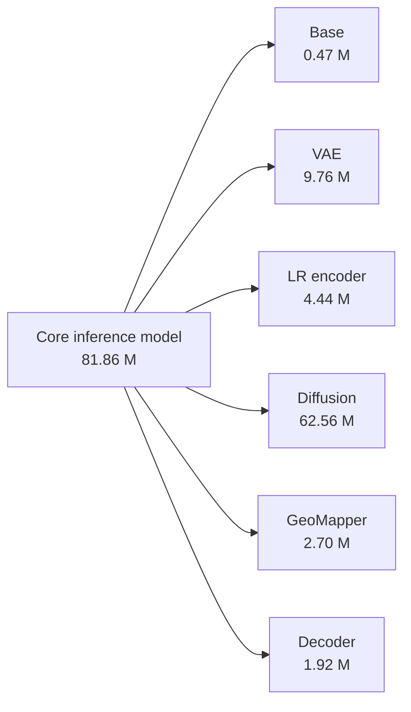
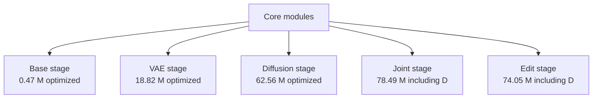

# 16 - Parameter Counts and Training Configuration

## Learning Objectives

- distinguish scalar parameters, parameter tensors, buffers, and activations;
- know the exact parameter count of every GeoDiff-GAN module;
- know which parameters are optimized in each training stage;
- understand the architecture and optimizer settings in the YAML configuration;
- reproduce and verify every count with the repository audit command.

All counts in this chapter were generated from commit-time code using
`configs/default.yaml`. They are not estimates.

## 1. What Is Being Counted?

A PyTorch parameter tensor may contain many trainable scalar values. For example, a convolution
weight with shape \(64\times3\times3\times3\) is one parameter tensor containing:

\[
64\cdot3\cdot3\cdot3=1,728
\]

scalar parameters.

This chapter reports scalar parameters because that is the standard model-size measure.

The audit distinguishes:

| Quantity | Meaning |
|---|---|
| Scalar parameters | Sum of `parameter.numel()` over a module |
| Parameter tensors | Number of separate `nn.Parameter` objects |
| Trainable parameters | Scalars whose `requires_grad=True` |
| Buffers | Non-optimized state such as diffusion schedules; excluded |
| Activations | Intermediate tensors created by a forward pass; excluded |

Parameters measure model capacity, but they do not determine peak GPU memory alone. Activations,
attention maps, gradients, Adam states, input resolution, batch size, and precision are also major
memory costs.

## 2. XS, Medium, and Large Presets

All three presets use the same end-to-end architecture, tensor interfaces, two operating modes,
training curriculum, losses, evidence controls, and spatial-consistency mechanisms. They differ
only in width, depth, text-encoder implementation for XS, and discriminator capacity.

| Preset | Configuration | Core parameters | Training discriminators | Purpose |
|---|---|---:|---:|---|
| XS | `configs/smoke.yaml` | 765,046 | 113,508 | Unit tests and pipeline debugging |
| Medium | `configs/medium.yaml` | 21,127,282 | 1,731,972 | Practical research on 16 GB GPUs |
| Large | `configs/default.yaml` | 81,856,274 | 6,871,812 | Highest-capacity research model |

The medium model is about 27.6 times larger than XS and contains 25.8% of the large model's core
parameters. Unlike XS, medium retains the full 768-dimensional SigLIP-compatible context,
four-level diffusion U-Net, 1,000-step training schedule, and all research mechanisms.

Capacity presets are not checkpoint-compatible. Keep one preset for the complete five-stage
curriculum; changing widths between stages changes parameter tensor shapes.

| Architecture setting | XS | Medium | Large |
|---|---:|---:|---:|
| Swin embedding/depth/heads | 16 / 2 / 4 | 40 / 4 / 5 | 60 / 6 / 6 |
| VAE base channels | 8 | 32 | 64 |
| LR encoder base channels | 8 | 32 | 64 |
| Diffusion widths | 16, 32, 48 | 64, 128, 192, 256 | 128, 256, 384, 512 |
| Context dimension | 32 | 768 | 768 |
| Mapper channels | 16 | 64 | 128 |
| Style dimension | 16 | 128 | 256 |
| Decoder channels | 16, 12, 8, 8 | 64, 48, 32, 24 | 128, 96, 64, 48 |
| Diffusion schedule | 20 | 1,000 | 1,000 |
| Discriminator base channels | 8 | 32 | 64 |

## 3. Large Architecture Count

The core inference model contains:

\[
\boxed{81,856,274\text{ scalar parameters}}
\]

stored in 555 parameter tensors.

| Core module | Scalar parameters | Share of core |
|---|---:|---:|
| SwinIR base | 472,203 | 0.58% |
| Residual VAE | 9,764,299 | 11.93% |
| LR encoder | 4,438,528 | 5.42% |
| Diffusion U-Net | 62,563,332 | 76.43% |
| Diffusion scheduler | 0 | 0.00% |
| GeoMapper | 2,697,730 | 3.30% |
| Residual GAN decoder | 1,920,182 | 2.35% |
| **Core total** | **81,856,274** | **100%** |

The scheduler stores diffusion coefficients as buffers, not learned parameters. The diffusion
U-Net dominates capacity because it contains the multi-resolution residual, conditioning, and
attention blocks.

Pure parameter storage is approximately:

| Precision | Core parameter storage |
|---|---:|
| FP32 | 312.3 MiB |
| FP16 | 156.1 MiB |

These values exclude gradients, optimizer state, activations, CUDA workspaces, and discriminators.



## 4. Large Training-Only Discriminators

The discriminators are loaded only for training and are not required for inference.

| Discriminator | Scalar parameters |
|---|---:|
| Conditional three-scale PatchGAN | 5,144,643 |
| Haar-wavelet discriminator | 1,727,169 |
| **Combined discriminator total** | **6,871,812** |

The complete training graph therefore contains:

\[
81,856,274+6,871,812
=\boxed{88,728,086\text{ parameters}}.
\]

This does not mean all 88.73 million parameters are optimized simultaneously. Stage freezing
selects a different subset.

## 5. Large Stage-Wise Optimized Parameters

| Stage | Trainable core modules | Core trainable | Discriminators | Total optimized |
|---|---|---:|---:|---:|
| Base | base | 472,203 | 0 | **472,203** |
| VAE | VAE, LR encoder, mapper, decoder | 18,820,739 | 0 | **18,820,739** |
| Diffusion | diffusion U-Net | 62,563,332 | 0 | **62,563,332** |
| Joint | diffusion, LR encoder, mapper, decoder | 71,619,772 | 6,871,812 | **78,491,584** |
| Edit | diffusion, mapper, decoder | 67,181,244 | 6,871,812 | **74,053,056** |

The base and VAE remain frozen in joint and edit training. The LR encoder is trainable in joint
training but frozen in edit training. This protects the spatial evidence representation while the
prompt-sensitive mapper, decoder, and diffusion model adapt.



The stage policy is defined once in
[`training/stages.py`](../src/geodiff_gan/training/stages.py) and is shared by the trainer and
parameter checker. This prevents the report from silently disagreeing with actual training.

## 6. Large Architecture Hyperparameters

The full architecture in `configs/default.yaml` uses:

| Setting | Value | Meaning |
|---|---:|---|
| `scale` | 4 | 128x128 LR becomes 512x512 HR |
| `base_embed_dim` | 60 | SwinIR feature width |
| `base_depth` | 6 | Number of residual Swin blocks |
| `base_heads` | 6 | Attention heads per Swin block |
| `window_size` | 8 | Local attention window |
| `latent_channels` | 4 | Residual latent channels |
| `vae_channels` | 64 | VAE base width |
| `lr_channels` | 64 | LR encoder base width |
| `diffusion_widths` | 128, 256, 384, 512 | U-Net stage widths |
| `context_dim` | 768 | Text-conditioning width |
| `degradation_dim` | 4 | Blur/noise/quantization condition size |
| `mapper_channels` | 128 | Spatial content width |
| `style_dim` | 256 | Per-stage FiLM/style width |
| `decoder_channels` | 128, 96, 64, 48 | Decoder stage widths |
| `diffusion_steps` | 1000 | Training diffusion schedule length |

Changing any width, depth, head count, or number of stages changes the parameter count. Spatial
input size usually changes activation memory and compute, but not convolution parameter counts.

## 7. Optimizer and Runtime Parameters

Default optimizer configuration:

| Setting | Generator | Discriminator |
|---|---:|---:|
| Optimizer | AdamW | AdamW |
| Learning rate | \(10^{-4}\) | \(10^{-4}\) |
| Betas | \((0.9,0.99)\) | \((0.0,0.99)\) |
| Weight decay | \(10^{-4}\) | 0 in current code |

Other defaults:

| Setting | Value |
|---|---:|
| Batch size per GPU | 1 |
| Gradient accumulation | 8 |
| Effective batch on one GPU | 8 |
| Gradient clipping | 1.0 |
| AMP | enabled on CUDA |
| Gradient checkpointing | enabled |
| Training back-projection steps | 1 |

For \(G\) GPUs:

\[
B_{\text{effective}}
=B_{\text{per GPU}}\times G\times A,
\]

where \(A\) is gradient accumulation.

For 702 one-tile patches, batch size 1, accumulation 8, and one GPU:

\[
\left\lceil\frac{702}{8}\right\rceil=88
\]

generator optimizer updates occur per epoch.

The Kaggle `FAST_DEV_RUN` deliberately overrides accumulation to 1 and runs one epoch per selected
stage. With 702 accepted patches, this is about 702 optimizer updates per stage. The exact number
can be lower after black-border quarantine or if the manifest contains fewer accepted patches.

## 8. Loss Weights

The default configured weights are:

| Loss | Weight |
|---|---:|
| Charbonnier | 1.0 |
| Degradation consistency | 1.0 |
| SSIM | 0.2 |
| Gradient | 0.1 |
| Perceptual | 0.1 |
| Wavelet | 0.05 |
| KL | 0.0001 |
| VAE reconstruction | 1.0 |
| Diffusion velocity | 1.0 |
| Evidence calibration | 0.1 |
| Edit localization | 0.05 |
| Edit permission | 0.05 |
| Prompt alignment | 0.05 |
| Adversarial | 0.01 |

Not every loss is active in every stage. A configured weight is a potential coefficient, while
`Trainer._forward_stage` determines whether that loss participates in a specific stage.

## 9. External Models Excluded from the Core Count

The frozen SigLIP text encoder is model-dependent and is excluded from the 81.86 million core
count. It supplies conditioning but is not optimized. Count it explicitly with
`--include-text-encoder`; this may download model weights.

Qwen3-VL is also excluded. It captions HR patches offline and is not loaded during GeoDiff-GAN
training or inference.

Therefore, report parameter totals using precise language:

> GeoDiff-GAN has 81.86 M core inference parameters and 6.87 M training-only discriminator
> parameters, excluding the frozen external text encoder and offline captioning model.

## 10. Reproducing the Audit

Run the standalone test script:

```bash
python scripts/check_parameters.py \
  --config configs/default.yaml \
  --patches 702 \
  --verify \
  --json parameter_report.json
```

After editable installation, the equivalent command is:

```bash
geodiff-parameters \
  --config configs/default.yaml \
  --patches 702 \
  --verify
```

Check the smoke architecture:

```bash
python scripts/check_parameters.py \
  --config configs/smoke.yaml \
  --defaults configs/default.yaml \
  --patches 702 \
  --verify
```

The smoke model contains 765,046 core parameters and 113,508 discriminator parameters. It is for
pipeline testing, not research-quality training.

Check the medium architecture:

```bash
python scripts/check_parameters.py \
  --config configs/medium.yaml \
  --defaults configs/default.yaml \
  --patches 702 \
  --verify
```

The medium model contains 21,127,282 core parameters and 1,731,972 discriminator parameters.

To count the configured frozen text encoder:

```bash
geodiff-parameters \
  --config configs/default.yaml \
  --include-text-encoder
```

## 11. What `--verify` Tests

The verification mode checks:

1. per-module core counts sum exactly to the complete core model;
2. discriminator module counts sum to the discriminator total;
3. each stage's total equals its trainable core plus active discriminators;
4. invalid patch counts and world sizes are rejected.

The unit tests lock both XS and medium architecture counts. An intentional architecture change
must update the expected test values and this chapter.

## Mastery Checklist

- [ ] I can distinguish parameter scalars from parameter tensors.
- [ ] I know that buffers and activations are not included in parameter totals.
- [ ] I can state the core and discriminator totals.
- [ ] I can explain why trainable counts differ by stage.
- [ ] I can calculate effective batch size and updates per epoch.
- [ ] I can reproduce the report with `--verify`.
