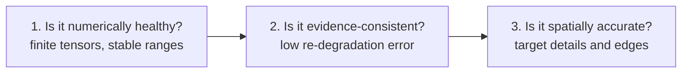
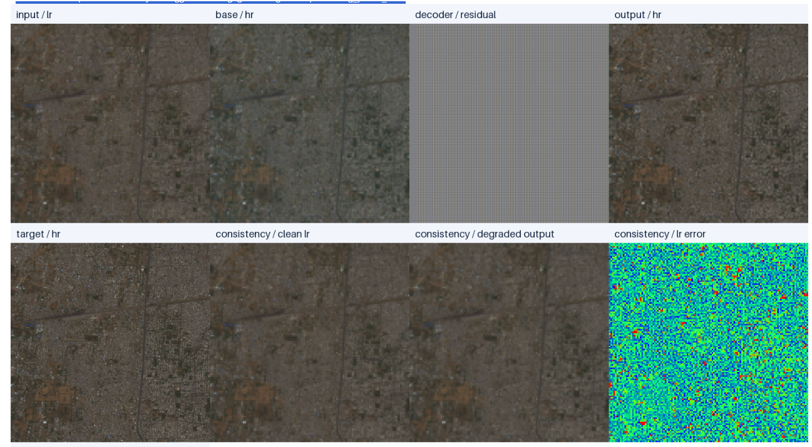
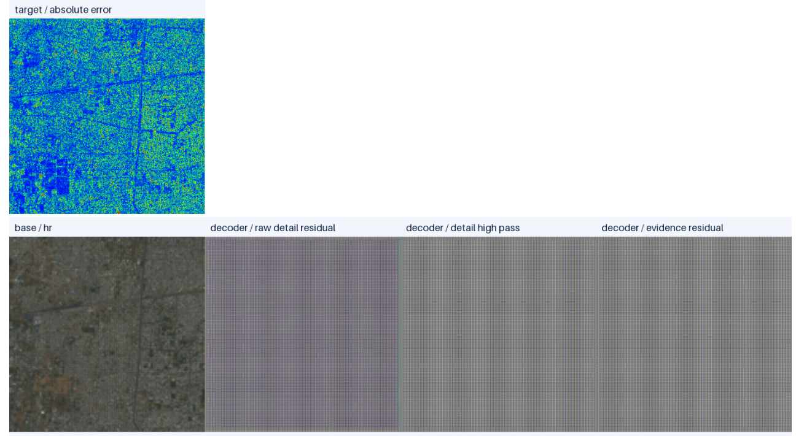
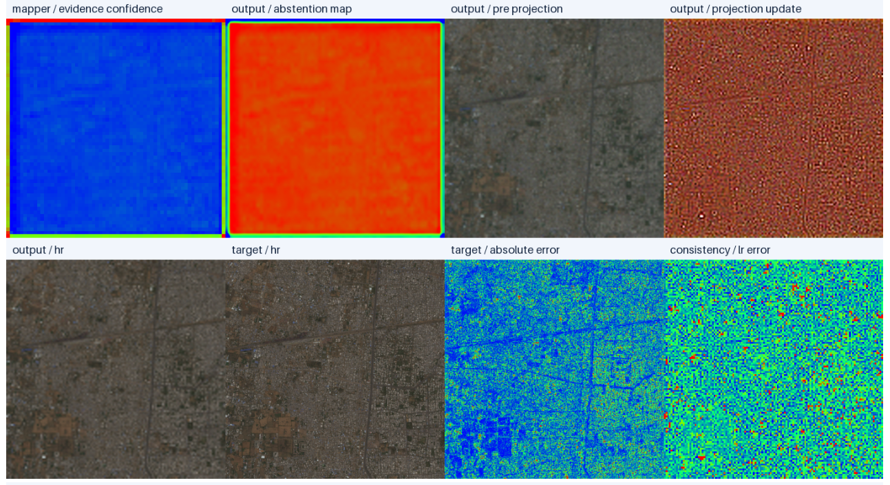
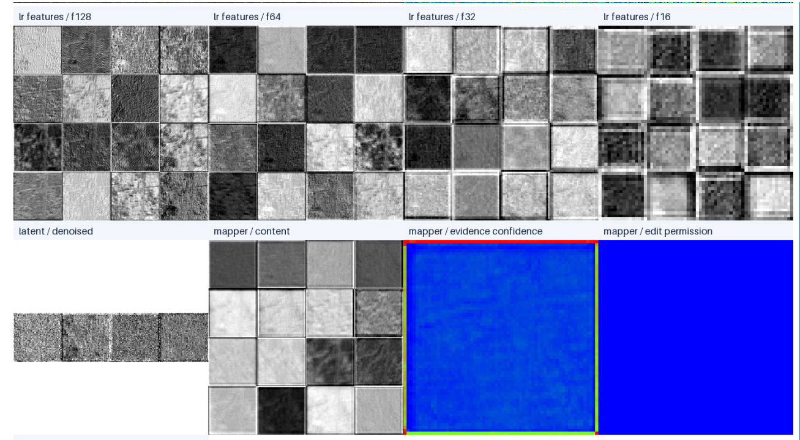
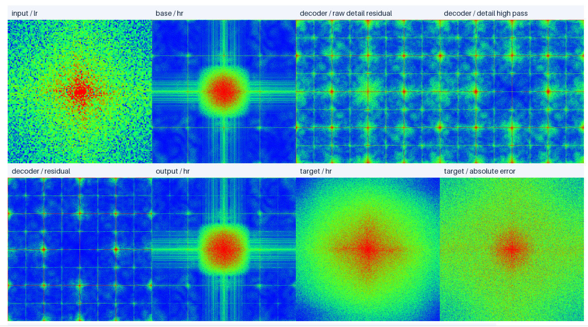
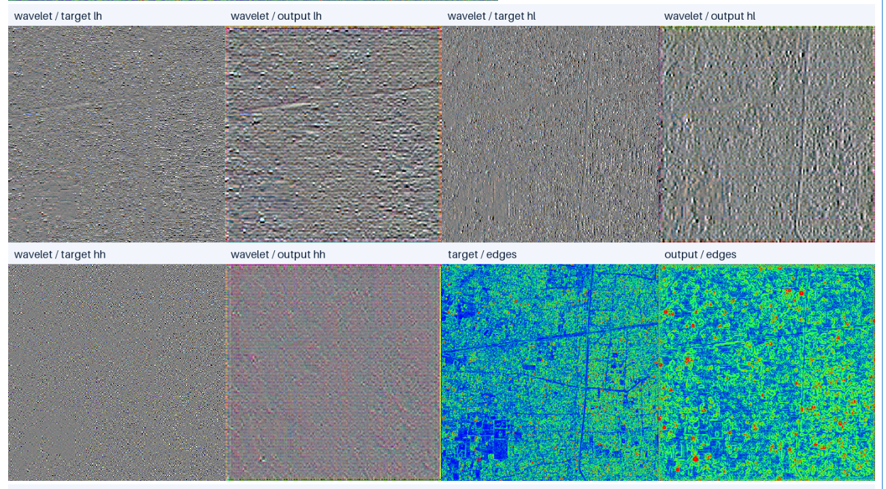
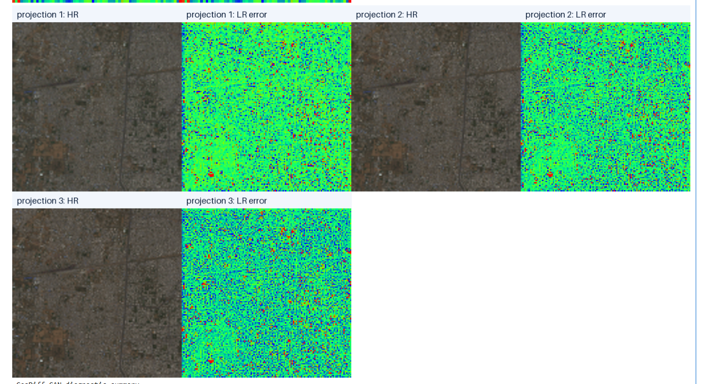

# 17 - Small Model Six-Tile Diagnostic Analysis

## Learning Objectives

After this chapter, you should be able to:

- read every panel produced by `geodiff_gan.cli.debug`;
- separate numerical stability from reconstruction quality;
- interpret residuals, confidence maps, Fourier spectra, wavelets, and back-projection;
- identify what this six-tile experiment demonstrates and what it does not;
- turn a visual impression into testable quantitative conclusions.

## 1. Experiment Being Analyzed

This diagnostic was produced with:

```text
variant:       small
checkpoint:    joint_epoch_0009.pt
split:         validation
patch index:   150
mode:          SR
diffusion:     20 sampling steps
prompt:        null / disabled
training data: 6 Sentinel-2 SAFE products
```

The main tensor sizes are:

```text
LR observation:       [1, 3, 128, 128]
HR base/output/target: [1, 3, 512, 512]
diffusion latent:      [1, 4, 64, 64]
```

This is one validation patch. It is useful for diagnosing mechanisms, but it is not enough to
measure generalization. Dataset-level conclusions require aggregate validation and test metrics.

## 2. Executive Diagnosis

The result is not a numerical failure. The pipeline is stable, the diffusion process converges,
the SR/edit policy behaves correctly, and back-projection strongly enforces LR consistency.

The main weakness is detail recovery:

| Observation | Result | Interpretation |
|---|---:|---|
| Base-to-target L1 | 0.04736 | Deterministic base is substantially wrong on this patch |
| Output-to-target L1 | 0.02650 | Final model is better than the base |
| L1 improvement over base | 44.0% | Meaningful patch-level improvement |
| LR error before projection | 0.02032 | Pre-projection output is not sufficiently sensor-consistent |
| LR error after projection | 0.00329 | Projection reduces inconsistency by 83.8%, or 6.19x |
| Evidence confidence mean | 0.166 | Generative detail is strongly suppressed |
| Abstention mean | 0.834 | Model declines to trust about 83% of its proposed detail |
| Output/target edge mean ratio | 33.3% | Output is strongly under-sharpened |
| LH wavelet energy ratio | 37.8% | Directional high-frequency energy is too low |
| HL wavelet energy ratio | 32.4% | Directional high-frequency energy is too low |
| HH wavelet energy ratio | 30.7% | Diagonal/fine texture energy is too low |
| Output clipping | 0% | Output remains inside the valid radiometric range |

The model therefore behaves as a conservative reconstruction system. It improves the base and
respects the LR observation, but it does not yet reconstruct enough of the target's fine spatial
structure.

## 3. Three Questions to Ask for Every Diagnostic



These questions are independent.

- A model can be numerically stable but inaccurate.
- A model can match the LR observation while producing the wrong HR details.
- A visually sharp image can be physically inconsistent with the LR observation.

This checkpoint passes the first question, performs well on the second after projection, and is
only partially successful on the third.

## 4. Figure 1: End-to-End Overview



### `input / lr`

This is the observed 128x128 low-resolution RGB patch enlarged for display. It contains the
evidence available to the model. Fine buildings, narrow roads, and sub-pixel boundaries cannot be
directly observed at their native 10 m detail.

### `base / hr`

This is the deterministic 512x512 SR estimate. It establishes geometry, color, and large
structures before the generative branch adds detail.

For this patch:

```text
base mean:   0.30017
target mean: 0.28376
base std:    0.05456
target std:  0.05868
```

The base is about `0.0164` too bright on average. It also looks smoother than the target. Its
target L1 error is `0.04736`, so the joint model has significant work to do.

### `decoder / residual`

This is not an ordinary RGB image. It is a signed correction:

\[
I_{\text{candidate}} = I_{\text{base}} + R_{\text{decoder}}.
\]

Neutral gray represents values near zero. Brighter and darker pixels represent positive and
negative corrections. Diagnostic plotting stretches the residual's range, so visible texture does
not mean the residual has normal RGB brightness.

The displayed fine grid is important. It suggests that the decoder is generating periodic
high-frequency structure. Some structure can correspond to urban texture, but repeated,
architecture-aligned grids are also a warning for upsampling artifacts.

### `output / hr`

This is the final output after evidence gating and three back-projection steps. It is visibly
closer to the target than the base, especially in brightness and large structures, but remains
softer than the target.

Numerically:

```text
base target L1:   0.04736
output target L1: 0.02650
relative gain:    44.0%
```

This is a real improvement for this patch. It does not mean the model has recovered all missing
detail.

### `target / hr`

This is the native 10 m training target. It contains sharper roads, blocks, roofs, and local
contrast than the output.

### `consistency / clean lr`

This is the clean simulated LR image before observation noise. In a synthetic experiment it is
known exactly. It is the preferred target for sensor consistency because the model should recover
scene content rather than reproduce sampled noise.

### `consistency / degraded output`

This is the final 512x512 output passed through the same blur and 4x downsampling model:

\[
\widehat I_{\text{LR}} = D(\widehat I_{\text{HR}};\theta).
\]

It should resemble `clean lr`. Their similarity checks whether the HR output could plausibly have
produced the LR observation.

### `consistency / lr error`

This is:

\[
\left|D(\widehat I_{\text{HR}};\theta)-I_{\text{LR,clean}}\right|.
\]

Blue indicates lower error and warmer colors indicate higher error. The numerical mean is
`0.00329`, which is low.

Do not compare color intensity between different heatmaps unless they use the same fixed color
limits. Most debug panels normalize each map independently.

### Figure 1 conclusion

The final output is more accurate than the deterministic base and is highly compatible with the
LR evidence. Its remaining error is concentrated in missing high-frequency spatial detail.

## 5. Figure 2: Residual Construction



### `target / absolute error`

This is the per-pixel absolute difference between output and target. Roads, dense urban regions,
and high-contrast structures remain visible in the error map. That means the model performs best
in smooth areas and loses accuracy around fine geometry.

### `decoder / raw detail residual`

This is the decoder's unrestricted detail proposal:

```text
min:  -0.68101
max:   0.49460
std:   0.26347
```

Its amplitude is large compared with the image. Adding it directly would produce an unstable,
over-textured result.

### `decoder / detail high pass`

The raw residual is high-pass filtered so that the generative branch cannot freely change broad
brightness and low-frequency geography.

```text
raw low-frequency fraction: 0.23138
```

About 23.1% of the raw residual is attributed to low-frequency content and removed. The remaining
standard deviation is still high at `0.24349`.

### `decoder / evidence residual`

The high-pass detail is multiplied by evidence confidence:

\[
R_{\text{evidence}}(x,y)=C(x,y)R_{\text{high-pass}}(x,y).
\]

Its standard deviation falls to `0.04009`, close to the expected factor from the mean confidence
of `0.166`.

This is a safety mechanism working as designed: it prevents the aggressive raw residual from
dominating the reconstruction. The problem is that the confidence is low nearly everywhere, so
valid detail is suppressed together with artifacts.

### Figure 2 conclusion

The decoder can generate substantial detail, but much of that detail has periodic structure and
is not trusted by the GeoMapper. The evidence gate protects spatial fidelity, yet currently acts
more like a global attenuation control than a selective spatial confidence model.

## 6. Figure 3: Evidence, Abstention, and Projection



### `mapper / evidence confidence`

Confidence lies in:

```text
minimum: 0.15074
maximum: 0.30733
mean:    0.16632
std:     0.01399
```

The low standard deviation means that most locations receive almost the same low confidence.
That is not saturation at exactly zero or one, but it is weak spatial discrimination.

The bright border should be checked separately. It may indicate padding or boundary behavior
rather than genuine confidence. Report interior-only statistics after cropping 8-16 pixels from
each edge.

### `output / abstention map`

Abstention is approximately:

\[
A(x,y)=1-C(x,y).
\]

Its mean is `0.83368`. Red therefore means "the model does not trust generated detail here," not
"the output is wrong here."

A useful confidence map should vary with local ambiguity and predicted error. This map is mostly
uniform, so calibration is not yet convincing.

### `output / pre projection`

This is the evidence-gated candidate before sensor correction. It is conservative and smooth:

```text
pre-projection std: 0.03680
target std:         0.05868
```

The candidate contains only about 63% of the target's standard deviation. This supports the
visual conclusion that local contrast has been suppressed.

### `output / projection update`

This is the correction added by back-projection. Its absolute mean is `0.01780`, which is large
relative to the final target L1 error of `0.02650`.

Therefore, back-projection is not making a tiny final adjustment. It is doing a substantial part
of the reconstruction.

### Bottom row

- `output / hr`: final projected result;
- `target / hr`: desired native-resolution patch;
- `target / absolute error`: where HR reconstruction remains wrong;
- `consistency / lr error`: where re-degradation remains inconsistent.

The HR error map and LR error map answer different questions. A region can have low LR error but
high HR error because many different HR textures degrade to nearly the same LR pixels.

### Figure 3 conclusion

Evidence control is conservative but poorly localized. Back-projection successfully repairs
measurement consistency, while the remaining target error demonstrates that LR consistency alone
cannot identify the correct high-resolution solution.

## 7. Figure 4: LR Features, Latent, and GeoMapper



### LR feature pyramids

The panels show selected channels, not RGB images:

| Feature | Shape | Role |
|---|---|---|
| `f128` | `[1, 24, 128, 128]` | local color, edges, fine LR texture |
| `f64` | `[1, 48, 64, 64]` | intermediate structures |
| `f32` | `[1, 96, 32, 32]` | wider context and object patterns |
| `f16` | `[1, 96, 16, 16]` | coarse semantic and regional context |

Each small tile in the mosaic is one feature channel. White and black represent high and low
normalized activation for that channel, not reflectance.

The channels respond differently to roads, dense regions, boundaries, and textures. This is a
healthy sign: the LR encoder is active and has not collapsed to constant features.

### `latent / denoised`

The four strips correspond to the four latent channels at 64x64. The final latent has:

```text
mean: 0.10536
std:  0.09144
```

It is spatially structured rather than pure Gaussian noise. Whether its amplitude is correct must
be judged against the residual VAE's training-latent distribution, not against RGB ranges.

### `mapper / content`

This is the 48-channel spatial content tensor sent to the decoder. Its standard deviation is
`1.65935`, so the mapper is active and produces varied content features.

Large mapper activations are not automatically an error because normalization and learned
convolutions operate in feature space. Monitor them across checkpoints for growth or collapse.

### `mapper / evidence confidence`

The confidence map is again low and nearly uniform. This is the main suspicious mapper output.

### `mapper / edit permission`

It is exactly zero because the model is running in SR mode:

```text
mean: 0.0
max:  0.0
```

This is correct. It prevents the unrestricted edit residual from entering a scientific SR output.

### Figure 4 conclusion

The LR encoder, diffusion latent, and mapper content are active. The policy separation between SR
and edit mode is correct. The weak component is not feature extraction; it is confidence
calibration and its spatial selectivity.

## 8. Diffusion Trajectory

The diffusion statistics show the latent moving from Gaussian noise toward a stable residual:

| Sampling point | Timestep | Latent std | Predicted-clean std |
|---:|---:|---:|---:|
| 0 | 999 | 1.00085 | 0.21783 |
| 5 | 736 | 0.89993 | 0.08946 |
| 10 | 473 | 0.67003 | 0.09770 |
| 15 | 210 | 0.33449 | 0.09189 |
| 19 | 0 | 0.09207 | 0.09144 |

At the final step, the latent and clean estimate have nearly identical statistics. There are no
NaN or Inf values, and the standard deviation decreases smoothly. These are signs of stable
sampling.

The final standard deviation being small does not by itself prove latent collapse. Check:

1. the VAE target-latent mean and standard deviation;
2. variation across many patches;
3. variation across random diffusion seeds;
4. whether different inputs produce different latent spatial patterns.

The text tensor is entirely zero:

```text
conditioning.text: mean=0, std=0
```

Therefore this run evaluates prompt-free SR only. It says nothing about prompt conditioning or
edit-mode performance.

## 9. Figure 5: Fourier Frequency Spectra



The Fourier transform decomposes an image into spatial frequencies:

- center: DC and low-frequency brightness/large structures;
- farther from center: finer textures and sharper transitions;
- horizontal or vertical lines: strong directional patterns;
- regularly repeated peaks: periodic structure.

### `input / lr`

The input spectrum has strong central energy and broad noise-like frequency content. The LR image
cannot contain native HR frequencies above its sampling limit; resizing the panel does not restore
them.

### `base / hr`

The strong central red region shows that the base is dominated by smooth, low-frequency content.
Horizontal and vertical lines reflect strong directional scene structure and interpolation or
upsampling behavior.

### Raw residual and high-pass residual

The repeated lattice of bright peaks is concerning. It indicates periodic detail at regularly
spaced frequencies. Common causes include:

- PixelShuffle or staged upsampling periodicity;
- transposed/modulated convolution behavior;
- feature-grid alignment;
- decoder learning a repeated texture shortcut.

The pattern remains after high-pass filtering, so the filter removes broad intensity changes but
does not remove periodic grid artifacts.

### Final residual and output

The final gated residual retains the lattice but at reduced amplitude. The output spectrum is
still dominated by the base. This explains why the output is stable but soft.

### Target and absolute error

The target has broader high-frequency energy. The error spectrum retains substantial central and
mid-frequency energy, meaning the mismatch is not only pixel noise; larger local contrast and
structure also remain wrong.

### Figure 5 conclusion

The decoder has learned a periodic high-frequency proposal rather than fully natural,
scene-adaptive detail. Gating hides much of it from the final output, but the underlying decoder
artifact should still be fixed.

Before declaring an architecture artifact, repeat the FFT with:

- one channel at a time;
- a window function such as Hann to reduce boundary leakage;
- fixed color limits;
- target, decoder, and output from many patches.

## 10. Figure 6: Haar Wavelets and Edges



Haar decomposition separates low-frequency content from directional details:

- `LH` and `HL`: orthogonal directional edge/detail bands;
- `HH`: diagonal and finest alternating detail.

The exact horizontal/vertical naming of `LH` and `HL` depends on implementation convention. The
important comparison is target versus output for the same band.

### Quantitative comparison

| Band | Target std | Output std | Retained detail-amplitude ratio |
|---|---:|---:|---:|
| LH | 0.03243 | 0.01226 | 37.8% |
| HL | 0.03614 | 0.01171 | 32.4% |
| HH | 0.01632 | 0.00501 | 30.7% |

The output contains only about one-third of the target's high-frequency standard deviation.
Because signal energy is proportional to squared amplitude, the corresponding energy ratios would
be even smaller. The standard-deviation ratios are used here because they match the diagnostic
statistics directly.

### `target / edges`

Strong roads, boundaries, buildings, and block structure are visible. Its edge magnitude mean is
`0.04040`.

### `output / edges`

The output edge mean is `0.01346`, only 33.3% of the target value. Its edge standard deviation is
only 27.4% of the target. The output contains some edges, but they are weaker and less spatially
organized.

### Figure 6 conclusion

This is the clearest evidence of under-reconstruction. The final image is not merely visually
different; it contains much less directional high-frequency energy than the target.

Increasing adversarial loss alone is not a sufficient solution. It may create sharper but false
texture. Improvements should combine:

- better decoder upsampling;
- stronger but controlled wavelet/gradient supervision;
- confidence calibration;
- more geographically diverse training data;
- validation of LR consistency after every change.

## 11. Figure 7: Back-Projection Trajectory



Back-projection repeatedly:

1. degrades the current HR image;
2. compares it with the clean LR evidence;
3. upsamples the LR error;
4. corrects the HR estimate.

The recorded LR errors are:

```text
before / step 1: 0.020323
step 2:          0.010598
step 3:          0.005724
final reported:  0.003285
```

The exact association between a displayed image and error can differ by callback timing, but the
important property is monotonic reduction. Final error is 83.8% lower than the initial error.

The HR panels look nearly identical because the corrections are small relative to the full RGB
range. The LR error panels can all look colorful because each heatmap may be independently
normalized. Trust the numeric L1 values for comparing steps.

### Figure 7 conclusion

Back-projection is functioning correctly and converges quickly. However, its update absolute mean
of `0.01780` is substantial. Run an ablation with zero projection steps to determine how much
quality comes from the learned model and how much comes from deterministic correction.

## 12. Other Important Tensor Statistics

### Observed degradation

```text
observed noise L1:      0.00372
noise-to-signal ratio:  0.01311
```

The synthetic noise is about 1.31% of the signal scale, which is mild. This diagnostic does not
show the excessive-noise problem seen in earlier degradation settings.

The final clean-LR error of `0.00329` is slightly below the observed noise L1. That is reasonable
for synthetic training because the projection target is the known clean LR image.

### Residual magnitude

```text
residual absolute mean:   0.03246
residual/base ratio:      0.10812
output clipped fraction:  0.0
```

The final residual is about 10.8% of the base magnitude. It is large enough to affect the result
but does not force values outside the legal image range.

### Base, output, and target contrast

```text
base std:   0.05456
output std: 0.04468
target std: 0.05868
```

The final output has only 76.1% of the target standard deviation and is even lower contrast than
the base. The projection corrects brightness and LR consistency, but the confidence-gated
residual cancels or suppresses some local contrast.

## 13. What Can Be Concluded

### Supported by this patch

1. The small model executes the complete architecture without numerical instability.
2. Twenty-step diffusion sampling converges to a finite structured latent.
3. Null-text conditioning is correctly inactive.
4. Edit permission is correctly zero in SR mode.
5. The final output improves target L1 by 44.0% relative to the base.
6. Back-projection reduces LR error by 83.8%.
7. The evidence gate prevents an aggressive decoder residual from corrupting the image.
8. The final output remains under-detailed relative to the target.
9. The raw decoder residual contains suspicious periodic frequency structure.
10. Evidence confidence is too uniform to demonstrate useful local calibration.

### Not supported by this patch

1. That the model generalizes to unseen cities or MGRS tiles.
2. That the model beats bicubic, SwinIR, ESRGAN, or diffusion-only baselines overall.
3. That prompt guidance works.
4. That uncertainty is calibrated.
5. That the result is publication-ready.
6. That missing 10 m details have been physically recovered.

## 14. Is Six-Tile Training the Cause?

Six tiles are enough for pipeline validation and an early research pilot. They are not enough to
cover the diversity of Sentinel-2 scenes, acquisition conditions, land-cover classes, atmospheric
variation, and city morphology.

Limited tile diversity can cause:

- decoder texture shortcuts;
- poor confidence calibration;
- weak generalization to the validation tile;
- over-reliance on deterministic projection;
- low-frequency or scene-specific bias.

However, the periodic residual pattern may also be architectural. More data alone should not be
assumed to fix it. Test both explanations through controlled ablations.

## 15. Recommended Next Experiments

### A. Aggregate validation diagnostics

Run at least 100 validation patches and report distributions, not one example:

```text
output L1 / base L1
PSNR and SSIM
edge magnitude ratio
LH, HL, HH standard-deviation ratios
evidence confidence mean and std
projection update / final residual ratio
LR error before and after projection
```

### B. Decoder artifact ablation

Compare the current upsampler against resize-convolution or anti-aliased upsampling. Use identical
training data, loss weights, seeds, and update counts. Compare FFT lattice energy.

### C. Evidence calibration

The desired behavior is high confidence where proposed residuals are locally accurate and low
confidence where they are wrong. Evaluate:

\[
\operatorname{corr}(C(x,y),-|E_{\text{HR}}(x,y)|).
\]

Also compare error at different confidence coverage levels. A nearly constant confidence map
cannot rank reliable and unreliable regions.

### D. Projection ablation

Evaluate with 0, 1, and 3 projection steps. Report both HR metrics and LR consistency. This reveals
whether projection is correcting a good learned estimate or compensating for a weak one.

### E. Controlled detail supervision

After fixing periodic artifacts, tune wavelet, gradient, and perceptual losses. Keep adversarial
weight low and monitor LR consistency so increased sharpness does not become hallucination.

### F. Scale the geography

Train on at least 25 geographically varied tiles for the next serious experiment. Keep validation
and test tiles entirely separate by product/tile, and report unseen-city and unseen-MGRS results.

## 16. A Practical Reading Checklist

For each new diagnostic, answer in this order:

1. Are all tensors finite?
2. Does diffusion variance decrease smoothly?
3. Is the text condition correct for the requested mode?
4. Is edit permission exactly zero in SR mode?
5. Does the output improve over the deterministic base?
6. Does back-projection reduce LR error monotonically?
7. Is the projection update small enough that the learned model still matters?
8. Does confidence vary spatially and correlate with correctness?
9. Do Fourier spectra show periodic artifacts?
10. Do output wavelet and edge energies approach the target?
11. Are errors concentrated in meaningful structures or random everywhere?
12. Do the same conclusions hold across many validation and test patches?

## 17. Final Assessment

For validation patch 150, the small six-tile model is a functioning but undertrained research
prototype. Its strongest properties are numerical stability, SR/edit separation, conservative
evidence gating, and effective sensor back-projection. Its main scientific weakness is insufficient
high-frequency reconstruction: edge and wavelet magnitudes are only about one-third of the
target, while the raw decoder proposal contains periodic artifacts.

The correct next conclusion is not "the output is bad" or "the architecture works." The defensible
conclusion is:

> The architecture improves the deterministic base and preserves LR evidence on this patch, but
> the current small-model checkpoint is over-conservative and has not learned clean,
> spatially selective high-frequency detail.

Next: repeat this analysis over the full validation set and use the distributions to decide
whether the dominant limitation is data scale, training duration, confidence calibration, or
decoder upsampling.
