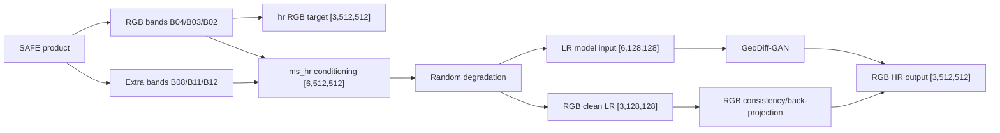

# 18. Multispectral GeoDiff-GAN Variants

## Goal

The multispectral variants keep the scientific target unchanged:

- Predict RGB 10 m HR output: `B04/B03/B02`.
- Use extra Sentinel-2 bands only as conditioning evidence.
- Keep PSNR, SSIM, LPIPS, wavelet loss, back-projection and LR consistency measured in RGB space.

This avoids comparing a 6-channel prediction against a 3-channel ground truth while still giving the model NIR/SWIR context.

## Patch Format

RGB-only patches still work:

```text
patch.npz
  hr: [3, 512, 512]
```

Multispectral patches add `ms_hr`:

```text
patch.npz
  hr: [3, 512, 512]       # RGB target: B04, B03, B02
  ms_hr: [6, 512, 512]    # conditioning: B04, B03, B02, B08, B11, B12
```

`hr` remains RGB so old code, captions and visualization continue to work.

## Preprocessing Command

Use a separate output directory or `--rebuild` when switching from RGB to multispectral, because the patch payload changes.

```bash
python -m geodiff_gan.cli.prepare_sentinel \
  --input /path/to/safe/root \
  --output /path/to/geodiff-output/patches_ms \
  --manifest /path/to/geodiff-output/manifest_ms.jsonl \
  --patch-size 512 \
  --stride 384 \
  --minimum-valid-fraction 0.95 \
  --multispectral-preset rgb-nir-swir
```

The preset stores `B08` at 10 m and resamples `B11/B12` from 20 m to the 10 m RGB grid using bilinear sampling.

## Configs

Two new override configs are available:

- `configs/small_12tile_improved_multispectral.yaml`
- `configs/medium_multispectral.yaml`

Both set:

```yaml
model:
  input_channels: 6
  output_channels: 3

data:
  target_key: hr
  condition_key: ms_hr
```

## Data Flow



## Why This Is Valid

The model never claims to reconstruct NIR/SWIR HR outputs. Extra bands are evidence for RGB reconstruction only:

- NIR helps vegetation boundaries and water/land separation.
- SWIR helps soil, built-up surfaces, moisture and haze ambiguity.
- RGB consistency remains conserved through degradation back-projection.

## Checks To Run

```bash
python -m geodiff_gan.cli.parameters \
  --config configs/small_12tile_improved_multispectral.yaml \
  --defaults configs/default.yaml

python -m geodiff_gan.cli.train \
  --config /path/to/resolved_small_ms_base.yaml
```

In debug output, expect:

- `input.lr`: visually shown as RGB first three channels, but tensor shape is `[B, 6, 128, 128]`.
- `target.hr`: `[B, 3, 512, 512]`.
- `clean_lr`: `[B, 3, 128, 128]`.
- `output.hr`: `[B, 3, 512, 512]`.
