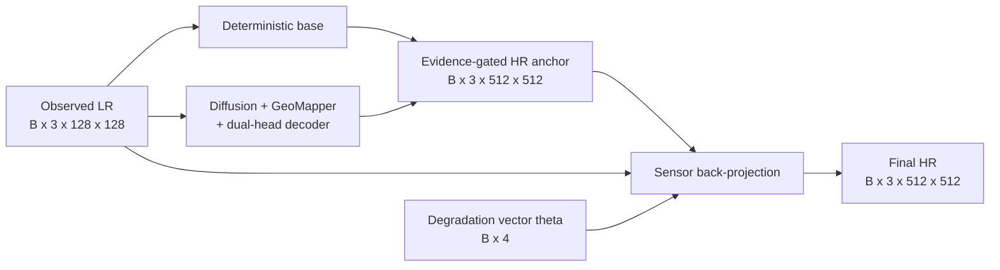

# 18 - Sensor Back-Projection: Internal Architecture and Mathematics

## Learning Objectives

After this chapter, you should be able to:

- explain why sensor back-projection is needed after generative super-resolution;
- derive iterative back-projection from the LR consistency objective;
- trace the exact implementation used by GeoDiff-GAN;
- calculate every tensor shape for 4x Sentinel-2 super-resolution;
- distinguish the implemented bicubic correction from a true degradation adjoint;
- interpret projection diagnostics and recognize failure modes.

## 1. Position in GeoDiff-GAN

Sensor back-projection is the last operation in the generator pipeline. It does not create the
initial high-resolution estimate. It corrects that estimate so that its simulated sensor
observation agrees with the available LR evidence.



In SR mode, the pre-projection estimate is:

\[
\hat{x}_0 =
\operatorname{clip}\left(
x_{\text{base}}+
c_{\text{eff}}\odot H(r_{\text{detail}}),
0,1
\right),
\]

where:

- \(x_{\text{base}}\) is the deterministic SR image;
- \(r_{\text{detail}}\) is the decoder's detail-head residual;
- \(H\) is the high-pass operator;
- \(c_{\text{eff}}\) is the upsampled effective evidence confidence;
- \(\odot\) is elementwise multiplication.

Back-projection receives \(\hat{x}_0\), not the raw decoder output.

## 2. Forward Sensor Model

Let:

- \(x\in[0,1]^{B\times3\times512\times512}\) be an HR image;
- \(y\in[0,1]^{B\times3\times128\times128}\) be its LR observation;
- \(s=4\) be the scale factor;
- \(\theta\in[0,1]^{B\times4}\) contain normalized degradation parameters.

The repository's clean differentiable sensor operator is:

\[
\mathcal{D}_{\theta}(x)
=
S_{4}\left(K_{\sigma(\theta_0)}*x\right),
\]

where:

- \(K_{\sigma}\) is a normalized \(9\times9\) isotropic Gaussian MTF/PSF kernel;
- \(*\) denotes convolution;
- \(S_4\) is 4x area downsampling.

The implemented parameter vector is:

\[
\theta =
[\theta_{\sigma},\theta_G,\theta_P,\theta_Q].
\]

Its entries control:

| Entry | Meaning | Used in clean projection? |
|---|---|---|
| \(\theta_\sigma\) | Gaussian blur sigma | Yes |
| \(\theta_G\) | Gaussian noise level | No |
| \(\theta_P\) | Poisson peak/strength | No |
| \(\theta_Q\) | quantization levels | No |

Back-projection calls `sensor_degrade(..., add_noise=False)`. Therefore, only the blur parameter
affects the forward operator during projection. Noise and quantization are stochastic or
non-smooth observation effects and are deliberately excluded from each correction iteration.

### Mild degradation preset

For the current default mild setting:

\[
\sigma =
0.50 + \theta_{\sigma}(1.00-0.50).
\]

Thus, \(\sigma\in[0.50,1.00]\) pixels on the 10 m HR grid.

### Internal blur implementation

For each sample \(b\), the Gaussian kernel is:

\[
K_b(i,j)=
\frac{
\exp\left(-\frac{i^2+j^2}{2\sigma_b^2}\right)
}{
\sum_{p,q}
\exp\left(-\frac{p^2+q^2}{2\sigma_b^2}\right)
}.
\]

The code:

1. creates one \(9\times9\) kernel per batch item;
2. repeats it for all three RGB channels;
3. reshapes batch and channel into grouped-convolution channels;
4. uses reflection padding;
5. applies grouped convolution;
6. performs area downsampling from \(512^2\) to \(128^2\).

Reflection padding reduces artificial dark borders compared with zero padding.

## 3. Why Back-Projection Is Necessary

A generated HR image can appear realistic while disagreeing with the LR measurement. The
measurement-consistency objective is:

\[
\mathcal{L}_{\text{LR}}(x)
=
\rho\left(\mathcal{D}_{\theta}(x)-y_c\right),
\]

where \(y_c\) is the consistency target and \(\rho\) is usually L1 or Charbonnier distance.

The inverse problem is underdetermined:

\[
\mathcal{D}_{\theta}(x_1)
\approx
\mathcal{D}_{\theta}(x_2)
\]

can hold for many different HR images \(x_1\) and \(x_2\). Back-projection does not identify the
unique true HR image. It restricts the generated image to the set of images compatible with the
LR evidence.

Geometrically, it moves the generative estimate toward the LR-consistency set:

\[
\mathcal{C}(y_c)
=
\{x:\mathcal{D}_{\theta}(x)\approx y_c\}.
\]

## 4. Derivation from Gradient Descent

Consider the squared consistency objective:

\[
J(x)
=
\frac{1}{2}
\left\|
\mathcal{D}_{\theta}(x)-y_c
\right\|_2^2.
\]

If the degradation operator is locally linear, its gradient is:

\[
\nabla_xJ(x)
=
\mathcal{D}_{\theta}^{T}
\left(
\mathcal{D}_{\theta}(x)-y_c
\right),
\]

where \(\mathcal{D}_{\theta}^{T}\) is the transpose or adjoint operator.

A gradient-descent update is:

\[
x_{k+1}
=
x_k-\alpha\nabla_xJ(x_k),
\]

which becomes:

\[
x_{k+1}
=
x_k+
\alpha\mathcal{D}_{\theta}^{T}
\left(
y_c-\mathcal{D}_{\theta}(x_k)
\right).
\]

Define the LR residual:

\[
e_k=y_c-\mathcal{D}_{\theta}(x_k).
\]

Then:

\[
x_{k+1}
=
x_k+\alpha\mathcal{D}_{\theta}^{T}(e_k).
\]

This is the mathematical form of iterative back-projection.

## 5. Exact GeoDiff-GAN Update

The repository does not use the exact adjoint \(\mathcal{D}_{\theta}^{T}\). It approximates the
correction by bicubic interpolation:

\[
U_4(e_k)
=
\operatorname{BicubicUpsample}_{128\rightarrow512}(e_k).
\]

The implemented update is:

\[
\boxed{
x_{k+1}
=
\operatorname{clip}
\left(
x_k+\alpha U_4
\left[
y_c-\mathcal{D}_{\theta}(x_k)
\right],
0,1
\right)
}
\]

The exact Python logic in `models/degradation.py` is conceptually:

```python
result = estimate
for iteration in range(iterations):
    predicted_lr = sensor_degrade(result, parameters, add_noise=False)
    error = observed_lr - predicted_lr
    correction = bicubic_upsample(error, result.shape[-2:])
    result = clamp(result + step_size * correction, 0, 1)
```

### Important terminology

This is an **approximate back-projection correction**. Calling bicubic interpolation the exact
sensor adjoint would be mathematically incorrect.

For the linear clean operator:

\[
\mathcal{D}_{\theta}=S_4K_{\sigma},
\]

the true adjoint would be:

\[
\mathcal{D}_{\theta}^{T}
=
K_{\sigma}^{T}S_4^{T}.
\]

Because the Gaussian kernel is symmetric, \(K_{\sigma}^{T}\) resembles the same blur, but
\(S_4^{T}\) is the transpose of area downsampling, not ordinary bicubic interpolation. Boundary
handling must also match exactly.

## 6. Internal Tensor Flow

For batch size \(B\):

| Step | Tensor | Shape |
|---:|---|---|
| 0 | initial estimate \(x_k\) | \(B\times3\times512\times512\) |
| 1 | reflected padded estimate | \(1\times(3B)\times520\times520\) |
| 2 | blurred HR | \(B\times3\times512\times512\) |
| 3 | predicted LR \(\mathcal{D}_{\theta}(x_k)\) | \(B\times3\times128\times128\) |
| 4 | LR error \(e_k\) | \(B\times3\times128\times128\) |
| 5 | bicubic correction \(U_4(e_k)\) | \(B\times3\times512\times512\) |
| 6 | scaled correction \(\alpha U_4(e_k)\) | \(B\times3\times512\times512\) |
| 7 | clamped updated image \(x_{k+1}\) | \(B\times3\times512\times512\) |

No trainable parameters exist inside `back_project`. It is a deterministic, differentiable tensor
operation.

## 7. SR Mode Versus Edit Mode

The two modes deliberately use different projection strength.

| Property | SR mode | Edit mode |
|---|---:|---:|
| Default iterations at inference | 3 | 1 |
| Step size \(\alpha\) | 0.50 | 0.15 |
| Initial estimate | evidence-gated SR anchor | base + detail + permitted edit |
| Consistency authority | Strong | Soft |
| Interpretation | Reconstruction estimate | Synthetic visualization |

### SR mode

\[
x_{k+1}^{SR}
=
\operatorname{clip}
\left(
x_k^{SR}+0.5U_4(e_k),0,1
\right).
\]

SR mode strongly preserves measurement evidence.

### Edit mode

\[
x_{k+1}^{edit}
=
\operatorname{clip}
\left(
x_k^{edit}+0.15U_4(e_k),0,1
\right).
\]

Edit mode applies only one weaker correction so that prompt-driven changes are not immediately
erased. Its outputs must carry `synthetic_edit=true`.

## 8. Training, Evaluation, and Real Inference Targets

The dataset creates two LR tensors:

\[
y_c=\mathcal{D}_{\theta}(x_{HR})
\]

and:

\[
y_o=Q\left(P\left(y_c+n_G\right)\right),
\]

where:

- \(y_c\) is `clean_lr`;
- \(y_o\) is the noisy and quantized observed `lr`;
- \(n_G\) is Gaussian noise;
- \(P\) represents Poisson sampling;
- \(Q\) represents quantization.

### Synthetic training and evaluation

The code passes:

```text
lr            = observed noisy LR used as model input
projection_lr = clean_lr used as the consistency target
```

Therefore back-projection tries to reproduce the clean scene observation rather than its sampled
noise.

This is valid for controlled synthetic experiments because `clean_lr` is known.

### Ordinary inference

Inside `decode_latent`:

```python
consistency_lr = lr if projection_lr is None else projection_lr
```

If no clean LR is available, projection targets the supplied observed LR. For real satellite
inputs, this may partially project sensor noise or compression artifacts into the HR output.

Practical real-data options include:

1. project toward the observed LR with fewer/weaker steps;
2. estimate a denoised LR target first;
3. use a noise-aware weighted consistency objective;
4. learn a calibrated sensor model from real multi-resolution observations.

## 9. Relationship to the Training Loss

Back-projection is an output correction. Degradation consistency is also explicitly optimized:

\[
\mathcal{L}_{cons}
=
\sqrt{
\left(
\mathcal{D}_{\theta}(\hat{x})-y_c
\right)^2+\epsilon^2
}.
\]

The repository implements this as a Charbonnier loss on the re-degraded output.

These mechanisms have different roles:

| Mechanism | When applied | Purpose |
|---|---|---|
| Consistency loss | During optimization | Teaches the generator to produce compatible outputs |
| Back-projection | During forward output construction | Deterministically corrects remaining LR mismatch |

If projection performs most of the correction, the generator may not have learned consistency
well enough. Always inspect both pre-projection and post-projection errors.

Training uses configurable `training.train_back_projection_steps`, currently defaulting to one,
to reduce compute and memory. Standard SR inference defaults to three steps.

## 10. Differentiability and Gradient Flow

The clean degradation path contains differentiable operations:

- Gaussian kernel construction;
- reflection padding;
- grouped convolution;
- area downsampling;
- bicubic upsampling;
- addition.

Clamping is piecewise differentiable:

\[
\frac{\partial\operatorname{clip}(z,0,1)}{\partial z}
=
\begin{cases}
1,&0<z<1,\\
0,&z<0\text{ or }z>1.
\end{cases}
\]

When many pixels clip to 0 or 1, gradients through those pixels vanish. This is why
`output_clipped_fraction` is an important diagnostic.

Because training executes back-projection inside the model forward pass, gradients can propagate
through the projection iterations to the pre-projection estimate. More iterations increase graph
depth, memory consumption, and runtime.

## 11. Fixed-Point Interpretation

At convergence:

\[
x_{k+1}\approx x_k.
\]

Ignoring clipping and assuming the upsampler does not annihilate the error:

\[
U_4\left(
y_c-\mathcal{D}_{\theta}(x_k)
\right)\approx0.
\]

This suggests:

\[
\mathcal{D}_{\theta}(x_k)\approx y_c.
\]

The desired fixed point is therefore an HR image whose degradation matches the LR evidence.

However, because \(U_4\) is approximate and the problem has a large null space, convergence does
not imply:

\[
x_k=x_{\text{true}}.
\]

Any unsupported high-frequency component \(z\) satisfying:

\[
\mathcal{D}_{\theta}(z)\approx0
\]

can remain almost invisible to the LR consistency constraint.

## 12. Frequency-Domain Interpretation

Blur and downsampling remove or alias high spatial frequencies. Back-projection mainly corrects
the frequencies represented in the LR residual.

Let the clean degradation be approximately linear. In the Fourier domain:

\[
Y(\omega)
\approx
\downarrow_4
\left[
K_{\sigma}(\omega)X(\omega)
\right].
\]

The residual:

\[
E_k(\omega)=Y_c(\omega)-\widehat{Y}_k(\omega)
\]

contains information only on the LR grid. Bicubic upsampling spreads this error smoothly onto the
HR grid. Consequently, back-projection is strong at:

- correcting brightness bias;
- correcting broad color differences;
- aligning large structures;
- restoring LR-visible edges.

It is weak at:

- choosing the correct roof texture;
- recovering sub-pixel road boundaries;
- determining high-frequency phase;
- eliminating generative artifacts in the degradation null space.

The high-pass/evidence gate controls generated detail; back-projection controls measurement
compatibility. Neither mechanism replaces the other.

## 13. Numerical Example from the Six-Tile Small Model

For validation patch 150:

```text
LR error before projection: 0.020323
LR error after projection:  0.003285
projection update abs mean: 0.017797
iterations:                 3
step size:                  0.50
```

The relative error reduction is:

\[
\frac{0.020323-0.003285}{0.020323}\times100
=83.8\%.
\]

The improvement factor is:

\[
\frac{0.020323}{0.003285}=6.19.
\]

This proves that the implemented projection strongly improves compatibility with the simulated
sensor model on this patch.

It does not prove high-frequency correctness. The same patch retained only roughly one-third of
the target edge and wavelet amplitude, demonstrating that strong LR consistency and incomplete HR
detail can coexist.

## 14. Reading Projection Diagnostics

Important recorded values are:

| Diagnostic | Meaning |
|---|---|
| `output.pre_projection` | Generator result before deterministic correction |
| `projection.step_N.image` | HR estimate after a projection update |
| `projection.step_N.lr_error` | LR residual associated with that iteration |
| `output.projection_update` | final output minus pre-projection estimate |
| `spatial.lr_error_before_projection` | initial re-degradation mismatch |
| `spatial.lr_error_after_projection` | final re-degradation mismatch |
| `spatial.projection_update_abs_mean` | average correction magnitude |
| `output.clipped_fraction` | fraction at radiometric limits |

### Healthy behavior

- LR error decreases monotonically;
- projection update is smaller than the image content;
- clipping remains near zero;
- HR quality does not worsen;
- correction is spatially related to LR mismatch.

### Warning signs

| Symptom | Likely explanation |
|---|---|
| LR error increases | step size too large or degradation mismatch |
| Alternating error across steps | oscillation around the consistency set |
| Large update but small HR gain | generator relies excessively on projection |
| High clipping fraction | unstable estimate or overly strong correction |
| Low LR error but poor target detail | ambiguity/null-space problem |
| Border corrections dominate | padding or crop misalignment |
| Real-image noise becomes sharper | projection targets noisy observed LR |

Heatmaps are often independently normalized. Compare numerical errors rather than assuming equal
colors represent equal magnitudes.

## 15. Hyperparameter Effects

### Number of iterations \(K\)

More iterations generally reduce LR error but increase:

- inference time;
- training memory when differentiated;
- risk of overfitting observed noise;
- risk of changing the generated estimate too strongly.

Recommended ablation:

```text
K = 0, 1, 3, 5
```

### Step size \(\alpha\)

Small \(\alpha\):

- stable;
- slow convergence;
- preserves more generative detail.

Large \(\alpha\):

- faster correction;
- possible oscillation;
- more clipping;
- stronger projection of LR noise.

Recommended ablation:

```text
alpha = 0.10, 0.25, 0.50, 0.75
```

### Degradation mismatch

Projection only enforces the implemented model:

\[
\mathcal{D}_{sim}\neq\mathcal{D}_{real}
\]

may produce low simulated consistency while remaining inconsistent with the real sensor. This is
the largest scientific limitation when moving from synthetic 40 m inputs to real imagery.

## 16. Architectural Improvements

### Exact differentiable adjoint

Replace bicubic correction with the transpose of the implemented area-downsample and blur
operators:

\[
x_{k+1}
=
x_k+\alpha K_{\sigma}^{T}S_4^{T}e_k.
\]

This is mathematically cleaner but requires exact treatment of area pooling and boundaries.

### Learned adjoint

Use:

\[
x_{k+1}
=
x_k+\alpha A_{\phi}(e_k,\theta,f_{LR}),
\]

where \(A_{\phi}\) is a learned correction network. It may improve reconstruction but can learn to
exploit simulator artifacts and weaken interpretability.

### Noise-aware projection

Use a confidence or inverse-noise weight:

\[
x_{k+1}
=
x_k+\alpha U_4\left(W_{\theta}\odot e_k\right).
\]

Noisy LR regions receive weaker correction.

### Proximal interpretation

Treat the generator as a learned prior and projection as a data-consistency step:

\[
x_{k+1}
=
\operatorname{prox}_{\lambda R}
\left(
x_k-\alpha\nabla J(x_k)
\right).
\]

This connects GeoDiff-GAN to plug-and-play and model-based deep reconstruction.

Any architectural improvement must be tested through ablation rather than assumed superior.

## 17. Required Ablations for a Paper

Report:

1. no back-projection;
2. one-step back-projection;
3. three-step back-projection;
4. bicubic approximate correction;
5. exact-adjoint-inspired correction;
6. projection toward clean LR versus noisy observed LR;
7. fixed versus degradation-conditioned blur;
8. SR and edit mode separately.

For every setting, measure:

```text
PSNR
SSIM
LPIPS or DISTS
edge F1
LH/HL/HH wavelet error
re-degradation L1
projection update magnitude
clipped fraction
runtime
```

The central research question is:

> How much LR consistency is gained, and what HR accuracy or perceptual detail is lost or gained
> in exchange?

## 18. What Sensor Back-Projection Conserves

It conserves, approximately:

- LR-visible radiometry;
- LR-scale spatial layout;
- color and brightness compatible with the observation;
- structures that survive blur and downsampling;
- consistency under the selected synthetic sensor model.

It does not conserve or guarantee:

- the unique 10 m texture;
- correct sub-pixel object geometry;
- high-frequency phase;
- real Sentinel-2 physics not represented by the simulator;
- freedom from hallucination;
- semantic correctness of prompt-driven edits.

The scientifically correct statement is:

> Sensor back-projection constrains the generated HR estimate to reproduce the available LR
> evidence under an explicit degradation model.

It is incorrect to say:

> Sensor back-projection recovers the true missing pixels.

## 19. Implementation Map

| Concern | File |
|---|---|
| Sensor degradation and projection loop | [`models/degradation.py`](../src/geodiff_gan/models/degradation.py) |
| SR/edit integration and defaults | [`models/system.py`](../src/geodiff_gan/models/system.py) |
| Clean and observed LR creation | [`data/dataset.py`](../src/geodiff_gan/data/dataset.py) |
| Consistency loss | [`losses.py`](../src/geodiff_gan/losses.py) |
| Training projection count | [`training/trainer.py`](../src/geodiff_gan/training/trainer.py) |
| Diagnostic projection trajectory | [`diagnostics.py`](../src/geodiff_gan/diagnostics.py) |

## 20. Mastery Checklist

- [ ] I can write the clean degradation equation.
- [ ] I know why noise is disabled inside projection.
- [ ] I can derive the adjoint-gradient update.
- [ ] I understand that bicubic upsampling is only an approximate correction.
- [ ] I can calculate all LR and HR tensor shapes.
- [ ] I know why synthetic experiments project toward `clean_lr`.
- [ ] I know what happens when `clean_lr` is unavailable.
- [ ] I can explain the different SR and edit projection strengths.
- [ ] I can interpret pre/post LR error and projection-update magnitude.
- [ ] I understand why low LR error does not imply correct HR texture.

## 21. Final Summary

GeoDiff-GAN sensor back-projection is a parameter-free, differentiable, iterative data-consistency
module. It repeatedly degrades the current HR estimate using a degradation-conditioned Gaussian
blur and 4x area downsampling, measures the LR residual, bicubic-upsamples that residual, and adds
a scaled correction to the HR image.

Mathematically, it approximates gradient descent on LR reconstruction error. Architecturally, it
acts after evidence-gated residual generation. Scientifically, it limits disagreement with the
measured LR image, but it cannot recover information destroyed by blur and downsampling.

Next: use [17 - Small Model Six-Tile Diagnostic Analysis](17_small_six_tile_diagnostic_analysis.md)
to interpret the projection behavior in an actual validation example.
