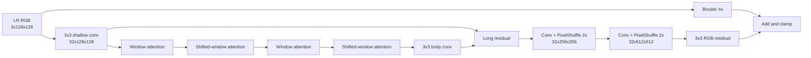

# 19 - Deterministic SwinIR Base

## Purpose

The deterministic base reconstructs the radiometrically conservative HR image before any
diffusion or adversarial detail is added. It carries the geometry, color, brightness, and
low-frequency structure that the generative branch is not allowed to replace freely.

For the small preset:

```text
input:       B x 3 x 128 x 128
embedding:   B x 32 x 128 x 128
depth:       4 window-transformer blocks
window:      8 x 8
heads:       4
output:      B x 3 x 512 x 512
```

## Architecture



## Window Attention

Let \(F\in\mathbb{R}^{B\times C\times H\times W}\). It is partitioned into
\(8\times8\) windows:

\[
F_w\in\mathbb{R}^{(BHW/64)\times64\times C}.
\]

For each window:

\[
Q=F_wW_Q,\qquad K=F_wW_K,\qquad V=F_wW_V,
\]

\[
\operatorname{Attention}(Q,K,V)
=
\operatorname{softmax}\left(\frac{QK^T}{\sqrt{d_h}}\right)V.
\]

The block uses pre-normalization and two residual paths:

\[
F' = F+\operatorname{WMSA}(\operatorname{LN}(F)),
\]

\[
F''=F'+\operatorname{MLP}_{1\times1}(\operatorname{LN2D}(F')).
\]

The MLP expands channels from \(C\) to \(2C\), applies GELU, and projects back to \(C\).

## Shifted Windows

Every second block rolls the feature map by \(w/2=4\) pixels before partitioning:

\[
\widetilde F=\operatorname{Roll}(F,-4,-4).
\]

After attention, the roll is reversed. This allows information to cross boundaries that would
otherwise remain isolated inside fixed windows.

The implementation does not construct the full Swin attention mask used by canonical SwinIR.
It uses cyclic rolling, reflection padding, local attention, and reverse rolling. Therefore it is
accurately described as **compact SwinIR-style**, not an exact reproduction of official SwinIR.

## Long Residual Body

If \(F_0\) is the shallow feature and \(T\) is the stack of transformer blocks:

\[
F_b=F_0+\operatorname{Conv}_{3\times3}(T(F_0)).
\]

This long skip preserves low-level LR evidence and improves gradient flow.

## PixelShuffle Upsampling

For each 2x stage, a convolution produces \(4C\) channels:

\[
Z\in\mathbb{R}^{B\times4C\times H\times W}.
\]

PixelShuffle rearranges channel groups into space:

\[
\operatorname{PS}_2(Z)
\in
\mathbb{R}^{B\times C\times2H\times2W}.
\]

Two stages transform:

```text
32 x 128 x 128
-> 128 x 128 x 128 before shuffle
-> 32 x 256 x 256
-> 128 x 256 x 256 before shuffle
-> 32 x 512 x 512
```

## Residual Image Prediction

The network predicts a correction to bicubic interpolation:

\[
x_{\text{base}}
=
\operatorname{clip}
\left(
\operatorname{Bicubic}_4(y)+R_{\text{base}}(y),
0,1
\right).
\]

Predicting a residual is easier than synthesizing the entire image and preserves the LR color
distribution.

## Training Role

The base is trained first using:

\[
\mathcal L_{\text{base}}
=
\lambda_C\mathcal L_{\text{Charb}}
+\lambda_S(1-\operatorname{SSIM})
+\lambda_G\mathcal L_{\text{gradient}}
+\lambda_D\mathcal L_{\text{consistency}}.
\]

It should optimize reconstruction accuracy, not perceptual sharpness. If the base is unstable,
later diffusion and GAN stages learn to compensate for basic radiometric errors.

## What It Conserves

The base helps conserve:

- large-scale geometry;
- RGB radiometry;
- roads and boundaries visible at LR scale;
- deterministic behavior across samples;
- a safe fallback when generative confidence is low.

It cannot uniquely reconstruct frequencies destroyed by 4x degradation.

## Diagnostics

Monitor:

```text
base.hr mean/std/range
base-to-target L1
base re-degradation L1
bicubic versus base PSNR/SSIM
FFT grid artifacts
clipped fraction
```

A trained base should normally outperform bicubic over a geographically separated validation set.

## Implementation

See [`models/base.py`](../src/geodiff_gan/models/base.py).

