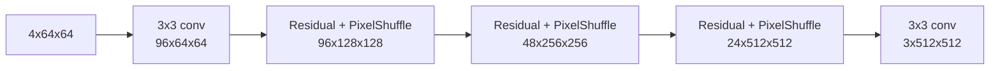

# 20 - Residual Variational Autoencoder

## Purpose

The residual VAE compresses the missing HR correction rather than the complete satellite image.

\[
r_{\text{target}}=x_{\text{HR}}-x_{\text{base}}.
\]

For a 512x512 target, the small preset maps:

```text
residual image: B x 3 x 512 x 512
latent mean:    B x 4 x 64 x 64
latent logvar:  B x 4 x 64 x 64
sampled latent: B x 4 x 64 x 64
decoded result: B x 3 x 512 x 512
```

The 8x spatial compression changes 786,432 image values into 16,384 latent values per sample.

## Encoder

With small-preset base width \(C=24\):

```text
3x512x512
-> Conv 3x3:       24x512x512
-> ResidualBlock:  24x512x512
-> Conv s2:        48x256x256
-> ResidualBlock:  48x256x256
-> Conv s2:        96x128x128
-> ResidualBlock:  96x128x128
-> Conv s2:        96x64x64
-> moments 1x1:     8x64x64
```

The eight moment channels split into:

\[
\mu,\log\sigma^2\in\mathbb{R}^{B\times4\times64\times64}.
\]

## Reparameterization

Direct sampling from \(\mathcal N(\mu,\sigma^2)\) would block ordinary backpropagation. The VAE
uses:

\[
\epsilon\sim\mathcal N(0,I),
\]

\[
z=\mu+\exp\left(\frac{1}{2}\log\sigma^2\right)\odot\epsilon.
\]

Randomness is isolated in \(\epsilon\), while \(\mu\) and \(\log\sigma^2\) remain differentiable.
Log variance is clamped to \([-20,10]\) for numerical safety.

## Decoder



At each upsampling stage:

\[
F_{2H,2W}
=
\operatorname{PixelShuffle}_2
\left(
\operatorname{Conv}_{3\times3}(R(F_{H,W}))
\right).
\]

The VAE decoder is used to learn a residual latent space during its own stage. The final
GeoDiff-GAN image is produced by the separate GeoMapper and dual-head SR decoder.

## Probabilistic Objective

The posterior is:

\[
q_\phi(z|r)=\mathcal N(\mu_\phi(r),\operatorname{diag}(\sigma_\phi^2(r))).
\]

The prior is:

\[
p(z)=\mathcal N(0,I).
\]

The KL divergence is:

\[
\mathcal L_{\text{KL}}
=
-\frac12
\mathbb E
\left[
1+\log\sigma^2-\mu^2-\exp(\log\sigma^2)
\right].
\]

Reconstruction uses:

\[
\hat r=G_\psi(z),
\]

\[
\mathcal L_{\text{VAE}}
=
\mathcal L_{\text{Charb}}(\hat r,r)
+\lambda_{\text{KL}}\mathcal L_{\text{KL}}.
\]

The KL weight must be controlled. Too large causes posterior collapse; too small produces a latent
distribution that diffusion cannot model smoothly.

## Why Residual Latents?

The base already contains low-frequency scene content. Modeling only its error:

- lowers latent dynamic range;
- focuses diffusion capacity on ambiguity;
- reduces pressure to regenerate radiometry;
- makes evidence gating meaningful;
- provides a safer decomposition between observation and prior.

## Failure Modes

| Symptom | Interpretation |
|---|---|
| decoded residual is nearly zero | posterior/decoder collapse |
| KL rapidly approaches zero | latent ignored |
| KL becomes very large | posterior far from Gaussian prior |
| checkerboard reconstruction | PixelShuffle/decoder artifact |
| latent scale differs greatly across splits | unstable latent distribution |
| VAE reconstructs low frequencies strongly | base/residual decomposition is weak |

## Required Diagnostics

Measure:

```text
mu mean/std
logvar mean/range
sampled latent mean/std
KL per latent element
residual reconstruction L1
decoded low-frequency fraction
latent channel covariance
```

## Implementation

See [`models/vae.py`](../src/geodiff_gan/models/vae.py).

