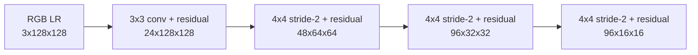

# 21 - Multi-Scale LR Feature Encoder

## Purpose

The LR encoder converts the observed LR image into a spatial feature pyramid. These features:

- condition latent diffusion;
- provide evidence to the GeoMapper;
- enter every SR decoder stage as skip features;
- preserve spatial alignment with the measurement.

For the small preset:

| Name | Shape |
|---|---|
| input | \(B\times3\times128\times128\) |
| `f128` | \(B\times24\times128\times128\) |
| `f64` | \(B\times48\times64\times64\) |
| `f32` | \(B\times96\times32\times32\) |
| `f16` | \(B\times96\times16\times16\) |

## Architecture



Each residual block computes:

\[
R(F)
=
F+
\operatorname{Conv}_2
\left(
\operatorname{SiLU}
\left(
\operatorname{GN}_2
\left(
\operatorname{Conv}_1(
\operatorname{SiLU}(\operatorname{GN}_1(F)))
\right)
\right)
\right).
\]

## Receptive Field and Scale

Fine features retain precise LR coordinates. Deeper features trade resolution for context:

- `f128`: edges, color transitions, local texture;
- `f64`: neighborhoods and intermediate structures;
- `f32`: wider urban/agricultural patterns;
- `f16`: regional context and coarse layout.

The encoder never increases spatial resolution. It extracts evidence only from pixels that were
actually observed.

## Module Connections

### Diffusion

`f64` is bilinearly aligned with the 64x64 latent and concatenated:

\[
u_0
=
\operatorname{Conv}
\left(
[z_t;\operatorname{Resize}(f_{64})]
\right).
\]

### GeoMapper

The denoised latent and `f64` are concatenated:

\[
m_0
=
\operatorname{Conv}
\left(
[\hat z_0;f_{64}]
\right).
\]

### Decoder skips

The decoder uses:

```text
64 stage  <- f64
128 stage <- f128
256 stage <- resized f128
512 stage <- resized f128
```

The 256 and 512 skip tensors contain interpolated LR evidence, not newly observed high-resolution
detail.

## Spatial Conservation

Because convolution and interpolation preserve grid correspondence, each feature location remains
tied to an LR neighborhood. This is one reason the architecture is safer than an unconditional
GAN decoder.

However, spatial alignment is only approximate near:

- patch boundaries;
- padded regions;
- resampling kernels;
- geometric misregistration between HR and LR pairs.

## How to Read Feature Mosaics

Each panel tile is one channel, independently normalized for display. It is not an RGB image.

Healthy features:

- differ across channels;
- respond to roads, boundaries, fields, water, and dense areas;
- retain coherent spatial patterns;
- have finite, nonzero variance.

Collapsed features are constant or nearly identical across channels. Exploding features show
rapidly increasing standard deviation with depth.

## Failure Modes

| Symptom | Likely issue |
|---|---|
| all feature channels look alike | representation collapse |
| `f16` loses all scene structure | excessive downsampling or weak training |
| decoder ignores skips | generated texture becomes poorly aligned |
| strong border activations | padding or invalid-patch contamination |
| validation features differ greatly from training | geographic/domain shift |

## Implementation

See `LREncoder` in [`models/generator.py`](../src/geodiff_gan/models/generator.py).

