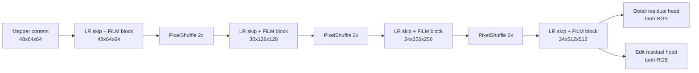

# 24 - Dual-Head FiLM SR Decoder

## Purpose

The decoder converts GeoMapper content and styles into two different RGB residuals:

1. **detail head:** evidence-constrained high-frequency reconstruction;
2. **edit head:** full-band prompt-guided synthetic modification.

The heads share the complete spatial backbone but have independent output convolutions.

## Small-Preset Stage Shapes

Decoder channels are `[48, 36, 24, 24]`.

```text
mapper content: B x 48 x 64 x 64
stage 0:        B x 48 x 64 x 64
stage 1:        B x 36 x 128 x 128
stage 2:        B x 24 x 256 x 256
stage 3:        B x 24 x 512 x 512
detail head:    B x 3 x 512 x 512
edit head:      B x 3 x 512 x 512
```

## Architecture



## Upsampling

At stages 1-3:

\[
F_l
=
\operatorname{PS}_2
\left(
\operatorname{Conv}_{3\times3}(F_{l-1})
\right).
\]

The convolution emits \(4C_l\) channels, which PixelShuffle rearranges into \(C_l\) channels at
twice the height and width.

## LR Skip Fusion

The source skips are:

```text
64 stage  <- f64
128 stage <- f128
256 stage <- resized f128
512 stage <- resized f128
```

At each stage:

\[
F_l
\leftarrow
F_l+
W_l\operatorname{Resize}(f_l).
\]

The \(1\times1\) projection \(W_l\) matches channels. Addition, rather than concatenation, limits
memory and forces the decoder to remain anchored to LR features.

## FiLM Residual Block

For stage style \(s_l\), a linear layer creates four vectors:

\[
[\gamma_1,\beta_1,\gamma_2,\beta_2]
=
W_ss_l.
\]

The first modulation is:

\[
H_1
=
\operatorname{Conv}_1
\left(
\operatorname{SiLU}
\left[
\operatorname{LN}(F)(1+\gamma_1)+\beta_1
\right]
\right).
\]

The second is:

\[
H_2
=
\operatorname{Conv}_2
\left(
\operatorname{SiLU}
\left[
\operatorname{LN}(H_1)(1+\gamma_2)+\beta_2
\right]
\right).
\]

The block output is:

\[
F'=F+H_2.
\]

FiLM changes channel behavior without changing spatial coordinates.

## Two Output Heads

Both heads use:

\[
r
=
\tanh
\left(
\operatorname{Conv}_{3\times3}
\left[
\operatorname{LReLU}
\left(
\operatorname{Conv}_{3\times3}(F_3)
\right)
\right]
\right).
\]

Thus residual values lie in \([-1,1]\).

The heads have independent weights:

\[
r_d=G_d(F_3),
\qquad
r_e=G_e(F_3).
\]

## SR Detail Path

The detail residual is high-pass filtered:

\[
\bar r_d
=
r_d-\operatorname{AvgPool}_{5\times5}(r_d).
\]

It is then multiplied by effective evidence:

\[
r_{\text{SR}}
=
C_{\text{eff}}\odot\bar r_d.
\]

The SR anchor is:

\[
x_{\text{anchor}}
=
\operatorname{clip}(x_{\text{base}}+r_{\text{SR}},0,1).
\]

This prevents the detail head from changing broad radiometry freely.

## Edit Path

The edit residual is:

\[
r_{\text{edit}}
=
P\odot r_e.
\]

In edit mode:

\[
r_{\text{total}}
=
r_{\text{SR}}+r_{\text{edit}}.
\]

Because \(r_e\) is not high-pass filtered, it may change color, brightness, and large structures.
This is why edit results are synthetic.

## Why Two Heads?

A single head would receive conflicting objectives:

- reconstruct evidence-constrained missing detail;
- create prompt-driven counterfactual content.

Separate heads allow shared scene features while preserving different output authorities.

## Periodic Artifact Risk

Three PixelShuffle stages can create repeated phase/grid patterns if channel groups learn unequal
statistics. Inspect decoder FFTs for lattice peaks. Possible remedies include:

- resize-convolution;
- ICNR initialization;
- anti-aliased upsampling;
- phase-consistency regularization;
- spectral artifact penalties.

## Failure Modes

| Symptom | Cause |
|---|---|
| detail head changes brightness | high-pass leakage or low-frequency residual |
| edit appears in SR | nonzero edit permission or mode bug |
| grid texture | PixelShuffle phase artifacts |
| output remains base-like | evidence gate too low or decoder collapse |
| raw residual extreme but gated residual tiny | decoder/gate co-adaptation |

## Implementation

See `ResidualSRDecoder` in
[`models/generator.py`](../src/geodiff_gan/models/generator.py) and `high_pass` in
[`models/blocks.py`](../src/geodiff_gan/models/blocks.py).

