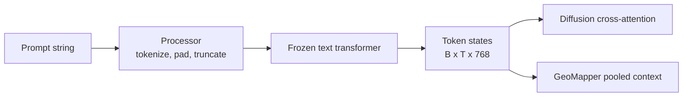

# 26 - Text and Prompt Conditioning

## Purpose

Text conditioning supplies semantic context about visible land cover, objects, density, terrain,
and texture. It is optional in SR mode and stronger only in explicitly synthetic edit mode.

The captioning model is not part of SR training. Qwen produces captions offline; a frozen
SigLIP-compatible encoder converts them into token embeddings during training and inference.

## Text Encoder

For prompts \(p_1,\ldots,p_B\), the frozen encoder returns:

\[
C=E_{\text{text}}(p)
\in
\mathbb R^{B\times T\times768}.
\]

The small, medium, and large presets retain 768-dimensional context. The debug/hash encoder exists
only for dependency-free tests and ablations.

## Frozen SigLIP Path



Freezing avoids:

- destabilizing the pretrained language representation;
- loading caption-generation Qwen during SR training;
- excessive memory and optimizer state;
- overfitting language embeddings to a small satellite dataset.

## Null Prompt

A null prompt still produces the encoder's representation for empty text unless conditioning is
explicitly disabled. The architecture also supports zeroing context for ablations:

\[
C'=0.
\]

In the supplied no-text diagnostic, the context tensor was all zeros, proving that the image was
generated without semantic prompt information.

## Prompt Augmentation

Training samples prompt kinds with configured probabilities:

```text
40% null
20% paraphrased
10% mismatched/counterfactual
remaining original
```

### Null prompts

Teach the model to perform ordinary SR without requiring language.

### Paraphrases

Teach robustness to wording variation:

\[
p'=\text{"Overhead satellite view containing: "}+p.
\]

### Mismatched prompts

Teach separation between reconstruction and semantic editing. In edit training, counterfactual
examples are excluded from paired reconstruction loss because their desired output is not the
observed HR target.

## Diffusion Cross-Attention

At 32x32, 16x16, and middle resolutions:

\[
Q=W_QF,\qquad K=W_KC,\qquad V=W_VC,
\]

\[
\operatorname{Attention}(F,C)
=
\operatorname{softmax}\left(\frac{QK^T}{\sqrt d}\right)V.
\]

This allows each spatial feature to retrieve relevant prompt tokens.

## GeoMapper Conditioning

Token states are mean pooled:

\[
\bar c=\frac1T\sum_i C_i.
\]

The projected context is spatially injected through confidence/permission:

\[
\widetilde M=M+W_c\bar c\odot S_p.
\]

Thus the same prompt has weak evidence-gated authority in SR and stronger permission-gated
authority in edit mode.

## Classifier-Free Guidance

At diffusion sampling:

\[
\hat v
=
\hat v_{\varnothing}
+w(\hat v_p-\hat v_{\varnothing}).
\]

Guidance scale \(w\) controls semantic strength. It should remain close to 1 for scientific SR.

## Image-Text Alignment Loss

When the pretrained model exposes image and text feature methods:

\[
i
=
\frac{E_I(\hat x)}{\|E_I(\hat x)\|_2},
\qquad
t
=
\frac{E_T(p)}{\|E_T(p)\|_2},
\]

\[
\mathcal L_{\text{align}}
=
1-i^Tt.
\]

The image is resized and normalized according to the frozen vision encoder.

Alignment loss rewards semantic agreement, not geographic truth. It must not dominate SR
reconstruction losses.

## Coordinate and Place-Name Removal

Captions should not contain coordinates or place names. Otherwise the model may:

- memorize geography;
- leak train/test identity;
- learn location-specific appearance shortcuts;
- make evaluation scientifically invalid.

## Failure Modes

| Symptom | Meaning |
|---|---|
| SR changes strongly with prompt | prompt authority too high |
| edit ignores prompt | context or permission path unused |
| coordinates improve validation | geographic leakage |
| null prompt degrades sharply | model over-dependent on text |
| high alignment, poor LR consistency | semantic hallucination |
| mismatch prompt reproduces target | edit mechanism ignored |

## Implementation

See [`text.py`](../src/geodiff_gan/text.py), cross-attention in
[`models/blocks.py`](../src/geodiff_gan/models/blocks.py), and GeoMapper in
[`models/generator.py`](../src/geodiff_gan/models/generator.py).

