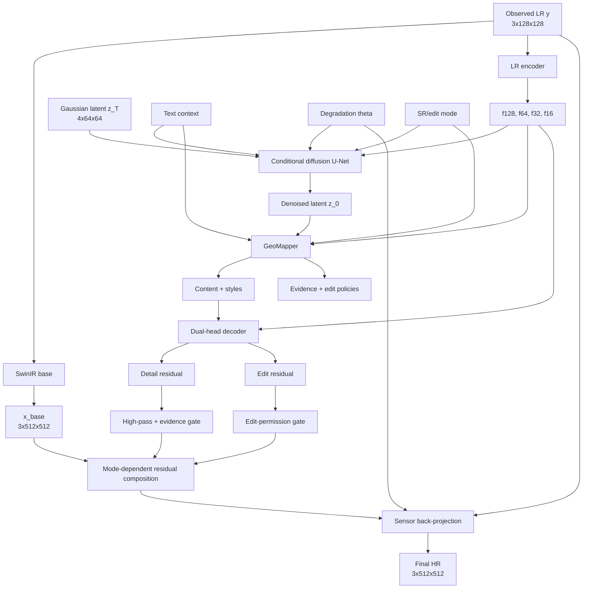

# 28 - Complete GeoDiff-GAN System Integration

## Purpose

This chapter joins all modules into one executable mathematical pipeline and explains which
parameters are trained at each stage.

## Complete Forward Graph



## Training-Time Residual Target

For paired HR target \(x\):

\[
x_b=B_\phi(y),
\]

\[
r=x-x_b.
\]

The VAE creates:

\[
z_0\sim q_\psi(z|r).
\]

Diffusion learns the conditional distribution of these residual latents.

## Inference-Time Latent Generation

Start with:

\[
z_T\sim\mathcal N(0,I).
\]

DDIM sampling gives:

\[
\hat z_0
=
\operatorname{DDIM}
\left(
z_T;y,c,\theta,m
\right).
\]

The LR encoder supplies spatial evidence:

\[
\{f_{128},f_{64},f_{32},f_{16}\}=E_{LR}(y).
\]

GeoMapper produces:

\[
(M,\{s_l\},C,P)
=
G_M(\hat z_0,f_{64},c,m).
\]

The decoder produces:

\[
(r_d,r_e)
=
G_D(M,\{s_l\},\{f_l\}).
\]

## SR Composition

\[
\bar r_d=H(r_d),
\]

\[
r_{SR}=C_{\text{eff}}\odot\bar r_d,
\]

\[
x_0^{SR}
=
\operatorname{clip}(x_b+r_{SR},0,1).
\]

Three strong back-projection steps yield:

\[
\hat x^{SR}
=
\operatorname{BP}_{K=3,\alpha=0.5}
\left(
x_0^{SR},y_c,\theta
\right).
\]

## Edit Composition

\[
r_{edit}=P\odot r_e,
\]

\[
x_0^{edit}
=
\operatorname{clip}
\left(
x_b+r_{SR}+r_{edit},
0,1
\right).
\]

One weak projection step yields:

\[
\hat x^{edit}
=
\operatorname{BP}_{K=1,\alpha=0.15}
\left(
x_0^{edit},y_c,\theta
\right).
\]

Metadata records:

```text
synthetic_edit = true
```

## Training Curriculum

### Stage 1: Base

Train:

```text
SwinIR base
```

Objective:

\[
\mathcal L_1
=
\mathcal L_{\text{Charb}}
+\lambda_S\mathcal L_{\text{SSIM}}
+\lambda_G\mathcal L_{\text{grad}}
+\lambda_C\mathcal L_{\text{cons}}.
\]

### Stage 2: Residual VAE and decoder preparation

Train residual representation and reconstruction path without adversarial pressure:

\[
\mathcal L_2
=
\mathcal L_{\text{res-rec}}
+\lambda_{KL}\mathcal L_{KL}
+\lambda_E\mathcal L_{\text{evidence}}.
\]

### Stage 3: Diffusion

Freeze the output decoder and train:

\[
\mathcal L_3
=
w_{\text{SNR}}
\|\hat v-v\|_2^2.
\]

### Stage 4: Joint

Fine-tune diffusion, mapper, decoder, and relevant reconstruction modules:

\[
\mathcal L_4
=
1.0\mathcal L_{\text{Charb}}
+1.0\mathcal L_{\text{cons}}
+0.2\mathcal L_{\text{SSIM}}
+0.1\mathcal L_{\text{LPIPS}}
+0.05\mathcal L_{\text{wavelet}}
+0.01\mathcal L_{\text{GAN}}
+\lambda_E\mathcal L_{\text{evidence}}.
\]

### Stage 5: Edit

Train prompt adapters/policies using counterfactual prompts:

\[
\mathcal L_5
=
\mathcal L_4
+0.05\mathcal L_{\text{align}}
+\mathcal L_{\text{soft-consistency}}.
\]

## Module Ownership

| Module | Primary responsibility | Train-time only? |
|---|---|---|
| SwinIR base | conservative reconstruction | No |
| Residual VAE | learn residual latent space | Encoder primarily training-time |
| LR encoder | spatial measurement features | No |
| Diffusion U-Net | stochastic residual prior | No |
| GeoMapper | content, styles, dual policies | No |
| Dual-head decoder | detail/edit residuals | No |
| Multi-scale PatchGAN | conditional spatial realism | Yes |
| Wavelet discriminator | high-frequency realism | Yes |
| Sensor back-projection | LR consistency | No |
| Text encoder | semantic conditioning | No, but frozen |
| Uncertainty abstention | reliability-aware blending | Evaluation/inference |

## Spatial-Conservation Mechanisms

No single module guarantees fidelity. Conservation is distributed across:

1. deterministic base residual learning;
2. LR feature conditioning in diffusion;
3. LR skips at every decoder stage;
4. high-pass filtering of SR residuals;
5. evidence confidence gating;
6. zero edit permission in SR mode;
7. degradation-consistency loss;
8. iterative sensor back-projection;
9. uncertainty abstention toward the base.

## Complete Shape Trace for Small Preset

```text
LR                              3 x 128 x 128
base HR                         3 x 512 x 512
f128                           24 x 128 x 128
f64                            48 x 64 x 64
f32                            96 x 32 x 32
f16                            96 x 16 x 16
diffusion latent                4 x 64 x 64
mapper content                 48 x 64 x 64
mapper styles                  4 x 96
evidence/edit policies          1 x 64 x 64
decoder stage 0                48 x 64 x 64
decoder stage 1                36 x 128 x 128
decoder stage 2                24 x 256 x 256
decoder stage 3                24 x 512 x 512
detail/edit residuals           3 x 512 x 512
final HR                        3 x 512 x 512
```

Batch dimension \(B\) is omitted.

## End-to-End Scientific Interpretation

The deterministic branch estimates what is strongly constrained by LR evidence. The diffusion
branch samples plausible missing residual structure. GeoMapper determines how that structure
should enter the spatial decoder and how much authority it receives. The dual-head decoder
separates reconstruction detail from synthetic editing. Discriminators improve realism only during
training. Back-projection and abstention constrain the final output.

The system estimates:

\[
\hat x
\sim
p(x\mid y,c,\theta,m),
\]

not:

\[
\hat x=x_{\text{unobserved true pixels}}.
\]

## Module-by-Module Debug Order

1. validate HR/LR pairs and degradation;
2. verify base improves bicubic;
3. verify residual VAE reconstruction and KL;
4. verify LR feature variance and spatial structure;
5. verify diffusion denoising trajectory;
6. verify GeoMapper confidence and permission;
7. inspect raw decoder residuals and FFT;
8. inspect discriminator balance;
9. verify projection reduces LR error;
10. verify uncertainty correlates with target error.

## Implementation

The main integration is in [`models/system.py`](../src/geodiff_gan/models/system.py). Read the
module chapters in order:

1. [Deterministic base](19_swinir_deterministic_base.md)
2. [Residual VAE](20_residual_vae.md)
3. [LR feature encoder](21_lr_feature_encoder.md)
4. [Conditional diffusion](22_conditional_latent_diffusion.md)
5. [GeoMapper](23_geomapper_dual_policy.md)
6. [Dual-head decoder](24_dual_head_sr_decoder.md)
7. [Dual discriminators](25_dual_discriminator_gan.md)
8. [Text conditioning](26_text_prompt_conditioning.md)
9. [Uncertainty and abstention](27_uncertainty_and_abstention.md)
10. [Sensor back-projection](18_sensor_back_projection.md)

