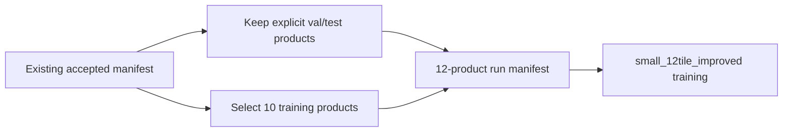

# 29 - Twelve-Tile Improved Small-Model Run

## Purpose

This chapter records the changes made after the six-tile diagnostic in
[Chapter 17](17_small_six_tile_diagnostic_analysis.md). It defines the next controlled experiment:

```text
model family:       small
experiment profile: 12tile_improved
total SAFE products: 12
training products:  10
validation products: 1 explicit prefix
test products:       1 explicit prefix
decoder upsampling: resize-convolution
checkpoint policy:  best + latest only
early stopping:      enabled
```

The objective is not merely to train longer. Each change targets a measured failure:

| Six-tile observation | Targeted change |
|---|---|
| FFT lattice peaks in residuals | Replace decoder PixelShuffle with resize-convolution |
| Evidence confidence nearly uniform | Add spatial confidence-selectivity supervision |
| Weak edge and wavelet amplitude | Add gradient loss to VAE/joint paths and strengthen detail weights |
| Projection performs a large correction | Expose 0/1/3-step projection ablations |
| Last epoch may not be best | Validation-selected best checkpoint |
| Unnecessary storage growth | Retain only best and latest checkpoints |
| Fixed epoch counts can overfit | Validation-based early stopping |
| Six products provide limited diversity | Increase to twelve geographically isolated products |

## 1. Important Compatibility Rule

The improved decoder changes the upsampling convolution shapes. Old PixelShuffle decoder
checkpoints are therefore not architecture-compatible with the new decoder.

The Kaggle notebook uses a separate directory:

```text
/kaggle/working/geodiff-gan-output/runs/small_12tile_improved/
```

This prevents automatic resume from loading a six-tile checkpoint. Previous patches, manifests,
checkpoints, figures, and training histories are not deleted.

The twelve-tile experiment starts a new five-stage model curriculum. Existing extracted patch files
are reused through a new manifest, so Sentinel products do not need to be extracted again.

## 2. Exact Twelve-Product Manifest

The preparation command's `--max-products` option limits only newly discovered unmatched products.
It cannot reduce an existing manifest that already contains more products.

The notebook now creates:

```text
manifest_12tile_improved.jsonl
```

It:

1. retains every explicitly assigned validation/test product;
2. selects enough sorted training products to reach twelve total products;
3. retains every accepted patch belonging to those products;
4. references the existing `.npz` patch files;
5. does not copy, move, or regenerate accepted patches.

With one validation and one test product, ten training products are selected.



The existing tile-isolation check still applies. If validation and test products belong to a tile
already used by training, preparation must stop rather than permit geographic leakage.

## 3. Artifact-Resistant Decoder Upsampling

### Previous decoder

Each stage used:

\[
F_{l+1}
=
\operatorname{PixelShuffle}_2
\left(
\operatorname{Conv}_{3\times3}(F_l)
\right).
\]

The convolution generated four channel phases for PixelShuffle. Unequal phase statistics can
produce periodic grids, which were visible as repeated peaks in the six-tile Fourier diagnostic.

### Improved decoder

The new experiment uses:

\[
\widetilde F_l
=
\operatorname{BilinearUpsample}_{2,\text{antialias}}(F_l),
\]

\[
F_{l+1}
=
\operatorname{Conv}_{3\times3}(\widetilde F_l).
\]

Configuration:

```yaml
model:
  decoder_upsample_mode: resize_conv
```

The complete architecture, stage resolutions, LR skip connections, FiLM blocks, detail head, and
edit head remain unchanged. Only the three decoder upsampling operators change.

### Parameter effect

| Small variant | Core parameters | Decoder parameters |
|---|---:|---:|
| Original PixelShuffle | 12,139,822 | 288,882 |
| Improved resize-convolution | 12,054,034 | 203,094 |

Resize-convolution reduces the decoder by 85,788 parameters because it does not generate four
phase-channel groups before rearrangement.

### Expected effect

- fewer checkerboard/lattice artifacts;
- smoother frequency response;
- less need for the evidence gate to suppress unsafe residuals;
- slightly lower memory and parameter cost.

It may initially produce softer detail. Gradient and wavelet supervision are strengthened to
counter that tendency without substantially increasing GAN pressure.

## 4. Improved Evidence-Confidence Calibration

The previous calibration loss matched confidence magnitude to:

\[
C^*(x,y)=\exp(-e(x,y)/\tau),
\]

where \(e\) is local ungated reconstruction error.

This allowed a nearly uniform confidence map to achieve a tolerable loss when most generated
details were inaccurate.

The improved loss contains two terms:

\[
\mathcal L_{\text{evidence}}
=
\operatorname{SmoothL1}(C,C^*)
+\lambda_{\text{sel}}
\left(1-\operatorname{corr}(C-\bar C,C^*-\bar C^*)\right).
\]

Configuration:

```yaml
training:
  evidence_selectivity_weight: 0.25
  loss_weights:
    evidence_calibration: 0.15
```

The first term calibrates absolute confidence. The second trains spatial ranking: locations with
lower ungated error should receive higher confidence than less accurate locations.

This does not force the gate open. A generated residual that is wrong everywhere may still receive
low confidence. The change specifically discourages the observed spatially constant shortcut.

## 5. Stronger Controlled Detail Supervision

The six-tile output retained only approximately:

```text
33.3% of target edge magnitude
37.8% of LH detail amplitude
32.4% of HL detail amplitude
30.7% of HH detail amplitude
```

The improved profile uses:

| Loss | Original | Improved |
|---|---:|---:|
| Gradient | 0.10 | 0.15 |
| Wavelet | 0.05 | 0.10 |
| Evidence calibration | 0.10 | 0.15 |
| Adversarial | 0.01 | 0.01 |

Gradient loss is now calculated in:

- deterministic base training;
- residual VAE/decoder preparation;
- joint reconstruction;
- matched-prompt edit reconstruction.

Previously, the configured gradient weight did not affect the VAE or joint reconstruction path.

The adversarial weight remains `0.01`. Increasing it before removing periodic artifacts could
reward sharper but incorrect texture.

## 6. Early Stopping

The improved profile sets:

```yaml
training:
  early_stopping_patience: 5
  early_stopping_min_epochs: 8
  early_stopping_min_delta: 0.0001
  checkpoint_metric: val_l1
  checkpoint_mode: min
```

Training stops when:

1. at least eight epochs have completed;
2. the monitored validation metric has failed to improve by at least `0.0001`;
3. this occurs for five consecutive validation checks.

Normal reconstruction stages monitor validation L1. Diffusion-only training does not produce a
direct HR reconstruction metric, so it falls back to validation total loss.

Early-stopping state is stored inside the latest checkpoint. If Kaggle interrupts and the stage
resumes, the best value and bad-epoch count are restored.

Early stopping is a maximum-budget controller, not a guarantee of optimality. Validation must
contain enough patches and representative geography. The non-development notebook uses a
validation cap of 64 batches by default; final model selection should later be confirmed on the
complete validation set.

## 7. Best and Latest Checkpoints

Each stage now retains:

```text
<stage>_best.pt
<stage>_epoch_XXXX.pt
```

`best.pt` is selected by the validation metric. The epoch-named file is the latest resumable
checkpoint. Older epoch checkpoint files are deleted only after the new latest checkpoint has been
written successfully.

The following files are never pruned:

- training history;
- training curves;
- latest metric JSON;
- resolved configuration;
- diagnostics;
- manifests and patches.

The next training stage is initialized from the previous stage's best checkpoint, not simply its
last epoch. Auto-resume within an interrupted stage still uses the latest checkpoint.

## 8. Training Budget

The notebook uses these maximum epochs:

| Stage | Maximum epochs | Early stopping |
|---|---:|---|
| Base | 30 | after minimum epoch 8 |
| VAE/decoder | 30 | after minimum epoch 8 |
| Diffusion | 100 | after minimum epoch 8 |
| Joint | 40 | after minimum epoch 8 |
| Edit | 20 | after minimum epoch 8 |

These are ceilings. A stage can stop earlier after validation stagnation.

For the first no-text reconstruction experiment, run:

```python
STAGES_TO_RUN = ["base", "vae", "diffusion", "joint"]
```

Do not train edit mode until meaningful captions and edit-specific supervision are available.

## 9. Projection Ablation Controls

Evaluation and debug commands now accept:

```text
--back-projection-steps 0
--back-projection-steps 1
--back-projection-steps 3
```

Example:

```bash
python -m geodiff_gan.cli.evaluate \
  --config /kaggle/working/geodiff-gan-output/configs/small_12tile_improved/joint.yaml \
  --checkpoint /kaggle/working/geodiff-gan-output/runs/small_12tile_improved/joint/joint_best.pt \
  --output /kaggle/working/geodiff-gan-output/evaluation/projection_0 \
  --split val \
  --samples 2 \
  --steps 10 \
  --back-projection-steps 0 \
  --no-text
```

Repeat with one and three steps.

Interpretation:

| Result | Meaning |
|---|---|
| HR quality good at 0 steps | learned generator is strong |
| large gain from 0 to 1 | projection usefully corrects modest inconsistency |
| model fails at 0 but looks good at 3 | projection is compensating for a weak generator |
| LR error decreases while HR metrics decrease | consistency correction is oversmoothing detail |

## 10. What Improvement Should Be Expected?

Twelve products provide twice the product count of the previous experiment, but still represent a
small research dataset. Expected improvements are:

- lower validation overfitting than the six-tile run;
- fewer periodic decoder artifacts;
- stronger edge/wavelet response;
- more spatial variation in confidence;
- reduced dependence on back-projection;
- better checkpoint selection.

Results are not guaranteed to improve. The experiment can still fail if:

- the ten training products are geographically or semantically similar;
- validation consists of only one unusual scene;
- captions/text loading introduces irrelevant conditioning;
- the decoder remains undertrained;
- synthetic degradation does not match the target task;
- confidence calibration remains dominated by globally inaccurate residuals.

## 11. Required Comparisons

Compare the new best joint checkpoint with the previous six-tile checkpoint using the same
validation protocol:

| Measurement | Desired direction |
|---|---|
| Output target L1 | decrease |
| PSNR / SSIM | increase |
| Edge F1 | increase |
| LH/HL/HH output-to-target amplitude ratio | move closer to 1 |
| LR re-degradation L1 | remain low |
| Evidence confidence-error correlation | become more negative |
| Confidence spatial standard deviation | increase only if calibration improves |
| FFT lattice peaks | decrease |
| Projection update absolute mean | decrease |
| Output clipping | remain near zero |

Do not interpret a higher confidence mean alone as improvement. Confidence is useful only when it
correlates with lower error.

## 12. Recommended Run Procedure

1. Restart the Kaggle kernel after pulling the updated repository.
2. Run installation and verify `configs/small_12tile_improved.yaml` exists.
3. Keep `FAST_DEV_RUN = False`.
4. Keep `MODEL_SIZE = "small"`.
5. Keep `EXPERIMENT_PROFILE = "12tile_improved"`.
6. Confirm the generated training manifest reports exactly twelve source products.
7. Confirm train, validation, and test MGRS tile sets do not overlap.
8. Train base, VAE, diffusion, and joint stages.
9. Evaluate `joint_best.pt`, not only the latest checkpoint.
10. Run 0/1/3-step projection ablations.
11. Export diagnostics for at least five validation patches representing different textures.
12. Compare aggregate metrics and diagnostic distributions against the six-tile run.

## 13. Verification Completed

The implementation was checked with:

```text
20 core tests passed
10 training tests passed
3 parameter-audit tests passed
38 repository tests passed in total
notebook JSON validation passed
improved parameter verification passed
```

The improved model contains:

```text
12,054,034 core parameters
979,492 training-only discriminator parameters
11,535,616 parameters optimized during joint training
```

## Final Research Statement

The new experiment tests whether the previous under-reconstruction was caused by limited data,
periodic decoder upsampling, weak detail supervision, and a spatially uniform confidence policy.
Because several mechanisms change together, the final paper must still run separate ablations for:

1. PixelShuffle versus resize-convolution;
2. six versus twelve products;
3. original versus selective confidence calibration;
4. original versus strengthened detail losses;
5. zero, one, and three back-projection steps.

Without those ablations, an improved result can justify the new training recipe but cannot identify
which individual change caused the gain.
