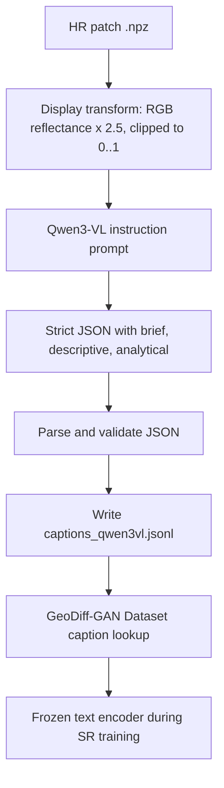

# 30. Caption Generation Pipeline for GeoDiff-GAN

## Why captions are generated offline

GeoDiff-GAN does not fine-tune the captioner. Captions are generated once, saved as JSONL,
and then encoded during SR training with the frozen text encoder. This keeps SR training
lighter and avoids mixing caption-model memory usage with diffusion-GAN training.

## Current research direction

Recent remote-sensing captioning work has moved from small encoder-decoder captioners toward
vision-language models, instruction-tuned remote-sensing MLLMs, and structured or modality-aware
prompting.

Key lessons used here:

- Large RS image-text datasets such as RS5M show that remote-sensing VLMs benefit from
  domain-specific image-text pairs rather than generic web captions only.
- RSGPT and EarthGPT show the value of instruction-tuned remote-sensing VLMs and detailed
  scene/object descriptions.
- Newer work such as Sentinel2Cap emphasizes human-validated Sentinel-1/Sentinel-2 captions,
  modality-aware prompts, and evaluation of Qwen3-VL-style zero-shot captioners.
- Training-free captioning research also supports retrieval or prompt augmentation, but for this
  thesis pipeline a direct VLM captioner is simpler, reproducible, and easier to audit.

References used for the design:

- RS5M / GeoRSCLIP: large remote-sensing image-text pairs and domain VLM transfer.
- RSGPT: high-quality human-annotated RSICap captions and remote-sensing VLM benchmarking.
- EarthGPT / EarthGPT-X and SkySenseGPT: instruction-tuned RS MLLMs for multi-sensor,
  fine-grained scene understanding.
- Sentinel2Cap: 2026 Sentinel-1/Sentinel-2 captioning benchmark, including zero-shot
  Qwen3-VL-8B-Instruct evaluation and modality-specific contextual prompts.

## Caption variants

Each patch receives three caption variants:

```json
{
  "brief": "short evidence-only phrase",
  "descriptive": "one or two neutral sentences",
  "analytical": {
    "land_cover": ["visible classes"],
    "visible_objects": ["visible objects"],
    "object_density": "sparse | moderate | dense | mixed | unclear",
    "terrain": "flat | hilly | mountainous | coastal | riverine | arid | mixed | unclear",
    "texture": "smooth | fine-grained | coarse | grid-like | linear | mixed | unclear",
    "spatial_layout": "dominant spatial arrangement",
    "uncertainty": "low | medium | high"
  }
}
```

The top-level `caption` field is also saved for backward compatibility. By default it uses the
`descriptive` caption because it gives the SR model more useful conditioning than a very short
label while remaining less verbose than the analytical JSON.

## Algorithm



## Safety rules

The caption prompt explicitly forbids:

- Coordinates and place names.
- Country, city, or ownership inference.
- People, events, or time inference.
- Sensor metadata hallucination.

The captioner should only describe visible evidence. If uncertain, it should say `unclear` or
`possibly`.

## Codebase support

The codebase now supports:

- `geodiff_gan.cli.caption_qwen` generating all three caption variants.
- Relative patch paths from Colab datasets.
- Backward-compatible caption JSONL with a top-level `caption`.
- `data.caption_field` for selecting `caption`, `brief`, `descriptive`, or `analytical`.

Recommended training setting:

```yaml
data:
  captions: /kaggle/input/geodiff-hr-dataset/captions_qwen3vl.jsonl
  caption_field: caption
  caption_sampling: fixed
  train_degradation_sampling: random
```

Use `caption_field: brief` for ablations where you want weaker text conditioning.
Use `caption_field: analytical` for highly structured prompt-conditioning experiments.

## Random captions and random LR per epoch

Training can now sample a different caption variant each time a training item is loaded:

```yaml
data:
  caption_sampling: random
  random_caption_fields: [brief, descriptive, analytical]
```

This applies to the training split only. Evaluation, baselines, and debug runs stay fixed so
metrics remain reproducible.

Training LR degradation is controlled separately:

```yaml
data:
  train_degradation_sampling: random  # new blur/noise/quantization each training call
```

For strict ablations, use:

```yaml
data:
  caption_sampling: fixed
  caption_field: descriptive
  train_degradation_sampling: fixed
```

`fixed` degradation uses a deterministic seed from the patch path, tile, row, and column. This is
useful for debugging but should not be the default final training setup.
