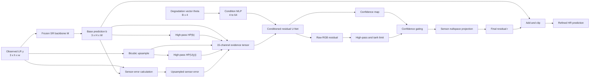

# 32. Sensor-Nullspace High-Frequency Refiner

## 1. Purpose of this chapter

This chapter explains the new **Sensor-Nullspace High-Frequency Refiner
(SN-HFR)** in enough detail to:

1. Understand the research problem it addresses.
2. Reproduce every tensor transformation.
3. Explain the method in a thesis defense or viva.
4. Train it without modifying a published super-resolution backbone.
5. Diagnose whether it improves real detail or merely creates texture.
6. Design fair ablation studies and make defensible research claims.

SN-HFR is a model-agnostic wrapper around a frozen satellite
super-resolution model. It learns only the high-frequency correction that the
base model missed, estimates where that correction is trustworthy, and
suppresses corrections that would violate the observed low-resolution image.

The method is implemented in:

- [refiner.py](../src/geodiff_gan/benchmark/refiner.py)
- [refiner_runner.py](../src/geodiff_gan/benchmark/refiner_runner.py)
- [benchmark_refiner.py](../src/geodiff_gan/cli/benchmark_refiner.py)

The runnable Kaggle experiment is:

- [GeoDiff_GAN_Kaggle_SN_HFR_Paired_Benchmark.ipynb](../kaggle/GeoDiff_GAN_Kaggle_SN_HFR_Paired_Benchmark.ipynb)

---

## 2. The problem being solved

Let:

- \(x \in [0,1]^{3 \times H \times W}\) be the unknown high-resolution image.
- \(y \in [0,1]^{3 \times h \times w}\) be the observed low-resolution image.
- \(s = H/h = W/w\) be the scale factor.
- \(\mathcal{D}_{\theta}\) be a sensor degradation operator.
- \(n\) be measurement noise.

The observation model is:

\[
y = \mathcal{D}_{\theta}(x) + n
\]

For the main Sentinel-2 experiment:

\[
h=w=128,\qquad H=W=512,\qquad s=4
\]

A pretrained super-resolution model \(M\) predicts:

\[
b = M(y)
\]

where \(b\) is called the **base HR prediction**.

The base model usually reconstructs:

- large land-cover regions,
- broad roads and rivers,
- low-frequency color and reflectance,
- coarse building density,
- major terrain boundaries.

It often under-reconstructs:

- narrow roads,
- roof boundaries,
- field borders,
- small edges,
- fine texture,
- high-frequency directional structure.

The ideal residual is:

\[
r^* = x-b
\]

However, learning all of \(r^*\) is risky. Its low-frequency component can
change radiometry and contradict the LR observation. SN-HFR therefore targets:

\[
h^* = \operatorname{HP}(x-b)
\]

where \(\operatorname{HP}\) is a high-pass operator.

The final prediction is:

\[
\hat{x} = \operatorname{clip}(b+r,0,1)
\]

where \(r\) is a confidence-gated, amplitude-limited, approximately
sensor-nullspace high-frequency residual.

---

## 3. Core research hypothesis

The method tests the following hypothesis:

> A frozen super-resolution backbone can be improved by a small,
> sensor-conditioned network that learns only the missing high-frequency
> residual, while confidence gating and sensor-nullspace projection prevent
> unsupported changes to the observed low-resolution evidence.

This is deliberately different from training a larger replacement model.

The experiment asks:

\[
\text{Does } M(y)+R(y,M(y),\theta) \text{ outperform } M(y)?
\]

The base model, data split, LR input, degradation, and evaluation protocol are
held fixed. The only changed variable is the refiner.

---

## 4. Why use a wrapper instead of changing every backbone?

Published super-resolution repositories use different:

- input sizes,
- scale factors,
- normalization rules,
- architectures,
- losses,
- checkpoint formats,
- inference APIs.

Changing their internal architecture would create three problems:

1. **Architecture fidelity would be lost.** The result would no longer be the
   published model.
2. **Attribution would become unclear.** An improvement could come from any
   internal modification.
3. **Comparison would become unfair.** Different backbones would receive
   different amounts of engineering.

SN-HFR treats each model as a frozen function:

\[
M:y\mapsto b
\]

The original checkpoint is loaded unchanged. The wrapper receives the same LR
input and operates only on the backbone output and sensor evidence.

This permits a paired comparison:

\[
\Delta_i =
\operatorname{metric}(\hat{x}_i,x_i)
-
\operatorname{metric}(b_i,x_i)
\]

for each test patch \(i\).

The scientific question is therefore not:

> Which backbone has the highest score?

It is:

> Does the same SN-HFR principle improve each backbone at its own native
> operating size?

---

## 5. End-to-end architecture



The frozen backbone is not updated. Only the SN-HFR parameters are trained.

---

## 6. Module summary

| Module | Input | Output | Role |
|---|---:|---:|---|
| Frozen backbone | \(3\times h\times w\) | \(3\times H\times W\) | Produces the original SR estimate |
| Sensor operator | HR plus degradation vector | Simulated LR | Tests compatibility with observed LR |
| Evidence builder | LR, base HR, sensor error | \(15\times H\times W\) | Builds complementary spatial evidence |
| Condition MLP | \(4\) degradation values | \(64\) values | Encodes blur/noise/degradation state |
| Conditioned U-Net | 15-channel evidence | 4-channel head | Predicts RGB correction and confidence |
| High-pass limiter | Raw RGB correction | Bounded RGB detail | Removes broad radiometric changes |
| Confidence gate | Detail and gate logit | Gated detail | Allows spatial abstention |
| Nullspace projector | Gated detail | Sensor-safe detail | Suppresses LR-visible residual content |
| Add-and-clip | Base and final residual | Refined HR | Produces the final image |

---

## 7. Input and output sizes

SN-HFR does not force all backbones to use the same native image size.

### 7.1 A 128 to 512 backbone

For a 4x model such as a GeoDiff-GAN variant:

| Tensor | Shape |
|---|---|
| LR input \(y\) | \(B\times3\times128\times128\) |
| Base output \(b\) | \(B\times3\times512\times512\) |
| Refiner evidence | \(B\times15\times512\times512\) |
| Raw residual | \(B\times3\times512\times512\) |
| Confidence | \(B\times1\times512\times512\) |
| Final residual | \(B\times3\times512\times512\) |
| Refined output | \(B\times3\times512\times512\) |

### 7.2 A 48 to 192 backbone

For an official implementation that expects 48x48 LR patches:

| Tensor | Shape |
|---|---|
| LR input \(y\) | \(B\times3\times48\times48\) |
| Base output \(b\) | \(B\times3\times192\times192\) |
| Refiner evidence | \(B\times15\times192\times192\) |
| Raw residual | \(B\times3\times192\times192\) |
| Confidence | \(B\times1\times192\times192\) |
| Refined output | \(B\times3\times192\times192\) |

The architecture is fully convolutional, so its weights do not depend on one
fixed spatial size. The base model's `ModelSpec` defines the valid LR crop and
scale.

---

## 8. Building the 15-channel evidence tensor

The refiner should not infer missing detail from the base image alone. It
receives five three-channel evidence groups:

\[
E = \operatorname{concat}
\left[
b,\;
\operatorname{HP}(b),\;
U(y),\;
\operatorname{HP}(U(y)),\;
U(e_{\text{LR}})
\right]
\]

Thus:

\[
E \in \mathbb{R}^{B\times15\times H\times W}
\]

### 8.1 Base image \(b\)

\[
E_1=b
\]

This supplies:

- reconstructed scene content,
- major object positions,
- global color,
- low-frequency structure,
- the context in which a correction will be added.

Without \(b\), the refiner would have to reconstruct the whole scene again.

### 8.2 High-pass base \(\operatorname{HP}(b)\)

\[
E_2=\operatorname{HP}(b)
\]

This makes existing edges and texture explicit. It helps the network answer:

- Where has the base already produced detail?
- Which boundaries are weak?
- Where would additional texture duplicate existing structure?

The implementation uses a local low-pass estimate and subtracts it:

\[
\operatorname{HP}(z)=z-\operatorname{LP}(z)
\]

### 8.3 Upsampled observed LR \(U(y)\)

\[
E_3=U(y)
\]

This is the observation placed on the HR grid. It remains blurrier than a true
HR image, but it contains the direct sensor evidence.

It prevents the refiner from relying only on artifacts or biases in the base
model.

### 8.4 High-pass upsampled LR \(\operatorname{HP}(U(y))\)

\[
E_4=\operatorname{HP}(U(y))
\]

This exposes LR-supported edges. A strong edge here is more defensible than a
texture pattern that appears only in the base prediction.

### 8.5 Upsampled sensor error \(U(e_{\text{LR}})\)

First degrade the base:

\[
\tilde{y}_b=\mathcal{D}_{\theta}(b)
\]

Then compute:

\[
e_{\text{LR}}=y-\tilde{y}_b
\]

and upsample it:

\[
E_5=U(e_{\text{LR}})
\]

This tells the refiner where the base prediction fails to reproduce the
observed LR image.

Interpretation:

- Near-zero error means the base is already sensor-consistent.
- Structured error suggests a missing or misplaced pattern.
- Random-looking error may indicate measurement noise.
- Large broad error often points to a low-frequency problem that a
  high-frequency-only refiner cannot fully repair.

---

## 9. Degradation conditioning

Satellite LR images are not generated by one fixed bicubic operator. Their
appearance depends on blur, noise, quantization, and other sensor parameters.

The implementation uses a four-dimensional degradation vector:

\[
\theta \in \mathbb{R}^{B\times4}
\]

It is embedded by a small MLP:

\[
e_{\theta} =
W_2\left(\operatorname{SiLU}(W_1\theta+b_1)\right)+b_2
\]

with:

\[
e_{\theta}\in\mathbb{R}^{B\times64}
\]

The embedding modulates every residual block. This lets one refiner adapt its
behavior to multiple degradation conditions instead of learning their average.

For example:

- Strong blur should produce a more conservative confidence estimate.
- Low noise may permit stronger edge restoration.
- Higher noise should discourage amplification of isolated LR fluctuations.

---

## 10. Layer-by-layer network architecture

The default SN-HFR has:

- base channels: 32,
- condition width: 64,
- encoder block counts: \((2,2,3)\),
- one RGB residual head,
- one confidence head,
- approximately **1,161,540 trainable parameters**.

### 10.1 Layer table

For a 512x512 HR working grid:

| Stage | Operation | Input shape | Output shape |
|---|---|---|---|
| Evidence | Concatenate 5 RGB groups | 5 groups | \(B,15,512,512\) |
| Stem | 3x3 convolution | \(B,15,512,512\) | \(B,32,512,512\) |
| Encoder L0 | 2 conditioned residual blocks | \(B,32,512,512\) | \(B,32,512,512\) |
| Down 1 | 3x3 stride-2 convolution | \(B,32,512,512\) | \(B,64,256,256\) |
| Encoder L1 | 2 conditioned residual blocks | \(B,64,256,256\) | \(B,64,256,256\) |
| Down 2 | 3x3 stride-2 convolution | \(B,64,256,256\) | \(B,96,128,128\) |
| Bottleneck | 3 conditioned residual blocks | \(B,96,128,128\) | \(B,96,128,128\) |
| Up 1 | Bilinear resize | \(B,96,128,128\) | \(B,96,256,256\) |
| Skip 1 | Concatenate encoder L1 | \(96+64\) channels | \(B,160,256,256\) |
| Fuse 1 | 3x3 convolution | \(B,160,256,256\) | \(B,64,256,256\) |
| Decoder L1 | 2 conditioned residual blocks | \(B,64,256,256\) | \(B,64,256,256\) |
| Up 0 | Bilinear resize | \(B,64,256,256\) | \(B,64,512,512\) |
| Skip 0 | Concatenate encoder L0 | \(64+32\) channels | \(B,96,512,512\) |
| Fuse 0 | 3x3 convolution | \(B,96,512,512\) | \(B,32,512,512\) |
| Decoder L0 | 2 conditioned residual blocks | \(B,32,512,512\) | \(B,32,512,512\) |
| Head norm | Group normalization | \(B,32,512,512\) | \(B,32,512,512\) |
| Head activation | SiLU | \(B,32,512,512\) | \(B,32,512,512\) |
| Output head | 3x3 convolution | \(B,32,512,512\) | \(B,4,512,512\) |
| Split | RGB plus confidence logit | \(B,4,512,512\) | \(B,3,H,W\) and \(B,1,H,W\) |

For another HR size, replace 512, 256, and 128 with \(H\), \(H/2\), and
\(H/4\).

### 10.2 Why use three spatial levels?

The full-resolution level detects:

- thin edges,
- small roofs,
- local texture,
- narrow linear structures.

The half-resolution level detects:

- groups of buildings,
- medium road patterns,
- field boundary context.

The quarter-resolution bottleneck supplies:

- a larger receptive field,
- broader scene context,
- discrimination between isolated noise and coherent structure.

Skip connections restore fine spatial localization that would otherwise be
lost by downsampling.

---

## 11. Conditioned residual block

Each residual block receives:

- a spatial feature tensor \(z\),
- the degradation embedding \(e_{\theta}\).

Conceptually:

\[
h_1 = \operatorname{Conv}
\left(
\operatorname{SiLU}
\left(
\operatorname{GN}(z)
\right)
\right)
\]

The degradation embedding is projected into scale and bias:

\[
[\gamma,\beta] = W_e e_{\theta}+b_e
\]

Then:

\[
\tilde{h}_1 =
(1+\gamma)\odot\operatorname{GN}(h_1)+\beta
\]

\[
h_2 =
\operatorname{Conv}
\left(
\operatorname{SiLU}(\tilde{h}_1)
\right)
\]

\[
z_{\text{out}}=z+h_2
\]

The operation is similar to feature-wise linear modulation, or FiLM.

### Why use \(1+\gamma\)?

Using \(1+\gamma\) gives the block an identity-like scaling point when
\(\gamma=0\). This is easier to optimize than making \(\gamma=1\) the neutral
state.

### Why use GroupNorm?

Training commonly uses batch size 1 or 2. BatchNorm statistics would be noisy
and dependent on batch composition. GroupNorm is stable for small batches.

### Why keep residual connections?

The block learns a correction to its input features. This matches the overall
task, which is itself residual learning, and improves gradient flow.

---

## 12. Resize-convolution and artifact control

The decoder uses:

1. bilinear interpolation,
2. ordinary convolution,
3. conditioned residual blocks.

It does not use PixelShuffle inside SN-HFR.

This choice is important because sub-pixel rearrangement can produce periodic
phase imbalance when channel groups are not learned equally. In earlier
experiments this appeared as:

- repeated grid patterns in residual images,
- lattice peaks in Fourier visualizations,
- similar textures across unrelated inputs.

Resize-convolution has a more direct spatial interpretation and reduces this
specific artifact risk. It does not guarantee artifact-free output, so Fourier
and residual diagnostics are still required.

---

## 13. Output parameterization

The four output channels are split into:

\[
[z_r,z_c] \in
\mathbb{R}^{B\times3\times H\times W}
\times
\mathbb{R}^{B\times1\times H\times W}
\]

where:

- \(z_r\) is the raw RGB residual,
- \(z_c\) is the confidence logit.

### 13.1 High-frequency candidate

First remove low-frequency content:

\[
\tilde{r}=\operatorname{HP}(z_r)
\]

Then bound it:

\[
r_{\text{candidate}}
=
\alpha\tanh(\tilde{r})
\]

where the default maximum residual amplitude is:

\[
\alpha=0.12
\]

The `tanh` limiter prevents unbounded corrections. A maximum of 0.12 means the
refiner cannot change a normalized channel by more than approximately 12
percentage points before the later projection.

### 13.2 Confidence map

\[
c=\sigma(z_c)
\]

where:

\[
c \in [0,1]^{B\times1\times H\times W}
\]

The same confidence value is applied to all three color channels at one
location:

\[
r_{\text{gated}}=c\odot r_{\text{candidate}}
\]

This encourages confidence to mean "detail is spatially supported here"
rather than independently changing each RGB channel.

### 13.3 Abstention map

For visualization:

\[
a=1-c
\]

High abstention means the model suppresses its generated detail and leaves the
base prediction mostly unchanged.

---

## 14. Identity-preserving initialization

A newly initialized refiner should not immediately damage a competent base
model.

The output head is initialized so that:

- residual-head weights are zero,
- residual-head biases are zero,
- confidence bias is \(-1\).

Initially:

\[
z_r=0
\]

and therefore:

\[
r_{\text{candidate}}=\alpha\tanh(0)=0
\]

Although:

\[
\sigma(-1)\approx0.269
\]

the gated residual is still exactly zero:

\[
r_{\text{gated}}=0.269\times0=0
\]

Thus the initial refined prediction is:

\[
\hat{x}=b
\]

This provides three benefits:

1. Training starts from the known base performance.
2. A random head cannot immediately inject strong texture.
3. Validation degradation can be attributed to learned behavior, not
   initialization noise.

---

## 15. Sensor-nullspace projection

### 15.1 Intuition

Many distinct HR images can produce almost the same LR observation. The set of
HR perturbations that are nearly invisible after degradation is the practical
sensor nullspace.

A desired residual \(r\) should satisfy:

\[
\mathcal{D}_{\theta}(b+r)
\approx
\mathcal{D}_{\theta}(b)
\]

or, approximately:

\[
\mathcal{D}^{\text{lin}}_{\theta}(r)\approx0
\]

### 15.2 Linearized residual degradation

The degradation pipeline may include clamping or operations that are not
perfectly linear. The implementation estimates the residual response around a
neutral image:

\[
\mathcal{D}^{\text{lin}}_{\theta}(r)
=
\mathcal{D}_{\theta}(0.5+r)
-
\mathcal{D}_{\theta}(0.5)
\]

The constant 0.5 keeps the test signal away from clipping boundaries.

### 15.3 Iterative suppression

Let:

\[
q = U\left(
\mathcal{D}^{\text{lin}}_{\theta}(r)
\right)
\]

The residual is updated as:

\[
r \leftarrow
\operatorname{HP}
\left(
r-\eta q
\right)
\]

followed by:

\[
r\leftarrow\operatorname{clamp}(r,-\alpha,\alpha)
\]

The default settings are:

- nullspace iterations: 1,
- correction step \(\eta\): 0.75,
- maximum residual amplitude \(\alpha\): 0.12.

### 15.4 What this projection is and is not

It is:

- a practical sensor-consistency correction,
- differentiable,
- degradation-conditioned,
- useful for suppressing residual components visible at LR scale.

It is not:

- an exact orthogonal projector,
- a proof that the residual belongs to the mathematical nullspace,
- an exact inverse of the satellite sensor,
- a substitute for evaluating hallucination risk.

The term **sensor-nullspace** should therefore be described as an approximate,
operational constraint.

### 15.5 Projection versus back-projection

Traditional back-projection updates the whole HR image to reproduce the LR
observation. SN-HFR instead projects only the learned residual toward an
LR-invisible subspace.

This distinction matters:

- Back-projection can change low-frequency image content.
- Residual nullspace projection preserves the frozen base as the anchor.

---

## 16. Complete forward pass

The following pseudocode describes one forward pass:

```python
with torch.no_grad():
    base_hr = backbone(lr)

upsampled_lr = bicubic(lr, size=base_hr.shape[-2:])
base_high = high_pass(base_hr)
upsampled_high = high_pass(upsampled_lr)

degraded_base = sensor_degrade(base_hr, degradation)
sensor_error_lr = lr - degraded_base
sensor_error_hr = bicubic(sensor_error_lr, size=base_hr.shape[-2:])

evidence = torch.cat(
    [
        base_hr,
        base_high,
        upsampled_lr,
        upsampled_high,
        sensor_error_hr,
    ],
    dim=1,
)

condition = degradation_mlp(degradation)
features = conditioned_unet(evidence, condition)
raw_rgb, confidence_logit = output_head(features).split([3, 1], dim=1)

candidate = max_residual * torch.tanh(high_pass(raw_rgb))
confidence = torch.sigmoid(confidence_logit)
gated = confidence * candidate
residual = sensor_nullspace_project(gated, degradation)

refined_hr = torch.clamp(base_hr + residual, 0.0, 1.0)
```

The `RefinerOutput` returned by the model directly exposes:

- base HR,
- raw residual,
- confidence,
- final residual,
- refined HR,
- degraded base,
- base sensor error.

The training and evaluation runner derives additional diagnostics such as:

- candidate-detail targets,
- degraded refined output,
- LR consistency errors,
- confidence summaries,
- spectra and comparison panels.

---

## 17. Backpropagation and frozen-backbone behavior

The backbone is:

- put in evaluation mode,
- wrapped in `torch.no_grad()`,
- excluded from the refiner optimizer,
- checked by checkpoint identity.

Therefore:

\[
\frac{\partial\mathcal{L}}{\partial\phi_M}=0
\]

where \(\phi_M\) are backbone parameters.

Gradients update only the refiner parameters \(\phi_R\):

\[
\phi_R \leftarrow
\phi_R -
\lambda
\frac{\partial\mathcal{L}}{\partial\phi_R}
\]

The sensor operator remains in the computational graph where differentiable.
This allows the consistency and nullspace losses to shape the residual.

Freezing the base has a methodological benefit beyond saving memory. It
ensures that:

\[
\text{base checkpoint before training}
=
\text{base checkpoint during evaluation}
\]

so the study measures a wrapper improvement rather than hidden backbone
fine-tuning.

---

## 18. Training targets

### 18.1 Refined image target

The main target is the ground-truth HR image:

\[
\hat{x}\rightarrow x
\]

### 18.2 Detail residual target

The ideal missing detail is:

\[
h^*=\operatorname{HP}(x-b)
\]

The predicted final residual is trained toward this target.

This is more specific than asking the network to learn the entire difference
\(x-b\), because broad color errors should remain the responsibility of the
base model.

### 18.3 Confidence target

A proxy confidence target is derived from the magnitude of valid missing
detail:

\[
q = \left|h^*\right|
\]

It is normalized with a robust patch statistic such as the 90th percentile:

\[
c^* =
\operatorname{clamp}
\left(
\frac{q}{P_{90}(q)+\epsilon},
0,1
\right)
\]

The target means:

- high missing-detail magnitude gives permission to refine,
- low missing-detail magnitude encourages abstention.

This is a supervised proxy, not a calibrated probability of correctness.
Calibration must still be tested against actual error on held-out data.

---

## 19. Complete training objective

The total generator loss is:

\[
\mathcal{L}
=
\lambda_{\text{char}}\mathcal{L}_{\text{char}}
+
\lambda_{\text{ssim}}\mathcal{L}_{\text{ssim}}
+
\lambda_{\text{grad}}\mathcal{L}_{\text{grad}}
+
\lambda_{\text{wav}}\mathcal{L}_{\text{wav}}
+
\lambda_{\text{detail}}\mathcal{L}_{\text{detail}}
+
\lambda_{\text{cons}}\mathcal{L}_{\text{cons}}
+
\lambda_{\text{gate}}\mathcal{L}_{\text{gate}}
+
\lambda_{\text{smooth}}\mathcal{L}_{\text{smooth}}
\]

Default weights:

| Loss | Weight |
|---|---:|
| Charbonnier reconstruction | 1.00 |
| SSIM | 0.20 |
| Gradient | 0.10 |
| Wavelet | 0.20 |
| Detail residual | 0.50 |
| Sensor consistency | 1.00 |
| Confidence gate | 0.05 |
| Smooth-region suppression | 0.02 |

### 19.1 Charbonnier reconstruction

\[
\mathcal{L}_{\text{char}}
=
\frac{1}{N}
\sum_i
\sqrt{
(\hat{x}_i-x_i)^2+\epsilon^2
}
\]

Role:

- preserves radiometric accuracy,
- provides stable pixel-level supervision,
- is less sensitive to extreme errors than squared loss.

Risk if overweighted:

- overly smooth output,
- suppression of uncertain but valid high-frequency detail.

### 19.2 SSIM loss

\[
\mathcal{L}_{\text{ssim}}
=
1-\operatorname{SSIM}(\hat{x},x)
\]

Role:

- preserves local structure,
- compares contrast and luminance patterns,
- complements pixel loss.

### 19.3 Gradient loss

Let \(\nabla\) contain horizontal and vertical image gradients:

\[
\mathcal{L}_{\text{grad}}
=
\left\|
\nabla\hat{x}-\nabla x
\right\|_1
\]

Role:

- improves edge magnitude,
- penalizes displaced or weak boundaries,
- directly addresses oversmoothing.

### 19.4 Wavelet loss

Using Haar detail bands:

\[
\mathcal{L}_{\text{wav}}
=
\sum_{k\in\{LH,HL,HH\}}
\left\|
W_k(\hat{x})-W_k(x)
\right\|_1
\]

Interpretation:

- \(LH\) emphasizes one edge orientation.
- \(HL\) emphasizes the orthogonal orientation.
- \(HH\) emphasizes diagonal and fine high-frequency structure.

Role:

- constrains directional high-frequency energy,
- discourages orientation-specific collapse,
- makes missing edge amplitude measurable.

### 19.5 Detail residual loss

\[
\mathcal{L}_{\text{detail}}
=
\left\|
r-h^*
\right\|_1
\]

where:

\[
h^*=\operatorname{HP}(x-b)
\]

Role:

- gives direct supervision to the new module,
- separates refinement learning from whole-image reconstruction,
- discourages generic texture unrelated to the true residual.

### 19.6 Sensor consistency loss

\[
\mathcal{L}_{\text{cons}}
=
\frac{1}{N}
\sum_i
\sqrt{
\left(
\mathcal{D}_{\theta}(\hat{x})_i-y_i
\right)^2+\epsilon^2
}
\]

Role:

- preserves observable LR evidence,
- penalizes residual content that changes the simulated sensor measurement,
- complements the explicit nullspace projection.

Why use both projection and loss?

- Projection constrains every forward pass.
- The loss teaches the network to predict a residual that requires less
  correction.

### 19.7 Confidence-gate loss

\[
\mathcal{L}_{\text{gate}}
=
\operatorname{SmoothL1}(c,c^*)
\]

Role:

- prevents an arbitrary always-open or always-closed gate,
- ties confidence to the supervised missing-detail signal.

### 19.8 Smooth-region suppression

Let \(m_{\text{smooth}}\) be high where the target has weak high-frequency
energy:

\[
\mathcal{L}_{\text{smooth}}
=
\left\|
m_{\text{smooth}}\odot r
\right\|_1
\]

Role:

- suppresses invented texture on uniform land, water, cloud-free sky-like
  regions, or broad low-contrast surfaces,
- reduces GAN-like texture shortcuts even though SN-HFR itself is not a GAN.

---

## 20. What each loss prevents

| Failure | Main defensive terms |
|---|---|
| Wrong global color | Charbonnier, sensor consistency, high-pass residual |
| Weak edges | Gradient, wavelet, detail residual |
| Random texture | Detail residual, smooth suppression |
| LR-inconsistent hallucination | Sensor consistency, nullspace projection |
| Gate always open | Confidence supervision, amplitude limiter |
| Gate always closed | Detail loss, confidence target |
| One directional frequency missing | Haar wavelet bands |
| Very large residual values | `tanh`, maximum residual clamp |

No single term is sufficient. The design works by combining complementary
constraints.

---

## 21. Dataset behavior during training

### Training

Training can use:

- random HR crops,
- random flips and rotations,
- a newly sampled degradation per epoch or visit,
- random noise realization,
- optional random caption policy in prompt-enabled backbones.

SN-HFR itself does not require captions. If the frozen base uses text, its text
policy must be held constant between base and refined evaluation.

### Validation and test

Validation and test should use:

- deterministic crops,
- deterministic degradation seeds,
- fixed model checkpoint,
- the same LR tensor for base and refined predictions,
- no test-time parameter updates.

Random test degradation would add unnecessary variance to paired deltas.

---

## 22. Checkpoint protocol

The training process keeps:

- `best.pt`: lowest validation L1 for the refined output,
- `latest.pt`: most recent completed epoch.

It does not need to retain every epoch.

The refiner checkpoint stores the SHA-256 identity of the frozen base
checkpoint. At evaluation time, the code checks that the supplied base
checkpoint matches.

This prevents an invalid comparison such as:

- train the refiner on base epoch 10,
- evaluate it on base epoch 30,
- report the result as a paired experiment.

Early stopping monitors held-out validation performance. A typical rule is:

- stop after a configured patience if validation L1 does not improve,
- retain `best.pt`,
- use `best.pt` for final test evaluation.

---

## 23. Training algorithm

```text
Input:
  frozen backbone M
  train and validation patches
  degradation operator D_theta
  refiner R_phi

For each epoch:
  For each training patch x:
    1. Sample degradation theta.
    2. Generate LR y = D_theta(x) + n.
    3. Compute frozen base b = M(y).
    4. Build 15-channel evidence E.
    5. Predict raw residual and confidence.
    6. High-pass, bound, gate, and nullspace-project residual.
    7. Form refined output x_hat = clip(b + r).
    8. Compute reconstruction, frequency, detail, confidence,
       and sensor-consistency losses.
    9. Update only refiner parameters.

  Evaluate deterministic validation patches.
  Save best.pt if validation L1 improves.
  Save latest.pt.
  Stop early if patience is exhausted.
```

---

## 24. Evaluation must be paired

For every held-out patch, evaluate:

\[
b_i=M(y_i)
\]

and:

\[
\hat{x}_i=b_i+R(y_i,b_i,\theta_i)
\]

using the exact same:

- HR target,
- LR input,
- crop,
- degradation parameters,
- base checkpoint,
- normalization,
- model-native dimensions.

### 24.1 Per-patch deltas

For a higher-is-better metric such as PSNR:

\[
\Delta_i^{\text{PSNR}}
=
\text{PSNR}(\hat{x}_i,x_i)
-
\text{PSNR}(b_i,x_i)
\]

For a lower-is-better metric such as LPIPS:

\[
\Delta_i^{\text{LPIPS}}
=
\text{LPIPS}(b_i,x_i)
-
\text{LPIPS}(\hat{x}_i,x_i)
\]

The sign should be oriented so positive means improvement.

### 24.2 Required summary statistics

Report:

- base mean,
- refined mean,
- mean paired delta,
- median paired delta,
- fraction of patches improved,
- bootstrap 95% confidence interval,
- number of test patches.

A mean improvement alone can hide that a model improves a few patches and
damages many others.

### 24.3 Recommended metrics

| Category | Metrics |
|---|---|
| Distortion | L1, PSNR, SSIM |
| Perceptual | LPIPS, DISTS |
| Structure | Edge F1, gradient error |
| Frequency | Haar LH/HL/HH error, frequency-distance metrics |
| Evidence conservation | LR re-degradation L1 |
| Confidence | Confidence-error correlation, selective risk |
| Runtime | Parameters, latency, peak memory |

---

## 25. Reading the visual diagnostics

The debug overview should be read as a causal trace, not only as a collection
of attractive images.

### 25.1 LR input

Shows the actual information supplied to the backbone. It should look lower
resolution, but it should not be dominated by synthetic noise.

### 25.2 Base HR

Shows what the frozen model already reconstructs. This is the anchor that
SN-HFR must improve.

### 25.3 Raw residual

Shows the unconstrained RGB output of the refiner head.

Healthy behavior:

- input-dependent structure,
- edges related to visible scene content,
- no repeated universal pattern.

Warning signs:

- same texture for unrelated images,
- strong low-frequency color fields,
- checkerboards or periodic grids.

### 25.4 Confidence map

Shows where the network permits its detail correction.

Healthy behavior:

- spatial variation,
- higher confidence near supported structures,
- lower confidence in smooth or ambiguous areas.

Warning signs:

- nearly uniform map,
- confidence close to 1 everywhere,
- confidence close to 0 everywhere.

### 25.5 Final residual

Shows the detail after:

- high-pass filtering,
- amplitude limiting,
- confidence gating,
- nullspace projection.

This is the actual change added to the base.

### 25.6 Refined output

Compare it with both base and target.

Ask:

- Are boundaries sharper at correct positions?
- Are new details present in the target?
- Has broad color remained stable?
- Are repetitive artificial textures visible?

### 25.7 Target absolute error

\[
|\hat{x}-x|
\]

Blue regions indicate smaller error and warmer regions indicate larger error,
subject to the visualization scale.

Compare base-error and refined-error maps with a shared color scale.

### 25.8 LR consistency error

\[
\left|
\mathcal{D}_{\theta}(\hat{x})-y
\right|
\]

Low LR error is necessary but not sufficient. A smooth bicubic image can be
LR-consistent without containing correct HR detail.

### 25.9 Fourier plot

A Fourier magnitude plot exposes periodic artifacts.

Healthy behavior:

- energy concentrated near the center with scene-dependent directional
  structure,
- no repeated lattice of bright peaks.

Warning:

- equally spaced bright peaks,
- cross-shaped periodic energy unrelated to scene geometry,
- identical spectral pattern across samples.

### 25.10 Wavelet panels

Compare target and output \(LH\), \(HL\), and \(HH\):

- Similar structure but lower amplitude means oversmoothing.
- Strong output energy absent from target means hallucinated texture.
- Orientation imbalance means one class of edges is under-reconstructed.

---

## 26. Confidence and uncertainty interpretation

Confidence is useful only if it predicts reliability.

### 26.1 Confidence-error correlation

Let \(e_i\) be local absolute error and \(c_i\) confidence.

A useful gate should show:

\[
\operatorname{corr}(c,e)<0
\]

because higher confidence should correspond to lower error.

A correlation near zero means the confidence map is visually present but not
informative.

### 26.2 Selective risk

Sort pixels or patches by confidence. Evaluate error only on the most confident
fraction.

If confidence is meaningful:

\[
\text{error at 80 percent coverage}
<
\text{error at 100 percent coverage}
\]

This directly tests whether abstention helps.

### 26.3 Do not call the gate calibrated without testing

The confidence target is a proxy based on missing-detail magnitude. It does not
automatically make \(c=0.8\) mean an 80% probability of correctness.

Use the terms:

- evidence confidence,
- confidence proxy,
- learned refinement permission.

Avoid claiming probabilistic calibration unless reliability diagrams and
calibration metrics support it.

---

## 27. Common failure modes

### 27.1 Residual remains almost zero

Symptoms:

- refined result equals base,
- confidence is low everywhere,
- residual standard deviation is near zero.

Possible causes:

- gate loss favors abstention too strongly,
- detail target has incorrect scaling,
- learning rate is too low,
- target patches contain little high-frequency structure,
- nullspace correction is too aggressive.

Actions:

1. Visualize \(h^*=\operatorname{HP}(x-b)\).
2. Check its standard deviation and percentile range.
3. Temporarily set nullspace iterations to zero as an ablation.
4. Inspect gradient norms of the output head.
5. Reduce gate or smooth suppression weights only after verifying the target.

### 27.2 Strong hallucinated texture

Symptoms:

- output looks sharper but differs from target,
- LPIPS or edge recall may improve while PSNR collapses,
- residual appears in smooth regions.

Actions:

1. Increase detail-target supervision.
2. Increase smooth-region suppression.
3. Lower `max_residual`.
4. Inspect confidence maps.
5. Increase sensor-consistency weight.
6. Confirm that random degradation is realistic.

### 27.3 Uniform confidence

Symptoms:

- confidence standard deviation is very small,
- the map does not follow structures.

Possible causes:

- confidence target is nearly uniform,
- patch normalization removes between-region contrast,
- insufficient data diversity,
- gate loss is too weak,
- decoder features do not reach the confidence head effectively.

Actions:

1. Plot confidence target beside prediction.
2. Report confidence histogram.
3. Measure confidence-error correlation.
4. Test separate confidence-head capacity.
5. Compare with a no-gate ablation.

### 27.4 Worsened LR consistency

Symptoms:

\[
\left\|
\mathcal{D}_{\theta}(\hat{x})-y
\right\|_1
>
\left\|
\mathcal{D}_{\theta}(b)-y
\right\|_1
\]

Actions:

1. Verify that evaluation uses the same degradation parameters.
2. Increase consistency weight.
3. Increase nullspace iterations from 1 to 2 or 3.
4. Check the neutral-image linearization for clipping.
5. Reduce nullspace step if iterative updates oscillate.

### 27.5 Periodic residual artifacts

Symptoms:

- grid patterns,
- repeated dots,
- lattice Fourier peaks.

Actions:

1. Verify resize-convolution is active.
2. Inspect whether the frozen base already contains the artifact.
3. Add frequency-domain artifact penalties only after locating the source.
4. Check data patching and compression patterns.
5. Compare residual Fourier spectra across unrelated inputs.

### 27.6 Base error is mainly low frequency

Symptoms:

- target and base have different broad brightness or color,
- high-pass residual target is small despite high image L1,
- refinement gives little improvement.

Interpretation:

SN-HFR is intentionally not designed to repair major low-frequency
radiometric failure. The backbone or degradation model must first be corrected.

### 27.7 Training improves but validation declines

Likely causes:

- small number of geographic tiles,
- memorized texture,
- degradation overfitting,
- confidence overfitting,
- excessive training duration.

Actions:

- keep `best.pt`,
- use early stopping,
- increase geographic diversity,
- compare per-tile metrics,
- lower learning rate,
- strengthen deterministic validation.

---

## 28. Required ablation studies

A publishable evaluation should isolate each claimed contribution.

| Ablation | Question answered |
|---|---|
| Base only | What does the official backbone achieve? |
| Generic residual U-Net | Is improvement only extra capacity? |
| SN-HFR without confidence | Does abstention help? |
| SN-HFR without nullspace projection | Does projection preserve LR evidence? |
| SN-HFR without sensor-error evidence | Is LR disagreement useful input? |
| SN-HFR without degradation conditioning | Does sensor conditioning matter? |
| SN-HFR without high-pass constraint | Does unrestricted residual harm radiometry? |
| Nullspace iterations 0/1/3 | What is the consistency-quality tradeoff? |
| Different max residual values | Is performance sensitive to correction amplitude? |
| Frozen versus jointly tuned base | Is the wrapper effective independently? |

### 28.1 Capacity control

The generic residual U-Net should have approximately the same:

- parameter count,
- depth,
- optimizer,
- training updates,
- input crop,
- training data.

Otherwise an SN-HFR gain might be explained by extra capacity rather than the
sensor-aware design.

### 28.2 Nullspace tradeoff

Increasing projection strength can improve LR consistency while reducing valid
detail amplitude. Report both:

- HR reconstruction metrics,
- LR re-degradation error.

The best configuration is not necessarily the one with minimum LR error.

---

## 29. Novelty and defensible claims

Individual ingredients such as:

- residual learning,
- high-pass filtering,
- FiLM conditioning,
- confidence gating,
- U-Nets,
- data consistency,

already exist in the literature.

The potential contribution is their specific combination into:

1. A **model-agnostic frozen-backbone refiner**.
2. A **sensor-evidence input construction** including re-degradation error.
3. A **confidence-gated high-frequency residual** rather than unrestricted HR
   synthesis.
4. An **approximate residual nullspace projection** tied to degradation
   parameters.
5. A **native-size paired evaluation protocol** across unchanged official
   backbones.
6. **Exact checkpoint coupling** between the base and refiner.

### Claims that may be supported by experiments

- SN-HFR improves a specific backbone on a specified held-out dataset.
- It reduces LR inconsistency compared with an unconstrained residual refiner.
- Confidence gating reduces errors in smooth or unsupported regions.
- The method generalizes across multiple unchanged backbone families.
- It improves a majority of held-out patches with a positive bootstrap
  confidence interval.

### Claims that should not be made without stronger evidence

- The method reconstructs real sub-pixel truth in all cases.
- Every generated high-frequency detail is observationally verified.
- Approximate nullspace projection guarantees physical correctness.
- The wrapper is state of the art based on one dataset or one split.
- Better perceptual metrics prove better scientific fidelity.

Satellite super-resolution remains an ill-posed inverse problem. The refined
output is an evidence-constrained estimate, not a new physical measurement.

---

## 30. Computational characteristics

The default refiner has approximately:

\[
1.16\text{ million trainable parameters}
\]

This is small relative to many transformer and diffusion backbones.

However, parameter count is not the only cost. The refiner operates on the HR
grid, so full-resolution activations consume substantial memory.

Memory is dominated by:

- 32-channel full-resolution stem features,
- full-resolution residual blocks,
- skip tensors,
- backward activations.

Practical settings:

- batch size 1 or 2,
- mixed precision,
- gradient accumulation,
- deterministic validation in smaller batches.

Freezing the backbone avoids storing its backward graph, which reduces memory
and isolates optimization.

Report:

- trainable refiner parameters,
- frozen backbone parameters,
- total inference parameters,
- peak GPU memory,
- base latency,
- refined latency.

---

## 31. Running the method

### 31.1 Train one refiner

```bash
python -m geodiff_gan.cli.benchmark_refiner \
  --mode train \
  --model swinir \
  --source-root /kaggle/working/benchmark-sources \
  --manifest /kaggle/input/prepared-data/manifest.jsonl \
  --base-checkpoint /kaggle/input/checkpoints/swinir_best.pt \
  --output /kaggle/working/sn_hfr/swinir \
  --max-updates 10000 \
  --validate-every 500 \
  --early-stopping-patience 6
```

The command identifies:

- official backbone adapter,
- official source root,
- frozen base checkpoint,
- prepared-data manifest,
- native crop and scale through the model specification,
- degradation policy,
- optimizer and update budget,
- checkpoint output directory.

### 31.2 Evaluate a paired experiment

```bash
python -m geodiff_gan.cli.benchmark_refiner \
  --mode evaluate \
  --model swinir \
  --source-root /kaggle/working/benchmark-sources \
  --manifest /kaggle/input/prepared-data/manifest.jsonl \
  --base-checkpoint /kaggle/input/checkpoints/swinir_best.pt \
  --output /kaggle/working/sn_hfr/swinir \
  --test-limit 80 \
  --bootstrap-samples 2000 \
  --optional-metrics
```

Evaluation automatically selects `best.pt` when it exists, otherwise it uses
`latest.pt`.

### 31.3 Run the Kaggle benchmark notebook

Open:

```text
kaggle/GeoDiff_GAN_Kaggle_SN_HFR_Paired_Benchmark.ipynb
```

The notebook performs:

1. environment setup,
2. dataset discovery,
3. manifest validation,
4. model-native adapter validation,
5. frozen base checkpoint selection,
6. refiner training with resume,
7. best/latest checkpointing,
8. paired test evaluation,
9. bootstrap confidence intervals,
10. side-by-side visual diagnostics.

---

## 32. Validation checklist before trusting a run

### Data

- [ ] Train, validation, and test records are disjoint.
- [ ] Geographic leakage has been checked.
- [ ] Bad or black-border patches are quarantined.
- [ ] HR values are normalized consistently.
- [ ] LR degradation is physically plausible.
- [ ] Base and refined methods use the exact same LR tensors.

### Backbone

- [ ] Official architecture is unchanged.
- [ ] Official input size and scale are respected.
- [ ] Base checkpoint loads without missing critical keys.
- [ ] Backbone is in evaluation mode.
- [ ] Backbone parameter gradients remain absent.
- [ ] Base checkpoint hash matches the refiner checkpoint metadata.

### Refiner

- [ ] Initial output equals base output before training.
- [ ] Evidence tensor has exactly 15 channels.
- [ ] Confidence lies in \([0,1]\).
- [ ] Residual remains within configured amplitude bounds.
- [ ] Nullspace projection does not create NaN or Inf.
- [ ] Residual differs across unrelated input images.

### Evaluation

- [ ] Test split was never used for early stopping.
- [ ] `best.pt` is used for final reporting.
- [ ] Metrics are computed per patch before paired aggregation.
- [ ] Higher/lower metric directions are handled correctly.
- [ ] Bootstrap intervals and improved fractions are reported.
- [ ] Visualizations use shared scales where comparison requires them.

---

## 33. How to interpret possible outcomes

### Outcome A: distortion and perceptual metrics improve

This is the strongest result, especially if:

- LR consistency remains stable or improves,
- the majority of patches improve,
- the confidence interval excludes zero,
- Fourier plots show no new artifacts.

### Outcome B: LPIPS improves but PSNR declines

The refiner is producing perceptually plausible detail but not necessarily the
correct pixels.

Investigate:

- target alignment,
- hallucinated texture,
- residual amplitude,
- edge precision versus recall,
- smooth-region behavior.

Do not describe this as unqualified reconstruction improvement.

### Outcome C: PSNR improves but edges remain weak

The refiner may be making small conservative corrections while still
under-reconstructing high-frequency amplitude.

Inspect:

- wavelet standard deviations,
- edge magnitude ratio,
- confidence suppression,
- detail-loss scale.

### Outcome D: LR consistency improves but HR metrics do not

The sensor constraint is working, but the learned correction is not predicting
the true missing detail. Back-projection-like correction alone cannot solve the
ill-posed HR reconstruction.

### Outcome E: only some backbones improve

This is still scientifically useful. It may indicate that:

- some base outputs leave learnable structured residuals,
- some backbones already saturate recoverable detail,
- some native input sizes contain less evidence,
- a shared refiner configuration is not optimal for every backbone.

Report the heterogeneity rather than averaging it away.

---

## 34. Worked conceptual example

Assume an LR patch contains a blurred road crossing farmland.

The base model reconstructs:

- correct farmland color,
- approximately correct road location,
- road boundary that is too soft.

Then:

1. \(b\) supplies the road and field context.
2. \(\operatorname{HP}(b)\) shows weak road edges.
3. \(U(y)\) confirms that a broad linear feature exists.
4. \(\operatorname{HP}(U(y))\) supplies LR-supported orientation.
5. \(U(y-\mathcal{D}_{\theta}(b))\) indicates where the base fails to explain
   the observed line.
6. The conditioned U-Net predicts opposite-sign residuals on the two sides of
   the road boundary.
7. Confidence is high along the supported boundary and low inside uniform
   fields.
8. High-pass filtering removes any broad brightness shift.
9. Nullspace projection suppresses residual components that noticeably alter
   the LR road intensity.
10. The final image has a sharper boundary while preserving the observed LR
    measurement.

For an unsupported tiny building invisible in LR:

- the method may still infer it from learned priors,
- confidence should ideally be low,
- the result must not be presented as directly observed truth.

---

## 35. Viva questions and answers

### Why not directly predict the final HR image?

Because the frozen backbone already reconstructs most low-frequency content.
Predicting only missing detail reduces the search space and makes evidence
conservation easier.

### Why freeze the backbone?

It preserves the official architecture and checkpoint, reduces memory, and
allows causal attribution of any paired improvement to the refiner.

### Why include the degraded-base error?

It tells the refiner where the base prediction fails to reproduce the actual LR
observation. This is direct sensor-domain evidence.

### Why is the output high-pass filtered?

The module is intended to restore missing detail, not alter global color or
radiometry. High-pass filtering enforces that division of responsibility.

### Why use a confidence gate?

Not every location contains enough evidence for reliable detail recovery. The
gate lets the refiner abstain spatially.

### Why is confidence not sufficient by itself?

A neural network can be confidently wrong. Confidence must be validated using
error correlation and selective-risk measurements.

### Why use sensor-nullspace projection?

It suppresses residual components that would be visible after LR degradation,
thereby preserving the observed measurement while permitting HR detail that is
less constrained by LR data.

### Is the projection exact?

No. It is an approximate iterative correction based on a linearized
degradation response and upsampled feedback.

### Why not compare every model at 128x128 input?

Changing a published model's native input can alter its architecture,
positional behavior, memory use, and official protocol. Each backbone is
validated at its own native size, and only its base-versus-refined delta is
interpreted.

### What is the strongest evidence that SN-HFR works?

A positive paired improvement on geographically held-out data across multiple
backbones, with bootstrap confidence intervals, stable LR consistency, useful
confidence maps, and no new periodic artifacts.

---

## 36. Final mental model

Think of SN-HFR as four successive questions:

1. **What did the frozen model already reconstruct?**
   The base image supplies the answer.

2. **What detail appears to be missing?**
   High-pass features and the supervised residual target identify it.

3. **Where is that detail supported enough to use?**
   The evidence-confidence gate decides.

4. **Can the correction be added without contradicting the sensor input?**
   The nullspace projection and consistency loss enforce this approximately.

In compact form:

\[
\boxed{
\hat{x}
=
\operatorname{clip}
\left[
b+
\mathcal{P}_{\theta}
\left(
\sigma(z_c)
\odot
\alpha\tanh
\left(
\operatorname{HP}(z_r)
\right)
\right),
0,1
\right]
}
\]

where:

- \(b=M(y)\) is the frozen backbone output,
- \(z_r,z_c=R_{\phi}(E,\theta)\) are the raw residual and confidence logit,
- \(E\) is the 15-channel sensor-evidence tensor,
- \(\mathcal{P}_{\theta}\) is the approximate sensor-nullspace projector.

The method is successful only when it adds **target-aligned, input-dependent,
high-frequency detail** while preserving **radiometry, LR evidence, and
geographic generalization**.
