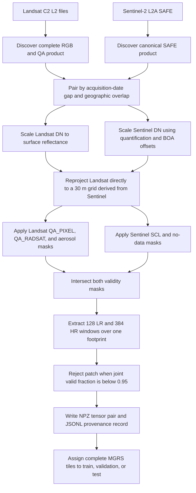
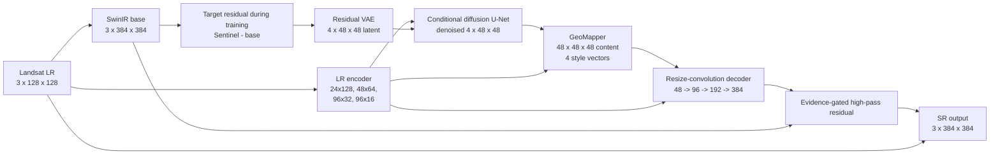

# 33 - Real Cross-Sensor 3x Super-Resolution Foundations

## Learning objectives

After this chapter, you should be able to explain:

1. why Landsat 30 m to Sentinel-2 10 m is a 3x problem;
2. why this is cross-sensor reconstruction rather than ordinary synthetic SR;
3. what makes two scenes a usable image pair;
4. how digital numbers become comparable reflectance tensors;
5. why reprojection, masking, date matching, and geographic splitting are necessary;
6. what every array in a prepared NPZ patch means;
7. which claims the paired dataset supports and which it does not.

## The short answer for a supervisor

> We use a real Landsat 8/9 surface-reflectance RGB observation at 30 m as the
> low-resolution input and a geographically overlapping Sentinel-2 L2A RGB
> observation at 10 m as the reference target. Both products are converted from
> metadata-scaled digital numbers to reflectance, projected onto grids covering
> the same ground footprint, filtered with both sensors' quality masks, and cut
> into paired `128 x 128` and `384 x 384` patches. GeoDiff-GAN then learns a 3x
> cross-sensor mapping while validity masks prevent clouds, saturation, fill, and
> scene borders from contributing to losses or metrics.

## 1. What changed from the earlier experiment?

| Property | Earlier synthetic experiment | Current paired experiment |
|---|---|---|
| LR source | Sentinel target degraded in software | Real Landsat 8/9 observation |
| HR source | Native Sentinel-2 10 m | Native Sentinel-2 10 m |
| Scale | 40 m to 10 m, 4x | 30 m to 10 m, 3x |
| Sensor count | One sensor | Two different sensors |
| Noise parameters | Known because they were sampled | Real effects are only partly known |
| Registration | Exact by construction | Must be checked between products |
| Temporal difference | Zero by construction | Zero to three days in the current preparation |
| Main scientific risk | Synthetic-to-real gap | Sensor, date, spectral, and alignment mismatch |

The new task is more realistic, but it is also harder to interpret. A difference
between Landsat and Sentinel may come from missing spatial detail, but it may also
come from spectral response, atmosphere, illumination, acquisition time,
geolocation, resampling, or real land-cover change.

## 2. Why is it exactly 3x?

The nominal ground sample distances are:

\[
r_{LR}=30\text{ m}, \qquad r_{HR}=10\text{ m}.
\]

Therefore the linear scale factor is:

\[
s=\frac{r_{LR}}{r_{HR}}=\frac{30}{10}=3.
\]

One Landsat pixel covers approximately the same nominal area as a `3 x 3` block
of Sentinel pixels. The number of samples grows by the square of the linear
factor:

\[
s^2=3^2=9.
\]

This does **not** mean nine independent observations were recovered. The model
estimates nine output samples from one input sample by combining measured LR
evidence with learned spatial priors.

For the configured patches:

```text
Landsat:    128 x 128 pixels x 30 m = 3.84 km x 3.84 km
Sentinel:   384 x 384 pixels x 10 m = 3.84 km x 3.84 km
```

The dimensions differ, but the ground footprint is intended to be the same.

## 3. Are they really the "same image"?

No. A precise phrase is **paired observations of the same geographic footprint**.

They are not identical measurements because:

- Landsat OLI and Sentinel MSI have different spectral response functions;
- their point-spread functions and modulation transfer functions differ;
- acquisition times and viewing geometries differ;
- atmospheric correction pipelines differ;
- geolocation can differ by a fraction of a pixel or more;
- a non-zero day gap allows real scene changes;
- cloud and shadow masks are sensor-specific.

Sentinel is therefore a **reference target**, not an unquestionable measurement
of the hidden value of each Landsat sub-pixel.

## 4. Complete data-preparation process



### Step 1: product discovery

A Landsat product is accepted only when the same product ID has:

```text
SR_B2.TIF       blue
SR_B3.TIF       green
SR_B4.TIF       red
QA_PIXEL.TIF    cloud, shadow, snow, fill, and other QA bits
QA_RADSAT.TIF   radiometric saturation
```

`MTL.txt` is retained for radiometric metadata, and `SR_QA_AEROSOL.TIF` is
strongly preferred. Individual bands from different product IDs must never be
mixed.

### Step 2: scene pairing

For each Sentinel product, the preparer considers Landsat products that:

1. are within `MAX_DAY_GAP`, currently three days;
2. overlap at least `MINIMUM_OVERLAP_FRACTION`, currently 10% of the Sentinel
   tile footprint.

Among valid candidates, it chooses the smallest day gap and then the greatest
overlap. The 10% criterion only establishes that two **scenes** overlap. It does
not mean that a patch with 10% valid data is accepted. Patch validity uses the
separate 95% threshold.

### Step 3: convert DN to reflectance

The code reads Landsat scaling from `MTL.txt`. Its standard fallback is:

\[
\rho_L=DN_L\times 0.0000275-0.2.
\]

Sentinel scaling is metadata-aware:

\[
\rho_S=\frac{DN_S+BOA\_ADD\_OFFSET_b}
{BOA\_QUANTIFICATION\_VALUE}.
\]

This matters because blindly dividing newer Sentinel products by 10,000 can
produce a radiometric offset. Values are clipped to `[0,1]` only after metadata
scaling.

### Step 4: construct exact grids

The Sentinel B04 10 m grid is the spatial reference. For each `384 x 384` HR
window, the code derives a corresponding 30 m transform using a scale of three.
Landsat is reprojected directly onto the resulting `128 x 128` grid.

It is not first enlarged to 10 m and then reduced again. That avoids an
unnecessary second resampling operation.

### Step 5: apply joint quality masks

Sentinel validity rejects no-data and invalid Scene Classification Layer classes.
Landsat validity rejects fill, dilated cloud, cirrus, cloud, cloud shadow, snow,
saturation, and high aerosol when aerosol QA is available.

The final HR mask is:

\[
M_{HR}=M_{Sentinel}\land \operatorname{expand}_{3x}(M_{Landsat}).
\]

Only patches satisfying

\[
\frac{\sum M_{HR}}{H\times W}\ge 0.95
\]

are retained.

### Step 6: split geographically

All patches from one MGRS tile must remain in one split. Random patch splitting
would allow overlapping and nearby landscape texture into both training and
evaluation, making generalization results unreliable.

The number of patches is not the number of independent geographic examples.
Hundreds of overlapping windows from one tile still represent one limited area.

## 5. What is stored in each patch?

| Key | Shape | Meaning |
|---|---:|---|
| `lr` | `[3,128,128]` | Real Landsat red, green, blue reflectance |
| `clean_lr` | `[3,128,128]` | Same real Landsat input; no synthetic noise is generated |
| `hr` | `[3,384,384]` | Sentinel red, green, blue reference reflectance |
| `valid_mask_lr` | `[1,128,128]` | Valid Landsat support |
| `valid_mask_hr` | `[1,384,384]` | Joint Landsat and Sentinel validity |
| `degradation` | `[4]` | Compact sensor/pair conditioning vector |

The current conditioning vector is:

```text
index 0: 0.5, nominal blur/PSF condition used by consistency projection
index 1: 1 for Landsat 9, 0 for Landsat 8
index 2: day gap divided by MAX_DAY_GAP
index 3: 1 - valid_fraction
```

The diffusion model receives all four values. In the current deterministic
re-degradation operator, only the first value controls blur because additional
synthetic noise is disabled for real paired input.

## 6. Tensor path through GeoDiff-GAN 3x



The architecture's purpose is unchanged. The scale and spatial dimensions are
adapted from 4x to 3x, and resize-convolution is used instead of PixelShuffle.

## 7. What is conserved spatially?

The implementation uses four constraints:

1. **Common ground grid:** LR and HR patches cover the same nominal footprint.
2. **Deterministic base:** most low-frequency radiometry comes from the Landsat
   conditioned base branch.
3. **High-pass SR residual:** the generative decoder mainly contributes detail.
4. **Back-projection:** the final output is blurred/downsampled and corrected
   toward the real Landsat observation.

This improves evidence conservation but cannot guarantee that every generated
building edge or field boundary is true. A low re-degradation error is necessary,
not sufficient, for HR correctness.

## 8. Current limitations that should be stated openly

- The pipeline reprojects products but does not estimate an additional learned
  or phase-correlation sub-pixel shift. Registration must be inspected visually.
- The current Landsat sensor operator uses a nominal Gaussian blur, not a complete
  calibrated per-band OLI point-spread function.
- S2C-specific HLS bandpass coefficients are not hard-coded, so S2C uses
  `bandpass_adjustment=none`.
- A three-day maximum can still include real change, cloud movement, agriculture,
  water-level differences, or illumination differences.
- Sentinel is a higher-resolution reference, not perfect ground truth.
- RGB-only training cannot use NIR/SWIR evidence unless a multispectral paired
  variant is designed and evaluated separately.

These are not reasons to abandon the experiment. They define the ablations and
quality controls required for a defensible result.

## 9. Common supervisor questions

### Why not downsample Sentinel to create Landsat?

That would return to synthetic SR. Real Landsat provides actual OLI radiometry,
noise, PSF, atmosphere, and acquisition effects. The tradeoff is that pair
alignment and sensor harmonization become harder.

### Why use Sentinel as the target?

It provides native 10 m RGB observations over the same area and is the available
higher-resolution reference. It is not claimed to be the unique true sub-pixel
solution.

### Why use surface reflectance rather than raw DN?

Raw digital numbers depend on product encoding and scale. Metadata-scaled surface
reflectance gives physically interpretable, approximately comparable values.

### Why use a validity mask if 95% of the patch is already valid?

The remaining 5% can still contain extreme cloud, fill, or border values. Without
masking, those pixels can dominate gradients, adversarial learning, and metrics.

### Why is overlap only 10% but validity 95%?

Overlap is a scene-level candidate filter. Validity is a patch-level acceptance
criterion. A Landsat scene may overlap a small part of a Sentinel tile while the
patches extracted inside that overlap are almost completely valid.

### Does bicubic enlargement make Landsat 10 m?

No. It only places the 30 m samples on a larger display grid. It creates no new
measured detail and is used as a visual or numerical baseline.

## Mastery checklist

- [ ] I can explain why the task is 3x spatially and 9x in sample count.
- [ ] I call the inputs paired observations, not identical images.
- [ ] I can derive the physical footprint of both tensors.
- [ ] I can explain both reflectance scaling equations.
- [ ] I can distinguish scene overlap from patch validity.
- [ ] I know what each NPZ key and conditioning-vector entry means.
- [ ] I can explain why a common grid does not prove sub-pixel registration.
- [ ] I can state the experiment's limitations without weakening its valid claims.

Next: [34 - Pair Quality Metrics and Diagnostic Interpretation](34_pair_quality_metrics_and_diagnostics.md).
