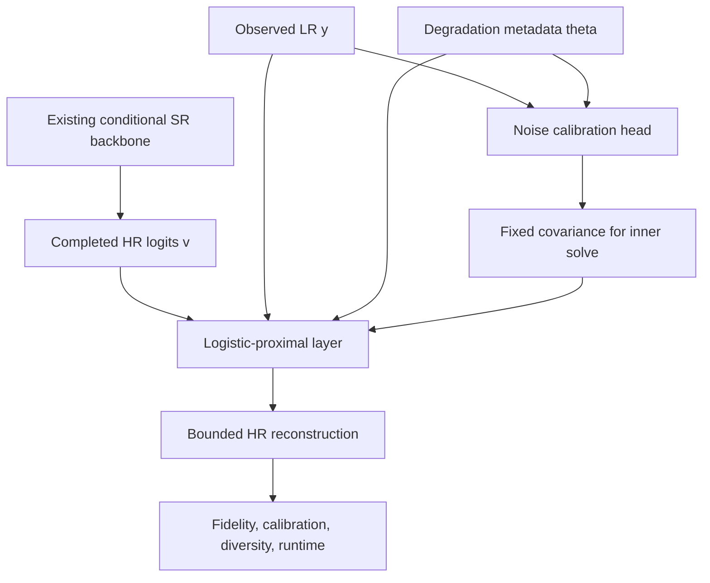

# 33 - Sensor-Calibrated Constraint Study: Paper Track Overview

## Learning Objectives

After this chapter, you should be able to:

- state the paper question without claiming a new projection mechanism;
- distinguish implemented GeoDiff-GAN behavior from proposed Path A work;
- explain why the study is conditional on empirical results;
- identify the minimum pilot that can reject the idea early;
- describe the sequence of Chapters 33-48.

## 1. Paper status

This track describes a **proposed research study**. It is not yet an implemented
feature of GeoDiff-GAN.

The repository currently contains:

- synthetic Sentinel-2 degradation;
- a deterministic SR base and conditional diffusion-GAN system;
- approximate iterative back-projection;
- deterministic tile-level manifest splitting;
- reconstruction and consistency metrics;
- extensive diagnostics.

It does not currently contain:

- GLinSAT or LinSATNet;
- a logistic-proximal solver;
- a sensor-noise calibration network;
- oracle, fixed, and estimated covariance experiment arms;
- calibration or row/null diversity evaluation.

This distinction is essential:

> **Implemented fact:** the current system can generate noisy LR data and
> compare an HR output with its re-degraded LR observation.
>
> **Research proposal:** a sensor-calibrated logistic-proximal output layer may
> improve uncertainty calibration without materially reducing reconstruction
> quality.

## 2. The paper question

The proposed paper does not ask:

> Did we invent bounded differentiable projection?

That mechanism is already closely represented by GLinSAT and related
satisfiability layers.

The proposed question is:

> For conditional satellite super-resolution, does a physically structured,
> externally estimated LR noise covariance improve the fidelity-calibration-
> diversity trade-off of a bounded logistic-proximal reconstruction compared
> with fixed covariance, hard consistency, Euclidean projection, and ordinary
> soft consistency?

This is a comparative, sensor-oriented question. It becomes a paper only if the
answer is supported by controlled evidence.

## 3. Working model names

Use names that describe behavior rather than imply priority:

| Name | Meaning | Novelty status |
|---|---|---|
| Soft consistency | Learned model with an LR data-fit loss | Established baseline |
| EuclideanProx | Euclidean prior plus Gaussian data fit | Established baseline |
| GLinSAT-Hard | Logistic-entropy layer with exact linear equality | Prior-art baseline |
| LogisticProx-Fixed | Bernoulli/logistic prior with fixed covariance | Prior-art floor |
| LogisticProx-Oracle | Same layer with simulator-known covariance | Diagnostic upper bound |
| SensorCal-LogisticProx | Same layer with covariance estimated from LR evidence and metadata | Proposed contribution |

`OF2-Hard` and `OF2-Noise` should not be used as names that imply new
mathematics. The exact hard objective is a GLinSAT special case, and the noisy
objective reduces to a logistic prior plus Gaussian data fit.

## 4. Central hypothesis

Let:

- \(x\) be the bounded HR reconstruction;
- \(v\) be the completed conditional model's HR logits;
- \(y\) be the observed LR image;
- \(C_\theta\) be the clean linear degradation operator;
- \(\widehat{\Sigma}\) be an LR covariance estimated before the inner solve.

The proposed output solves:

\[
\hat{x}
=
\arg\min_{0<x<1}
D_{\mathrm{Bern}}\!\left(x\middle\|\sigma(v)\right)
+
\frac{1}{2}
\left(y-C_\theta x\right)^\top
\widehat{\Sigma}^{-1}
\left(y-C_\theta x\right).
\]

The falsifiable hypothesis is:

> At matched backbone, data, and compute, covariance estimated from sensor
> evidence and degradation metadata approaches the calibration of oracle
> covariance and improves over fixed covariance, while preserving acceptable
> reconstruction quality and stochastic diversity.

## 5. Study logic

The covariance is estimated **outside** the projection solve. During the first
implementation, it must remain fixed with respect to the inner optimization
variable. This preserves the convexity and uniqueness arguments developed in
Chapter 40.

## 6. The go/no-go strategy

The study should start with the smallest experiment capable of rejecting the
idea:

1. Use one small/common backbone.
2. Freeze it initially.
3. Train only the calibration head where required.
4. Use one completely held-out geographic region.
5. Run at least three seeds.
6. Compare all six arms on identical LR tensors.
7. Evaluate calibration and reconstruction before a large-scale run.

Scale to a full paper only if:

- oracle covariance improves over fixed covariance;
- estimated covariance recovers a meaningful part of the oracle gain;
- uncertainty coverage and standardized residual diagnostics improve;
- reconstruction and diversity remain within pre-registered tolerances;
- solver cost is operationally acceptable.

If oracle covariance gives no benefit, the calibration hypothesis is falsified
for the tested setting. Training a more complicated estimator would then be
unjustified.

## 7. Paper-track chapter map

## 8. Claims that are allowed before experiments

You may state:

- the objectives of several existing mechanisms are algebraically related;
- fixed positive covariance produces a strictly convex inner problem;
- a controlled pilot can test whether covariance calibration matters;
- tile-level isolation is necessary for geographic generalization.

You may not yet state:

- SensorCal improves satellite SR;
- the method is state of the art;
- the covariance estimator is calibrated;
- the model recovers real missing spatial detail;
- the proposed combination is the first of its kind.

## 9. Recommended paper category

If the pilot and full study succeed, the most defensible category is:

> A rigorous sensor-calibrated comparative study of bounded consistency layers
> for conditional satellite super-resolution.

This is closer to an applied remote-sensing methods paper than a general
machine-learning projection paper. IEEE JSTARS is a plausible target after
successful implementation, leak-free evaluation, and strong results. Venue
acceptance is never guaranteed by the design alone.

## Mastery Checklist

- [ ] I can state the paper question without claiming a new projection layer.
- [ ] I know which parts exist in the repository and which are proposals.
- [ ] I understand why the oracle covariance arm must precede full training.
- [ ] I can explain why favorable empirical results are a publication condition.
- [ ] I know the six experiment arms and their roles.

Next: [34 - Satellite Observation Model and Synthetic 40 m Protocol](34_satellite_observation_model.md).
