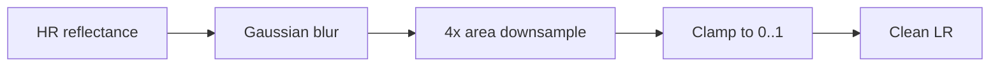
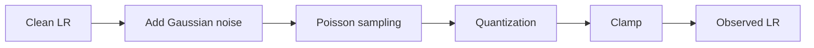

# 34 - Satellite Observation Model and Synthetic 40 m Protocol

## Learning Objectives

- formulate the 40 m to 10 m experiment as a controlled inverse problem;
- separate clean degradation, observation noise, and post-processing;
- connect the equations to the current degradation implementation;
- explain why synthetic 40 m RGB is useful but not a native measurement;
- identify which operator must be linear for the proposed solver.

## 1. Variables and tensor shapes

The primary RGB experiment uses:

\[
x_{\mathrm{HR}}\in[0,1]^{B\times3\times512\times512}
\]

and:

\[
y_{\mathrm{LR}}\in[0,1]^{B\times3\times128\times128}.
\]

The nominal scale is four:

\[
s=4.
\]

The clean synthetic observation is:

\[
\mu=C_\theta x_{\mathrm{HR}},
\]

where \(C_\theta\) applies blur and area downsampling. The noisy observation is:

\[
y=Q\!\left(N(\mu;\theta_n)\right),
\]

where:

- \(N\) represents stochastic Gaussian and Poisson effects;
- \(Q\) represents quantization and clipping;
- \(\theta=(\theta_b,\theta_n,\theta_q)\) records degradation settings.

## 2. Current repository implementation

The current implementation is
[degradation.py](../src/geodiff_gan/models/degradation.py).

`sensor_degrade(..., add_noise=False)` performs:

With `add_noise=True`, it additionally performs:

`random_degradation(..., return_clean=True)` returns:

- observed LR;
- four normalized degradation parameters;
- clean LR.

The dataset already exposes `lr`, `clean_lr`, and `degradation`. Therefore the
realized synthetic observation residual can be computed without storing LR
images on disk:

\[
\eta_{\mathrm{realized}}=y-\mu
=\texttt{lr}-\texttt{clean\_lr}.
\]

## 3. What is native and what is synthetic

Sentinel-2 RGB bands B4, B3, and B2 are native 10 m products. There is no native
40 m Sentinel-2 RGB product in this experiment. Both 20 m RGB and 40 m RGB
would be synthetic resampling choices.

Therefore:

> The experiment measures reconstruction under a controlled synthetic
> degradation model. It does not prove recovery from an independently acquired
> physical 40 m RGB sensor.

This limitation is acceptable when it is stated explicitly and complemented
with held-out degradation and, where possible, real-data validation.

## 4. The clean operator required by the solver

The proposed logistic-proximal layer requires a clean operator \(C_\theta\) and
its transpose \(C_\theta^\top\).

For theory, \(C_\theta\) must be linear:

\[
C_\theta(a x_1+b x_2)
=
aC_\theta x_1+bC_\theta x_2.
\]

Blur and area downsampling are linear. Clamping is not:

\[
\operatorname{clip}(a x_1+b x_2)
\ne
a\operatorname{clip}(x_1)+b\operatorname{clip}(x_2)
\]

in general.

Consequently, the solver should not directly reuse a function that clamps its
output. The implementation needs:

- `linear_sensor_forward`: blur plus downsampling, without noise or clamp;
- `linear_sensor_adjoint`: the exact transpose under the same padding and
  downsampling conventions;
- `sensor_observe`: nonlinear stochastic simulation used by the dataset.

The bounded sigmoid parameterization of \(x\) handles HR bounds. The linear
operator should not hide another clamp inside the solver.

## 5. Observation noise is not one simple Gaussian

The current simulator uses three effects:

1. additive Gaussian noise;
2. Poisson sampling;
3. quantization.

An approximate diagonal variance at clean LR mean \(\mu_i\) is:

\[
\operatorname{Var}(y_i\mid\mu_i)
\approx
\sigma_g^2
+
\frac{\mu_i}{p}
+
\frac{\Delta^2}{12},
\]

where:

- \(\sigma_g\) is Gaussian standard deviation;
- \(p\) is the Poisson peak;
- \(\Delta=1/(L-1)\) is the quantization step for \(L\) levels.

This is an approximation because:

- Gaussian noise is added before Poisson sampling in the current code;
- values are clamped;
- quantization is discrete;
- the Poisson mean can depend on a noisy intermediate value.

The most reliable oracle covariance for the pilot can therefore be obtained in
two ways:

1. **Analytic proxy:** use the formula above.
2. **Monte Carlo oracle:** repeatedly sample the simulator at fixed
   \(x,\theta\), then estimate per-bin or per-pixel variance.

The Monte Carlo version is slower but exposes approximation error in the
analytic model.

## 6. Clean LR versus observed LR

The reconstruction model receives observed LR:

\[
y=\mu+\eta.
\]

Consistency against \(y\) forces the reconstruction to reproduce noise.
Consistency against \(\mu\) is unavailable in real inference, although it is
known in the synthetic experiment.

This motivates three diagnostic quantities:

\[
e_{\mathrm{observed}}=C_\theta\hat{x}-y,
\]

\[
e_{\mathrm{clean}}=C_\theta\hat{x}-\mu,
\]

\[
\hat{\eta}=y-C_\theta\hat{x}.
\]

A useful noise-aware method should not merely reduce
\(\lVert e_{\mathrm{observed}}\rVert\) by fitting random noise. It should improve
the reconstruction of \(\mu\), recover plausible \(\eta\), and provide calibrated
uncertainty.

## 7. Deterministic validation

Training should use fresh random degradations when the research question
requires robustness. Validation and testing should use deterministic seeds so
that every method sees exactly the same:

- blur kernel;
- Gaussian sample;
- Poisson sample;
- quantization strength;
- LR tensor.

The current `SentinelPatchDataset` already derives a deterministic seed from
tile identity, patch location, path, and `degradation_seed` when random
degradation is disabled.

This supports paired comparison. A metric difference is meaningful only when
the LR observation is held fixed between methods.

## 8. Spatial support and boundary conditions

Reflect padding is currently applied before blur. Its transpose is not simply
ordinary zero-padded transposed convolution. The adjoint must account for the
reflection operation.

For the first correctness prototype, an autograd vector-Jacobian product can
define the exact adjoint:

\[
C_\theta^\top z
=
\nabla_x\langle C_\theta x,z\rangle.
\]

After correctness is established, a custom efficient adjoint can replace it.

Always test the adjoint identity:

\[
\langle C_\theta x,z\rangle
\approx
\langle x,C_\theta^\top z\rangle.
\]

The relative error should be close to floating-point tolerance.

## 9. Paper wording

Use:

> We evaluate a controlled four-times Sentinel-2 RGB reconstruction protocol
> in which native 10 m patches are degraded synthetically to 40 m-equivalent
> observations using randomized blur, downsampling, stochastic noise, and
> quantization.

Avoid:

> We super-resolve native Sentinel-2 40 m RGB observations.

No such native RGB product is used.

## Exercises

1. Derive the output shape after four-times area downsampling of a 512 square
   patch.
2. Explain why clamp invalidates a linear-operator theorem.
3. Compute the quantization variance approximation for 2048 levels.
4. Explain why fitting observed LR perfectly can fit noise.
5. Write the adjoint identity used to test `linear_sensor_adjoint`.

## Mastery Checklist

- [ ] I can separate \(C_\theta\), stochastic noise, quantization, and clamp.
- [ ] I know the current dataset returns both clean and observed LR.
- [ ] I understand why 40 m RGB is synthetic.
- [ ] I know why the solver needs an unclamped linear operator and its adjoint.
- [ ] I can explain analytic and Monte Carlo oracle covariance.

Next: [35 - Prior Art, GLinSAT Equivalence, and Honest Novelty](35_prior_art_and_novelty.md).
