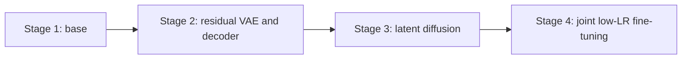
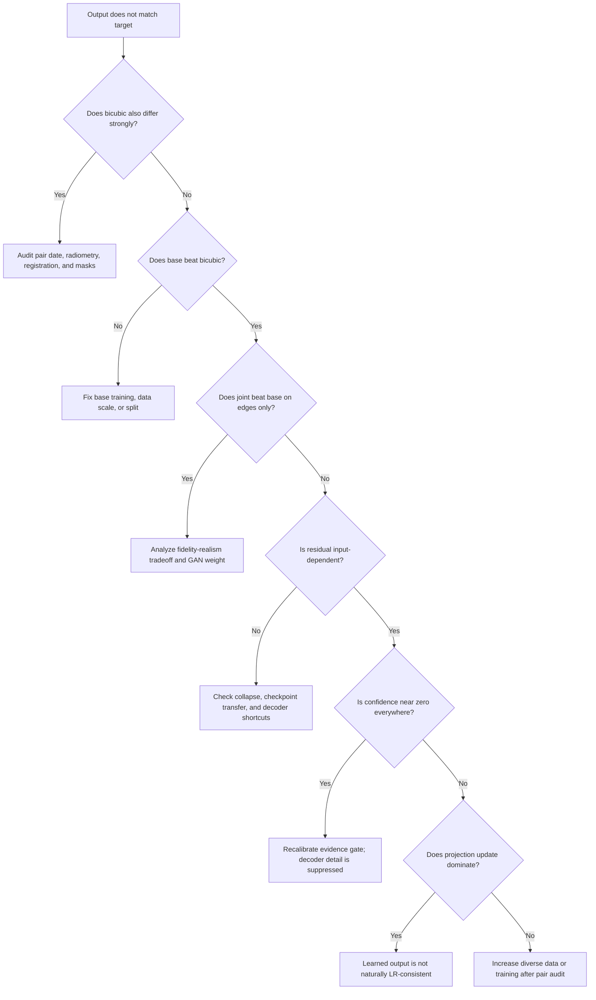

# 35 - Training, Debugging, Evaluation, and Supervisor Questions

## Learning objectives

This chapter connects prepared pairs to model behavior. It explains:

- why training is divided into stages;
- what each module contributes;
- what every important loss and diagnostic means;
- how to read training curves and evaluation tables;
- how to determine whether the model learned reconstruction or memorized texture;
- how to answer minor-to-major supervisor questions.

## 1. One-minute architecture explanation

> The deterministic SwinIR branch first produces a conservative 3x estimate from
> real Landsat. A residual VAE compresses the difference between Sentinel and the
> base into a `4 x 48 x 48` latent. Conditional diffusion learns the distribution
> of plausible residual latents using Landsat features and pair metadata. GeoMapper
> converts the denoised latent into spatial content, layer-wise FiLM styles, and
> evidence confidence. A resize-convolution GAN decoder predicts high-frequency
> residual detail, which is gated, added to the base, and optionally back-projected
> so that its simulated 30 m observation remains close to Landsat.

## 2. Module-by-module purpose

| Module | Input | Output | Why it exists |
|---|---|---|---|
| SwinIR base | `3x128x128` Landsat | `3x384x384` base | Conservative radiometry and coarse geometry |
| LR encoder | Landsat | four feature scales | Spatial evidence and decoder skips |
| Residual VAE | `Sentinel - base` | `4x48x48` latent | Compact residual representation |
| Diffusion U-Net | noisy latent + conditions | velocity estimate | Models ambiguity and stochastic detail |
| GeoMapper | latent + LR feature + mode | content, styles, policies | Connects diffusion to spatial GAN synthesis |
| SR decoder | mapped content + LR skips | detail and edit residuals | Produces spatially resolved residual detail |
| Evidence gate | content + LR evidence | confidence map | Suppresses unsupported detail |
| PatchGAN | HR/LR pair | local realism scores | Encourages plausible local structure |
| Wavelet discriminator | HR high bands + LR | frequency realism scores | Focuses adversarial learning on detail bands |
| Back-projection | HR estimate + Landsat | corrected HR | Reduces approximate LR inconsistency |

Text conditioning is disabled in the first paired experiment. This isolates the
effect of real cross-sensor training before prompts add another variable.

## 3. Why train in stages?



### Stage 1: deterministic base

**Question:** Can the model reconstruct broad Sentinel radiometry and structure
from Landsat without generative texture?

Train the base with masked Charbonnier, SSIM, gradient, and low-weight
consistency losses. If this stage does not beat bicubic on held-out data, adding
diffusion and GAN capacity is premature.

### Stage 2: VAE and decoder

**Question:** Can a compact latent encode and decode the residual information that
the base missed?

The target is:

\[
R^*=M\odot(H-B(L)).
\]

Masking sets invalid residual targets to zero and excludes them from reconstruction
losses.

### Stage 3: diffusion

**Question:** Can the diffusion U-Net predict the denoising velocity of residual
latents conditioned on Landsat evidence and pair metadata?

The decoder is not the primary object being optimized here. The core loss is the
SNR-weighted velocity loss.

### Stage 4: joint fine-tuning

**Question:** Can diffusion, GeoMapper, decoder, confidence, and low-weight GAN
objectives cooperate without destroying deterministic fidelity?

This stage uses a lower learning rate. Early stopping is important because
validation PSNR can peak before adversarial texture objectives finish decreasing.

## 4. Losses: meaning, purpose, and failure modes

| Loss | Preferred direction | Purpose | Failure when overweighted |
|---|---|---|---|
| Charbonnier | Lower | Robust pixel reconstruction | Smooth average output |
| `1 - SSIM` | Lower | Local structural similarity | Can still miss fine texture |
| Gradient | Lower | Edge magnitude and location | Sharpened noise if isolated |
| VAE reconstruction | Lower | Preserve target residual through latent | Decoder may memorize residual patterns |
| KL | Lower, but not zero by force | Regularize latent distribution | Posterior collapse if too strong |
| Diffusion velocity | Lower | Learn residual-latent denoising | Weak samples if undertrained |
| Wavelet | Lower | Match directional high-frequency bands | Artificial detail if excessive |
| Perceptual | Lower | Match deep visual features | Domain mismatch with natural-image features |
| Evidence calibration | Lower | Align confidence with local accuracy | Uniform low/high confidence if poorly balanced |
| Consistency | Lower | Preserve Landsat evidence | Over-smooth HR if too strong |
| Generator adversarial | More realistic D score | Improve local realism | Hallucinated or periodic texture |
| Discriminator hinge | Stable real/fake margin | Train critics | Critic dominance or collapse |

All reconstruction, structure, wavelet, consistency, calibration, metric, and
adversarial paths now respect validity masks. For GAN training, invalid prediction
pixels are replaced by target pixels before they reach the discriminators. This
prevents the critics from learning cloud or border artifacts as real/fake cues.

## 5. Loss is not the same as a reported metric

A loss is optimized by gradient descent. A metric is used to evaluate behavior.
They can share similar formulas but have different roles and weights.

Examples:

- Charbonnier is close to MAE but includes a small numerical epsilon during
  training.
- SSIM loss is `1 - SSIM`, while the report displays SSIM itself.
- Adversarial loss can improve edge F1 while reducing PSNR.
- Total loss is a weighted sum and has no direct physical unit.

Never compare total-loss values between stages as though they were the same
objective. Each stage contains different terms and trainable parameters.

## 6. Reading training progress

Example:

```text
[joint] epoch 4/15 complete loss=0.2588
val_psnr=36.24 val_ssim=0.8906
early_stop=3/5 elapsed=1h23m
```

Interpretation:

- `epoch 4/15`: fourth complete pass over the training loader;
- `loss=0.2588`: mean weighted training objective, not accuracy;
- `val_psnr=36.24`: masked held-out pixel fidelity;
- `val_ssim=0.8906`: masked held-out structural similarity;
- `early_stop=3/5`: validation selection metric failed to improve for three
  consecutive checks; two more failures stop training;
- `elapsed`: wall-clock runtime.

If training loss decreases while validation L1 increases, the model is overfitting
or the joint objectives are moving away from reconstruction fidelity.

## 7. Important diagnostic tensor names

### `input.lr`

Real Landsat input. Shape should be `[1,3,128,128]`.

### `base.hr`

Deterministic 3x output. It should contain stable low-frequency content and should
not show periodic grids.

### `target.hr`

Sentinel reference. It is used only during supervised training/evaluation, not as
an inference input.

### `target.valid_mask`

White regions contribute to loss and metrics; black regions are excluded.

### `latent.denoised`

Final `4 x 48 x 48` diffusion latent. Its channel values are features, not RGB or
reflectance.

### `mapper.content`

Spatial decoder content at `48 x 48`. Feature-grid brightness has no direct
physical meaning; patterns show activation structure.

### `mapper.evidence_confidence`

A learned confidence map between zero and one.

- near 1: decoder detail receives stronger permission;
- near 0: the model should rely more on the deterministic base;
- almost constant everywhere: confidence policy may not be learning spatial
  selectivity.

### `output.abstention_map`

Approximately the complement of combined confidence after uncertainty handling.
High abstention means the final output is pulled toward the conservative base.

### `decoder.raw_detail_residual`

Unfiltered detail proposal. It may contain low-frequency content and is not the
residual finally added in SR mode.

### `decoder.detail_high_pass`

High-pass-filtered detail. Broad brightness or color changes should be greatly
reduced here.

### `decoder.evidence_residual`

High-pass detail after confidence gating. This is the main generative contribution
in SR mode.

### `output.pre_projection`

Base plus gated residual before LR consistency correction.

### `output.projection_update`

The correction introduced by back-projection. If its magnitude is very large,
the learned output was not naturally Landsat-consistent.

### `output.hr`

Final SR result after optional projection and uncertainty-aware abstention.

## 8. Diffusion trajectory values

At the first DDIM step, `latent_t999` should resemble noise with standard deviation
near one. As timesteps approach zero, the latent should become structured and its
statistics should stabilize.

Check:

- no NaN or Inf;
- decreasing noise-like variation;
- clean predictions do not explode;
- final latent scale resembles latents observed during VAE training.

A stable trajectory proves numerical stability, not semantic correctness.

## 9. Decoder residual interpretation

Residual visualizations are contrast-stretched around zero. Gray usually means
near zero, while bright/dark colors represent positive/negative corrections.

Do not interpret a gray residual as an RGB satellite image. Ask instead:

1. Does it vary with the input patch?
2. Does it follow meaningful edges?
3. Does it contain a repeated lattice independent of geography?
4. Is most low-frequency energy removed after high-pass filtering?
5. Does evidence gating suppress unsupported regions?

Different inputs producing the same residual indicates collapse or a decoder
shortcut. Different residuals are necessary but do not guarantee correct detail.

## 10. Confidence and uncertainty

Eight stochastic outputs can be written as \(\hat H_1,\dots,\hat H_8\). Their
pixelwise variance is:

\[
U(i,j)=\frac{1}{K}\sum_k
\left\|\hat H_k(i,j)-\bar H(i,j)\right\|_2^2.
\]

High variance means samples disagree. It does not automatically mean high error;
calibration must be tested against the Sentinel reference.

Useful checks:

- uncertainty-error correlation should be positive if uncertainty is informative;
- confidence-error correlation should be negative;
- selective L1 at 80% coverage should improve when low-confidence pixels are
  excluded.

Near-zero correlations indicate that maps may look plausible but are not calibrated.

## 11. Back-projection trajectory

Each projection step calculates an approximate LR error and upsamples a correction.

Expected behavior:

- LR error decreases over steps;
- HR appearance changes modestly;
- projection update remains small relative to the base;
- target error does not sharply increase.

If LR error improves while target edges remain weak, projection is enforcing
evidence but not reconstructing missing detail. If projection dominates the output,
reduce its steps during ablation and improve the learned reconstruction.

## 12. How to interpret an evaluation table

Compare GeoDiff-GAN with bicubic and the deterministic base using the same masked
split.

### Ideal broad pattern

- lower L1 than bicubic;
- higher PSNR and SSIM than bicubic;
- higher edge F1 than base;
- competitive or lower LPIPS/DISTS;
- lower re-degradation error;
- no periodic artifacts in residual spectra.

### Common tradeoff pattern

GeoDiff-GAN may have slightly lower PSNR than the base but much higher edge F1.
This means the generative branch added sharper structure at some pixel-fidelity
cost. Whether this is acceptable depends on visual correctness, LPIPS/DISTS,
consistency, and ablations. Do not report only the favorable metric.

### A result is not a percentage accuracy

There is no single accuracy value for continuous SR. Report a vector of metrics
and explain each axis.

## 13. Failure diagnosis decision tree



## 14. Minor-to-major supervisor question bank

### What is a pixel value here?

A normalized surface-reflectance sample for one spectral band after metadata
scaling and clipping, not raw DN and not a land-cover class.

### What is a batch?

A set of patches processed together before one backward pass. Gradient accumulation
combines multiple microbatches before an optimizer update.

### What is an epoch?

One pass through the training loader. Overlapping patches mean one epoch is not one
independent pass over unique geography.

### What is an iteration?

Usually one processed batch. An optimizer update may occur only after several
iterations when gradient accumulation is used.

### Why FP16?

It reduces activation memory and can accelerate GPU tensor operations. The scaler
helps prevent small gradients from underflowing.

### Why gradient checkpointing?

It recomputes selected activations during backward instead of storing all of them,
trading additional computation for lower memory use.

### Why residual prediction?

The base already explains much of the scene. Predicting only missing detail limits
the generative branch's authority and makes evidence conservation easier.

### Why latent diffusion instead of pixel diffusion?

`4 x 48 x 48` is much smaller than `3 x 384 x 384`, reducing compute while modeling
the uncertain residual rather than the full radiometric image.

### Why a GAN after diffusion?

Diffusion models a conditional residual distribution; adversarial critics encourage
the decoded local and wavelet detail to resemble target statistics. GAN loss is kept
low to reduce hallucination risk.

### Why both PatchGAN and wavelet discriminator?

PatchGAN focuses on local spatial realism. The wavelet discriminator focuses on
directional high-frequency bands that a smooth model can neglect.

### Why resize-convolution?

It upsamples first and then convolves, reducing phase-imbalance and periodic-grid
risks associated with poorly balanced sub-pixel convolution. It preserves the same
decoder purpose without PixelShuffle.

### Why is the latent `48 x 48`?

The VAE downsamples the `384 x 384` target by a factor of eight:
\(384/8=48\).

### Why does GeoMapper resize a `64 x 64` LR feature to `48 x 48`?

The LR encoder and VAE follow different spatial hierarchies. GeoMapper bilinearly
aligns the selected LR feature to latent resolution before concatenation.

### Why is the consistency weight only 0.25?

Real Landsat and Sentinel are not generated by the exact same synthetic operator.
The low weight encourages evidence compatibility without forcing the Sentinel target
through an oversimplified sensor model.

### What does `observed_lr_noise_l1=0` mean in paired mode?

`clean_lr` is the same real Landsat tensor as `lr`; synthetic noise is disabled.
Zero therefore means no synthetic noisy/clean decomposition was created. It does
not mean the real sensor is noise-free.

### Why can a same-day pair still differ?

Acquisition time, atmosphere, viewing geometry, spectral response, geolocation,
clouds, and BRDF can differ even on the same calendar day.

### Does low re-degradation error prove the generated buildings are real?

No. Downsampling is many-to-one. Numerous HR textures can reproduce the same LR
measurement.

### What is the main novelty claim?

Novelty should be framed as a tested combination: real cross-sensor residual
diffusion, spatial evidence/style mapping, confidence-gated high-pass GAN decoding,
dual spatial/wavelet critics, and LR-consistent abstention. Each component requires
ablation; architecture complexity alone is not proof of novelty.

## 15. Claims you may and may not make

### Defensible after proper experiments

- The model reduces selected full-reference errors on geographically held-out
  Landsat-Sentinel pairs.
- The output is more consistent with real Landsat under the stated approximate
  sensor operator.
- Edge or perceptual metrics improve relative to named baselines.
- Uncertainty or confidence is informative if calibration correlations support it.

### Not defensible from this experiment alone

- The model recovered the true unobserved 10 m Landsat pixels.
- Every generated object exists on the ground.
- A sharp output is spatially correct.
- Performance on random patches proves geographic generalization.
- One favorable metric proves state of the art.

## 16. Minimum experiment matrix

| Experiment | Purpose |
|---|---|
| Bicubic | No-learning interpolation baseline |
| Deterministic base | Measures benefit before generative modules |
| Full GeoDiff-GAN | Proposed system |
| Without diffusion | Tests stochastic residual prior |
| Without GAN critics | Tests adversarial detail contribution |
| Without wavelet critic | Tests frequency-specific critic |
| Without evidence gate | Tests confidence constraint |
| 0/1/3 projection steps | Tests consistency-quality tradeoff |
| Same-day only vs up-to-3-day pairs | Tests temporal mismatch sensitivity |
| Registration-clean subset | Tests alignment sensitivity |

Use the same geographic test set and evaluation protocol for every row.

## 17. Supervisor-ready result template

> The experiment used **N scene pairs** from **T independent MGRS tiles**, with
> **X/Y/Z patches** in train/validation/test and a maximum day gap of **D**. All
> metrics were calculated on metadata-scaled reflectance using the joint validity
> mask. Relative to bicubic, GeoDiff-GAN changed PSNR from **A** to **B**, SSIM from
> **C** to **D**, edge F1 from **E** to **F**, and approximate LR consistency from
> **G** to **H**. Relative to the deterministic base, the generative branch
> improved **specific metrics** but changed **tradeoff metrics**. Registration,
> residual spectra, confidence calibration, and 0/1/3-step projection diagnostics
> showed **observed evidence**, so the result is interpreted as **a conditional
> reconstruction estimate**, not direct recovery of hidden ground truth.

## Mastery checklist

- [ ] I can explain every architecture module in one sentence.
- [ ] I understand why stages use different losses and trainable parameters.
- [ ] I can distinguish loss, metric, and accuracy.
- [ ] I can interpret every major debug tensor and plot.
- [ ] I can diagnose overfitting from training and validation curves.
- [ ] I can explain confidence, uncertainty, and abstention separately.
- [ ] I can explain why projection can improve LR error without restoring HR edges.
- [ ] I can report both favorable and unfavorable metrics.
- [ ] I can state valid claims and reject overclaims.

Previous: [34 - Pair Quality Metrics and Diagnostic Interpretation](34_pair_quality_metrics_and_diagnostics.md).

Next: [36 - Spatial, Spectral, Radiometric, and Temporal Resolution](36_spatial_spectral_radiometric_temporal_resolution.md).
