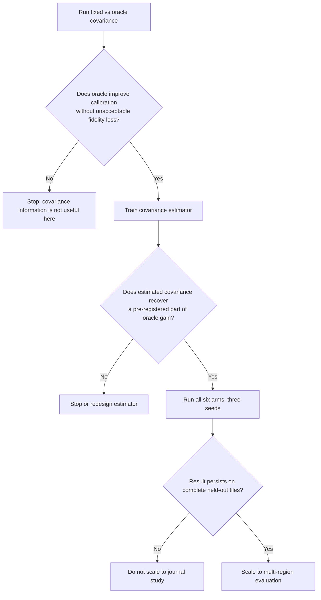

# 37 - Six-Arm Controlled Pilot

## Learning Objectives

- define six non-duplicated experiment arms;
- understand what scientific question each arm answers;
- keep backbone, LR observations, and compute comparable;
- avoid comparing algebraically identical methods;
- construct a low-cost go/no-go pilot.

## 1. Why six arms are required

The paper needs to separate four effects:

1. adding any LR consistency;
2. changing Euclidean geometry to bounded logistic geometry;
3. enforcing a hard equality;
4. supplying better noise covariance.

One comparison cannot identify all four. The six-arm design changes one
mechanism at a time.

## 2. Common notation

Let:

- \(v\) be completed HR logits from the common backbone;
- \(p=\sigma(v)\) be its bounded output;
- \(y\) be observed LR;
- \(C\) be clean linear degradation;
- \(\Sigma_0\) be fixed covariance;
- \(\Sigma_*\) be oracle covariance;
- \(\widehat{\Sigma}\) be estimated covariance.

All methods receive the same \(v,y,C,\theta\).

## 3. Arm 1: soft consistency

The model is trained with:

\[
\mathcal{L}
=
\mathcal{L}_{\mathrm{HR}}(p,x^*)
+
\lambda_c
\lVert Cp-y\rVert_1
\]

or a comparable differentiable data-fit loss.

There is no optimization layer at inference.

Question answered:

> Is an explicit solver useful beyond an ordinary consistency loss?

## 4. Arm 2: EuclideanProx

Solve:

\[
\hat{x}_{E}
=
\arg\min_x
\frac{1}{2\tau^2}\lVert x-p\rVert_2^2
+
\frac12(y-Cx)^\top\Sigma_0^{-1}(y-Cx).
\]

Optionally enforce bounds after solving, but record that clipping changes the
exact objective.

Question answered:

> Does bounded logistic geometry matter beyond a conventional Gaussian prior
> around the backbone output?

## 5. Arm 3: GLinSAT-Hard

Solve:

\[
\hat{x}_{H}
=
\arg\min_{0<x<1,\;Cx=y}
D_{\mathrm{Bern}}(x\|\sigma(v)).
\]

This is the exact hard baseline when feasible.

Question answered:

> What is gained and lost by reproducing the observed LR exactly?

Expected risk:

- observed noise may be forced into the HR output;
- feasibility and conditioning become difficult near bounds;
- posterior diversity is restricted to the hard fiber.

## 6. Arm 4: LogisticProx-Fixed

Solve:

\[
\hat{x}_{F}
=
\arg\min_{0<x<1}
D_{\mathrm{Bern}}(x\|\sigma(v))
+
\frac12(y-Cx)^\top\Sigma_0^{-1}(y-Cx).
\]

Question answered:

> Does the logistic-proximal formulation help when all measurements receive
> the same trust?

This arm is the correct baseline for the proposed estimator. It is not the
paper's novel method.

## 7. Arm 5: LogisticProx-Oracle

Use the same solver with:

\[
\Sigma=\Sigma_*.
\]

Question answered:

> Is accurate covariance useful in principle under this simulator and
> backbone?

This arm is not available for real inference because it may use clean LR or
simulator-known noise parameters. It is an experimental upper bound.

## 8. Arm 6: SensorCal-LogisticProx

Estimate:

\[
\widehat{\Sigma}=g_\psi(y,\theta)
\]

and solve the same fixed-covariance problem:

\[
\hat{x}_{S}
=
\arg\min_{0<x<1}
D_{\mathrm{Bern}}(x\|\sigma(v))
+
\frac12(y-Cx)^\top
\widehat{\Sigma}^{-1}
(y-Cx).
\]

Question answered:

> Can observable LR evidence recover enough covariance information to approach
> the oracle calibration-quality trade-off?

## 9. Comparison matrix

| Arm | Bounded geometry | Solver | Exact \(Cx=y\) | Adaptive covariance | Uses oracle data |
|---|---:|---:|---:|---:|---:|
| Soft consistency | Backbone-dependent | No | No | No | No |
| EuclideanProx | Optional clip | Yes | No | No | No |
| GLinSAT-Hard | Yes | Yes | Yes | No | No |
| LogisticProx-Fixed | Yes | Yes | No | No | No |
| LogisticProx-Oracle | Yes | Yes | No | Yes | Yes |
| SensorCal-LogisticProx | Yes | Yes | No | Yes | No |

## 10. Fairness constraints

All arms must use:

- the same backbone checkpoint;
- the same HR target;
- the exact same observed LR tensor;
- the same clean operator;
- the same data split;
- the same evaluation crop;
- the same number of stochastic samples;
- documented tolerances and iteration budgets.

Do not regenerate random LR independently for each arm inside an evaluation
loop. Generate one batch and pass it to every method.

## 11. Frozen-backbone pilot

The first pilot should freeze the SR backbone. Reasons:

- it isolates output-layer effects;
- it prevents six separate backbone training trajectories;
- it lowers compute;
- it makes a failed covariance hypothesis inexpensive;
- it avoids attributing optimizer noise to the constraint mechanism.

Only Arm 6 requires a trained calibration head. The other solvers can operate
on a shared completed prediction.

After a successful frozen pilot, an end-to-end fine-tuning ablation can test
whether the backbone learns to cooperate with the output layer.

## 12. Pilot data scope

Use:

- one held-out geographic region;
- complete tile separation;
- at least three random seeds for trainable components;
- deterministic validation degradations;
- a small but nontrivial number of test patches spanning smooth and textured
  areas.

One region is a go/no-go pilot, not final evidence of broad generalization.

## 13. Decision tree

## 14. Invalid comparisons

Do not compare:

- `OF2-Noise` against an identically formulated GLinSAT-plus-ridge objective;
- hard GLinSAT against noisy consistency only on hard residual;
- methods using different LR noise draws;
- a fine-tuned proposed arm against frozen baselines without a matching
  training-budget study;
- one seed of a trainable estimator against deterministic baselines and call
  the difference architectural.

## Exercises

1. State the unique scientific question answered by each arm.
2. Explain why Arm 5 must precede expensive Arm 6 training.
3. Describe one unfair comparison and how to correct it.
4. Explain why hard residual is not the primary metric for Arm 6.
5. Design a seventh ablation that tests end-to-end fine-tuning.

## Mastery Checklist

- [ ] I can write all six objectives.
- [ ] I know that Arm 4 is the prior-art floor, not the proposed contribution.
- [ ] I understand the role of oracle covariance.
- [ ] I can keep paired LR inputs identical across arms.
- [ ] I know the stop conditions for the pilot.

Next: [38 - Sensor Noise Calibration](38_sensor_noise_calibration.md).
