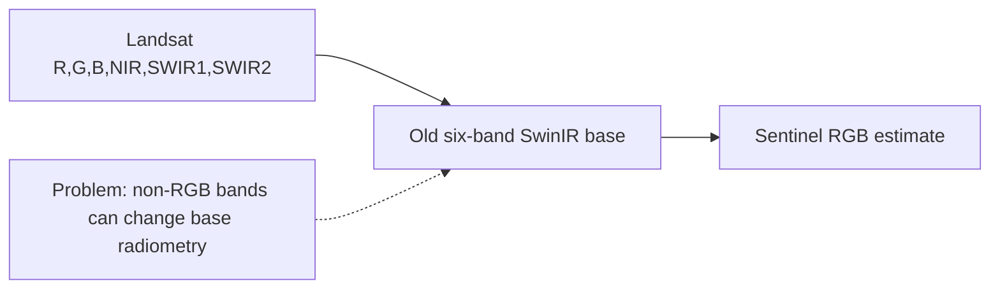
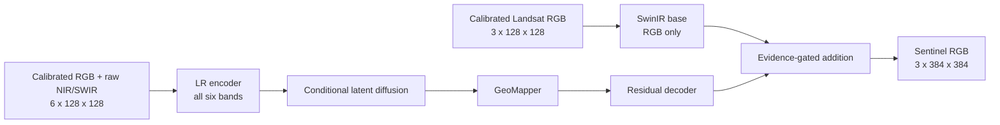

# Harmonized Dual-Stream Cross-Sensor Experiment

## 1. Why the previous experiment is insufficient

The Landsat 30 m input and Sentinel-2 10 m target are observations from different
sensors and dates. Their RGB values are not interchangeable even after surface
reflectance scaling. Differences in spectral response, atmosphere, view geometry,
registration, and acquisition date create a cross-sensor domain gap.

The previous six-band model also gave all bands directly to the deterministic RGB
base. NIR and SWIR contain useful structure, but they are not RGB radiance. Asking a
single SwinIR stem to mix all six bands while reconstructing RGB can alter color and
reduce PSNR.



## 2. Improvement 1: train-only radiometric harmonization

For each RGB channel, fit the robust affine relation

```text
Sentinel_30m = slope * Landsat_30m + offset
```

`Sentinel_30m` is produced by area-averaging each training HR target by 3. Only
training patches fit `slope` and `offset`. The frozen coefficients are then applied
to train, validation, test, and inference Landsat RGB. Fitting on validation or test
targets would be leakage.

This is global sensor harmonization, not per-image histogram matching. It cannot use
the unknown target of a deployed image. The calibration report includes raw versus
calibrated MAE/RMSE and an integer-shift audit. If calibration worsens held-out
bicubic PSNR, reject it rather than assuming it must help.

## 3. Improvement 2: dual-stream multispectral evidence



The base therefore remains a radiometrically conservative RGB reconstruction.
NIR/SWIR can influence only the learned correction through the LR encoder,
diffusion conditioning, mapper, and decoder. The model can use vegetation and built
surface evidence without treating NIR or SWIR as visible color.

## 4. Improvement 3: conservative joint optimization

For the two new experiments:

- Joint tuning is at most 8 epochs with early stopping.
- Joint learning rate is at most `5e-6`.
- Diffusion weights remain frozen during joint tuning.
- Only `lr_encoder`, `mapper`, and `decoder` are optimized.
- Adversarial, perceptual, gradient, and wavelet pressures are zero.
- MSE, multiscale MSE, SSIM, radiometric loss, residual supervision, and a strong
  base guard prioritize distortion.

Diffusion is still used during inference and gradients can pass through its frozen
operations to conditioning features. “Frozen” means its parameters do not update;
it does not mean the module is removed.

## 5. Experiments and causal interpretation

| Experiment | Calibration | Base input | Residual input | Question |
|---|---|---|---|---|
| `rgb_fidelity` | No | RGB | RGB | Previous fidelity baseline |
| `multispectral_fidelity` | No | Six bands | Six bands | Previous multispectral design |
| `rgb_harmonized_fidelity` | Train-only affine | RGB | RGB | Does sensor harmonization help? |
| `multispectral_guided_fidelity` | Train-only affine | RGB | Six bands | Do auxiliary bands help when isolated from the base? |

Do not compare only final model scores. Compare each final output with the exact
SwinIR base embedded in the same joint checkpoint.

## 6. Acceptance criteria

The residual branch passes only when held-out results satisfy all of the following:

1. Mean `psnr_delta_vs_base > 0`.
2. Mean `ssim_delta_vs_base >= 0`.
3. `l1_improvement_vs_base > 0`.
4. A useful fraction of individual test patches beats the base, not only the mean.
5. Improvements occur on more than one tile or spatial fold.
6. Error maps do not show periodic texture or color shifts.

Validation selects residual scale from `[0, 0.25, 0.5, 0.75, 1]`. A learned
correction is accepted only if it beats residual scale zero by at least `0.05 dB`
PSNR without reducing SSIM. Otherwise inference falls back to the deterministic
base. Test targets never select the scale.

## 7. Reading the new outputs

`metrics.json` now contains:

- `base_psnr`, `base_ssim`, `base_l1`: exact embedded-base performance.
- `psnr_delta_vs_base`: positive means the complete model improved PSNR.
- `ssim_delta_vs_base`: positive means structure improved.
- `l1_improvement_vs_base`: positive means absolute error decreased.
- `fraction_beating_base_psnr`: proportion of patches where final PSNR is higher.
- `radiometric_adjustment_l1`: average magnitude of the RGB calibration.

`per_patch_metrics.jsonl` stores the same comparison per test patch. This supports
paired tile-wise statistics and reveals whether an aggregate gain comes from a small
subset of easy scenes.

## 8. What this experiment cannot prove

Global affine harmonization does not solve temporal land-cover change, subpixel
misregistration, cloud contamination, or nonlinear spectral-response differences.
If the registration audit frequently prefers nonzero shifts, fix dataset alignment
before increasing model capacity. A larger model cannot recover a consistently
misregistered target.
