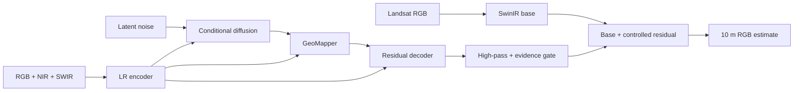

# Progress Seminar Presentation Content

## Evidence-Constrained Diffusion-Driven GAN for Cross-Sensor Satellite Image Super-Resolution

This document is the complete page-by-page content for a 25-30 minute progress
seminar. Keep the slide text short. Use the speaker notes to explain the slide rather
than reading paragraphs from the screen.

## Presentation rule

Every technical answer should follow this order:

1. explain the idea in one plain-language sentence;
2. explain how it is implemented;
3. state what it does not guarantee.

---

## Page 1 - Title

### On the slide

**Evidence-Constrained Diffusion-Driven GAN for 3x Cross-Sensor Satellite Image Super-Resolution**

- Landsat 8/9: 30 m input
- Sentinel-2: 10 m reference
- Progress seminar
- Name, enrollment number, supervisor, department, date

### What to say

> My research investigates whether a generative model can transform a real Landsat
> 30 m observation into a useful Sentinel-like 10 m RGB estimate while explicitly
> controlling unsupported detail. The goal is not simply to create a sharper-looking
> image. The goal is to improve spatial detail without silently violating the measured
> low-resolution evidence.

### Suggested visual

One equal-footprint triptych: native Landsat 30 m, model output, Sentinel-2 reference.

---

## Page 2 - Start with one pixel

### On the slide

**What does one satellite pixel mean?**

- A 30 m Landsat pixel summarizes roughly `30 m x 30 m = 900 m2`.
- A 10 m Sentinel pixel summarizes roughly `10 m x 10 m = 100 m2`.
- One 30 m pixel corresponds geometrically to a `3 x 3` group of 10 m samples.
- The sensor measures mixed reflected energy, not a photograph of nine hidden pixels.

### What to say

> Imagine a 30 m pixel containing part road, part soil, and part vegetation. Landsat
> records one mixed value. Sentinel samples the same nominal area more densely. Super
> resolution asks the model to estimate a plausible 3 by 3 arrangement from the mixed
> observation and patterns learned from paired examples.

### Audience interaction

Ask: **Can one number uniquely determine nine unknown numbers?**

Expected answer: No. The problem is ill-posed; several HR arrangements can produce a
similar LR observation.

---

## Page 3 - What is spatial resolution?

### On the slide

**Spatial resolution is ground area represented by one image sample**

| Sensor | Nominal RGB sampling | Smaller objects visible? |
|---|---:|---|
| Landsat 8/9 OLI | 30 m | Less |
| Sentinel-2 MSI | 10 m | More |

- Smaller ground sampling distance means denser spatial sampling.
- It does not automatically mean better spectral, temporal, or radiometric quality.

### What to say

> Resolution is multidimensional. Spatial resolution describes sampling on the ground.
> Spectral resolution describes wavelength bands, radiometric resolution describes
> sensitivity to intensity, and temporal resolution describes revisit frequency. My
> model changes the spatial sampling grid; it does not improve all four dimensions.

---

## Page 4 - What is super-resolution?

### On the slide

**Super-resolution estimates an HR image from an LR observation**

```text
LR measurement + learned prior -> HR estimate
```

- Bicubic interpolation increases array size but does not infer scene-specific detail.
- Learned SR uses examples to estimate likely edges, boundaries, and textures.
- The output is an estimate, not a new physical measurement.

### What to say

> Enlarging 128 by 128 to 384 by 384 is not itself super-resolution. Bicubic produces
> smoother intermediate values. A learned SR model tries to infer spatial structure,
> but every inferred detail must be treated according to its evidence and uncertainty.

---

## Page 5 - If high-resolution satellites exist, why use SR?

### On the slide

**Why not always download the 10 m image?**

- Historical coverage: Landsat provides a much longer archive.
- Cloud-free availability: the HR sensor may be cloudy or missing at the required date.
- Revisit and continuity: one mission cannot observe every location at every useful time.
- Cost and access: very-high-resolution commercial imagery may be restricted.
- Sensor failure, transmission gaps, and incomplete regional coverage occur.
- Long-term studies require a consistent temporal record.

### What to say

> If a valid Sentinel-2 image exists for the exact place and date, it should be used
> instead of an SR estimate. SR is useful when the desired high-resolution observation
> is unavailable, cloudy, temporally mismatched, too expensive, or absent from the
> historical archive. It can support harmonized monitoring, but must not be presented as
> a replacement for actual measurement.

### Audience interaction

Ask: **Would you use generated SR or an available cloud-free Sentinel image?**

Answer: Use the real observation. SR addresses missing or lower-resolution cases.

---

## Page 6 - Where can SR help?

### On the slide

- Land-cover mapping and change screening
- Agricultural field-boundary interpretation
- Urban expansion monitoring
- Coastline, river, and water-body delineation
- Disaster-response visualization when recent HR data are unavailable
- Preparing more spatially detailed inputs for downstream research

### Important warning

**Use SR for analysis support, not as unquestioned ground truth.**

### What to say

> An SR product can reveal patterns useful for screening and model input. For legal
> boundaries, property disputes, navigation, or safety-critical decisions, generated
> details require independent validation.

---

## Page 7 - What SR can and cannot recover

### On the slide

| Can do | Cannot guarantee |
|---|---|
| Estimate likely high-frequency structure | Recover the unique hidden reality |
| Improve similarity to paired references | Create information that was measured nowhere |
| Use multispectral context | Prove every generated edge exists |
| Quantify sample uncertainty | Make uncertainty disappear |
| Preserve LR evidence approximately | Correct a badly registered training pair |

### What to say

> The scientific question is not whether the output looks sharp. It is whether it is
> closer to a held-out reference, remains compatible with Landsat, generalizes to new
> geography, and identifies where its detail is unreliable.

---

## Page 8 - Research problem

### On the slide

**Input:** real Landsat 8/9 Level-2 surface reflectance RGB at 30 m

**Reference:** real Sentinel-2 L2A surface reflectance RGB at 10 m

**Output:** `3 x 384 x 384` Sentinel-like RGB from `3 x 128 x 128` Landsat RGB

**Optional guidance:** Landsat NIR, SWIR1, and SWIR2

**Primary target:** improve PSNR and SSIM without degrading the deterministic base

### What to say

> This is real cross-sensor 3x super-resolution. It is harder than synthetic SR because
> the LR input is not generated from the target. Landsat and Sentinel are different
> observations from different instruments and possibly different times.

---

## Page 9 - Evolution of the work

### On the slide

```text
Phase 1: synthetic Sentinel 40 m -> Sentinel 10 m, 4x
Phase 2: real Landsat 30 m -> Sentinel 10 m, 3x
Phase 3: sensor harmonization + RGB-base/multispectral-guidance separation
```

### What to say

> The first phase tested architecture and software using synthetic degradation, where
> alignment is exact. The supervisor-directed second phase replaced simulated LR with
> real Landsat. This makes the question more useful but introduces spectral, radiometric,
> spatial, and temporal differences. The current phase addresses those measured failure
> modes rather than simply increasing model size.

---

## Page 10 - Why cross-sensor pairing is difficult

### On the slide

**Four differences must be separated**

1. **Spatial:** 30 m versus 10 m sampling and different point-spread functions.
2. **Spectral:** OLI and MSI bands have different wavelength response curves.
3. **Radiometric:** atmosphere, calibration, illumination, and processing differ.
4. **Temporal:** even a short date gap can contain real scene change.

Also: projection, geolocation, view angle, cloud masks, and resampling.

### What to say

> A Landsat-Sentinel pixel difference is not automatically missing spatial detail. It may
> be color response, haze, seasonal change, or misregistration. If the dataset is wrong,
> a larger model learns the error more efficiently; it does not solve the science.

---

## Page 11 - Research questions

### On the slide

1. Can the model improve held-out PSNR and SSIM over bicubic and SwinIR?
2. Does latent diffusion add useful detail or only plausible texture?
3. Can an evidence gate suppress unsupported residuals?
4. Does train-only radiometric harmonization reduce the sensor domain gap?
5. Do NIR/SWIR bands help when they guide only the residual pathway?
6. Do improvements generalize spatially rather than memorize patches?

### Hypothesis

> A conservative RGB base plus evidence-gated, multispectral-conditioned residual
> generation will be safer than unrestricted full-image generation.

---

## Page 12 - Data sources and band mapping

### On the slide

| Role | Product | Bands used |
|---|---|---|
| LR input | Landsat 8/9 C2 L2 | B4 red, B3 green, B2 blue |
| Optional guidance | Landsat 8/9 C2 L2 | B5 NIR, B6 SWIR1, B7 SWIR2 |
| HR reference | Sentinel-2 L2A | B4 red, B3 green, B2 blue at 10 m |
| Quality | Both products | QA, saturation, aerosol, SCL, no-data |

### What to say

> Surface reflectance is used instead of display RGB or raw digital numbers. The
> multispectral model predicts only RGB. NIR and SWIR are evidence channels, not output
> colors.

---

## Page 13 - Pair creation

### On the slide

1. Discover complete Landsat and Sentinel products.
2. Match scenes by geographic overlap and smallest acquisition-date gap.
3. Convert metadata-scaled digital numbers to surface reflectance.
4. Use the Sentinel 10 m grid as the spatial reference.
5. Reproject Landsat directly to the corresponding 30 m grid.
6. Intersect both sensors' validity masks.
7. Reject patches below 95% valid support.
8. Store tensors and product provenance in NPZ plus JSONL manifest.

### Key settings

- Maximum day gap: 3 days
- HR patch: `384 x 384`, stride 288
- LR patch: `128 x 128`

---

## Page 14 - Equal footprint, unequal dimensions

### On the slide

```text
Landsat:  128 pixels x 30 m = 3840 m
Sentinel: 384 pixels x 10 m = 3840 m
```

- Both patches cover the same nominal `3.84 km x 3.84 km` ground area.
- Displaying them at equal panel width does not imply equal native resolution.
- Bicubic `384 x 384` contains no new measured information.

### Audience interaction

Ask: **Why can the 128-pixel image appear the same physical size on a slide?**

Answer: Plotting software scales both arrays to the panel dimensions. Native sample count
and ground sampling distance remain different.

---

## Page 15 - Quality masks and quarantine

### On the slide

Reject or mask:

- cloud, cirrus, cloud shadow, snow, no-data;
- radiometric saturation;
- high aerosol where QA is available;
- invalid SAFE borders and black background;
- insufficient overlap or valid fraction;
- obvious spatial displacement or temporal change during manual audit.

### What to say

> A valid fraction checks usable pixels, but it cannot prove subpixel registration. Pair
> diagnostics must inspect roads, riverbanks, coastlines, and field boundaries. Rejected
> patches should be quarantined with reasons rather than silently deleted.

---

## Page 16 - Train, validation, and test design

### On the slide

**Current development experiment**

- Spatial train/validation/test blocks within each tile
- Guard bands prevent overlapping windows from crossing split boundaries
- Every available tile contributes validation and test examples

**Final generalization experiment**

- Hold out complete geographic tiles or cities
- Report per-tile results and cross-validation

### What to say

> Random patch splitting is invalid because neighboring patches overlap and share texture.
> The current within-tile spatial split supports development when few tiles are available.
> It does not replace final complete-tile holdout, which is required for a strong claim of
> geographic generalization.

---

## Page 17 - Baselines and fairness

### On the slide

- Bicubic interpolation
- Deterministic SwinIR base
- RGB GeoDiff-GAN
- Multispectral GeoDiff-GAN
- Harmonized RGB GeoDiff-GAN
- Harmonized multispectral-guided GeoDiff-GAN
- External recent SR methods under a separate fair benchmark protocol

Fair comparison requires identical pairs, masks, splits, test indices, and metrics.

### What to say

> SwinIR is not merely an internal component. It is the strongest safety baseline. The
> complete model should not be called an improvement unless it beats the exact embedded
> base on held-out data.

---

## Page 18 - Architecture in one picture

### On the slide



### One-sentence explanation

> SwinIR reconstructs the conservative image; diffusion and the decoder are allowed to
> propose only a gated residual.

---

## Page 19 - Why a deterministic base?

### On the slide

**SwinIR base: measurement-oriented reconstruction**

- Receives only calibrated RGB in the improved multispectral design.
- Uses local shifted-window attention.
- Upsamples with resize-convolution, not PixelShuffle.
- Preserves most low-frequency color and structure.
- Provides a fallback when the generative residual is unreliable.

### What to say

> An unrestricted generator can change the entire image. Residual decomposition assigns
> low-frequency responsibility to a deterministic model and limits stochastic generation
> to a correction. This does not guarantee truth, but it reduces the freedom to hallucinate.

---

## Page 20 - Why a residual VAE?

### On the slide

During training:

```text
target residual = Sentinel reference - SwinIR base
```

- VAE compresses the residual into a four-channel latent.
- For 3x patches, `384 x 384` residual becomes approximately `4 x 48 x 48` latent.
- Compression makes diffusion computationally practical.
- KL regularization organizes the latent space.

### What to say

> The VAE does not super-resolve by itself. It learns a compact language for what the base
> missed. At inference, the VAE encoder is not given the unknown Sentinel target.

---

## Page 21 - Why latent diffusion?

### On the slide

- Starts from Gaussian latent noise at inference.
- Iteratively denoises using LR features and sensor conditions.
- Models multiple plausible residuals for one LR observation.
- Uses velocity prediction with SNR weighting.
- Multiple samples estimate stochastic uncertainty.

### What to say

> Diffusion is useful because SR is one-to-many. However, plausibility is not fidelity.
> That is why the model also uses a deterministic base, spatial LR features, evidence
> gating, validation scale selection, and explicit comparison against the base.

---

## Page 22 - GeoMapper, decoder, and evidence control

### On the slide

**GeoMapper outputs**

- spatial content tensor;
- layer-wise FiLM style parameters;
- evidence-confidence map;
- edit-permission map for optional prompt editing.

**Decoder**

- combines mapped latent content with multi-scale LR skip features;
- predicts a detail residual rather than unrestricted RGB;
- high-pass filters the SR residual;
- multiplies it by evidence confidence.

### What to say

> Confidence answers: where does the LR observation support adding detail? Edit permission
> answers a separate question: where may a prompt change synthetic content? They must not
> be treated as the same gate.

---

## Page 23 - Optional prompt mode

### On the slide

Two operational modes:

| Mode | Purpose | Prompt strength | Label |
|---|---|---|---|
| SR | Evidence-constrained reconstruction | Null or weak | Reconstructed estimate |
| Edit | Counterfactual visualization | Strong | `synthetic_edit=true` |

### What to say

> Prompt editing is not part of the current PSNR/SSIM experiment. It is deliberately
> disabled while cross-sensor fidelity is being solved. Any edit-mode output must be
> labeled synthetic and must not be presented as an observed event or object.

---

## Page 24 - Training curriculum

### On the slide

1. **Base:** train SwinIR for pixel and structural fidelity.
2. **VAE/decoder preparation:** learn residual representation and reconstruction.
3. **Diffusion:** learn conditional residual-latent denoising.
4. **Joint:** tune LR encoder, mapper, decoder, and selected generative modules.
5. **Edit adapters:** optional future prompt-alignment stage.

### Improved joint policy

- maximum 8 epochs;
- learning rate at most `5e-6`;
- diffusion weights frozen;
- adversarial and perceptual losses disabled;
- early stopping on validation PSNR.

---

## Page 25 - Losses and what each one asks

### On the slide

| Loss | Question |
|---|---|
| MSE | Are pixel values correct? Directly related to PSNR |
| SSIM | Are local luminance, contrast, and structure correct? |
| Charbonnier | Is average robust reconstruction error small? |
| Multiscale MSE | Is fidelity maintained at coarse and fine scales? |
| Radiometric | Are channel means and contrast stable? |
| Residual supervision | Is the correction equal to what the base missed? |
| Base guard | Did the full model become worse than the base? |

### What to say

> A loss weight is not an accuracy percentage. Loss magnitudes differ, so weights must be
> interpreted together with their weighted contributions and validation metrics.

---

## Page 26 - Metrics

### On the slide

- **L1/MAE:** average absolute reflectance error; lower is better.
- **PSNR:** pixel fidelity derived from MSE; higher is better.
- **SSIM:** local structural similarity; higher is better.
- **Edge F1:** target-edge precision/recall balance; higher is better.
- **LPIPS/DISTS:** learned perceptual distances; lower is better.
- **Re-degradation L1:** approximate Landsat evidence consistency; lower is better.

### Critical statement

> PSNR is not "percentage accuracy," and a sharp image is not necessarily correct.

### What to say

> The primary supervisor-directed objective is currently PSNR and SSIM. Edge and
> perceptual metrics remain secondary diagnostics. All full-reference metrics depend on
> pair quality and registration.

---

## Page 27 - Diagnostic images and what they reveal

### On the slide

- Input LR: actual Landsat observation
- Base HR: deterministic SwinIR reconstruction
- Decoder residual: proposed signed detail
- Final output: base plus controlled residual
- Absolute-error map: where prediction differs from Sentinel
- LR-error map: consistency after re-degradation
- Fourier plot: periodic or grid artifacts
- Wavelet/edge maps: retained high-frequency content
- Confidence/abstention maps: where detail is accepted or suppressed

### What to say

> Diagnostic images are not decorative. A repeated residual across unrelated inputs means
> the decoder is using a texture shortcut. Lattice peaks in Fourier space can reveal
> upsampling artifacts that may not be obvious from aggregate PSNR.

---

## Page 28 - Preliminary results before the new improvement

### On the slide

**Preliminary single-split test, 28 patches, 4 samples, 20 diffusion steps**

| Experiment | L1 lower | PSNR higher | SSIM higher | Edge F1 higher |
|---|---:|---:|---:|---:|
| RGB standard | 0.01426 | **33.44** | **0.8580** | 0.0712 |
| RGB fidelity | 0.01507 | 33.29 | 0.8510 | 0.0340 |
| Multispectral fidelity | 0.01546 | 32.97 | 0.8538 | **0.0904** |

### Interpretation

- RGB standard had the best preliminary PSNR/SSIM among the three full models.
- Multispectral improved edge F1 but reduced pixel fidelity.
- These results do not yet prove improvement over the exact embedded SwinIR base.
- Twenty-eight patches are diagnostic evidence, not a final statistical conclusion.

### What to say

> I report the negative result directly: simply adding fidelity weights or feeding six
> bands to the whole network did not reliably improve reconstruction. The failure guided
> the next experiment.

---

## Page 29 - Why did the complete model underperform?

### On the slide

1. Cross-sensor radiometric mismatch remained in the input-target pair.
2. The old multispectral base mixed NIR/SWIR directly into RGB reconstruction.
3. Diffusion can generate plausible but pixel-inaccurate residuals.
4. Joint tuning can move the decoder toward training-specific texture.
5. Residual confidence may be weak or spatially uninformative.
6. Registration and temporal differences impose an upper bound on PSNR.
7. A small test set creates noisy model rankings.

### What to say

> The response is not to increase GAN weight or immediately use a larger model. The
> correct response is to isolate sensor calibration, residual conditioning, data quality,
> and base regression in controlled experiments.

---

## Page 30 - Current improvement: harmonized dual stream

### On the slide

**Improvement A: train-only RGB harmonization**

```text
Sentinel_30m = slope * Landsat_30m + offset
```

**Improvement B: separate responsibilities**

- RGB only -> deterministic SwinIR base
- RGB + NIR + SWIR -> LR encoder and residual guidance

**Improvement C: conservative optimization**

- frozen diffusion during joint tuning;
- distortion-only objective;
- shorter joint stage;
- validation can reject the residual.

### What to say

> Calibration coefficients are fitted only from training patches. Validation and test
> targets are never used. NIR/SWIR can guide spatial interpretation but cannot directly
> shift the base RGB colors.

---

## Page 31 - Next controlled experiment

### On the slide

| Experiment | RGB harmonization | Base input | Residual input |
|---|---|---|---|
| RGB fidelity | No | RGB | RGB |
| Multispectral fidelity | No | Six bands | Six bands |
| RGB harmonized | Yes | RGB | RGB |
| Multispectral guided | Yes | RGB | Six bands |

### Predefined acceptance criteria

- `PSNR delta versus base > 0`
- `SSIM delta versus base >= 0`
- `L1 improvement versus base > 0`
- improvement on a useful fraction of individual patches and multiple folds
- no systematic color drift or periodic residual artifacts

### Validation safety rule

Residual scale is selected from `[0, 0.25, 0.5, 0.75, 1]`. If the learned residual
does not beat the base by at least `0.05 dB` PSNR without lowering SSIM, use scale zero.

---

## Page 32 - What is novel and what is not?

### On the slide

**Established components**

- SwinIR, VAE, diffusion U-Net, FiLM/modulated decoding, GAN discriminators, wavelets

**Candidate contribution of this work**

- deterministic-stochastic residual decomposition for satellite SR;
- separate evidence confidence and prompt edit permission;
- policy-separated detail and edit residuals;
- uncertainty-aware return toward a deterministic base;
- cross-sensor RGB-base/multispectral-residual separation;
- train-only harmonization plus explicit final-versus-base acceptance.

### What to say

> Combining known blocks is not automatically novel. Novelty becomes defensible only if
> the integration addresses a clear failure and controlled ablations demonstrate a
> reproducible benefit. Until those experiments are complete, I call these candidate
> contributions, not proven superiority or priority claims.

---

## Page 33 - Completed work

### On the slide

- Synthetic 4x and real cross-sensor 3x pipelines implemented
- Sentinel SAFE and Landsat Level-2 discovery, scaling, QA masking, pairing, and caching
- RGB and six-band multispectral patch formats
- Small, medium, and multispectral GeoDiff-GAN variants
- PixelShuffle removed in favor of resize-convolution
- Stage-wise training, auto-resume, early stopping, best/latest checkpoint retention
- Debug tensors, intermediate visualizations, Fourier, wavelet, confidence, uncertainty
- PSNR, SSIM, edge F1, LPIPS, DISTS, consistency, and per-patch evaluation
- Train-only radiometric calibration and dual-stream architecture implemented
- Kaggle, Colab, and DGX workflows; reproducibility documentation and tests

### Evidence of software validation

- Generated notebook code cells validated
- Full repository test suite passing
- Experiments stored in isolated directories with resolved configs and manifests

---

## Page 34 - Limitations and responsible use

### On the slide

- Sentinel is a reference observation, not perfect hidden ground truth.
- Misregistration can make a correct-looking result score poorly or teach false edges.
- Global affine calibration cannot remove nonlinear spectral differences.
- Three-day pairing does not guarantee no land-cover change.
- Generative detail may be plausible but false.
- Current patch counts and geographic diversity are insufficient for broad claims.
- Prompt edits must be labeled synthetic.

### What to say

> The model output should be described as a Sentinel-like estimate conditioned on Landsat,
> not as a physically observed 10 m Landsat image. Raw products, provenance, uncertainty,
> and reference data must remain available to the analyst.

---

## Page 35 - Remaining work

### On the slide

1. Run harmonized RGB and multispectral-guided experiments.
2. Compare exact embedded base versus final model per patch and per tile.
3. Audit calibration coefficients and registration-shift distributions.
4. Run spatial K-fold and complete-tile holdout evaluation.
5. Compare against recent open-source SR baselines under the same protocol.
6. Add multiple seeds and confidence intervals.
7. Reintroduce wavelet/GAN terms only after fidelity improvement is established.
8. Evaluate grounded captions and edit mode separately from reconstruction.
9. Use QGIS for current analysis; evaluate ArcGIS integration as planned work.
10. Prepare paper figures, ablations, compute table, and failure-case appendix.

---

## Page 36 - Expected outcome

### On the slide

The study may produce one of three scientifically valid outcomes:

1. Full GeoDiff-GAN improves both fidelity and detail.
2. SwinIR remains best for reconstruction, while diffusion helps only perceptual/edit mode.
3. Cross-sensor pair uncertainty dominates model differences and requires better data first.

### What to say

> A thesis is not invalid if the most complex model does not win. A rigorous negative
> result with controlled diagnosis is stronger than selecting only favorable images. The
> decision will be based on held-out measurements, not architectural preference.

---

## Page 37 - Final conclusion

### On the slide

**Three takeaways**

1. SR is useful when a matching HR observation is unavailable, but its output is an estimate.
2. Real Landsat-to-Sentinel SR is a sensor-harmonization and registration problem as well as an upsampling problem.
3. The proposed system controls generative detail with a deterministic RGB base, multispectral residual guidance, evidence gating, uncertainty, and validation fallback.

### Closing statement

> The current contribution is an evidence-controlled experimental framework. The next
> result must demonstrate whether its learned residual adds measurable information beyond
> SwinIR without sacrificing spatial and radiometric fidelity.

---

## Page 38 - Thank you / discussion

### On the slide

**Thank you**

Questions and critical feedback are welcome.

Prompt the panel with:

- Is the current train-only affine harmonization sufficient, or should nonlinear sensor-response calibration be tested?
- Which final geographic holdout would best represent deployment?
- Should reconstruction and perceptual/edit objectives be reported as separate operating points?

---

# Optional Backup Pages

## Backup A - Core equations

For Landsat input `y`, Sentinel reference `x`, deterministic base `B`, and residual
generator `R`:

```text
x_base = B(y_RGB)
r_hat = R(y_RGB,NIR,SWIR,z)
x_hat = clip(x_base + confidence * high_pass(r_hat), 0, 1)
```

For normalized images:

```text
PSNR = -10 log10(MSE)
```

The residual is accepted only when validation confirms improvement over `x_base`.

## Backup B - Tensor sizes for the 3x model

| Tensor | Shape |
|---|---:|
| Landsat RGB | `3 x 128 x 128` |
| Landsat multispectral | `6 x 128 x 128` |
| SwinIR base | `3 x 384 x 384` |
| LR features | `24x128`, `48x64`, `96x32`, `96x16` |
| Residual latent | approximately `4 x 48 x 48` |
| Mapper content | approximately `48 x 48 x 48` in the small model |
| Final RGB | `3 x 384 x 384` |

Batch dimension is omitted.

## Backup C - Why resize-convolution?

PixelShuffle rearranges channels into spatial phases. Unequal phase learning can create
periodic lattice artifacts. Resize-convolution first resizes the feature map and then
applies a conventional convolution, reducing phase imbalance. It does not automatically
guarantee artifact-free output; Fourier diagnostics remain necessary.

## Backup D - Reproducibility record

For each experiment retain:

- Git commit and branch;
- resolved YAML configuration;
- manifest and calibration snapshot;
- random seed and environment versions;
- stage initialization checkpoint;
- best and latest checkpoints;
- validation selection decision;
- aggregate and per-patch metrics;
- saved outputs and diagnostic figures.

## Backup E - How to present preliminary results honestly

Use these exact labels:

- **Preliminary:** limited patches, one split, or one seed.
- **Diagnostic:** intended to identify failures, not claim generalization.
- **Reference target:** Sentinel paired observation, not hidden truth.
- **Generated estimate:** model output.
- **Candidate contribution:** mechanism awaiting ablation.

Never use `accuracy` as a substitute for PSNR, SSIM, MAE, edge F1, or perceptual
distance.
