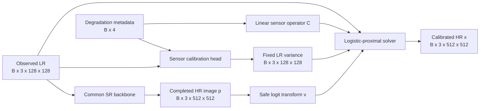
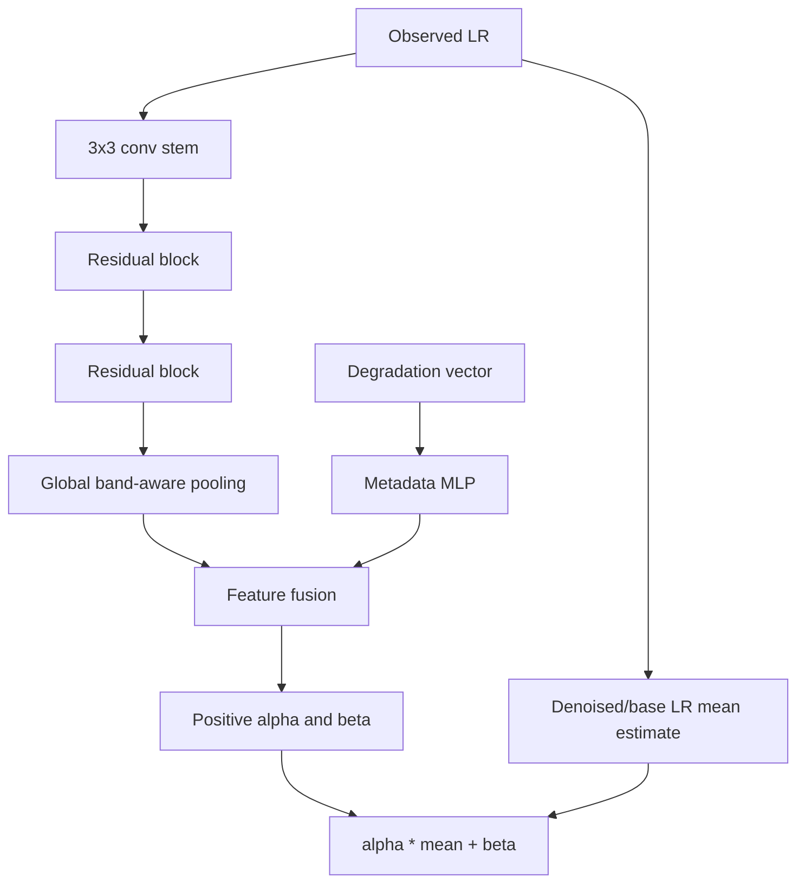

# 39 - SensorCal-LogisticProx Architecture

## Learning Objectives

- trace the proposed wrapper from LR input to calibrated HR output;
- calculate tensor shapes at every interface;
- integrate the wrapper without changing the existing SR backbone;
- distinguish backbone uncertainty from observation covariance;
- understand deterministic and stochastic inference paths.

## 1. Architectural principle

The proposed method is an output wrapper around a completed conditional SR
prediction:



The backbone architecture remains unchanged for the frozen pilot.

## 2. Inputs and outputs

### 2.1 Backbone inputs

For RGB:

\[
y\in[0,1]^{B\times3\times128\times128}.
\]

The existing GeoDiff-GAN may also receive:

- text context;
- degradation parameters;
- mode token;
- stochastic diffusion seed.

### 2.2 Completed prediction

The wrapper receives:

\[
p\in[0,1]^{B\times3\times512\times512}.
\]

Convert to logits:

\[
v=\operatorname{logit}
\left[
\operatorname{clip}(p,\epsilon,1-\epsilon)
\right].
\]

Preferred long-term implementation: expose pre-sigmoid or pre-clamp logits
from the decoder. Initial implementation: use the safe inverse transform above.

### 2.3 Calibration output

The calibration head produces diagonal LR variance:

\[
\hat{s}^2
\in
\mathbb{R}_{>0}^{B\times3\times128\times128}.
\]

It may first produce:

\[
\alpha,\beta\in\mathbb{R}_{>0}^{B\times3}
\]

and combine them with an LR mean estimate:

\[
\hat{s}_{b,i}^2
=
\alpha_b\hat{\mu}_{b,i}+\beta_b.
\]

### 2.4 Solver outputs

The solver returns:

- calibrated HR image \(\hat{x}\);
- dual variable \(\lambda\);
- predicted observation residual
  \(\hat{\eta}=y-C\hat{x}\);
- convergence diagnostics;
- optional implicit-gradient state.

Shapes:

\[
\hat{x}:B\times3\times512\times512,
\]

\[
\lambda,\hat{\eta}:B\times3\times128\times128.
\]

## 3. Calibration-head design

The initial head should be intentionally small:



Reasons for low capacity:

- fewer opportunities to memorize target error;
- interpretable band-level coefficients;
- lower pilot cost;
- easier comparison with oracle parameters;
- simpler reliability diagnostics.

Only add a spatial variance residual after proving that global/band-aware
parameters are insufficient.

## 4. Interaction with GeoDiff-GAN

Current GeoDiff-GAN sampling produces:

- deterministic base;
- denoised latent;
- mapped content and policies;
- residual decoder output;
- back-projected HR image.

For the controlled pilot, choose one clearly defined backbone output:

1. disable existing back-projection;
2. run the completed diffusion/decoder prediction;
3. pass that prediction to every output-layer arm;
4. apply exactly one selected consistency mechanism.

Do not compare:

- GeoDiff-GAN with three old back-projection steps,
- another arm with no old back-projection,
- SensorCal with an additional solver.

That would confound the comparison.

## 5. Wrapper interface

A proposed high-level interface is:

```python
result = constraint_wrapper(
    prediction=backbone_output,
    observed_lr=batch["lr_rgb"],
    degradation=batch["degradation"],
    clean_lr=batch.get("clean_lr"),
    arm="sensorcal_logistic",
)
```

Return a structured result:

```python
ConstraintOutput(
    image=...,
    variance=...,
    residual_lr=...,
    dual=...,
    iterations=...,
    converged=...,
    diagnostics=...,
)
```

The clean LR is diagnostic/oracle information only. It must not enter the
SensorCal inference path.

## 6. Deterministic inference

For one backbone prediction and one LR observation:

1. estimate covariance once;
2. solve the fixed-covariance problem;
3. return calibrated HR and diagnostics.

This path measures output-layer effects without diffusion sampling variance.

## 7. Stochastic inference

For \(K\) diffusion samples:

\[
v^{(1)},\ldots,v^{(K)},
\]

use the same observed LR and, normally, the same estimated covariance:

\[
\hat{x}^{(k)}
=
\mathcal{P}
\left(
v^{(k)},y,C,\widehat{\Sigma}
\right).
\]

This permits pre/post comparison of diversity:

- variance in completed backbone outputs;
- variance after logistic-proximal calibration;
- LR row-space variation;
- sensor-nullspace variation.

Do not re-estimate covariance from each HR sample in the initial experiment.
That would mix observation uncertainty with posterior sample variation.

## 8. Evidence boundaries

The wrapper guarantees only properties of its mathematical objective and
solver tolerance. It does not guarantee:

- that generated HR texture is physically true;
- that estimated variance is genuine sensor noise;
- that the degradation operator matches real acquisition;
- that stochastic samples represent the exact conditional posterior.

The method remains an evidence-aware reconstruction, not a new measurement.

## 9. Parameter cost

The solver has no conventional learned convolution weights, but it has runtime
cost. The calibration head should report:

- trainable parameter count;
- peak activation memory;
- covariance-estimation latency;
- solver latency;
- total wrapper overhead.

Do not describe the method as lightweight based only on learned parameter
count. Iterative linear-operator calls may dominate inference time.

## Exercises

1. Calculate the number of HR and LR scalar variables for batch size one.
2. Explain why the dual variable lives on the LR grid.
3. Describe how to disable old back-projection fairly.
4. Explain why covariance should normally be shared across stochastic HR
   samples for one observed LR.
5. Identify three outputs that diagnostics must save.

## Mastery Checklist

- [ ] I can trace every tensor shape through the wrapper.
- [ ] I know how it attaches without changing the frozen backbone.
- [ ] I understand why old back-projection must be controlled.
- [ ] I distinguish observation covariance from diffusion diversity.
- [ ] I know the wrapper's guarantees and limitations.

Next: [40 - Convex Dual Solver and Implicit Differentiation](40_convex_solver_and_gradients.md).
