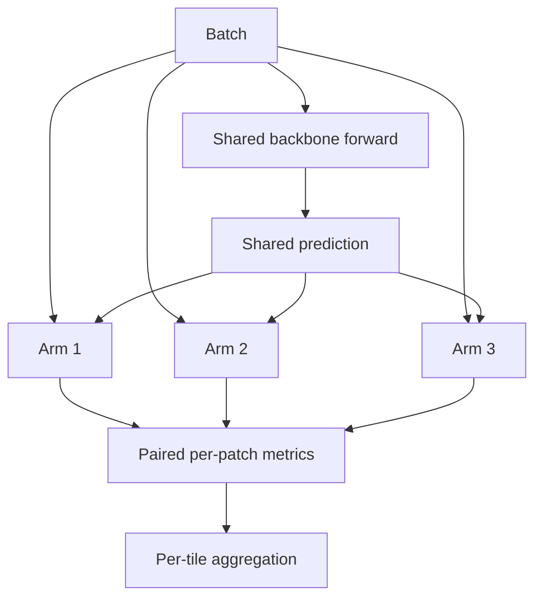

# 41 - Codebase Implementation Blueprint

## Learning Objectives

- map the proposed study onto concrete repository files;
- define stable interfaces before coding;
- preserve existing GeoDiff-GAN behavior;
- plan unit, integration, and scientific tests;
- understand which current functions can and cannot be reused.

## 1. Implementation status

The isolated SensorCal core is now implemented additively in:

- `src/geodiff_gan/constraints/` for linear operators, exact adjoints,
  Euclidean and logistic proximal layers, noise calibration, and six study
  arms;
- `src/geodiff_gan/experiments/constraint_study.py` for paired application of
  all arms to the same backbone prediction and LR observation;
- `tests/test_constraints.py` for operator, convergence, gradient, covariance,
  and six-arm smoke tests.

The full checkpoint-driven pilot CLI and large-scale geographic experiment
remain future work. Passing the isolated tests establishes implementation
correctness only; it does not validate the SensorCal research hypothesis.

## 2. Proposed file layout

```text
src/geodiff_gan/
  constraints/
    __init__.py
    operator.py
    logistic_prox.py
    euclidean_prox.py
    noise_calibration.py
    outputs.py
  experiments/
    constraint_study.py
  cli/
    constraint_pilot.py
tests/
  test_sensor_operator.py
  test_logistic_prox.py
  test_noise_calibration.py
  test_constraint_study.py
configs/
  constraint_pilot/
    common.yaml
    soft.yaml
    euclidean.yaml
    glinsat_hard.yaml
    logistic_fixed.yaml
    logistic_oracle.yaml
    sensorcal_logistic.yaml
```

Do not place all solver, model, metrics, and experiment code into
`training/trainer.py`. The existing trainer is already shared by multiple
stages.

## 3. Linear sensor operator

Proposed protocol:

```python
class LinearSensorOperator(Protocol):
    scale: int

    def forward(self, hr: torch.Tensor) -> torch.Tensor:
        ...

    def adjoint(
        self,
        lr: torch.Tensor,
        output_shape: tuple[int, int],
    ) -> torch.Tensor:
        ...
```

Requirements:

- no stochastic noise;
- no quantization;
- no clamp;
- shape-preserving channels;
- exact documented padding;
- batched degradation parameters;
- tested adjoint identity.

The current `sensor_degrade(..., add_noise=False)` is useful as a reference but
contains a final clamp. Refactor carefully or add a separate linear function.
Do not change current behavior silently.

## 4. Solver output

Use a dataclass rather than an unstructured tuple:

```python
@dataclass
class ProximalOutput:
    image: torch.Tensor
    dual: torch.Tensor
    observation_residual: torch.Tensor
    decomposition_residual: torch.Tensor
    iterations: torch.Tensor
    converged: torch.Tensor
    objective: torch.Tensor
```

Batch members may converge in different numbers of iterations. Preserve
per-sample status where practical.

## 5. Logistic-proximal layer

Proposed constructor:

```python
class LogisticProxLayer(nn.Module):
    def __init__(
        self,
        max_newton_iterations: int = 20,
        max_cg_iterations: int = 50,
        relative_tolerance: float = 1e-5,
        variance_floor: float = 1e-7,
        logit_epsilon: float = 1e-5,
        backward_mode: str = "unrolled",
    ) -> None:
        ...
```

Forward:

```python
def forward(
    self,
    logits: torch.Tensor,
    observed_lr: torch.Tensor,
    variance: torch.Tensor,
    operator: LinearSensorOperator,
    warm_start: torch.Tensor | None = None,
) -> ProximalOutput:
    ...
```

Start with unrolled differentiation for correctness. Add implicit backward only
after finite-difference tests pass.

## 6. Noise calibration module

Initial interface:

```python
@dataclass
class NoiseCalibrationOutput:
    variance: torch.Tensor
    alpha: torch.Tensor
    beta: torch.Tensor
    mean_lr: torch.Tensor


class SensorNoiseCalibrator(nn.Module):
    def forward(
        self,
        observed_lr: torch.Tensor,
        degradation: torch.Tensor,
    ) -> NoiseCalibrationOutput:
        ...
```

The first version should:

- predict positive band-level \(\alpha,\beta\);
- estimate or receive a deterministic LR mean;
- return diagonal LR variance;
- expose raw and bounded values for diagnostics.

Do not start with a large full-resolution U-Net variance estimator.

## 7. Arm adapter

All six arms should implement one interface:

```python
class ConstraintArm(Protocol):
    name: str

    def apply(
        self,
        prediction: torch.Tensor,
        observed_lr: torch.Tensor,
        degradation: torch.Tensor,
        oracle: dict[str, torch.Tensor] | None = None,
    ) -> ProximalOutput:
        ...
```

This makes evaluation pairing explicit and prevents each arm from loading data
or regenerating noise independently.

## 8. Dataset additions

The current dataset returns:

- `hr`;
- `lr`;
- `lr_rgb`;
- `clean_lr`;
- `degradation`;
- caption and patch identity.

Add derived values in the experiment collate or runner where possible:

```python
realized_noise = batch["lr_rgb"] - batch["clean_lr"]
```

Avoid storing duplicate LR arrays on disk. Training already regenerates LR
from HR.

If oracle covariance lookup requires simulator-native values such as Gaussian
standard deviation or Poisson peak, add a documented conversion helper from
the normalized four-vector. Do not alter manifest schema unless metadata must
persist across runs.

## 9. Experiment runner

The runner should:

1. load one backbone checkpoint;
2. produce one completed prediction per batch;
3. cache or retain the prediction in memory;
4. apply all requested arms to the same inputs;
5. compute paired metrics;
6. save per-patch rows;
7. aggregate by complete tile;
8. record solver failures.



Do not run six independent evaluation scripts that silently choose different
patch subsets.

## 10. CLI design

Example future command:

```bash
python -m geodiff_gan.cli.constraint_pilot \
  --config configs/constraint_pilot/common.yaml \
  --backbone-checkpoint runs/small/joint/best.pt \
  --arms soft,euclidean,glinsat_hard,logistic_fixed,logistic_oracle,sensorcal \
  --split test \
  --seeds 11,29,47 \
  --output runs/constraint_pilot
```

Required startup output:

- manifest path and hash;
- split counts and unique tile IDs;
- backbone checkpoint hash;
- enabled arms;
- operator definition;
- covariance source;
- solver tolerances;
- device and precision.

## 11. Test pyramid

### Unit tests

- forward shape;
- adjoint identity;
- positive variance;
- dual-gradient correctness;
- objective decrease;
- convergence on block averaging;
- finite-difference gradients.

### Integration tests

- one real dataset patch;
- each arm produces finite HR;
- same LR is used by all arms;
- deterministic repeatability;
- checkpoint round trip;
- CPU smoke test.

### Scientific tests

- oracle beats or matches fixed covariance on calibration;
- estimated covariance is compared with oracle;
- complete tile isolation;
- three-seed aggregation;
- pre-registered go/no-go report.

Passing unit tests does not prove the scientific hypothesis.

## 12. Backward compatibility

The current package supports Python 3.10 or newer. New code should:

- preserve existing public CLIs;
- avoid adding mandatory heavy dependencies;
- keep optional calibration/solver dependencies behind extras if needed;
- use PyTorch operations where possible;
- not change checkpoint keys of existing models;
- not modify official SOTA backbone architectures.

## 13. Debug hooks

Each solver call should optionally report:

- initial and final dual objective;
- gradient norm by Newton iteration;
- CG residual by inner iteration;
- variance statistics;
- sigmoid saturation fraction;
- decomposition residual;
- forward/adjoint timing;
- convergence reason.

Integrate these with the repository's existing `DiagnosticRecorder` pattern
rather than inventing unrelated logging conventions.

## Exercises

1. Explain why the experiment runner must own LR generation.
2. List the minimum fields in `ProximalOutput`.
3. State why a clamped forward operator cannot be used by the dual theorem.
4. Design a unit test for positive variance.
5. Explain the difference between a unit test and a scientific validation.

## Mastery Checklist

- [ ] I know where each proposed component belongs in the repository.
- [ ] I can define the operator, solver, calibrator, and arm interfaces.
- [ ] I understand why the runner must produce paired evaluations.
- [ ] I will preserve existing behavior and checkpoints.
- [ ] I know the required unit and integration tests.

Next: [42 - Data Preparation and Leak-Free Geographic Splits](42_data_and_splits.md).
