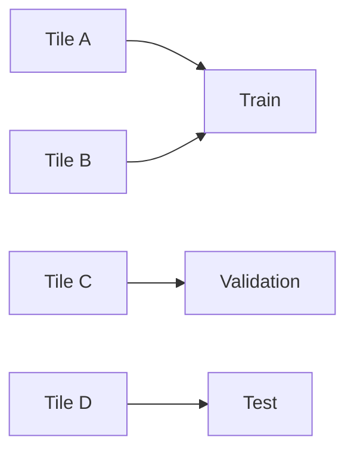
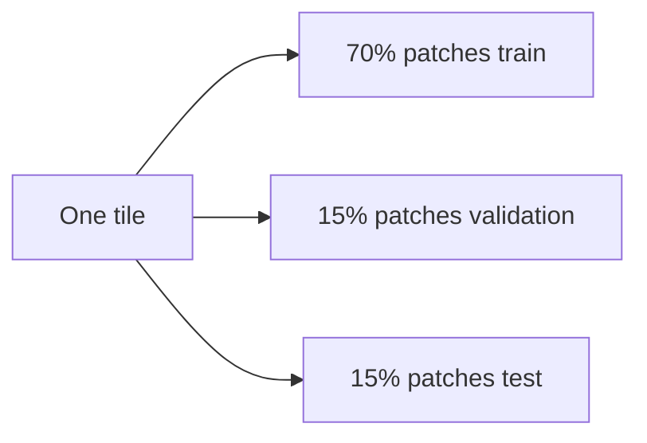

# 42 - Data Preparation and Leak-Free Geographic Splits

## Learning Objectives

- prepare native 10 m targets without storing redundant LR data;
- enforce complete-tile split isolation;
- distinguish pilot and final-study data requirements;
- construct deterministic paired validation observations;
- audit invalid, cloudy, saturated, and border patches.

## 1. Stored data

The recommended prepared patch contains:

- normalized native-resolution HR reflectance;
- optional multispectral condition tensor;
- source and spatial metadata in the manifest.

LR does not need to be stored. The current dataset synthesizes LR at load time
using the HR patch and a degradation generator.

Benefits:

- fresh degradation per training epoch;
- lower dataset size;
- configurable severity;
- exact clean/noisy LR pairing;
- reproducible deterministic validation.

## 2. Patch geometry

For the primary experiment:

| Item | Shape |
|---|---|
| HR RGB | \(3\times512\times512\) |
| LR RGB | \(3\times128\times128\) |
| Scale | 4 |
| Typical extraction stride | 384 |

Overlapping patches from one source tile are strongly correlated. They cannot
be treated as independent geographic samples.

## 3. Tile-level isolation

The manifest code contains
`validate_tile_split_isolation`, which raises an error if one MGRS tile appears
in multiple splits.

Correct:



Invalid:



Random patch splits from every tile leak land-cover texture, acquisition
conditions, roads, field patterns, and overlapping pixels.

## 4. Pilot split

The pilot needs:

- enough training tiles for the small calibration head;
- one complete validation region for model selection;
- one complete test region untouched until final pilot evaluation.

One held-out region is acceptable only for go/no-go. It is not enough for broad
geographic claims.

The statistical unit is the tile or geographic region, not the patch.

## 5. Full study split

A stronger journal study should include multiple complete regions representing:

- urban;
- agriculture;
- forest;
- coast or water;
- arid terrain;
- mountain or high-relief terrain where available.

The exact tile count depends on availability and compute. Do not invent a
universal minimum. Instead report:

- number of train, validation, and test tiles;
- number of valid patches;
- land-cover composition;
- acquisition dates and seasons;
- sensor/product versions;
- cloud and saturation filtering.

Generalization claims must not exceed represented test conditions.

## 6. Prefix-based products and duplicate SAFE discovery

Some Kaggle datasets contain an outer renamed `.SAFE` directory and an inner
true Sentinel product `.SAFE` directory. Product discovery must select actual
products, not count both wrappers.

Validate a candidate by checking for expected structure and raster bands,
rather than accepting every path ending with `.SAFE`.

Use stable product identity derived from the real source metadata or inner
Sentinel product name. This prevents:

- duplicate extraction;
- repeated patches;
- incorrect progress counts;
- train/test duplicates with different wrapper names.

## 7. Incremental preprocessing

When new SAFE products are added:

1. read the existing manifest;
2. collect completed source-product identities;
3. discover valid products;
4. skip completed products;
5. process only new products;
6. append atomically;
7. revalidate tile isolation and file existence.

Never delete existing prepared patches as part of routine incremental
discovery.

## 8. Patch validity and quarantine

Reject or quarantine patches with:

- nodata borders;
- black corners caused by reprojection support;
- excessive clouds;
- cloud shadows;
- invalid SCL classes;
- severe saturation;
- nonfinite values;
- insufficient valid fraction.

Keep quarantine metadata:

```json
{
  "source_product": "...",
  "row": 0,
  "col": 0,
  "reason": "black_border_fraction",
  "measured_value": 0.31,
  "threshold": 0.02
}
```

Quarantine records are useful for inspecting whether filtering is too strict.

## 9. Random training degradation

For every training access:

\[
(y,\theta,\mu)
\sim
\mathcal{D}(x).
\]

This gives different noise and degradation across epochs. It improves coverage
of the synthetic observation distribution.

For validation and test:

\[
(y_i,\theta_i,\mu_i)
=
\mathcal{D}_{s_i}(x_i),
\]

where \(s_i\) is a stable hash-derived seed.

Every experiment arm must receive these exact tensors.

## 10. Oracle data boundary

Synthetic evaluation may use:

- clean LR;
- realized noise;
- simulator parameters;
- Monte Carlo variance.

Mark these fields as:

- training supervision;
- oracle baseline input;
- diagnostic-only data.

The SensorCal inference path may use only observed LR and deployment-available
metadata.

## 11. Dataset audit report

Before training, generate:

- total records;
- split counts;
- unique tile counts;
- records per tile;
- valid-fraction histogram;
- HR intensity histograms by band;
- cloud/saturation rejection counts;
- missing-file count;
- duplicate source-window count;
- black-border quarantine count.

Also visualize random samples from every split. A valid JSON manifest does not
guarantee visually valid imagery.

## 12. Hashes and reproducibility

Record:

- manifest SHA-256;
- product list;
- preprocessing configuration;
- code commit;
- random degradation seed policy;
- quarantine file hash.

If a manifest is reassigned or filtered, write a new version rather than
silently changing the data behind an old experiment name.

## Exercises

1. Explain why overlapping patches from one tile are not independent.
2. Describe how to discover a valid inner SAFE product.
3. Give three reasons to retain quarantine metadata.
4. Explain why LR need not be stored.
5. State which oracle fields are forbidden during SensorCal inference.

## Mastery Checklist

- [ ] I can produce HR patches without storing redundant LR arrays.
- [ ] I enforce complete-tile split isolation.
- [ ] I understand incremental SAFE processing and duplicate wrappers.
- [ ] I quarantine invalid borders and clouds with reasons.
- [ ] I can generate deterministic paired validation observations.

Next: [43 - Training Protocol and Checkpointing](43_training_protocol.md).
