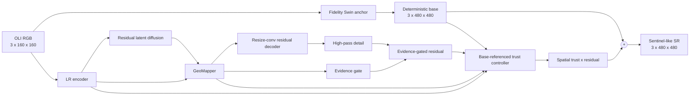

# GeoDiff-Fidelity on OLI2MSI

## 1. Starting point

The last held-out OLI2MSI result was:

| Method | PSNR | SSIM | L1 | Edge F1 |
|---|---:|---:|---:|---:|
| Bicubic | 31.9859 | 0.8800 | 0.01636 | 0.2094 |
| SwinIR base | 33.7650 | 0.9091 | 0.01271 | 0.6284 |
| GeoDiff-GAN, validation-selected scale | 33.7837 | 0.9096 | 0.01268 | 0.6398 |

The final model improved the base by only `0.0187 dB`. The deterministic base
is doing nearly all reconstruction work. Diffusion contains useful edge
information, but its residual is not reliable enough to add at full strength
everywhere. The earlier `35.87 dB` result was validation performance, not an
official test result.

## 2. Problems found in the old experiment

### 2.1 Weak deterministic anchor

The old OLI2MSI run used four compact window-transformer blocks at width 32. A
stronger base is justified because PSNR is dominated by reconstruction accuracy,
not generative texture.

### 2.2 Global residual scaling

Validation selected a global scale of `0.25`. That same value was applied to
flat land, roads, water boundaries and dense texture despite different local
reconstruction difficulty.

### 2.3 Sample-level guard

The old base guard compared one MSE per image. Damage in one region could be
cancelled by a small improvement elsewhere.

### 2.4 Training-sampling mismatch

Joint reconstruction losses used one-step clean estimates from uniformly
sampled diffusion timesteps, including very noisy states. Deployment uses the
final result of a multi-step sampler.

### 2.5 Wrong diffusion checkpoint fallback

The diffusion-only stage does not produce `val_psnr`. The trainer fell back to
`val_loss_total` while retaining `mode=max`, so it could save the checkpoint
with the largest validation loss. Fallback losses now use `mode=min`; the new
notebook explicitly selects `val_loss_diffusion` with `mode=min`.

### 2.6 Stale checkpoint lineage

An old downstream stage could auto-resume after its base changed. Every new
checkpoint stores its parent SHA-256, and each lineage gets a separate output
directory.

## 3. Updated architecture



### 3.1 Fidelity Swin anchor

The new base uses width 72, depth 12, six heads, three nested residual Swin
groups, a long shallow-feature skip, resize-convolution, and a zero-initialized
scene-level RGB gain/bias head. The radiometric head starts as the identity and
can learn systematic Landsat-to-Sentinel RGB differences without per-image
min/max normalization.

The full core model has `18,736,561` scalar parameters. Base, VAE, diffusion
and residual decoder all use resize-convolution in this variant; there is no
PixelShuffle module. The base detail head is zero-initialized, so the first
forward pass is exactly the clipped bicubic anchor rather than random detail.

### 3.2 Base-referenced trust projection

Let `b` be the base, `y` the target, `r` the evidence-gated high-pass residual,
and `tau` the predicted spatial trust:

```text
y_hat = b + tau * r
```

For each local window, the error-minimizing training target is:

```text
tau* = clip(mean(r dot (y - b)) / (mean(||r||^2) + epsilon), 0, tau_max)
```

This is a local least-squares projection. A residual pointing in the wrong
direction receives zero trust. The controller sees mapper content, LR features,
evidence confidence, base high-frequency energy and residual energy. Its last
layer starts at `tau=0.25`, matching the previous validation calibration.

### 3.3 Spatial excess-risk guard

The local guard penalizes:

```text
ReLU(local_MSE(y_hat, y) - local_MSE(b, y) + margin)
```

An easy region can no longer conceal damage in a difficult region.

### 3.4 Fidelity joint stage

The base remains frozen. In final refinement, diffusion and the LR encoder are
also frozen; only mapper, decoder and trust controller train. Reconstruction
uses the lower 35% of diffusion timesteps. GAN and natural-image perceptual
losses remain disabled. Sampled validation PSNR selects the checkpoint.

## 4. Novelty boundary

Uncertainty-aware diffusion is not new. UPSR controls regional diffusion noise,
SlimDiffSR uses uncertainty-guided timesteps, FaithDiff aligns degraded-input
features, and ASDDPM adds global semantics to remote-sensing diffusion.
Ada-RefSR also learns to gate an external reference, while SFG-SwinSR gates
high-frequency features inside Swin feed-forward blocks. LSSR already studies
diffusion priors with multimodal constraints for Landsat-to-Sentinel SR.

The defensible provisional contribution is narrower:

> A base-referenced local least-squares trust projection for accepting or
> rejecting sampled high-frequency residuals in paired cross-sensor satellite
> super-resolution.

Unlike uncertainty used only for noise perturbation or teacher filtering, this
trust target is the coefficient that directly minimizes reconstruction error
relative to the deterministic cross-sensor base. This remains a hypothesis
until literature review and matched ablations establish it.

The distinction from the closest 2026 methods must stay explicit. Ada-RefSR
regulates information from a separate reference through implicit correlation;
this model regulates its own generated residual against its deterministic
base. SFG-SwinSR gates latent frequency features; this model supervises the
output residual gain with a closed-form target-relative coefficient. Do not
claim that adaptive gating, high-pass residuals, Swin SR, or uncertainty are
individually novel.

Recent work to compare:

- [ASDDPM (2024)](https://arxiv.org/abs/2403.11078)
- [FaithDiff (CVPR 2025)](https://openaccess.thecvf.com/content/CVPR2025/html/Chen_FaithDiff_Unleashing_Diffusion_Priors_for_Faithful_Image_Super-resolution_CVPR_2025_paper.html)
- [UPSR (CVPR 2025)](https://openaccess.thecvf.com/content/CVPR2025/html/Zhang_Uncertainty-guided_Perturbation_for_Image_Super-Resolution_Diffusion_Model_CVPR_2025_paper.html)
- [DiffFuSR (2025)](https://arxiv.org/abs/2506.11764)
- [SlimDiffSR (2026)](https://arxiv.org/abs/2605.02198)
- [Selective Diffusion Distillation (AAAI 2026)](https://ojs.aaai.org/index.php/AAAI/article/view/38351)
- [Ada-RefSR (2026)](https://arxiv.org/abs/2602.01864)
- [SFG-SwinSR (2026)](https://arxiv.org/abs/2605.09687)
- [LSSR (2025)](https://arxiv.org/abs/2510.23382)

## 5. Why 35 dB is a target, not a guarantee

PSNR depends on data completeness, split, normalization, protocol, seed,
training duration and checkpoint selection. The update removes identified
failure modes and adds capacity, but cannot guarantee unseen test performance.

The notebook targets `>=35 dB` by requiring all `5,225` official training pairs
and `100` test pairs, using full `160 -> 480` frames, applying the official fixed
`clip(0, 0.3) / 0.3` conversion, fixing checkpoint selection and lineage, and
selecting residual scale only on validation. It stops if the full dataset is
missing rather than silently reporting a 38-pair training run.

## 6. Required ablations

| Ablation | Question |
|---|---|
| Legacy compact base | Is the old reference reproduced? |
| Fidelity base only | Is improvement only added capacity? |
| Fidelity base + fixed `0.25` gain | Does spatial trust beat a global scale? |
| Learned trust without oracle loss | Does least-squares supervision matter? |
| Learned trust without local guard | Does excess-risk control matter? |
| Parameter-matched decoder without trust | Is gain merely more parameters? |
| Full model | Does the complete method improve reliably? |

Report PSNR, SSIM, L1, ERGAS, SAM, UIQI, sCC, edge F1, and the fraction of test
pairs beating their own deterministic base. Use at least three seeds.

## 7. Acceptance criteria

- Evaluate all 100 official test pairs.
- Compare the final output with its embedded base, not a stale checkpoint.
- Beat fixed gain under matched training.
- Report variation across seeds or confidence intervals.
- Show meaningful error, trust and uncertainty maps.
- Avoid material spectral regression for a small PSNR gain.
- Archive config, commit, checkpoint hash and split IDs.

Reaching `35 dB` is useful but is not sufficient by itself to establish novelty.

## 8. Notebook

Run `kaggle/GeoDiff_GAN_OLI2MSI_FidelityTrust_3x.ipynb`. Set
`FAST_DEV_RUN=False` for the publication run. It converts full frames
restart-safely, trains four stages, audits lineage, selects residual scale on
validation, evaluates test once, saves figures, and packages metrics/configs.
