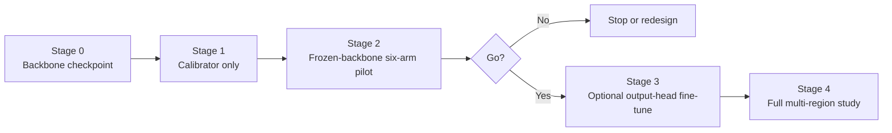

# 43 - Training Protocol and Checkpointing

## Learning Objectives

- train the calibration study in risk-reducing stages;
- isolate covariance estimation from backbone optimization;
- define early stopping and checkpoint selection;
- preserve paired fairness across experiment arms;
- know when end-to-end fine-tuning is justified.

## 1. Training philosophy

Do not start by jointly training:

- diffusion;
- GAN decoder;
- calibration head;
- iterative solver;
- discriminators.

That design would make failure impossible to localize.

Use staged training:



## 2. Stage 0: select the common backbone

Choose one checkpoint before training the calibration head.

Record:

- model variant;
- architecture configuration;
- checkpoint path and hash;
- training data and split;
- selected epoch;
- validation selection metric;
- whether old back-projection is disabled.

The pilot should not choose a different backbone checkpoint per arm.

## 3. Stage 1: train the noise calibrator

Freeze the SR backbone.

Inputs:

- observed LR;
- degradation metadata;
- optional frozen LR features.

Targets:

- realized synthetic residual;
- oracle variance or variance bins;
- optional simulator coefficients.

Initial loss:

\[
\mathcal{L}_{\mathrm{cal}}
=
\lambda_{\mathrm{nll}}\mathcal{L}_{\mathrm{noise\_nll}}
+
\lambda_{\mathrm{logvar}}\mathcal{L}_{\mathrm{logvar}}
+
\lambda_{\mathrm{param}}\mathcal{L}_{\mathrm{param}}
+
\lambda_{\mathrm{smooth}}\mathcal{L}_{\mathrm{smooth}}.
\]

Start with the smallest set justified by available targets. Do not add all
terms merely because they exist.

## 4. Stage 2: frozen-backbone six-arm pilot

For each deterministic evaluation batch:

1. compute one shared completed prediction;
2. construct fixed, oracle, and estimated covariance;
3. apply all six arms;
4. save paired per-patch results;
5. aggregate by tile;
6. record solver convergence and runtime.

Only the calibrator has seed-dependent learned parameters. Solvers should be
deterministic given inputs and tolerances.

## 5. Stage 3: optional output-head fine-tuning

Proceed only if Stage 2 passes the go/no-go gate.

Possible trainable components:

- final SR decoder/output head;
- calibration head;
- lightweight adapter before logits.

Keep frozen initially:

- most of diffusion U-Net;
- deterministic base;
- discriminators;
- text encoder.

Reason: the paper question concerns the output consistency mechanism. Fully
unfreezing the generative system can make improvements impossible to attribute.

## 6. Stage 4: full study

Train or evaluate selected arms on:

- multiple complete train regions;
- complete validation regions;
- complete unseen test regions;
- held-out degradation settings;
- operator-mismatch conditions.

Do not carry every failed pilot variant into the expensive study. Preserve
failed pilot results, but scale only scientifically necessary arms.

## 7. Optimizer guidance

For a small calibration head:

- AdamW is a practical default;
- use a lower learning rate for any pretrained features;
- log gradient norm;
- clip only if instability is measured;
- do not tune on test tiles.

The solver itself normally has no optimizer state across training batches.
Its Newton/CG iteration controls are numerical hyperparameters, not learned
weights.

## 8. Early stopping

Select one validation objective before training. A calibration-oriented choice
can combine:

\[
\mathcal{S}_{\mathrm{val}}
=
\mathcal{L}_{\mathrm{NLL}}
+
\gamma
\left|
\operatorname{Var}(z)-1
\right|
+
\delta
\left|
\mathbb{E}[z]
\right|.
\]

Alternatively use validation NLL alone and report other metrics independently.

Do not select the checkpoint using test PSNR or whichever metric looks best
after training.

## 9. Best and last checkpoints

Save:

- `best.pt`: best predefined validation objective;
- `last.pt`: most recent complete epoch/update;
- `history.jsonl`: one compact record per validation event;
- `resolved_config.yaml`;
- `run_metadata.json`.

Avoid one checkpoint per epoch unless needed for a specific analysis. Excess
checkpointing consumes storage and complicates selection.

Checkpoint contents:

- calibration model state;
- optimizer and scheduler;
- current epoch/update;
- best metric and patience;
- random-number states;
- backbone checkpoint hash;
- manifest hash;
- solver configuration;
- covariance mode.

## 10. Resume behavior

On resume:

1. validate backbone hash;
2. validate manifest hash;
3. validate model configuration;
4. restore optimizer and scheduler;
5. restore random states;
6. continue from the next complete update;
7. retain previous best metric.

If hashes differ, fail loudly unless an explicit transfer-learning mode is
selected.

## 11. Three-seed protocol

Use at least three seeds for:

- calibrator initialization;
- training data order;
- random augmentation;
- random training degradation.

Validation degradation remains deterministic and identical.

Report:

- per-seed results;
- mean and standard deviation;
- tile-level paired intervals;
- failed runs.

Do not average checkpoints across seeds unless that is a predefined method.

## 12. Progress reporting

Training output should be compact:

```text
[sensorcal] epoch 3/20 batch 800/1600 loss=... eta=...
[sensorcal] validation nll=... z_mean=... z_var=... best=... patience=1/5
```

Use progress bars for batches but avoid printing full diagnostics every step.
Write detailed records to JSONL and render plots separately.

## 13. Stop conditions

Stop the research direction if:

- oracle covariance does not improve the pre-registered calibration target;
- estimated covariance is no better than fixed covariance;
- gains disappear across seeds;
- calibration improves only by unacceptable oversmoothing;
- solver failure rate is operationally high;
- variance mostly tracks operator mismatch rather than known synthetic noise.

Stopping after a negative pilot is successful research management.

## Exercises

1. Explain why the backbone is frozen in Stage 1 and Stage 2.
2. Define a validation checkpoint criterion without test leakage.
3. List all hashes checked on resume.
4. Explain the difference between optimizer iterations and Newton-CG
   iterations.
5. Give one condition that justifies Stage 3.

## Mastery Checklist

- [ ] I understand the four-stage risk-reducing protocol.
- [ ] I can train and select the calibrator without test leakage.
- [ ] I save only best, last, history, and resolved metadata.
- [ ] I can resume without silently changing data or backbone.
- [ ] I know the empirical conditions that stop the project.

Next: [44 - Reconstruction, Calibration, Diversity, and Efficiency Metrics](44_metrics_and_calibration.md).
