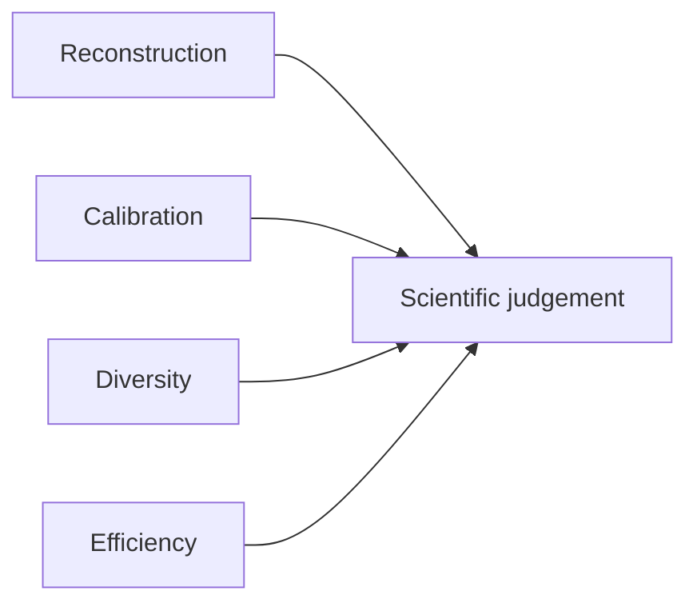

# 44 - Reconstruction, Calibration, Diversity, and Efficiency Metrics

## Learning Objectives

- evaluate more than PSNR and visual sharpness;
- compute noise calibration and standardized residual diagnostics;
- separate observation uncertainty from posterior diversity;
- measure row-space and sensor-nullspace variation;
- report solver cost and failures.

## 1. Four evaluation axes

A method is not successful merely because one axis improves.

## 2. Reconstruction metrics

### 2.1 L1 and PSNR

\[
\operatorname{L1}
=
\frac{1}{N}\lVert\hat{x}-x^*\rVert_1
\]

\[
\operatorname{PSNR}
=
-10\log_{10}
\left(
\operatorname{MSE}
\right)
\]

for data in \([0,1]\).

### 2.2 SSIM

SSIM measures local luminance, contrast, and structure. It is more
structure-aware than PSNR but can still favor smooth outputs.

### 2.3 LPIPS and DISTS

These perceptual metrics compare learned deep features. Lower is better.
They may reward plausible texture that is not spatially correct, so pair them
with distortion and consistency metrics.

### 2.4 Edge F1

Edge F1 evaluates whether predicted edges align with target edges under a
specified threshold and tolerance. Report those settings.

## 3. Sensor-domain metrics

Observed consistency:

\[
e_y
=
\lVert C\hat{x}-y\rVert_1.
\]

Clean consistency for synthetic data:

\[
e_\mu
=
\lVert C\hat{x}-\mu\rVert_1.
\]

These answer different questions. A hard method can minimize \(e_y\) while
reproducing noise and worsening \(e_\mu\).

Always report both in the synthetic study.

## 4. Noise recovery

Predicted residual:

\[
\hat{\eta}=y-C\hat{x}.
\]

Synthetic target residual:

\[
\eta^*=y-\mu.
\]

Metrics:

\[
\operatorname{MAE}_{\eta}
=
\lVert\hat{\eta}-\eta^*\rVert_1,
\]

\[
\operatorname{RMSE}_{\eta}
=
\sqrt{
\frac1m
\lVert\hat{\eta}-\eta^*\rVert_2^2
}.
\]

These measure decomposition quality, not covariance calibration alone.

## 5. Gaussian NLL

For diagonal variance:

\[
\operatorname{NLL}
=
\frac12
\sum_i
\left[
\frac{(\eta_i^*)^2}{\hat{s}_i^2}
+
\log\hat{s}_i^2
+
\log(2\pi)
\right].
\]

Use the residual whose distribution the covariance estimator was trained to
model. Clearly distinguish:

- simulator noise \(y-\mu\);
- model residual \(y-C\hat{x}\).

Model residual includes reconstruction error and is a harder calibration
target.

## 6. Standardized residual diagnostics

\[
z_i=\frac{\eta_i^*}{\hat{s}_i}.
\]

Report:

- mean of \(z\);
- variance of \(z\);
- skewness;
- excess kurtosis;
- fraction outside 1, 2, and 3 standard deviations;
- band-specific values;
- degradation-bin values.

Expected Gaussian reference coverage:

- approximately 68.3 percent inside 1 standard deviation;
- approximately 95.4 percent inside 2;
- approximately 99.7 percent inside 3.

Do not treat small deviations as failure without confidence intervals and
sample-size context.

## 7. Reliability by variance bin

Group pixels by predicted variance. For each bin, compare:

\[
\text{predicted variance}
\quad\text{with}\quad
\text{empirical squared residual}.
\]

A reliability curve plots:

\[
\mathbb{E}[\hat{s}^2\mid\text{bin}]
\quad\text{against}\quad
\mathbb{E}[(\eta^*)^2\mid\text{bin}].
\]

Perfect calibration follows the diagonal. Also report a scalar bin-weighted
calibration error, while retaining the plot.

## 8. Interval coverage

For Gaussian intervals:

\[
\mu_i\pm q_\alpha\hat{s}_i.
\]

Compute empirical coverage at several nominal levels, such as:

- 50 percent;
- 80 percent;
- 90 percent;
- 95 percent.

Coverage alone can be improved by very wide intervals. Pair it with interval
width or a proper score such as CRPS.

## 9. Posterior diversity

Generate \(K\) HR samples:

\[
\hat{x}^{(1)},\ldots,\hat{x}^{(K)}.
\]

Total sample variance:

\[
V_{\mathrm{total}}
=
\frac1K
\sum_k
\left\|
\hat{x}^{(k)}-\bar{x}
\right\|_2^2.
\]

This mixes sensor-observed and unobserved directions.

## 10. Row/null decomposition

For a linear operator \(C\), the Euclidean row-space projector is:

\[
P_{\mathrm{row}}
=
C^\top(CC^\top)^\dagger C.
\]

and:

\[
P_{\mathrm{null}}=I-P_{\mathrm{row}}.
\]

For centered sample difference:

\[
\delta^{(k)}
=
\hat{x}^{(k)}-\bar{x},
\]

measure:

\[
V_{\mathrm{row}}
=
\frac1K\sum_k
\lVert P_{\mathrm{row}}\delta^{(k)}\rVert_2^2,
\]

\[
V_{\mathrm{null}}
=
\frac1K\sum_k
\lVert P_{\mathrm{null}}\delta^{(k)}\rVert_2^2.
\]

For large images, compute these with operator solves rather than explicit
projector matrices.

Interpretation:

- hard consistency should suppress measurement-visible row variation;
- noisy consistency may retain some row variation depending on covariance;
- null variation represents ambiguity less visible to the LR operator.

This decomposition does not prove semantic correctness of diverse samples.

## 11. Efficiency metrics

Report:

- calibration-head parameter count;
- solver Newton iterations;
- total CG iterations;
- convergence rate;
- forward latency;
- backward latency;
- peak GPU memory;
- operator calls;
- warm-start policy;
- numerical precision.

Separate:

- backbone latency;
- calibration latency;
- solver latency;
- total latency.

## 12. Failure metrics

Count:

- nonconverged samples;
- NaN or Inf samples;
- variance-floor saturation;
- variance-ceiling saturation;
- excessive sigmoid saturation;
- clipped final outputs;
- operator-adjoint test failures.

Do not omit failed samples from averages without reporting them.

## 13. Current repository support

[metrics.py](../src/geodiff_gan/metrics.py) already implements:

- L1;
- PSNR;
- SSIM;
- edge F1;
- LR re-degradation L1;
- optional LPIPS;
- optional DISTS.

The proposed study must add calibration, residual-recovery, diversity, and
solver-cost metrics without changing existing definitions silently.

## Exercises

1. Explain why observed and clean LR consistency can move in opposite
   directions.
2. Distinguish residual recovery from variance calibration.
3. Explain why coverage requires interval width.
4. Describe row-space and null-space diversity.
5. List five solver-efficiency values required in a paper table.

## Mastery Checklist

- [ ] I evaluate reconstruction, calibration, diversity, and efficiency.
- [ ] I report both observed and clean consistency for synthetic data.
- [ ] I can compute standardized residual and reliability diagnostics.
- [ ] I understand row/null diversity and its limits.
- [ ] I report numerical failures rather than filtering them silently.

Next: [45 - Statistical Design and Go/No-Go Gates](45_statistics_and_go_no_go.md).
