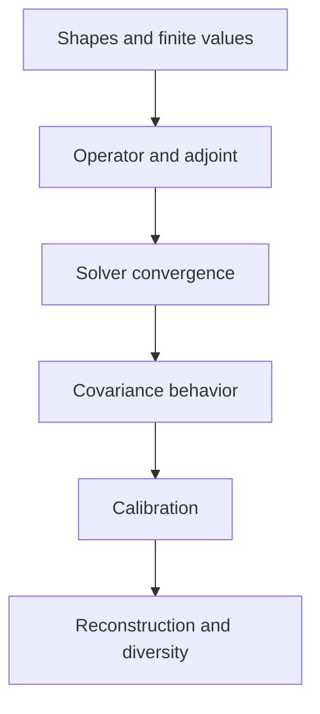

# 46 - Solver and Calibration Diagnostics

## Learning Objectives

- diagnose numerical, calibration, and reconstruction failures separately;
- design intermediate visual panels;
- recognize variance inflation, saturation, and operator mismatch;
- inspect solver trajectories without flooding notebook output;
- prepare shareable diagnostic reports.

## 1. Diagnostic hierarchy

Debug in this order:



Do not interpret image quality before verifying the operator and solver.

## 2. Tensor checks

Capture:

| Tensor | Expected shape |
|---|---|
| observed LR | \(B\times3\times128\times128\) |
| clean LR | \(B\times3\times128\times128\) |
| completed HR | \(B\times3\times512\times512\) |
| logits | \(B\times3\times512\times512\) |
| predicted variance | \(B\times3\times128\times128\) |
| dual | \(B\times3\times128\times128\) |
| calibrated HR | \(B\times3\times512\times512\) |

For each tensor report:

- minimum and maximum;
- mean and standard deviation;
- NaN and Inf count;
- fraction near configured bounds.

## 3. Operator diagnostics

### 3.1 Adjoint check

Report:

\[
\epsilon_{\mathrm{adj}}
=
\frac{
|\langle Cx,z\rangle-\langle x,C^\top z\rangle|
}{
|\langle Cx,z\rangle|
+
|\langle x,C^\top z\rangle|
+
\epsilon
}.
\]

### 3.2 Impulse response

Apply \(C\) to:

- centered impulse;
- corner impulse;
- horizontal line;
- vertical line;
- constant image.

This reveals:

- blur orientation;
- normalization;
- padding behavior;
- downsampling phase;
- border artifacts.

### 3.3 Constant preservation

For normalized blur and area downsampling:

\[
C\mathbf{1}\approx\mathbf{1}.
\]

Failure indicates normalization or boundary errors.

## 4. Solver trajectory

Save compact arrays rather than printing every CG step:

- Newton iteration index;
- dual objective;
- gradient norm;
- decomposition residual;
- CG iterations;
- step size;
- elapsed milliseconds.

Plot them after completion.

Expected:

- objective decreases;
- gradient norm decreases;
- decomposition residual decreases;
- step sizes remain finite.

Oscillation suggests:

- incorrect Hessian-vector product;
- wrong adjoint;
- step too aggressive;
- covariance too small;
- numerical precision problems.

## 5. Core overview panel

Recommended 3 by 4 panel:

1. observed LR upsample;
2. completed backbone HR;
3. calibrated HR;
4. target HR;
5. clean LR upsample;
6. re-degraded backbone;
7. re-degraded calibrated output;
8. observed LR error;
9. target absolute error before;
10. target absolute error after;
11. predicted standard deviation;
12. predicted observation residual.

Use consistent color scales for before/after error maps.

## 6. Calibration panel

Include:

- predicted variance histogram;
- oracle versus predicted scatter;
- reliability curve;
- standardized residual histogram;
- standardized residual Q-Q plot;
- coverage versus nominal coverage;
- predicted interval width;
- variance by degradation severity.

Do not visualize every variance map with independent min/max scaling. That can
make nearly constant maps look informative.

## 7. Diversity panel

For \(K\) stochastic samples show:

- sample mean HR;
- total standard deviation;
- pre-projection standard deviation;
- post-projection standard deviation;
- row-space variance map;
- null-space variance map;
- target absolute error;
- uncertainty-error correlation.

The map must be accompanied by scalar summaries. Attractive uncertainty maps
can be uncorrelated with actual error.

## 8. Variance inflation

Symptoms:

- variance rises throughout training;
- quadratic residual loss falls;
- NLL does not improve;
- many pixels hit variance ceiling;
- standardized residual variance becomes much smaller than one;
- intervals are very wide with excessive coverage.

Actions:

1. verify log determinant is included;
2. inspect target residual definition;
3. lower model capacity;
4. add oracle log-variance supervision;
5. tighten physically justified bounds;
6. check for operator mismatch.

## 9. Variance collapse

Symptoms:

- many values at floor;
- standardized residual variance much greater than one;
- severe undercoverage;
- strong noisy-LR fitting;
- output resembles hard consistency.

Actions:

- verify positivity transform;
- inspect NLL scaling;
- check units of reflectance and variance;
- increase floor only if physically justified;
- validate simulator parameter conversion.

## 10. Operator-error absorption

Run correct and mismatched operator cases. If covariance rises specifically in
regions with blur or registration mismatch, it is modeling residual
uncertainty rather than pure sensor noise.

Report this honestly. Possible responses:

- keep broad residual-uncertainty terminology;
- add operator-uncertainty conditioning;
- reject strongly mismatched samples;
- improve degradation estimation.

Do not relabel model error as aleatoric sensor noise.

## 11. Reconstruction failure modes

### Oversmoothing

- NLL improves;
- PSNR may improve;
- LPIPS and edges worsen;
- predicted variance can be too conservative.

### Noise copying

- observed LR error is extremely low;
- clean LR error worsens;
- high-frequency residual resembles random noise.

### Texture hallucination

- perceptual metric improves;
- target-aligned edge precision falls;
- diversity is high in smooth regions.

### Uniform covariance

- estimator reduces to fixed covariance;
- variance-map standard deviation is tiny;
- oracle gap remains open.

### Scene-content leakage

- variance follows land-cover texture rather than simulator noise parameters;
- calibration fails under unseen terrain.

## 12. Report directory

Recommended output:

```text
debug_constraint_patch_000150/
  report.json
  tensors.pt
  overview.png
  operator.png
  solver_curves.png
  calibration.png
  diversity.png
  metrics.json
  metadata.json
```

`metadata.json` should include:

- patch and tile identity;
- backbone checkpoint hash;
- arm;
- degradation parameters;
- solver configuration;
- covariance source;
- random seed.

## 13. Notebook output control

In long runs:

- update progress at controlled intervals;
- write detailed logs to disk;
- display only latest summary;
- avoid printing one line per CG iteration;
- save figures and show selected samples;
- preserve report paths for later sharing.

This prevents notebook output limits from hiding training progress.

## Exercises

1. Explain why the adjoint check precedes image-quality inspection.
2. Design a panel that exposes noise copying.
3. State three symptoms of variance inflation.
4. Explain why independent heatmap scaling is misleading.
5. Describe how to test operator-error absorption.

## Mastery Checklist

- [ ] I debug shapes, operator, solver, covariance, then images.
- [ ] I can identify variance inflation and collapse.
- [ ] I use shared scales for comparative maps.
- [ ] I save compact trajectories rather than flooding output.
- [ ] I produce a complete shareable diagnostic directory.

Next: [47 - Paper Structure, Figures, Tables, and Claims](47_paper_writing_guide.md).
