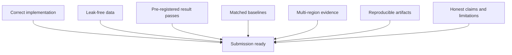

# 48 - Reproducibility and Submission Readiness

## Learning Objectives

- create an auditable experiment record;
- package data splits, configurations, and checkpoints;
- verify scientific and numerical readiness;
- distinguish a completed experiment from a submission-ready paper;
- conduct a final no-overclaim audit.

## 1. Reproducibility principle

A result is attributable only when another researcher can determine:

- which code produced it;
- which data and split were used;
- which checkpoint was selected;
- which LR observations each method saw;
- which solver and covariance settings were active;
- how metrics were aggregated.

## 2. Run directory

Recommended structure:

```text
runs/sensorcal_pilot/<run_id>/
  best.pt
  last.pt
  resolved_config.yaml
  run_metadata.json
  history.jsonl
  manifest.sha256
  backbone.sha256
  environment.txt
  metrics/
    per_patch.parquet
    per_tile.csv
    summary.json
  diagnostics/
  figures/
  logs/
```

## 3. Run metadata

Store:

```json
{
  "git_commit": "...",
  "dirty_worktree": true,
  "python": "...",
  "torch": "...",
  "cuda": "...",
  "gpu": "...",
  "manifest": "...",
  "manifest_sha256": "...",
  "backbone_checkpoint": "...",
  "backbone_sha256": "...",
  "arm": "sensorcal_logistic",
  "seed": 29,
  "split": "test",
  "operator": "gaussian_area_linear_v1",
  "covariance": "estimated_band_affine_v1"
}
```

If the worktree is dirty, record a patch or archive of the exact source.

## 4. Configuration capture

The resolved configuration must include:

- model and checkpoint;
- disabled/enabled old back-projection;
- data paths and target keys;
- degradation severity and seed;
- covariance source and bounds;
- solver tolerances and iteration limits;
- precision;
- batch size;
- metrics;
- evaluation limits;
- seed list;
- checkpoint rule.

Do not rely on notebook global variables that are absent from saved metadata.

## 5. Data audit

Before final evaluation:

- [ ] every record exists;
- [ ] no duplicate patch paths;
- [ ] no duplicate source windows;
- [ ] complete tile isolation passes;
- [ ] validation/test tiles were never used for training;
- [ ] quarantine rules are documented;
- [ ] split counts match the paper;
- [ ] manifest hash matches every final run.

## 6. Numerical audit

- [ ] forward-adjoint identity passes;
- [ ] dual objective and gradient tests pass;
- [ ] finite-difference gradients pass;
- [ ] unrolled and implicit gradients agree on tiny problems;
- [ ] covariance is positive and finite;
- [ ] convergence flags are saved;
- [ ] failures are included in reporting;
- [ ] results are repeatable under deterministic settings.

## 7. Baseline audit

- [ ] same backbone checkpoint;
- [ ] same completed prediction where required;
- [ ] same LR tensors;
- [ ] same masks and crops;
- [ ] GLinSAT implementation validated against its objective;
- [ ] Euclidean baseline solves its stated objective;
- [ ] fixed and oracle covariance definitions are documented;
- [ ] no proposed arm receives target-only inference information.

## 8. Metric audit

- [ ] metric direction is correct;
- [ ] image range is documented;
- [ ] LPIPS input normalization is correct;
- [ ] edge threshold and tolerance are fixed;
- [ ] NLL includes log variance;
- [ ] standardized residual target is defined;
- [ ] coverage includes interval width or proper score;
- [ ] per-tile aggregation precedes geographic inference;
- [ ] test metrics were computed only after checkpoint lock.

## 9. Paper-result traceability

Every table row and figure should point to:

- run IDs;
- exact data split;
- aggregation script;
- source CSV/JSON;
- figure-generation script;
- checkpoint hashes.

Maintain a table:

| Paper item | Source artifact |
|---|---|
| Table 3, SensorCal row | `runs/.../summary.json` |
| Figure 4 reliability | `runs/.../calibration_bins.csv` |
| Figure 5 sample 150 | `runs/.../diagnostics/patch_150/` |
| Runtime table | `runs/.../timing.json` |

Manual transcription is a common source of paper errors.

## 10. Code-release checklist

- [ ] install instructions work in a fresh environment;
- [ ] optional dependencies are documented;
- [ ] pilot command runs from the repository root;
- [ ] one CPU smoke configuration is available;
- [ ] pretrained checkpoints have licenses and provenance;
- [ ] dataset access and licenses are documented;
- [ ] secrets and Kaggle credentials are absent;
- [ ] absolute personal paths are removed;
- [ ] random seeds and split rules are public;
- [ ] expected output structure is documented.

## 11. Claim audit

Search the manuscript for:

- `novel`;
- `first`;
- `guarantee`;
- `physical`;
- `ground truth`;
- `real 40 m`;
- `calibrated`;
- `conservation`;
- `exact`.

For every occurrence, identify the theorem, experiment, or data fact that
supports it.

Preferred wording:

- controlled synthetic degradation;
- estimated covariance;
- bounded reconstruction;
- solver residual below tolerance;
- geographically held-out within the tested regions;
- evidence-constrained estimate.

## 12. Submission readiness gate

The paper is submission-ready only when all are true:



A complete manuscript with missing evidence is not ready. A favorable pilot
with no full geographic evaluation is not ready. A strong metric with an
incorrect split is not valid.

## 13. Supervisor progress package

Before a full paper, prepare:

1. two-page problem and novelty note;
2. six-arm pilot table;
3. calibration and reliability figure;
4. three qualitative samples;
5. solver correctness report;
6. data-split audit;
7. go/no-go decision;
8. next-stage compute estimate.

This lets a supervisor evaluate the evidence without reading every training
log.

## 14. Final viva explanation

If asked, "What is your contribution?" answer:

> We do not claim to invent logistic-entropy projection or signal-dependent
> noise modeling. We test whether a restricted covariance estimator, using
> only observable satellite LR evidence and degradation metadata, improves the
> calibration-quality trade-off of a bounded logistic-proximal output layer.
> The study uses matched baselines, complete held-out tiles, oracle-gap
> analysis, diversity decomposition, and solver diagnostics.

If results do not support that statement, revise the contribution or stop the
paper.

## 15. Course completion

You have completed the Path A paper track when you can:

- derive every objective;
- implement and test the operator and solver;
- explain all six arms;
- audit the data split;
- train and resume the calibrator;
- interpret calibration and diversity;
- make a pre-registered go/no-go decision;
- write claims bounded by actual evidence.

## Mastery Checklist

- [ ] Every final number is traceable to a run artifact.
- [ ] Data, numerical, baseline, and metric audits pass.
- [ ] The paper contains no unsupported priority or physical claims.
- [ ] The full geographic study passes the pre-registered gate.
- [ ] Code and configurations run without private credentials or paths.

Return to the [Learning Course README](README.md).
