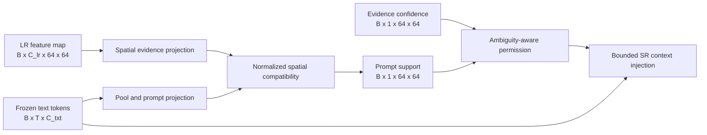

# 49 - Evidence-Aware Caption Conditioning and Contradiction Control

## Learning Objectives

- explain why adding ordinary caption cross-attention is not sufficient novelty;
- distinguish prompt support, LR evidence confidence, ambiguity, and edit permission;
- understand the proposed prompt-evidence controller and its tensor shapes;
- train mismatched-prompt suppression without weakening explicit edit mode;
- run a controlled correct/null/paraphrased/mismatched caption study;
- state the empirical conditions required before making a publication claim.

## 1. Research status

Caption conditioning already exists in GeoDiff-GAN through a frozen text
encoder, diffusion cross-attention, mapper context injection, classifier-free
guidance, and caption augmentation. Those components are useful, but their
combination is not a strong method-level novelty claim by itself.

The proposed contribution is narrower:

> In SR mode, estimate whether a prompt is supported by LR spatial evidence,
> restrict semantic injection to ambiguous locations, and suppress prompts
> that contradict the observation. Keep edit mode explicitly synthetic and
> separately controlled.

This is a research hypothesis until controlled experiments show that it works.
The code can guarantee which gates are applied; it cannot guarantee that the
learned support score is semantically correct without evaluation.

## 2. Why captions alone do not establish novelty

The following are established techniques:

- CLIP or SigLIP text embeddings;
- cross-attention from image features to text tokens;
- classifier-free guidance with null prompts;
- paraphrase augmentation;
- prompt-conditioned diffusion and GAN decoding;
- image-text alignment losses.

A paper whose only change is adding those components to satellite SR can be
described as an application or integration paper. The stronger scientific
question is whether text can be made subordinate to measurement evidence.

## 3. Four different policy quantities

Do not use one gate for four different meanings.

| Quantity | Meaning | Desired behavior |
|---|---|---|
| Evidence confidence | Reliability of generated image detail | High where LR supports reconstruction |
| Prompt support | Compatibility of the caption with LR features | Low for contradictory captions |
| SR prompt permission | Where compatible text may influence ambiguous detail | Low where evidence is decisive or prompt is unsupported |
| Edit permission | Where synthetic counterfactual edits are allowed | Active only in edit mode |

Let:

\[
e(u)\in[0,1]
\]

be evidence confidence at spatial location \(u\), and let:

\[
s(u,c,y)\in[0,1]
\]

be compatibility between prompt \(c\) and LR observation \(y\). Define SR
prompt permission as:

\[
q_{\mathrm{SR}}(u)
=
s(u,c,y)
\left[\rho+(1-\rho)(1-e(u))\right],
\]

where \(\rho\) is a small ambiguity floor. The term \(1-e(u)\) means semantic
injection is strongest where reconstruction evidence is uncertain. The
support term prevents arbitrary prompts from exploiting that uncertainty.

## 4. Proposed controller

The controller should be small. Its purpose is policy estimation, not another
image generator. An initial implementation uses:

1. a 1x1 convolution for LR evidence features;
2. a linear projection of pooled text context;
3. normalized dot-product compatibility;
4. a learned scale and bias;
5. explicit multiplication by the ambiguity term.

## 5. Prompt-policy supervision

Training already labels augmented prompts as:

- `original`;
- `paraphrase`;
- `null`;
- `mismatch`.

For SR mode, the support target is initially:

| Prompt kind | Support target |
|---|---:|
| Original grounded caption | 1 |
| Paraphrase | 1 |
| Null prompt | 0 |
| Mismatched prompt | 0 |

Use binary cross-entropy on the spatial mean and a direct penalty on SR prompt
permission for null and mismatched prompts. This supervision is only as good as
the captions: incorrectly grounded captions create incorrect positive labels.

## 6. Contradiction invariance

For a mismatched SR prompt, run a paired null-prompt branch with the same:

- LR input;
- degradation parameters;
- diffusion noise and timestep;
- base reconstruction;
- LR feature maps.

Penalize:

\[
\mathcal{L}_{\mathrm{contra}}
=
\left\|
\hat{x}_{\mathrm{mismatch}}
-
\hat{x}_{\mathrm{null}}
\right\|_1.
\]

This teaches the model to reject unsupported text rather than merely producing
a low support score while still changing the image through diffusion.

For matched captions, use a one-sided utility loss:

\[
\mathcal{L}_{\mathrm{utility}}
=
\max\left(
0,
E(\hat{x}_{\mathrm{prompt}},x)
-
E(\hat{x}_{\mathrm{null}},x)
\right),
\]

where \(E\) is per-sample reconstruction error. This prevents a matched prompt
from becoming worse than the null baseline; it does not force artificial
changes when text is unnecessary.

## 7. SR mode and edit mode must remain separate

In SR mode:

- text authority is bounded;
- unsupported prompts should approach null-prompt behavior;
- high-frequency residuals remain evidence constrained;
- LR consistency remains mandatory.

In edit mode:

- counterfactual prompts may intentionally contradict the observed scene;
- changes are controlled by edit permission, not SR prompt permission;
- output metadata must contain `synthetic_edit=true`;
- outputs must never be described as recovered observations.

Do not train mismatch suppression on edit-mode counterfactual samples. That
would teach the edit branch to reject the prompts it is intended to follow.

## 8. Required controlled evaluation

For every test patch, use the same diffusion seed for:

1. the grounded caption;
2. a null caption;
3. a deterministic paraphrase;
4. a mismatched caption from another land-cover category.

Report:

- PSNR, SSIM, LPIPS, DISTS, and edge F1;
- LR re-degradation error;
- prompt-support and prompt-permission means;
- image L1 change from the null-prompt output;
- LR-domain change from the null-prompt output;
- contradiction suppression ratio;
- matched-caption gain over null;
- stochastic uncertainty across repeated seeds.

The primary contradiction metric is:

\[
R_{\mathrm{contra}}
=
\frac{
\|\hat{x}_{\mathrm{mismatch}}-\hat{x}_{\mathrm{null}}\|_1
}{
\|\hat{x}_{\mathrm{matched}}-\hat{x}_{\mathrm{null}}\|_1+\epsilon
}.
\]

Lower is better, but a trivial model that ignores all text also scores well.
Therefore contradiction suppression must be reported together with matched
caption utility.

## 9. Mandatory ablations

- no text;
- standard text conditioning without the controller;
- controller without ambiguity gating;
- controller without mismatch supervision;
- controller without paired null invariance;
- full evidence-aware controller;
- correct versus null versus paraphrased versus mismatched prompts;
- SR versus explicitly synthetic edit mode.

## 10. Success criteria

The caption mechanism is useful only if all conditions hold on unseen tiles:

1. matched captions improve at least one pre-registered detail or semantic
   metric without a material PSNR or LR-consistency loss;
2. paraphrases produce statistically equivalent reconstructions;
3. mismatched captions cause substantially less change than matched captions;
4. prompt support separates matched and mismatched cases above chance;
5. the no-text baseline remains competitive where captions add no evidence;
6. edit outputs remain clearly labelled synthetic.

If matched, null, and mismatched outputs are nearly identical, the model has
learned to ignore text. If mismatched prompts cause large scene changes, the
controller has failed. Neither outcome supports the novelty claim.

## 11. Kaggle experiment sequence

1. Attach the preprocessed NPZ dataset and caption JSONL.
2. Use geographically separated validation and test tiles.
3. Start from the same pretrained small-improved joint checkpoint for both
   standard-caption and evidence-aware runs.
4. Fine-tune only mapper prompt-policy parameters first.
5. Unfreeze diffusion adapters only after the policy separates matched and
   mismatched prompts.
6. Save best and latest checkpoints only.
7. Run the controlled four-prompt evaluation with identical seeds.
8. Download metrics, per-patch rows, diagnostic panels, configs, and checkpoint
   hashes.

## 12. Claims that are currently allowed

Allowed before experiments:

> We implement an evidence-aware prompt policy and a controlled contradiction
> evaluation protocol for satellite super-resolution.

Not allowed before experiments:

- captions improve reconstruction;
- the controller prevents hallucinations;
- prompt support is calibrated;
- the method is novel or publishable;
- generated fine structures are physically recovered.

## Mastery Checklist

- [ ] I can distinguish evidence confidence from prompt support.
- [ ] I can derive the SR prompt-permission equation.
- [ ] I understand why mismatch suppression applies only to SR mode.
- [ ] I can explain why a null-prompt paired branch is required.
- [ ] I know the controlled four-prompt evaluation and failure cases.
- [ ] I will not claim novelty before held-out-tile results support it.

Next implementation entry points:

- `src/geodiff_gan/models/generator.py`;
- `src/geodiff_gan/losses.py`;
- `src/geodiff_gan/training/trainer.py`;
- `src/geodiff_gan/cli/prompt_ablation.py`;
- `kaggle/GeoDiff_GAN_Kaggle_Evidence_Aware_Caption_Study.ipynb`.
