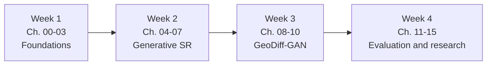
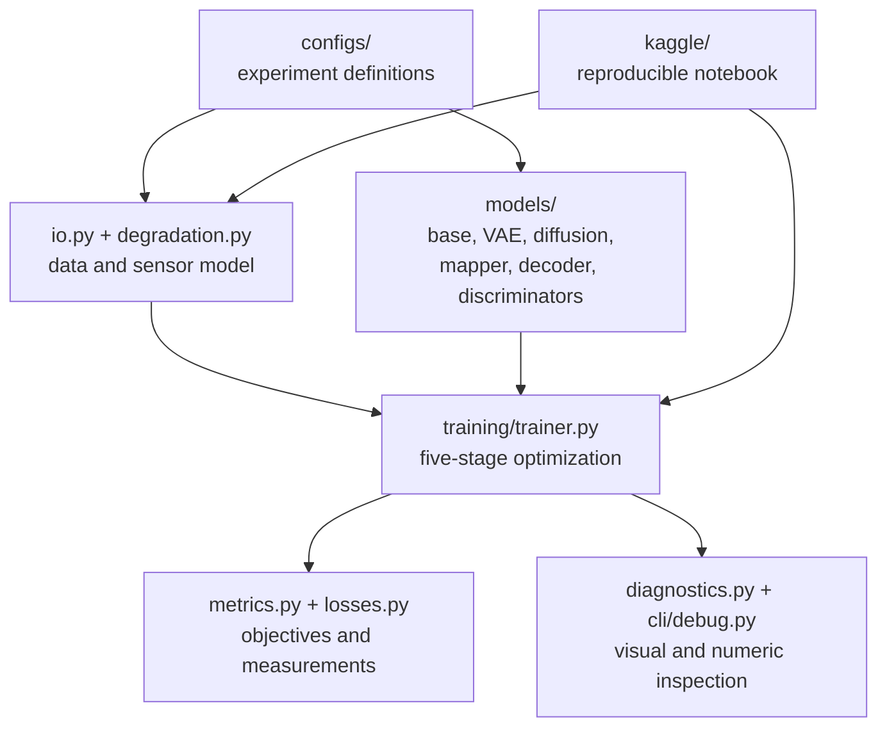

# GeoDiff-GAN Learning Course

This folder is a sequential, self-contained course for understanding, training, debugging, and
researching GeoDiff-GAN. Read the chapters in numerical order. Each chapter contains:

- learning objectives;
- the theory needed for the next chapter;
- Mermaid diagrams;
- links to the corresponding implementation;
- derivations and tensor-shape examples;
- exercises and a mastery checklist.

The course distinguishes three kinds of statements:

> **Fact** describes established mathematics or code behavior.
>
> **Design rationale** explains why this repository makes a particular engineering choice.
>
> **Research hypothesis** is a claim that must be tested with experiments and ablations.

That distinction matters. A plausible architecture is not automatically a scientific contribution,
and a visually sharp satellite image is not automatically a spatially faithful reconstruction.

## Course Sequence

| Order | Chapter | Main outcome |
|---:|---|---|
| 00 | [Course map](00_course_map.md) | Understand the full dependency graph and study plan |
| 01 | [Mathematical foundations](01_mathematical_foundations.md) | Work confidently with tensors, convolutions, probability, and optimization |
| 02 | [Deep learning and PyTorch](02_deep_learning_and_pytorch.md) | Understand modules, autograd, mixed precision, and distributed training |
| 03 | [Remote sensing and Sentinel-2](03_remote_sensing_and_sentinel2.md) | Understand what the pixels physically represent |
| 04 | [Image formation and super-resolution](04_image_formation_and_super_resolution.md) | Formulate SR as an inverse problem |
| 05 | [GAN foundations](05_gan_foundations.md) | Understand adversarial training and PatchGAN discriminators |
| 06 | [Diffusion foundations](06_diffusion_foundations.md) | Derive latent diffusion and velocity prediction |
| 07 | [Conditioning and prompts](07_conditioning_and_prompts.md) | Understand cross-attention, FiLM, guidance, and evidence gates |
| 08 | [GeoDiff-GAN architecture](08_geodiff_gan_architecture.md) | Trace every module and tensor shape |
| 09 | [Data and degradation pipeline](09_data_and_degradation_pipeline.md) | Build leakage-free synthetic 40 m training pairs |
| 10 | [Five-stage training](10_five_stage_training.md) | Understand parameters, losses, freezing, and checkpoint transfer |
| 11 | [Spatial fidelity and evaluation](11_spatial_fidelity_and_evaluation.md) | Measure reconstruction quality without trusting appearance alone |
| 12 | [Debugging and visual diagnostics](12_debugging_and_visual_diagnostics.md) | Diagnose shape, numerical, conditioning, and consistency failures |
| 13 | [Novelty, ablations, and research design](13_novelty_ablations_and_research.md) | Turn the architecture into defensible research |
| 14 | [Kaggle execution and research workflow](14_kaggle_and_research_workflow.md) | Run experiments reproducibly and organize evidence |
| 15 | [Paper, thesis, and viva guide](15_paper_thesis_and_viva.md) | Explain and defend the work precisely |

## Recommended Pace

For each chapter:

1. Read the theory without opening the code.
2. Reproduce the shape calculations by hand.
3. Follow the code links and locate each operation.
4. Answer the exercises without looking back.
5. Run the relevant command or diagnostic.
6. Continue only when you can explain the mastery checklist aloud.

## Repository Map

## Ground Rules for Satellite Super-Resolution

1. **The LR observation is evidence.** A generated HR output must remain compatible with it.
2. **Native 10 m is a target, not hidden ground truth at 40 m.** Synthetic degradation permits
   supervised experiments but does not prove real 40 m-to-10 m recovery.
3. **Texture realism and spatial correctness are different axes.** Report both.
4. **Prompts can guide ambiguity but can also hallucinate.** SR mode and edit mode must remain
   semantically and operationally separate.
5. **Geographic leakage invalidates results.** Split complete MGRS tiles, not random patches.
6. **Novelty is demonstrated by comparisons and ablations.** It is not established by naming
   modules.

## Starting Point

Begin with [00: Course Map](00_course_map.md).
