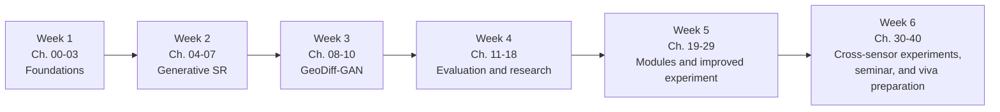
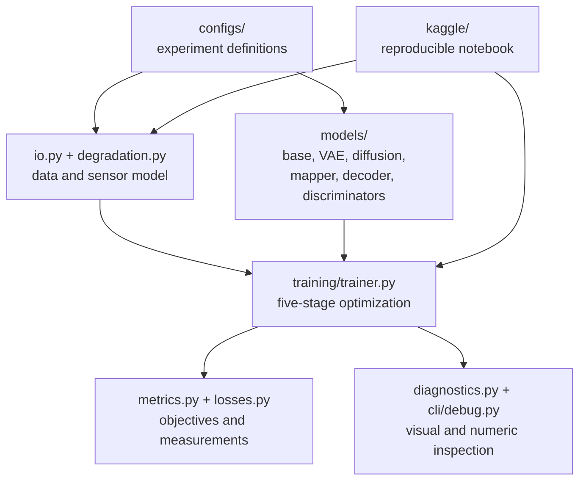

# GeoDiff-GAN Learning Course

This folder is a sequential, self-contained course for understanding, training, debugging, and
researching GeoDiff-GAN. Read the chapters in numerical order. Each chapter contains:

- learning objectives;
- the theory needed for the next chapter;
- Mermaid diagrams;
- links to the corresponding implementation;
- derivations and tensor-shape examples;
- exercises and a mastery checklist.

The course distinguishes three kinds of statements:

> **Fact** describes established mathematics or code behavior.
>
> **Design rationale** explains why this repository makes a particular engineering choice.
>
> **Research hypothesis** is a claim that must be tested with experiments and ablations.

That distinction matters. A plausible architecture is not automatically a scientific contribution,
and a visually sharp satellite image is not automatically a spatially faithful reconstruction.

## Course Sequence

| Order | Chapter | Main outcome |
|---:|---|---|
| 00 | [Course map](00_course_map.md) | Understand the full dependency graph and study plan |
| 01 | [Mathematical foundations](01_mathematical_foundations.md) | Work confidently with tensors, convolutions, probability, and optimization |
| 02 | [Deep learning and PyTorch](02_deep_learning_and_pytorch.md) | Understand modules, autograd, mixed precision, and distributed training |
| 03 | [Remote sensing and Sentinel-2](03_remote_sensing_and_sentinel2.md) | Understand what the pixels physically represent |
| 04 | [Image formation and super-resolution](04_image_formation_and_super_resolution.md) | Formulate SR as an inverse problem |
| 05 | [GAN foundations](05_gan_foundations.md) | Understand adversarial training and PatchGAN discriminators |
| 06 | [Diffusion foundations](06_diffusion_foundations.md) | Derive latent diffusion and velocity prediction |
| 07 | [Conditioning and prompts](07_conditioning_and_prompts.md) | Understand cross-attention, FiLM, guidance, and evidence gates |
| 08 | [GeoDiff-GAN architecture](08_geodiff_gan_architecture.md) | Trace every module and tensor shape |
| 09 | [Data and degradation pipeline](09_data_and_degradation_pipeline.md) | Build leakage-free synthetic 40 m training pairs |
| 10 | [Five-stage training](10_five_stage_training.md) | Understand parameters, losses, freezing, and checkpoint transfer |
| 11 | [Spatial fidelity and evaluation](11_spatial_fidelity_and_evaluation.md) | Measure reconstruction quality without trusting appearance alone |
| 12 | [Debugging and visual diagnostics](12_debugging_and_visual_diagnostics.md) | Diagnose shape, numerical, conditioning, and consistency failures |
| 13 | [Novelty, ablations, and research design](13_novelty_ablations_and_research.md) | Turn the architecture into defensible research |
| 14 | [Kaggle execution and research workflow](14_kaggle_and_research_workflow.md) | Run experiments reproducibly and organize evidence |
| 15 | [Paper, thesis, and viva guide](15_paper_thesis_and_viva.md) | Explain and defend the work precisely |
| 16 | [Parameter counts and training configuration](16_parameter_counts_and_training_configuration.md) | Audit capacity, stage freezing, optimizers, and update counts |
| 17 | [Small model six-tile diagnostic analysis](17_small_six_tile_diagnostic_analysis.md) | Interpret residual, confidence, frequency, wavelet, edge, and projection diagnostics |
| 18 | [Sensor back-projection](18_sensor_back_projection.md) | Derive and trace the complete sensor-consistency correction |
| 19 | [Deterministic SwinIR base](19_swinir_deterministic_base.md) | Understand conservative window-attention reconstruction |
| 20 | [Residual VAE](20_residual_vae.md) | Derive the residual latent representation and KL training |
| 21 | [Multi-scale LR feature encoder](21_lr_feature_encoder.md) | Trace spatial evidence features across resolutions |
| 22 | [Conditional latent diffusion](22_conditional_latent_diffusion.md) | Derive velocity training, U-Net conditioning, and DDIM sampling |
| 23 | [GeoMapper and dual-policy gating](23_geomapper_dual_policy.md) | Understand spatial content, styles, evidence, and edit permission |
| 24 | [Dual-head FiLM SR decoder](24_dual_head_sr_decoder.md) | Trace detail and edit residual generation |
| 25 | [Dual-discriminator GAN](25_dual_discriminator_gan.md) | Understand multi-scale PatchGAN and wavelet critics |
| 26 | [Text and prompt conditioning](26_text_prompt_conditioning.md) | Trace frozen text embeddings, guidance, and alignment |
| 27 | [Uncertainty and abstention](27_uncertainty_and_abstention.md) | Quantify stochastic disagreement and reliability-aware blending |
| 28 | [Complete system integration](28_complete_system_integration.md) | Join all modules, equations, tensor shapes, and training stages |
| 29 | [Twelve-tile improved small-model run](29_twelve_tile_small_improvement_run.md) | Apply artifact, confidence, detail, checkpoint, and early-stopping improvements |
| 30 | [Caption generation pipeline](30_caption_generation_pipeline.md) | Generate grounded brief, descriptive, analytical, and positional captions |
| 31 | [SOTA benchmark protocol](31_sota_benchmark_protocol.md) | Compare external models without silently changing their architectures |
| 32 | [Landsat-Sentinel paired dataset](32_landsat_sentinel_real_pair_dataset.md) | Prepare real Landsat 30 m and Sentinel-2 10 m 3x pairs |
| 33 | [Real cross-sensor SR foundations](33_real_cross_sensor_sr_foundations.md) | Explain pairing, reflectance, grids, masks, tensor shapes, and limitations |
| 34 | [Pair quality metrics and diagnostics](34_pair_quality_metrics_and_diagnostics.md) | Interpret MAE, bias, PSNR, edges, heatmaps, registration, spectra, and masks |
| 35 | [Training, debugging, evaluation, and viva](35_training_debugging_evaluation_viva.md) | Defend modules, losses, diagnostics, results, ablations, and scientific claims |
| 36 | [Spatial, spectral, radiometric, and temporal resolution](36_spatial_spectral_radiometric_temporal_resolution.md) | Separate the four sensor-resolution dimensions and diagnose their effects on real 3x SR |
| 37 | [PSNR/SSIM fidelity-first training](37_psnr_ssim_fidelity_first_training.md) | Optimize distortion, guard the strong base, and validate sampled residual utility |
| 38 | [Harmonized dual-stream cross-sensor experiment](38_harmonized_dual_stream_experiment.md) | Calibrate Landsat RGB, isolate NIR/SWIR guidance, and audit final gains against the embedded base |
| 39 | [Progress seminar presentation content](39_progress_seminar_presentation_content.md) | Present the complete project from layman motivation through results, limitations, and next experiments |
| 40 | [Progress seminar cross-question handbook](40_progress_seminar_cross_questions.md) | Answer foundational, remote-sensing, architecture, training, evaluation, novelty, and ethics questions |

## Recommended Pace

```mermaid
flowchart LR
    A["Week 1<br/>Ch. 00-03<br/>Foundations"] -->
    B["Week 2<br/>Ch. 04-07<br/>Generative SR"] -->
    C["Week 3<br/>Ch. 08-10<br/>GeoDiff-GAN"] -->
    D["Week 4<br/>Ch. 11-18<br/>Evaluation and research"] -->
    E["Week 5<br/>Ch. 19-29<br/>Modules and improved experiment"] -->
    F["Week 6<br/>Ch. 30-40<br/>Cross-sensor experiments,<br/>seminar, and viva preparation"]
```

For each chapter:

1. Read the theory without opening the code.
2. Reproduce the shape calculations by hand.
3. Follow the code links and locate each operation.
4. Answer the exercises without looking back.
5. Run the relevant command or diagnostic.
6. Continue only when you can explain the mastery checklist aloud.

## Repository Map

```mermaid
flowchart TD
    CFG["configs/<br/>experiment definitions"]
    DATA["io.py + degradation.py<br/>data and sensor model"]
    MODEL["models/<br/>base, VAE, diffusion,<br/>mapper, decoder, discriminators"]
    TRAIN["training/trainer.py<br/>five-stage optimization"]
    EVAL["metrics.py + losses.py<br/>objectives and measurements"]
    DEBUG["diagnostics.py + cli/debug.py<br/>visual and numeric inspection"]
    KAGGLE["kaggle/<br/>reproducible notebook"]

    CFG --> DATA
    CFG --> MODEL
    DATA --> TRAIN
    MODEL --> TRAIN
    TRAIN --> EVAL
    TRAIN --> DEBUG
    KAGGLE --> DATA
    KAGGLE --> TRAIN
```

## Ground Rules for Satellite Super-Resolution

1. **The LR observation is evidence.** A generated HR output must remain compatible with it.
2. **Native 10 m is a target, not hidden ground truth at 40 m.** Synthetic degradation permits
   supervised experiments but does not prove real 40 m-to-10 m recovery.
3. **Texture realism and spatial correctness are different axes.** Report both.
4. **Prompts can guide ambiguity but can also hallucinate.** SR mode and edit mode must remain
   semantically and operationally separate.
5. **Geographic leakage invalidates results.** Split complete MGRS tiles, not random patches.
6. **Novelty is demonstrated by comparisons and ablations.** It is not established by naming
   modules.

## Starting Point

Begin with [00: Course Map](00_course_map.md).

The latest OLI2MSI model revision is explained in
[43: OLI2MSI Fidelity-Trust Experiment](43_oli2msi_fidelity_trust_experiment.md).
