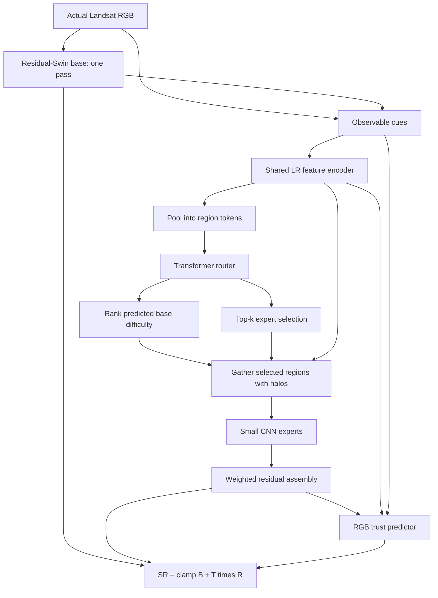

# 02. Architecture and Tensor Shapes

Implementation: [TrustMoESR](../../src/geodiff_gan/models/trust_moe.py).
Use N for batch size, C for channels, H/W for spatial dimensions.

## Base Reconstruction

The implemented base is a compact residual-Swin model, not a claim to reproduce the
full official SwinIR architecture. Shallow convolution features pass through two
groups, each with two attention blocks at the default configuration. Attention
uses regular/shifted windows, relative-position bias and a mask.

There are skips inside attention blocks, around residual groups, around the body,
and from bicubic RGB to the output. A group returns `x + 0.1 * conv(blocks(x))`.
Resize-convolution upsamples features. The RGB correction starts at zero, so the
untrained base initially equals clamped bicubic interpolation.

## Default Shape Walkthrough

| Tensor or operation | Shape for one 128 x 128 LR image |
|---|---|
| LR RGB | `1 x 3 x 128 x 128` |
| Base RGB | `1 x 3 x 384 x 384` |
| Concatenated cues | `1 x 13 x 128 x 128` |
| Encoder features | `1 x 32 x 128 x 128` |
| 8x8 pooling | `1 x 32 x 16 x 16` |
| Router tokens | `1 x 256 x 32` |
| Five expert logits | `1 x 256 x 5` |
| Difficulty score | `1 x 256` |
| One gathered feature tile including halo | `1 x 32 x 16 x 16` |
| Expert RGB output including halo | `1 x 3 x 48 x 48` |
| Cropped RGB core | `1 x 3 x 24 x 24` |
| Assembled residual and RGB trust | each `1 x 3 x 384 x 384` |
| Final output | `1 x 3 x 384 x 384` |

The 13 cue channels are LR RGB (3), area-resized base RGB (3), area-resized absolute
base high-frequency response (3), base-to-LR RGB discrepancy (3), and mean LR local
variation (1). Base high-frequency response is `B - average_pool_5x5(B)`.

The encoder has two 3x3 convolutions with GELU. The router adds a depthwise spatial
position convolution, then runs two Transformer encoder layers, each with four heads
and a width-64 feed-forward block at default feature width 32. It has separate
linear heads for expert logits and scalar difficulty.

## Expert and Trust Details

Each expert uses two width-32 3x3 convolutions with GELU, bilinear 3x upsampling,
and a 3x3 RGB convolution. Its proposal is `0.1 * tanh(rgb)`. This bounds each raw
proposal in the model's normalized units. The RGB weights start small and independent.

The trust head receives encoder features (32), area-resized residual RGB (3), and
base-to-LR discrepancy (3): 38 channels. Two 1x1 convolutions produce three LR-grid
logits. They are bilinearly resized to HR and passed through sigmoid. Thus trust
is HR-shaped but generated from coarse-grid evidence, not a full HR attention head.

The output is clamped to [0,1]. It is not a second base pass.
For dimensions not divisible by eight, feature padding completes the region grid;
the assembled output is cropped back to exactly three times the original dimensions.

## Worked Compute Count

At 128x128, there are 256 regions. With coverage 0.5, 128 regions are selected.
With top-k=2, there are 256 region-expert assignments per image. This does not mean
256 Python calls: assignments for the same expert are batched, with dispatch chunks
of at most 128 gathered tiles by default.

At 160x160, there are 400 regions; 50% coverage and top-k=2 yield 400 assignments.
Changing image dimensions changes work, not learned parameter count.

## Check Yourself

Calculate shapes for a 64x64 LR training crop. Answer: 192x192 output, 64 router
tokens, 32 selected regions and 64 assignments at the default budget.

Next: [Routing and trust](03_routing_experts_and_trust.md).
